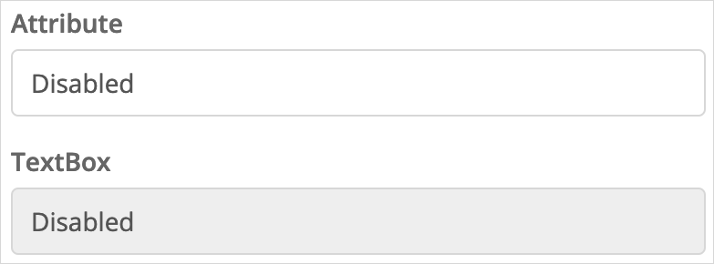
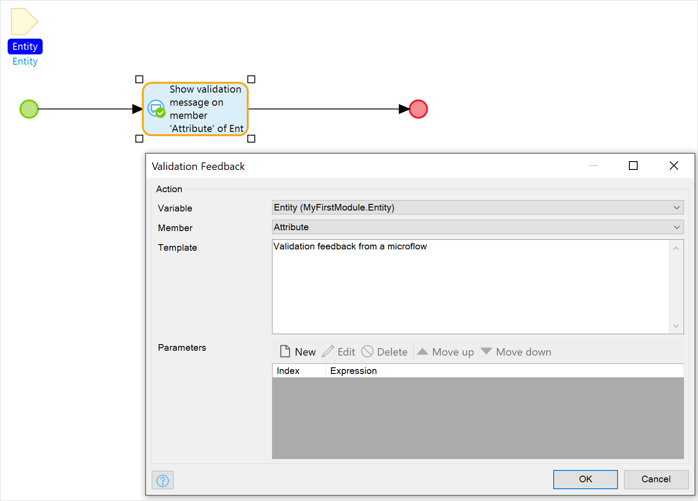
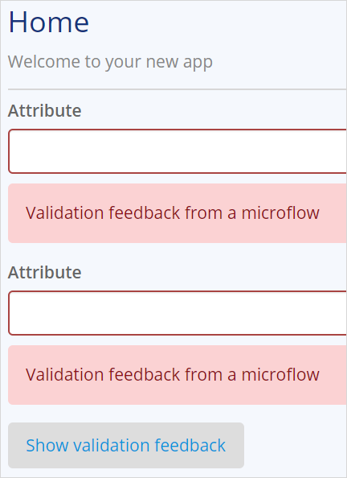
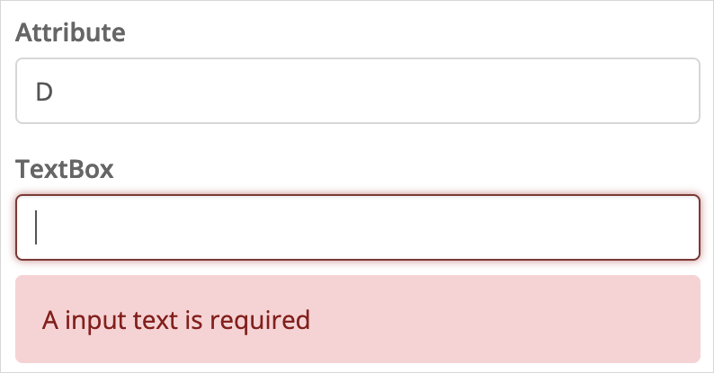
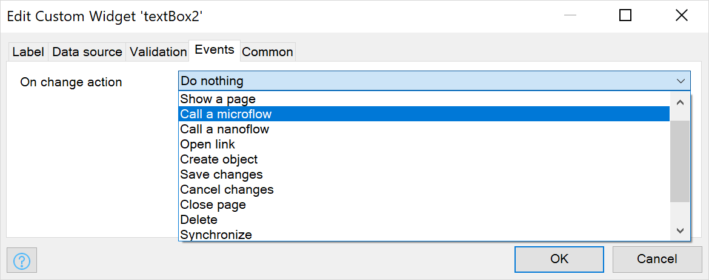

## 1 Introduction

The new pluggable widget API makes building feature-complete widgets much easier. This how-to will go beyond [How to Create a Pluggable Widget Part 1](create-a-pluggable-widget-one) and teach you how to add advanced features to your TextBox input widget.

**This how-to will teach you how to do the following:**

* Configure widget edit permissions
* Add validation feedback
* Add custom validations
* Create an onChange action
* Improve accessibility for screen readers 
* Enable Mendix Studio Pro and Mendix Studio previews

## 2 Prerequisites

Before starting this how-to, make sure you have completed the following prerequisites:

* Complete [Build a Text Box Pluggable Widget: Part 1](create-a-pluggable-widget-one)

## 3 Adding Advanced Features to Your TextBox Input Widget

To add advanced features to your TextBox input widget, consult the sections below.

### 3.1 Configuring Edit Permissions

Right now the input is editable for any user at all times. However, the input should be disabled in cases when:

* A user does not have the security rights to edit
* A user is given read-only permission
* The context data view is not editable
* Mendix developers specify so in the widget's configuration

To add these restrictions, follow the instructions below:

1. In *TextBox.xml* add the enumeration attribute for `Editable` inside `propertyGroup` (where you put the attribute inside `propertyGroup` will affect how the attribute renders in the Mendix Studios): 

	```ts
	<property key="editable" type="enumeration" defaultValue="default">
		<caption>Editable</caption>
		<description/>
		<enumerationValues>
			<enumerationValue key="default">Default</enumerationValue>
			<enumerationValue key="never">Never</enumerationValue>
		</enumerationValues>
	</property>
	```

2. Run `npm run build` to update the TypeScript definitions inside *TextBoxProps.d.ts*. 

3. Now add read-only functionality to your widget. In *TextBox.tsx*, replace the `render` function with the code below to check if the input should be disabled and pass it to in the `TextInput` component:

	```ts
	render(): ReactNode {
		const value = this.props.textAttribute.value || "";
		return <TextInput
			value={value}
			style={this.props.style}
			className={this.props.class}
			tabIndex={this.props.tabIndex}
			onUpdate={this.onUpdateHandle}
			disabled={this.isReadOnly()}
		/>;
	}
	private isReadOnly(): boolean {
		return this.props.editable === "never" || this.props.textAttribute.readOnly;
	}
	```

	Explaining the code:
	
	* The `textAttribute` has a property `readOnly`, which will be set to `true` based on entity access or if the containing data view is set to `Editable: No`
	* The function is not passed to the child component, but executed during rendering – the result of the `isReadOnly` function is passed (therefore, it is not necessary to bind the scope to `this`)

4. In *components/TextInput.tsx*, add the `disabled` property to the `InputProps` interface and set the HTML input attribute to `disabled`:

	```ts
	import { CSSProperties, ChangeEvent, Component, ReactNode, createElement } from "react";
	import classNames from "classnames";
	export interface InputProps {
		value: string;
		className?: string;
		index?: number;
		style?: CSSProperties;
		tabIndex?: number;
		onUpdate?: (value: string) => void;
		disabled?: boolean;
	}
	export class TextInput extends Component<InputProps> {
		private readonly handleChange = this.onChange.bind(this);
		render(): ReactNode {
			const className = classNames("form-control", this.props.className);
			return <input
				type="text"
				className={className}
				style={this.props.style}
				value={this.props.value}
				tabIndex={this.props.tabIndex}
				onChange={this.handleChange}
				disabled={this.props.disabled}
			/>;
		}
		private onChange(event: ChangeEvent<HTMLInputElement>) {
			if (this.props.onUpdate) {
				this.props.onUpdate(event.target.value);
			}
		}
	}
	```
	
	After altering this code, do the following to see your changes:<br/>
		a. Run `npm run build` to update the widget.<br/>
		b. In Mendix Studio Pro, press <kbd>F4</kbd> to synchronize your project directory.<br/>
		c. Right-click your TextBox widget and select **Update widget**. Then click **Run Locally**.<br/>
		d. Click **View** to see your changes.

	Explaining the code:

	* The property `disabled` in an input element will behave according to the HTML's specifications – it will not respond to user actions, cannot be focused, is removed from the tab order, and will not fire any events

5.  When you select **Never** for your TextBox widget's `Editable` property in Mendix Studio Pro, the widget will function like this: 

	{}{}

	Explaining the code:

	* The theme styling will apply the disabled style to the input in the same way as the standard input widget in the disabled state 

### 3.2 Adding Validation Feedback

This section will teach you to add validation to your TextBox widget. Using microflows and nanoflows, validation feedback can easily be provided. 

1. Drag a **call microflow button** widget below your TextBox widget and drop it there. On the subsequent dialog box, click **New** to assign a new microflow to your button, name it *Validation_Microflow*, and click **OK**:

	{}{}

	Before moving forward, go back to your app's **Home** page, double-click your validation button, and name it *Show validation feedback*.

2. Open your *Validation_Microflow* and drop a **Validation feedback** client activity onto your microflow: 

	{}{}

	To define your validation feedback client activity:<br />
	a. Double-click the **Validation feedback** client activity.<br />
	b. Set **Variable** to **Entity (MyFirstModule Entity)**.<br />
	c. Set **Member** to **Attribute**, and type *Validation feedback from a microflow* into **Template**.<br />
	d. Click **OK**.<br />
	e. Click **File** > **Save All** from the Mendix Studio Pro drop-down menu.

3. To render the message, create a new component *components/Alert.tsx*:

	```ts
	import { FunctionComponent, createElement } from "react";
	import classNames from "classnames";
	export interface AlertProps {
		alertStyle?: "default" | "primary" | "success" | "info" | "warning" | "danger";
		className?: string;
	}
	export const Alert: FunctionComponent<AlertProps> = ({ alertStyle, className, children }) =>
		children
			? <div className={classNames(`alert alert-${alertStyle}`, className) }>{children}</div>
			: null;
	Alert.displayName = "Alert";
	Alert.defaultProps = { alertStyle: "danger" };
	```
	
	Explaining the code:

	* The `Alert` component does not have a state and can be written as a stateless function component
	* The component has a `displayName` for debugging and error messages
	* A `function` component can also have default properties which are set directly on the prototype

4. In *TextBox.tsx*, the validation feedback can be accessed though the attribute `validation` property and shown in the `Alert` component. Replace the `render` function with the following code:

	```ts
	render(): ReactNode {
		const value = this.props.textAttribute.value || "";
		const validationFeedback = this.props.textAttribute.validation;
		return <Fragment>
			<TextInput
				value={value}
				style={this.props.style}
				className={this.props.class}
				tabIndex={this.props.tabIndex}
				onUpdate={this.onUpdateHandle}
				disabled={this.isReadOnly()}
			/>
			<Alert>{validationFeedback}</Alert>
		</Fragment>;
	}
	```

5. Add `Fragment` to the current React import (shown below), and add a new `Alert` import underneath the existing imports in *TextBox.tsx*:

	```ts
	import { Component, ReactNode, Fragment, createElement } from "react";
	import { Alert } from "./components/Alert";
	```
	
	After altering this code, do the following to see your changes:<br/>
		a. Run `npm run build` to update the widget.<br/>
		b. In Mendix Studio Pro, press <kbd>F4</kbd> to synchronize your project directory.<br/>
		c. Right-click your TextBox widget and select **Update widget**. Then click **Run Locally**.<br/>
		d. Click **View** to see your changes.
	
	Explaining the code:
	
	* React nodes each require a root element – to create a non-rendering element and group the container elements, a `Fragment` can be used
	* When there is no error the validation will be empty, the `Alert` will not show, and the component will return `null`
	
	Now, your widget will show validation feedback from its microflow:
	
	{}{}

### 3.3 Customizing Validation

Validation can come from a modeled microflow or nanoflow, but can also be widget specific. For this sample you will learn to implement a custom, required message which will show when the input is empty.


1.  In *TextBox.xml*, add the `requiredMessage` property inside `propertyGroup`:

	```xml
	<property key="requiredMessage" type="textTemplate" required="false">
		<caption>Required message</caption>
		<description/>
		<translations>
			<translation lang="en_US">A input text is required</translation>
		</translations>
	</property>
	```

	Explaining the code:

	* `textTemplate` strings are translatable strings which can also have attributes and data values
	* Default values can be added to the XML and are language specific

2. In *TextBox.tsx*, add a validation handler to the attribute after the `onUpdate` function:

	```ts
	componentDidMount() {
		this.props.textAttribute.setValidator(this.validator.bind(this));
	}

	private validator(value: string | undefined): string | undefined {
		const { requiredMessage } = this.props;
		if (requiredMessage && requiredMessage.value && !value) {
			return requiredMessage.value;
		}
		return;
	}
	```

	After altering this code, do the following to see your changes:<br/>
		a. Run `npm run build` to update the widget.<br/>
		b. In Mendix Studio Pro, press <kbd>F4</kbd> to synchronize your project directory.<br/>
		c. Right-click your TextBox widget and select **Update widget**. Then click **Run Locally**.<br/>
		d. Click **View** to see your changes.

	Explaining the code:

	* The `componentDidMount` is a lifecycle method of the React component, and is only called once
	* The custom validator is registered to the attribute, and is called after each `setValue` call – the new value is only accepted when the validator returns no string
	* When the validator returns an error message, it will passed to the attribute, and a re-render is triggered – the standard `this.props.textAttribute.validation` will get the message and display it in the same way as the validation feedback

3.  When entering text and removing all characters, the following error is shown:

	{}{}

### 3.4 Adding an OnChange Action

Until now the components did not keep any state. Each keystroke passed through the `onUpdate` function, which set the new value. The newly-set value was received through the React lifecycle, which updated the property and called the `render` function. This method can cause many rendering actions to be triggered by all widgets that are using that same attribute, such as a re-render for each keystroke. This pattern also makes it also difficult to trigger an onChange action. The onChange action should only trigger on leaving the input combined with a changed value. 

{}[check if this limitation is solved before end of April, then delete it if so]{}

{}
Limitation: The implementation in this sample will cause the onChange event to trigger when the validation fails. A failed validation will prevent the real change in the attribute, thus the actual value will not be changed.{}

1.  In *TextBox.xml*, add the `onChange` action inside `propertyGroup`:

	```xml
	<property key="onChangeAction" type="action" required="false">
		<caption>OnChange action</caption>
		<description/>
	</property>
	```
	
	After altering this code, do the following to see your changes:<br/>
		a. Run `npm run build` to update the widget.<br/>
		b. In Mendix Studio Pro, press <kbd>F4</kbd> to synchronize your project directory.<br/>
		c. Right-click your TextBox widget and select **Update widget**. Then click **Run Locally**.<br/>
		d. Click **View** to see your changes.

	Adding this code will allow you to select various actions:

	

2. In *TextBox.tsx*, check if `onChangeAction` is available and call the execute function `onLeave` when the value is changed. When doing this, replace the `onUpdate` function with your new `onLeave` function:
   
	```ts
	class TextBox extends Component<TextBoxContainerProps> {
		private readonly onLeaveHandle = this.onLeave.bind(this);
		componentDidMount() {
			this.props.textAttribute.setValidator(this.validator.bind(this));
		}
		render(): ReactNode {
			const value = this.props.textAttribute.value || "";
			const validationFeedback = this.props.textAttribute.validation;
			return <Fragment>
				<TextInput
					value={value}
					style={this.props.style}
					className={this.props.class}
					tabIndex={this.props.tabIndex}
					disabled={this.isReadOnly()}
					onLeave={this.onLeaveHandle}
				/>
				<Alert>{validationFeedback}</Alert>
			</Fragment>;
		}
		private isReadOnly(): boolean {
			return this.props.editable === "never" || this.props.textAttribute.readOnly;
		}
		private onLeave(value: string, isChanged: boolean) {
			if (!isChanged) {
				return;
			}
			const { textAttribute, onChangeAction } = this.props;
			textAttribute.setValue(value);
			if (onChangeAction && onChangeAction.canExecute) {
				onChangeAction.execute();
			}
		}
		private validator(value: string | undefined): string | undefined {
			const { requiredMessage } = this.props;
			if (requiredMessage && requiredMessage.value && !value) {
				return requiredMessage.value;
			}
			return;
		}
	}
	```

3. In *components/TextInput.tsx*, introduce a state for input changes and use the `onBlur` function to call the `onLeave` function by replacing the `onUpdate` function:
   
	```ts
	import { CSSProperties, Component, ReactNode, createElement, ChangeEvent } from "react";
	import classNames from "classnames";
	
	export interface InputProps {
		value: string;
		className?: string;
		index?: number;
		style?: CSSProperties;
		tabIndex?: number;
		id?: string;
		disabled?: boolean;
		onLeave?: (value: string, changed: boolean) => void;
	}
	interface InputState {
		editedValue?: string;
	}
	export class TextInput extends Component<InputProps, InputState> {
		private readonly onChangeHandle = this.onChange.bind(this);
		private readonly onBlurHandle = this.onBlur.bind(this);
		readonly state: InputState = { editedValue: undefined };
		componentDidUpdate(prevProps: InputProps) {
			if (this.props.value !== prevProps.value) {
				this.setState({ editedValue: undefined });
			}
		}
		render(): ReactNode {
			const className = classNames("form-control", this.props.className);
			return <input
				type="text"
				className={className}
				style={this.props.style}
				value={this.getCurrentValue()}
				tabIndex={this.props.tabIndex}
				onChange={this.onChangeHandle}
				disabled={this.props.disabled}
				onBlur={this.onBlurHandle}
			/>;
		}
		private getCurrentValue() {
			return this.state.editedValue !== undefined
				? this.state.editedValue
				: this.props.value;
		}
		private onChange(event: ChangeEvent<HTMLInputElement>) {
			this.setState({ editedValue: event.target.value });
		}
		private onBlur() {
			const inputValue = this.props.value;
			const currentValue = this.getCurrentValue();
			if (this.props.onLeave) {
				this.props.onLeave(currentValue, currentValue !== inputValue);
			}
			this.setState({ editedValue: undefined });
		}
	}
	```

	Explaining the code:

	* The `componentDidUpdate` function is a React lifecycle function that is called before rendering, directly after an update of the properties
	* The state `editedValue` will be empty until the input value is changed by the user 
	* The `setState` function will update the state and will re-render the component (in the rendering, the new value is taken from `editedValue`)
	* The `onBlur` function will set the new value in the attribute through the container component – the state is reset, and the new value is received by an update of the attribute (which will propagate as a new property value)

### 3.5 Adding Accessibility

To make the input widget more accessible for people using screen readers, you will need to provide hints about the input. 

1. In *TextBox.tsx*, replace the `render` function with `id`, `required`, and `hasError` properties:
   
	```ts
	render(): ReactNode {
		const value = this.props.textAttribute.value || "";
		const validationFeedback = this.props.textAttribute.validation;
		const required = !!(this.props.requiredMessage && this.props.requiredMessage.value);
		return <Fragment>
			<TextInput        
				id={this.props.id}
				value={value}
				style={this.props.style}
				className={this.props.class}
				tabIndex={this.props.tabIndex}
				disabled={this.isReadOnly()}
				onLeave={this.onLeaveHandle}
				required={required}
				hasError={!!validationFeedback}
			/>
			<Alert id={this.props.id + "-error"}>{validationFeedback}</Alert>
		</Fragment>;
	}
	```

2. In *components/Alert.tsx*, add the `id` and `alert`properties:

	```ts
	import { FunctionComponent, createElement } from "react";
	import classNames from "classnames";
	export interface AlertProps {
		id?: string;
		alertStyle?: "default" | "primary" | "success" | "info" | "warning" | "danger";
		className?: string;
	}
	export const Alert: FunctionComponent<AlertProps> = ({ alertStyle, className, children, id }) =>
		children
			? <div id={id} className={classNames(`alert alert-${alertStyle}`, className) }>{children}</div>
			: null;
	Alert.displayName = "Alert";
	Alert.defaultProps = { alertStyle: "danger" };
	```

3. In *components/TextInput.tsx*, add the `id` property to the `InputProps` and pass it from the `TextBox` component to the `TextInput` component:

	```ts
	export interface InputProps {
		id?: string;
		value: string;
		className?: string;
		index?: number;
		style?: CSSProperties;
		tabIndex?: number;
		hasError?: boolean;
		required?: boolean;
		disabled?: boolean;
		onLeave?: (value: string, changed: boolean) => void;
	}
	```
	
	Then add the `id` and `aria` attributes to be rendered:
	
	```ts
	render(): ReactNode {
		const className = classNames("form-control", this.props.className);
		const labelledby = `${this.props.id}-label` 
			+ (this.props.hasError ? ` ${this.props.id}-error` : "");
		return <input
			id={this.props.id}
			type="text"
			className={className}
			style={this.props.style}
			value={this.getCurrentValue()}
			tabIndex={this.props.tabIndex}
			onChange={this.onChangeHandle}
			disabled={this.props.disabled}
			onBlur={this.onBlurHandle}
			aria-labelledby={labelledby}
			aria-invalid={this.props.hasError}
			aria-required={this.props.required}
		/>;
	}
	```
	
	After altering this code, do the following to see your changes:<br/>
		a. Run `npm run build` to update the widget.<br/>
		b. In Mendix Studio Pro, press <kbd>F4</kbd> to synchronize your project directory.<br/>
		c. Right-click your TextBox widget and select **Update widget**. Then click **Run Locally**.<br/>
		d. Click **View** to see your changes.
	
	Explaining the code:

	* The `Label` component provided by the platform has a `for` attribute which will have a reference to the widget's ID – you must set the ID to for the screen reader to link the label to the `this` input
	* The `Label` component will have an ID `<widgetid>-label` in the input – you must link the `area-labeledby` to the ID of the label

You have now made your widget compatible with screen readers. If a screen reader is describing your app aloud, it will list the widget elements to the user.

### 3.6 Enabling Preview Mode

To easily view changes to your widget while in Mendix Studio or Mendix Studio Pro's design mode, you can add preview functionality to your TextBox widget. Note that the properties received in preview mode will be slightly different than at the runtime level.

To add preview mode functionality, create a new file *src/TextBox.webmodeler.tsx* and add this code to it:

```ts
import { Component, createElement, ReactNode } from "react";
import { TextBoxPreviewProps, VisibilityMap } from "../typings/TextBoxProps";
import { TextInput } from "./components/TextInput";

declare function require(name: string): string;

// eslint-disable-next-line @typescript-eslint/class-name-casing
export class preview extends Component<TextBoxPreviewProps> {
    render(): ReactNode {
        const value = `[${this.props.textAttribute}]`;
        return <TextInput value={value} disabled={this.props.editable === "never"} />;
    }
}

export function getVisibleProperties(_valueMap: TextBoxPreviewProps, visibilityMap: VisibilityMap): VisibilityMap {
    /* To hide any property in Mendix Studio, please assign the property in visibilityMap to false */
    return visibilityMap;
}

export function getPreviewCss(): string {
    return require("./ui/TextBox.css");
}
```

Explaining the code:

* The display component `TextInput` can be fully re-used to display the preview
* There is no need to attach any event handlers for updates 

## 4 Read More

* [Make JavaScript Actions](/howto/extensibility/build-javascript-actions)
* [Build a Text Box Pluggable Widget: Part 1](create-a-pluggable-widget-one)
