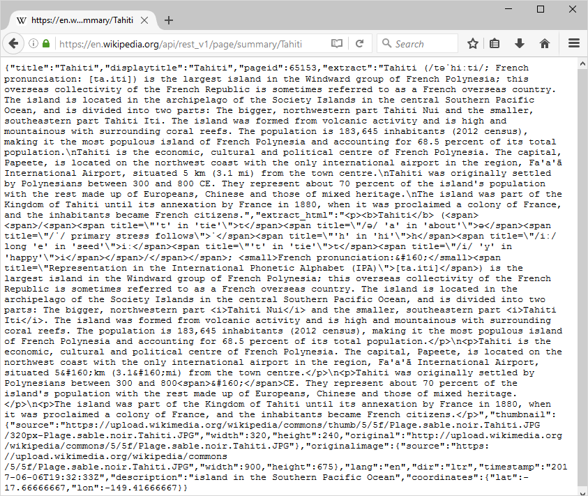
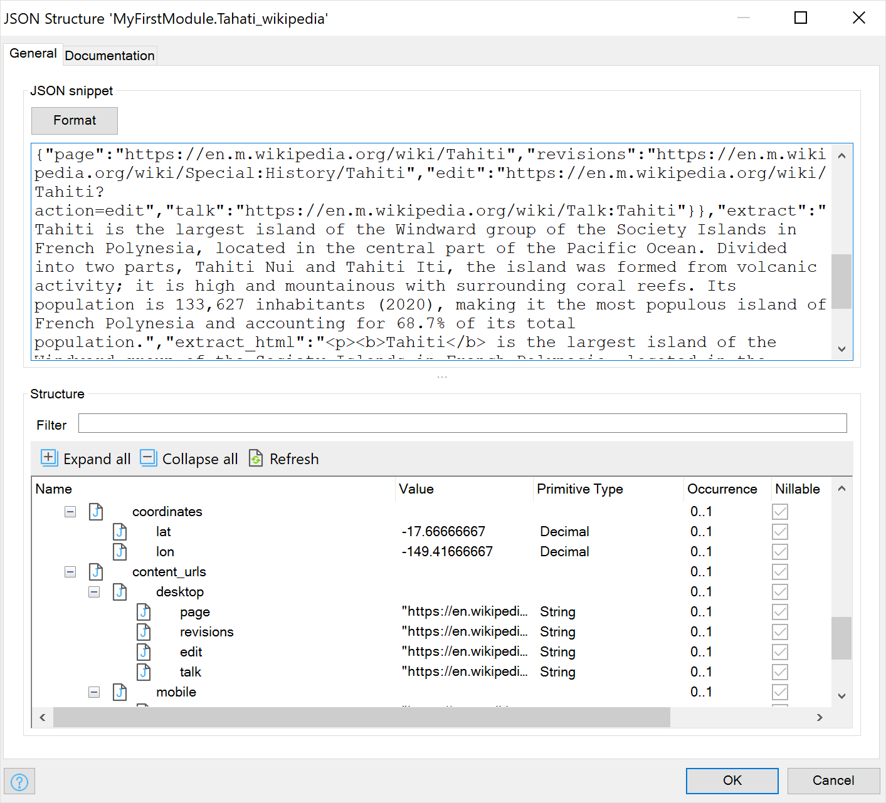
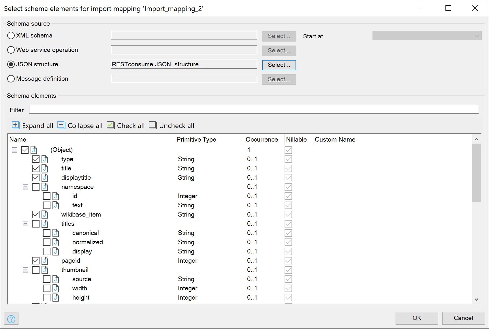
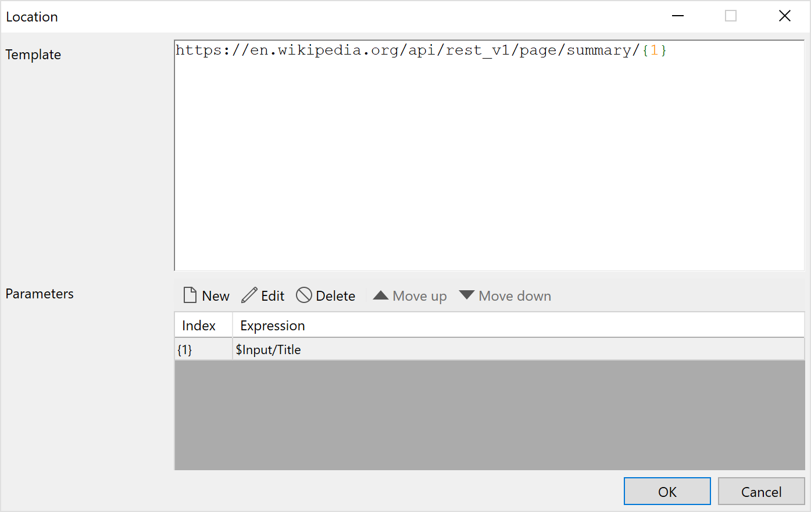
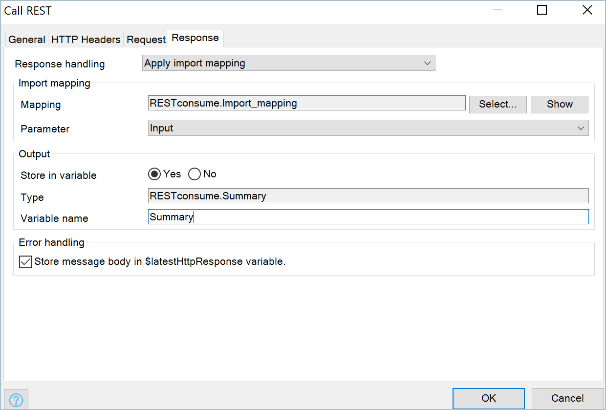
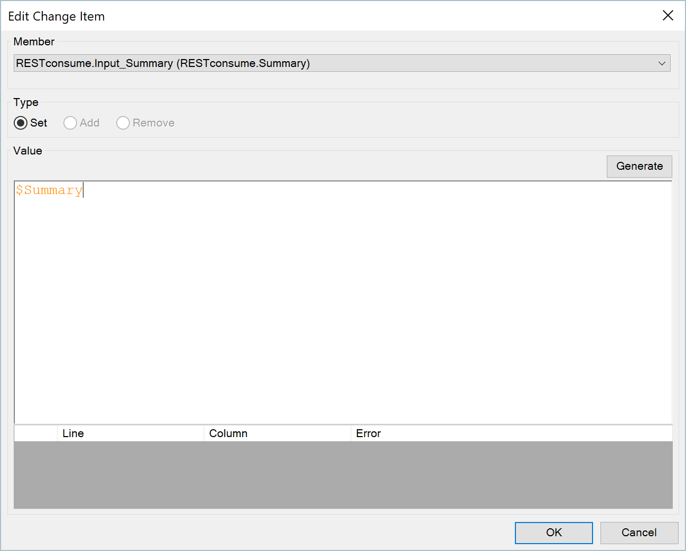
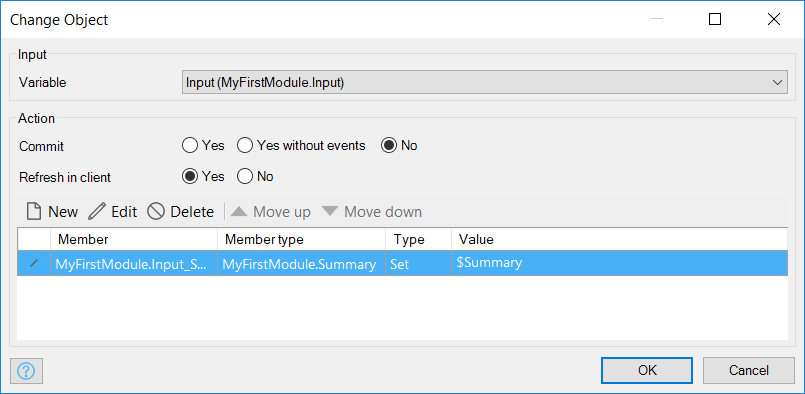
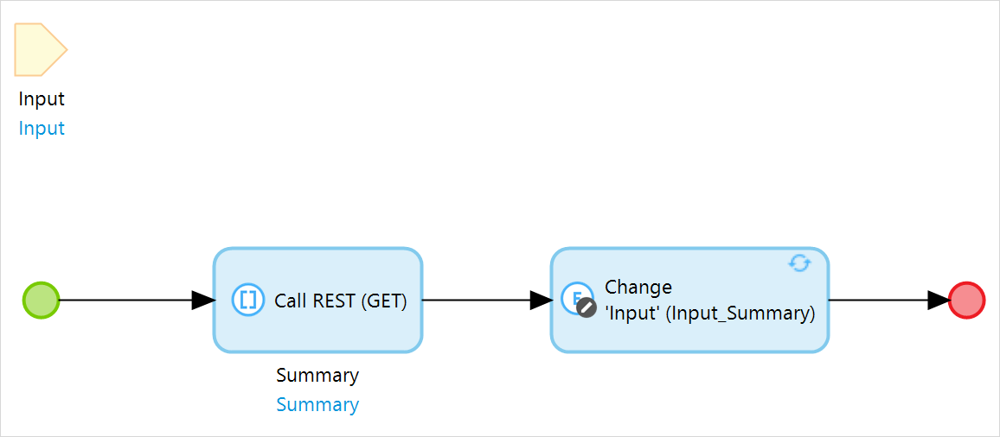
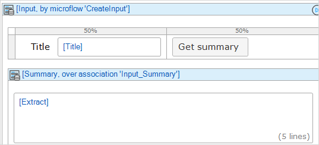

## 1 Introduction

In your Mendix app, you can use information from REST services. This how-to shows you how to do that through an example in which you create an app that retrieves Wikipedia pages from a REST service. The resulting app is [available for download](attachments/consume-a-rest-service/WikipediaApi.mpk).

**This how-to will teach you how to do the following:**

* Call the REST service in a microflow

## 2 Creating a JSON Structure

The Wikipedia REST service allows you to retrieve the summary of a page. This service can be reached at `https://en.wikipedia.org/api/rest_v1/page/summary/{title}`, where `{title}` is the title of a page.

We will start by providing Studio Pro as an example of what the REST service returns:

1. Open your browser and go to [https://en.wikipedia.org/api/rest_v1/page/summary/Tahiti](https://en.wikipedia.org/api/rest_v1/page/summary/Tahiti)
   * This calls the REST service with a GET request – the result is the summary of the [Tahiti page on Wikipedia](https://en.wikipedia.org/wiki/Tahiti) in the JSON format

    

2. Copy the whole JSON snippet. Make sure that you select the **Raw Data** tab to copy the whole code structure.

3.  Now you need to add a new [JSON structure](../../refguide/json-structures)  to your module which contains sample JSON that you can use in the app. Right-click the module in the **Project Explorer** and select **Add other** > **JSON structure**.
    
4. Enter a **Name** for the structure: *Tahiti_wikipedia* and click **OK**.

5. In the **JSON Structure** dialog box, paste the JSON snippet in the  **General** tab and click **Refresh**. This analyzes the structure of the JSON snippet that we can use later.

   

6. Click **OK**

## 3 Creating an Import Mapping

An [import mapping](../../refguide/import-mappings) specifies how the JSON relates to [entities](../../refguide/entities). You can map the the JSON to any entity you like.  The following steps describe how to generate the entities and create an import mapping roll:

1. Right-click the module in the **Project Explorer** and select **Add other** >  **Import Mapping**.

2. Enter a **Name** for the import mapping: *Tahiti_wikipedia* and click **OK**.

3. In the **Select schema elements for import mapping** dialog box, click the radio button for **JSON structure** and then click **Select**.

4. Double-click **Tahiti_wikipedia** in the **Select JSON Structure** dialog box.

5. Click **Expand all** and then click **Check all**.

    

6. Click **OK**. The **Tahiti_wikipedia** document is displayed and the JSON structure is on the right.

7. Click **Map automatically** in the editor toolbar. 

8. A pop-up box is displayed informing you that can **See the details for the changes that have been applied**. You can click **Details** to see details of the mapping to the entities that are generated to match the JSON structure.

9. Click **Close** to see the entities corresponding to the JSON structure.

## 4 Adding an Input Entity to the Domain Model

The service takes the title of the page as an input. It returns the summary of the page. 

In this section, you are creating an entity that represents this input and associating it with its summary.

To add an input entity to the domain model, follow these steps:

1. In the **Project Explorer**, double-click the **Domain Model**.
2. Rename **Root** to **Summary**.
3. From the **Toolbox**, drag an **Entity** onto the domain model.
4. Double-click the entity and enter *Input* for the **Name**.
5. For **Persistable**, select **No**.
6. On the **Attributes** tab, click **New** to add a string attribute and name it *Title*.
7. Click **OK**.
8. Drag an association from **Input** to **Summary**.

  

## 5 Calling the REST Service in a Microflow

You will now call the REST service in a [microflow](../../refguide/microflows). The microflow takes an **Input** as a parameter and sets the associated **Summary**.

To call the REST service in a microflow, follow these steps:

1. Create a new microflow and call it *Tahiti*.

2. Right-click and select **Add** > **Parameter** to add an input parameter.

3. Double-click the input parameter and in the **Parameter** dialog box, click **Select**. Select the **Input** entity from the module to specify that as the input.

4. From the **Toolbox**, drag a **Call REST service** activity onto the microflow and double-click it.

5. In the **Call REST** dialog box, click **Edit** for the **Location** and add the following for the template: `https://en.wikipedia.org/api/rest_v1/page/summary/{1}`, with the parameter `$Input/Title`. Click **OK**.

    

6. In the **Response** tab, set **Response handling** to **Apply import mapping** (or to **Import mapping for the entire response**, depending on your Studio Pro version).

7. For **Mapping** click ** **Select** and double-click **Tahiti_wikipedia**.

8. For **Output** select **Yes** for  **Store in variable** and specify  *Summary* for the **Variable name**.

    

9. Click **OK**.

10. From the **Toolbox**, drag a **Change object** activity onto the microflow and place it after **Call REST service** and double-click it.

11. For the **Input Object**, select **Input (MyFirstModule.Input)**.

12. For **Refresh in client**, select **Yes**. This makes sure that the summary is displayed on the screen.

13. Click **New**.

14. On the **Edit Change Item** dialog box, for** **Member**, select **MyFirstModule.Input_Summary (MyFirstModule.Summary)**.

15. Under **Value**, enter `$Summary`.

     

16. Click **OK**

     

17. Click **OK**. You have created microflow that takes the title of an article as input and associates it with its summary.

     

You have successfully consumed a REST service and created a microflow to show the results. The rest of this how-to describes turning this microflow into an app so that yoyu can see the REST call in action.

## 6 Creating a Page

To create a page for this app, follow these steps:

1. Open the **Homepage** and add a **Data view**.
2. Double-click the the **[Unknown]** bar and select the **Input** entity.
3. For the **Data source Type** select **Microflow**.
4. For the **Name**, enter *CreateInput*. Note that when this page loads, it needs a new **Input** object – you will fill the **CreateInput** microflow that creates this object below.
5. Click **OK**.
6. From **Container widgets**, add a new **Table** with one row and two columns.
7. Drag the **Title** field onto the left column.
8. From the **Project Explorer**, drag **Microflow** onto the right column.
9. On the **Properties** tab, enter *Get summary* for the caption of the button.
10. Add a **Data view** below the table (inside the other data view).
11. From the **Connector**, drag the **Summary** entity onto the **[Unknown]** bar.
12. Click **OK**.
13. From this data view, delete all the fields except **Extract**.
14. Double-click **Extract**.
15. For **Show label**, select **No**.
16. Click **OK**.
17. Delete the **Save** and **Cancel** buttons.

    

## 7 Filling In the Create Input Microflow

Now all that is left is to have the **CreateInput** microflow create a new **Input** object.

To fill in the CreateInput microflow, follow these steps:

1. In the **Project Explorer**, double-click **CreateInput**.
2. From the **Toolbox**, drag on a **Create object** activity.
3. Double-click the activity.
4. Click **Select...** and double-click **Input**.
5. Click **OK**.
6. Double-click the red **End event**.
7. Under **Return value**, enter `$NewInput`.
8. Click **OK**

Congratulations! You can now start your app and get summaries from Wikipedia.

## 8 Example

**How to consume REST with Mendix Studio Pro 8**

{}

## 9 Read More

* [Consume a Complex Web Service](consume-a-complex-web-service)
* [Consume a Simple Web Service](consume-a-simple-web-service)
* [Export XML Documents](export-xml-documents)
* [Import XML Documents](importing-xml-documents)
* [Import Excel Documents](importing-excel-documents)
* [Expose a Web Service](expose-a-web-service)
* [Expose Data to BI Tools Using OData](exposing-data-to-bi-tools-using-odata)
