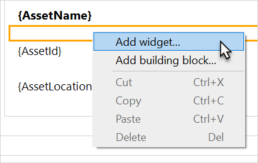
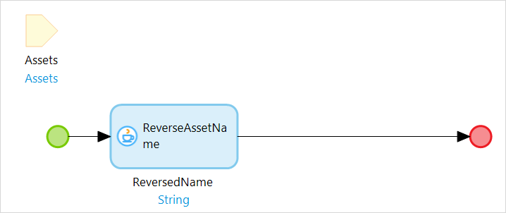
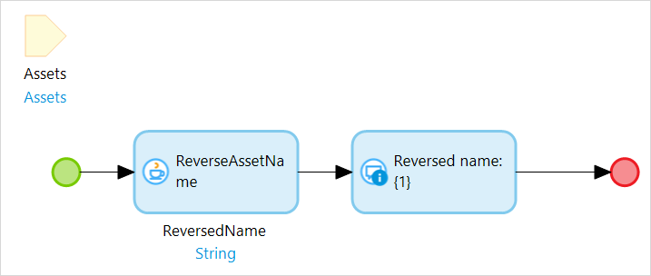

## 1 Introduction

Most application logic can be developed using microflows. Microflows are very powerful and contain a lot of the features that you need in every application. To prevent you from getting stuck due to a missing feature, Mendix microflows are extendable. So, whenever you feel something is missing, you can add it yourself with the use of Java actions. 

**This how-to will teach you how to do the following:**

* Extend your application with custom Java code

## 2 Prerequisites

Before starting this how-to, make sure you have completed the following prerequisite:

*  Have Eclipse installed (download it [here](https://eclipse.org/))

	{}You can use any text editor to create custom Java actions, but we highly recommend using Eclipse. The Modeler contains a **Deploy for Eclipse** feature verifying that everything that needs to be configured in Eclipse is done automatically. All you have to do is import the project into your Eclipse working environment.
{}

* Have an app project with the **Asset Manager** starter app (**Create App** > **Asset Manager**)

## 3 Adding a Java Action in the Modeler

1. Right-click the **MyFirstModule** module and select **Add other** > **Resources** > **Java action**.
2. Enter *ReverseAssetName* for the **Name** of the new Java action and click **OK**.
3.  In the **Java Action** wizard, click **Add** to add a parameter and do the following:</br>

	1. Enter *inputAssets* for the **Name** of the new parameter</br>
	2. Select **Object** for the **Type**.</br>
	3. Click **Select** for **Entity** and select **MyFirstModule.Assets** as the object type.</br>
	4. Click **OK**.</br>

	{}
	{}

4. Back on the **Java Action** wizard, change the **Return type** of the Java action to **String** and click **OK** to save the Java action:

	

5. Select **Project** > **Deploy for Eclipse** from the top Modeler toolbar.

## 4 Editing the Java Action in Eclipse

To edit the Java action in Eclipse, follow these steps:

1.  Open Eclipse, right-click in the **Package Explorer** window, and select **Import...** from the menu:

	{}
	{}

3.  In the **Import** window, select **Existing Projects into Workspace** and click **Next**:

	{}
	{}

4.  Set the project directory as the root directory for this project and click **Finish**:

	{}
	{}

	{}If you don't know what the project directory is, select **Project** > **Show Project Directory in Explorer** in the Modeler.
	{}

5.  Double-click **ReverseAssetName.java** in the **Package Explorer** of Eclipse:

	

	In the Java code, there is a placeholder marked with `//BEGIN USER CODE` and `//END USER CODE` comment statements. This is where you can add your own Java code. The modeler will never overwrite the code between those two statements.

	

	As you can see, the Modeler generated a variable for the input customer object name `inputCustomer`. You can use that variable to get the name of the customer and reverse it like this:

	```java
String assetsAssetName = this.inputAssets.getAssetName(this.getContext());
return new StringBuilder(assetsAssetName).reverse().toString();
	```

6.  Insert the above code between the `//BEGIN USER CODE` and `//END USER CODE` comment statements. It should look like this:

	

7. Select **File** > **Save** to Save the Java action in Eclipse.

## 5 Calling the Java Action from a Microflow

1. Back in the Modeler, locate the **Assets** page via **Project Explorer**.
2.  Under **{AssetName}, right-click and select **Add widget**:

	{}
	{}

3. In the **Select widget** dialog box that appears, select **Button widgets** > **Call microflow button**.
4. In the **Select Microflow** dialog box, click **New** to create a new microflow.
5. Enter *Asset_ReverseName* for the **Name** of the new microflow and click **OK**.
6.  Right-click the **Asset reverse name** button you just created and select **Go to on clock microflow** to open the new microflow, which should look like this:

	{}
	{}

7.  Drag the **ReverseCustomerName** Java action from the **Project Explorer** onto the line between the green start event and red end event. This generates a Java action activity:

	{}
	{}

8.  Double-click the generated activity to open the **Call Java Action** properties editor, and then click **Edit** for the first input to open the argument editor:

	{}
	{}

9. Press and hold the <kbd>Ctrl</kbd> key and then press the spacebar to open the code completion editor.
10. Select **$Assets (MyFirstModule.Assets)**:

	{}
	{}

11. Click **OK** to save the expression.
12. In the **Call Java Action** window, change the output **Variable** to *ReversedName*:

	{}
	{}

13. Click **OK** to save the properties. The microflow should now look like this:

	{}
	{}

14. From the **Toolbox** (select **View** > **Toolbox** to open it, if necessary), drag a **Show message** activity into the microflow.
15. Double-click the activity to open the **Show Message** properties editor and enter *Reversed name: {1}* for **Template**.
16. In the **Parameters** section, click **New** to open the expression editor.
17. Select **$ReversedName (String)**, which is the output variable of the Java action:

	{}
	{}

18. Click **OK** to save the parameter. The **Show Message** activity properties should now look like this:

	{}
	{}

19. Click **OK** to save the show message activity. The microflow should now look like this:

	{}
	{}

## 6 Deploying & Seeing the Results

1. Click **Run Locally** to deploy the application locally and click **View** to open the application in your browser.
2. To test the new feature, select **Asset** from the app's **Dashboard**.
3.  On the **Assets** page, click **Asset reverse name** for the asset that has been loaded:

	{}
	{}

4.  The reversed name of the asset will be presented: 

	{}
	{}

## 7 Read More

* [How to Define Access Rules Using XPath](define-access-rules-using-xpath)
* [How to Trigger Logic Using Microflows](triggering-logic-using-microflows)
* [How to Create a Custom Save Button](create-a-custom-save-button)
* [How to Work with Lists in a Microflow](working-with-lists-in-a-microflow)
* [How to Optimize Retrieve Activities](optimizing-retrieve-activities)
* [How to Set Up Error Handling](set-up-error-handling)
* [How to Optimize Microflow Aggregates](optimizing-microflow-aggregates)
* [How to Extract & Use Sub-Microflows](extract-and-use-sub-microflows)
