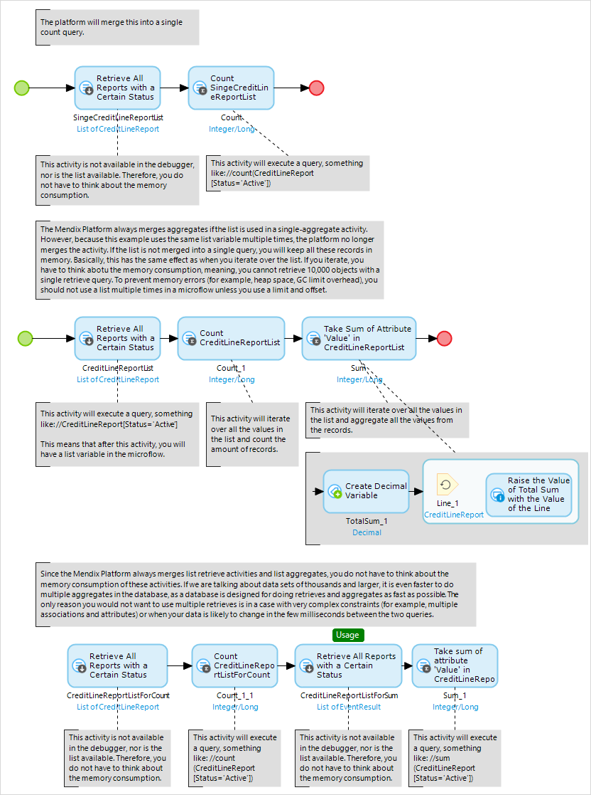

## 1 Optimization

In some projects, it is necessary to evaluate large datasets in a microflow (for example, for reporting purposes). If all those microflows do a lot of retrieves and aggregates on large datasets, it is easy to run into performance or memory problems. 

When a database retrieve activity is only used in list aggregate activities, the platform can automatically merge these two activities into a single action. This executes a single aggregate query on the database. So, if you retrieve all 100k log lines from a database and only do a count on the list, you don’t receive a heap space, because the microflow would never place all 100k records in the memory. However, if you reuse the same list variable for multiple list aggregates, this no longer applies.

The platform only creates an optimized SQL query as long as the list is not used in the microflow afterwards. If you use the list later (for example, to iterate over), the query will not be optimized.

If you do want to use the list but you also want the optimized query, do two separate retrieves. This will do the optimized query, and you can use the second retrieve in your microflow.

## 2 Related Content

* [How to Define Access Rules Using XPath](define-access-rules-using-xpath)
* [How to Extend Your Application with Custom Java](extending-your-application-with-custom-java)
* [How to Work with Lists in a Microflow](working-with-lists-in-a-microflow)
* [How to Trigger Logic Using Microflows](triggering-logic-using-microflows)
* [How to Create a Custom Save Button](create-a-custom-save-button)
* [How to Optimize Retrieve Activities](optimizing-retrieve-activities)
* [How to Configure Error Handling](set-up-error-handling)
* [How to Optimize Microflow Aggregates](optimizing-microflow-aggregates)
* [How to Extract & Use Sub-Microflows](extract-and-use-sub-microflows)
