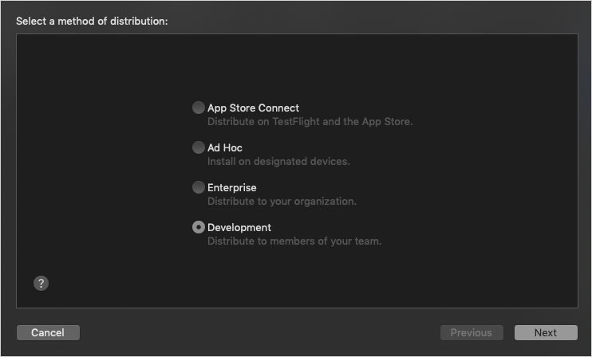
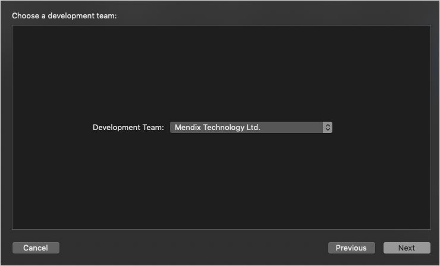
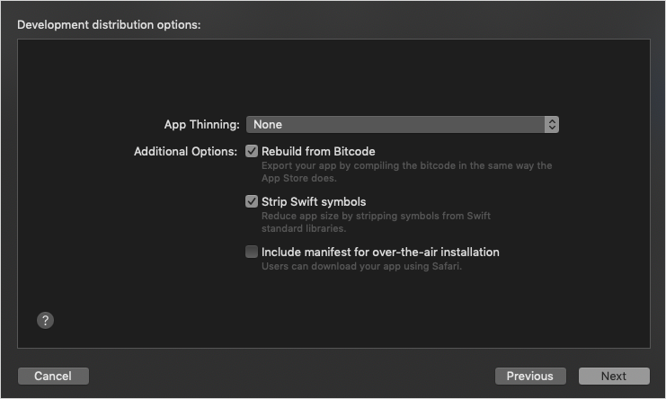
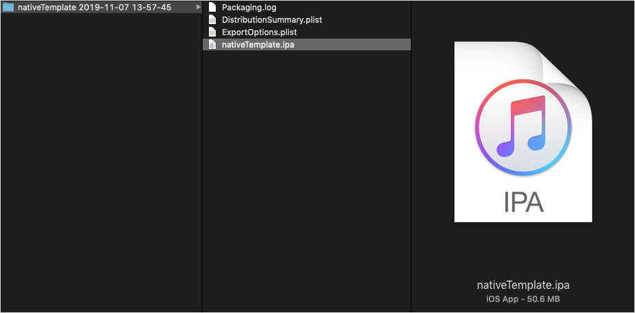

## 1 Introduction

This how-to will teach you how to go from a blank slate to an app running on a device.

Every Native Builder project has configurations. These configurations are useful for preparing your app, and then creating builds on App Center and GitHub respectively. Configurations are also critical for making updates to apps already delivered to production devices. For more information on the Native Builder's capabilities, see the [Native Builder Reference Guide](/refguide/native-builder).

## 2 Prerequisites {#prerequisites}

Before starting this how-to, make sure you have completed the following prerequisites:

* Read [How to Get Started with Native Mobile](/howto/mobile/getting-started-with-native-mobile) to see how to create, style and debug an application with Mendix Studio Pro
* Deploy your native app to the cloud via Studio Pro and have the cloud address of your deployed application available
* Learn how to use Windows' command line interface (CLI) program `cmd`
* Install [Java JDK 11](https://adoptopenjdk.net/) (if you have Studio Pro installed, you should already have JDK 11 in *C:\Program Files\AdoptOpenJDK*)
* Download the Native Builder [executable](https://www.dropbox.com/sh/hpw7sshut9bco68/AABackrr75rPSgW7u5LBMkMra?dl=0) to a folder of your preference and extract all contents
 * Use v1.0.0 with Mendix 8.0
 * Use v2.0.0 with Mendix 8.1.0 and above
 * Use v3.0.0 with Mendix 8.3.0 and above

### 2.1 Platform-Specific Prerequisites

If you plan to deploy your app for testing on an iOS device, make sure you have completed the following prerequisites:

* Register for an Apple Developer Account
* Have an iOS device for testing the iOS package that will be produced
* Have an iOS deployment certificate and a provisioning file for which your device is activated
* Have Xcode installed on your computer for deploying the iOS package to your test device

If you plan to deploy your app for testing on an Android device, make sure you have an Android device available.

## 3 Getting Your Tokens

To use the Native Builder, you will first need to get tokens to authenticate with GitHub and App Center. If you already have tokens for your GitHub and App Center, you do not need to repeat these sections.

{}
The Native Builder needs to communicate with GitHub and App Center. Therefore, make sure your firewall permissions do not restrict the Native Builder.
{}

### 3.1 GitHub Token {#github-token}

1. Go to [GitHub](https://github.com/) and sign in.
2. Go to [Settings](https://github.com/settings/profile) by clicking your profile picture in the top-right corner of the page.
3. Click [Developer settings](https://github.com/settings/apps) at the bottom of the left menu.
4. Navigate to [Personal access tokens](https://github.com/settings/tokens) and then click **Generate new token** to create a new personal access token.
5. In the **Note** field, write *Native Builder.*
6. Under **Select scopes**, select **repo**.
7. Click **Generate token**.
8. Store your token in a secure place. You will not be able to see it again. If you lose it, you will have to create a new token and delete your old one.

### 3.2 App Center Token {#appcenter-token}

1. Go to [App Center](https://appcenter.ms/apps) and sign in.
2. Click your profile icon in the top right corner, then click **Settings**, and then **Account Settings**.
3. In the **API Tokens** tab, click **New API token**.
4. Add a description of your token, select **Full Access**, then click **Add new API token**, and then **New API Token**.
5. Store this token in a secure place as well. You will not be able to see it again. If you lose it, you will have to create a new token and delete your old one.

## 4 Preparing Your Project

The native builder uses the `prepare` command as well as a line of parameters in your CLI to specify the details of your build. Below is an example of a `prepare` command with a complete set of parameters:

```bash
native-builder.exe prepare --project-name CoolApp --java-home "C:\Program Files\Java\jdk-11.0.3" --project-path "Y:\Documents\Mendix\CoolApp\CoolApp.mpr" --mxbuild-path "C:\Program Files\Mendix\8.6.0.715\modeler\mxbuild.exe" --github-access-token b609183aa226a8c2d962700be7a387bd7776e986 --appcenter-api-token 440725eb1311ddfced62894a4d23fc90843370c7 --appcenter-organization "cool-organization" --runtime-url "https://coolapp.mendixcloud.com" --app-name "My Cool App" --app-identifier "com.mendix.coolapp" --mendix-version "8.6.0"
```

{}
To be valid, the `app-identifier` needs to be lower-case with no special characters.
{}

The `prepare` command  does the following:

* Generates a private GitHub repository which will house the project's source code and configurations
* Generates two different projects on App Center for Android and iOS respectively
* Modifies the default app icons and splash screen if any are provided
* Modifies the application's name and identifier for both Android and iOS if any are provided
* Modifies the Runtime URL for both Android and iOS if any are provided

Now you will run your first `prepare` command:

1. Open your CLI.
2. Change directory to the folder you extracted the Native Builder contents to.
3.  Run `prepare` for the first time, which will produce this warning:

	

	This warning is part of App Center's security policy. 

2. Visit App Center's [dashboard](https://appcenter.ms/) to see your applications created by the Native Builder:

	

To address the warning, complete the following steps (you must do them for both your iOS and Android apps if you have one of each):

1. Navigate to [App Center](https://appcenter.ms/).
2. Select your newly created app.
3. Select **Build** on the left panel.
4. You will be greeted with a screen that allows you to link your account with a repository service.
5. Choose **GitHub**.
6. If you are not logged in already you will be asked to sign into your GitHub account. If asked, do so.
7. Select approve in the permission request.
8. Select the repository you want to connect to.
9. You will be redirected back to your App Center account. Your repository’s branches are now listed in the build page.

{}
If you run into errors while running the `prepare` command, try running your CLI as an administrator.
{}

You have successfully prepared your app, and in the next section will make a build from it.

## 5 Making Your First Build {#first-build}

To initiate your first build in the Native Builder, you will execute a command in CLI with various parameters included. For more information on parameters, see the [Commands](/refguide/native-builder#commands) section in the *Native Builder* guide. While some parameters are optional, two are required: the `--project-name` parameter and the `--build-number` parameter.

This is an example build command using the the two required parameters mentioned above, as well as the optional `--app-version` command (it is best practice to include a [new app version](https://semver.org/) with each release):

```bash
native-builder.exe build --project-name CoolApp --build-number 1 --app-version 0.1.0
```

Now it is time for you to make your own first build:

1. Open your CLI.
2. Make sure you are in still in your Native Builder directory.
3. Write this command, with your own information replacing the example text:

	```
	native-builder.exe build --project-name {ExampleName} --build-number {1} --app-version {0.1.0}
	```

4. Run the command.

This command does the following:

* Generates a JavaScript deployment bundle and images of the Native App from Studio pro
* Creates a new build branch on GitHub and starts a build process on App Center

If your `build` command fails citing version conflicts on Java classes, try the following:

1. Clear your deployment directory.
2. Complete a new build in Studio Pro.
3. Run the `build` command again in the Native Builder.
4. Ensure the version in your `--java-home` file path matches the version being used in Studio Pro.

### 5.1 Signing a Build {#signing-a-build}

By default, App Center builds are unsigned and cannot be released on the Google Play Store or the Apple App Store. To release your apps, you must provide your signature keys to App Center. Signature keys prove the authenticity of your app and prevent forgeries. For more information to how to acquire these keys, see the [Managing App Signing Keys Reference Guide](/refguide/managing-app-signing-keys). 

For Android, if you do not intend to publish your app to the Google Play Store, you can skip this section. For iOS, this step prepares an already installable iOS App Store Package (*.ipa*). Without this section's instructions, an unsigned version of an iOS app (*.xcarchive*) would need to be signed manually using Xcode in order to deploy on a device or in the App Store.

Currently due to limitations, Native Builder is not able to copy signing keys from one branch to another. Therefor setting up signing has to be done per branch you want to release. When you build with Native Builder, the build number provided is used to create a new branch with the format **build/#number**. When ready to release, setup signing for the build number branch you decided according to this documentation and rebuild with native builder using the build number of the branch.

To sign your app using App Center, do the following:

1. Navigate to [App Center](https://appcenter.ms/apps).
2. Select the application you wish to configure.
3. Select **Build** on the left panel.
4. Select the **branch** you would like to configure from the list.

The next steps differ depending on the type of app you want to configure.

#### 5.1.1 Signing a Build for iOS

1.  Click the **Wrench icon** in the top-right corner to open the **Build configuration** panel:

	

2.  Switch the **Sign builds** toggle on:

	

3. Upload your mobile provisioning profile. A **Distribution** profile is best, as App Center has a 30 minute limit for free accounts signing with a **Developer** profile.
4. Upload your *.p12* certificate.
5. Provide the password you used when exporting the *.p12* certificate.
6. Click **Save**, or **Save and build** if you wish to build immediately.

#### 5.1.2 Signing a Build for Android

1. Select the **Wrench icon** in the top-right corner to open the **Build configuration** panel:

	{}{}

2. In the **Build Variant** drop-down menu, select **release**:

	{}{}

3. Select **Sign builds**:

	{}{}

4. Upload your keystore file.
5. Provide the password to your keystore.
6. Provide the name of your key’s alias.
7. Provide the password of the key’s alias.
8. Click **Save**, or **Save and build** if you wish to build immediately.

Finally, either start a build for this branch manually or run the `build` command again with the same build number as before:

```bash
native-builder.exe build --project-name CoolApp --build-number 1 --app-version 0.1.0
```

This allows the Native Builder to build again using the same keys already configured on App Center.

### 5.2 Native Builder and App Center Build Phase

After your start your Native Builder build, you will see some or all of the following:

* The Native Builder starting a build:

	{}{}

* App Center starting a build:

	{}{}

* A successful App Center build:

	{}{}

* A successful, downloaded Android build:

	{}{}

* A successful, downloaded iOS build:

	{}{}

If your build times out, you can either sign your app locally as described in [Android Local Signing](#android-local-signing) and [iOS Local Signing](#ios-local-signing) below, or upgrade to a paid App Center account. This build issue is more likely to affect iOS builds because of how long signing takes with an iOS developer profile.

In case of failure, the build logs will be downloaded for your convenience. Please provide them when filing a [support ticket](/developerportal/support/submit-support-request) with Mendix.

Afer your build succeeds, note the downloaded *.zip* archives at the path provided by Native Builder.

## 6 Distributing {#distributing}

If your builds are not signed, the downloaded archives `CoolApp-Android-1.zip` and `CoolApp-iOS-1.zip` will contain *non-release* builds, `app-debug.apk` and `nativeTemplate.xcarchive`. 

If your builds are signed, they will contain `app-release.apk` and `nativeTemplate.ipa` files for Android and iOS platforms respectively.

For distributing to a specific platform, see the subsequent sections below:

* [Distributing for Android](#android-distributing)
* [Distributing for iOS](#ios-distributing)

### 6.1 Distributing for Android {#android-distributing}

#### 6.1.1 Local Signing {#android-local-signing}

You can skip this section if you completed [Signing a Build](#signing-a-build). To sign your Android app locally, use apksigner by following Google's [apksigner documentation](https://developer.android.com/studio/command-line/apksigner).

#### 6.1.2 Installing on a Device

The *app-debug.apk* or *app-release.apk* can readily be installed on any device by sending the file over via any available means (for example USB).

To install your app via USB, connect your device to a machine via USB. To Install an APK from your device's file manager app this way:

1. Follow the instructions on Google’s [Transfer files between your computer & Android device](https://support.google.com/android/answer/9064445?hl=en) to get the APK onto your device. Note which folder you transfer the APK into.
2. Open your phone’s file manager, navigate to the folder containing your APK, then tap the APK file to open it.
3. Tap the **Install** button. 
	
	{}On Android, you might see a dialog box warning you against installing because this is not a Play Store app. Tap **INSTALL ANYWAY**.
	{}
	
4. Tap the **Done** button when prompted. You should now be able to access your installed app via your **App Drawer**, as well as by tapping the **Open** button after the installation completes.

	{}{}

You can also consult Google's [Run apps on a hardware device](https://developer.android.com/studio/run/device) for detailed instructions on testing your app using a physical Android device instead of an emulator.

#### 6.1.3 Uploading to the Google Play Store

This section details publishing a signed Android app to the Google Play store. This section can only be started if you done the following:

* Completed the [Signing a Build](#signing-a-build) section above
* Produced an *app-release.apk* build
* Read Google's overview of [the Android app publishing process](http://developer.android.com/tools/publishing/publishing_overview.html). 

Before submitting your app to an app store, you will have to complete Google's [signup steps](https://play.google.com/apps/publish/signup/). Also, [review the launch checklist](http://developer.android.com/distribute/tools/launch-checklist.html) before publishing your app. Beyond the launch checklist information, check Google's [Preparing your app for release](https://developer.android.com/studio/publish) for information on edge cases to resolve before publishing. 

Once you have satisfied those requirements, you can follow Google's [Upload your app to the Play Console](https://developer.android.com/studio/publish/upload-bundle). Then, follow Google's [Prepare & roll out releases](https://support.google.com/googleplay/android-developer/answer/7159011) to create, prepare, review, and roll out your app release.

### 6.2 Distributing for iOS {#ios-distributing}

#### 6.2.1 Local Signing {#ios-local-signing}

You can skip this section if you completed [Signing a Build](#signing-a-build). Local signing is useful if you only want to test your app on a device, or you do not have a distribution certificate and have run out of build minutes on App Center when signing with a developer certificate.

In order to deploy the *nativeTemplate.xcarchive* on a device or on the App Store, an Apple developer account and a development team is required. If one is available, do the following:

1. Using an Xcode version below 11, double-click the *nativeTemplate.xcarchive* file and it should open with the built-in *Application Loader* software.

2.  Click the *Distribute App* button to start the local signing flow.:

	

3.  Select **Development**:

	

4. Choose a **Development Team**:

	

5. Configure your **Development distribution options**:

	

6. Select a re-signing option:

	

7. Review your *.ipa* content and click **Export**:

	

8. Congratulations. You now have a signed *.ipa* file:

	

#### 6.2.2 Installing on a Device

You can now deploy your app to your device. An easy way to do this is with Apple's iTunes program.

To install the *ipa* on your device, follow these steps:

1.  Connect your Apple device to your computer. Both will show dialog boxes which ask you to confirm that you trust the devices. Tap **Continue** on your device, and **Trust This Computer?** on your mobile device to proceed:

	

2. Open iTunes and connect your iOS device to your computer.
3. Select the *.ipa* package file that you downloaded earlier, and drag it onto your device's **Devices** section on iTunes' left menu. Drop the *.ipa* file there to install it on your device.
4. If there is an existing version, iTunes will ask if you want to replace that existing version of the app. If there is one, do so.
5. Your app will show up in the list of apps. Click the **Install** button next to your app.
6. Click **Apply** at the bottom of the screen to execute the actual installation.

#### 6.2.3 Distributing for iOS Tablets

When you try to build an app for tablets, your app will run as a phone app in a scaled mode optimized for tablet form factors. Please note, however, that Apple has far stricter rules for releasing tablet apps. For example, they require the app to behave well in any possible rotation or resolution. This means that when making a Mendix app for iOS tablets you should take extra care to style your app correctly so it is not rejected. 

There are two ways to enable tablet mode:

* If you are working with a Mac and are familiar with Git you can use XCode
* You can directly do the changes in the appropriate files using GitHub's page

##### 6.2.3.1 Use XCode on a Mac

By default, building for tablets is disabled in XCode. Do the following to enable tablet settings:

1. Select the following options in your XCode workspace:<br />
	a. **iPad**: this enables tablet mode. By default, if tablet mode in enabled you also have to support any possible orientation.<br />
	b. **Portrait**.<br />
	c. **Landscape Left**.<br />
	d. **Landscape Right.**<br />
	e.  **Requires full screen**: Mendix requires this because full-screen orientations are easier on Mendix developers than smaller side-by-side forms.

	{}{}

1. Commit these changes to your project's master branch so consecutive builds have the tablet settings enabled.

##### 6.2.3.2 Directly Change the Files on GitHub

First, navigate to your project's repository. This should be `www.github.com/<your github username>/<the given project name>`. Then do the following to enable tablet mode:

1. Using the **Find file** functionality, find and open *project.pbxproj*:

	

1.  Click the edit icon:

	

1. Change both instances of `TARGET_DEVICE_FAMILY = “1”;` to `TARGET_DEVICE_FAMILY = “1,2";`.
1.  Commit these changes.
1. Using the **Find file** functionality again, find and open *info.plist*.
1.  Click the edit icon, then change the code like so: 

	a. Before the final `</dict>` line, add this key:<br />
	
	```
	<key>UIRequiresFullScreen</key>
	<true/>
	```
	
	b. Change this code:<br />
	
	```
		<key>UISupportedInterfaceOrientations</key>
	<array>
		<string>UIInterfaceOrientationPortrait</string>
</array>
	```
	
	to the following:<br />
	
	```
		<key>UISupportedInterfaceOrientations</key>
	<array>
		<string>UIInterfaceOrientationPortrait</string>
		<string>UIInterfaceOrientationLandscapeLeft</string>
		<string>UIInterfaceOrientationLandscapeRight</string>
	</array>
	```
1. Commit these changes.

#### 6.2.4 Uploading to the Apple App Store

To upload your app to the iOS App Store, follow these instructions (to continue, you must have completed the [Signing a Build](#signing-a-build) section above and recieved a build signed for the Apple Store):

1. Follow Apple's [Add an app to your account](https://help.apple.com/app-store-connect/#/dev2cd126805) tutorial to add an app entry to your account.
2.  After adding a new app to your account, follow Apple's [View and edit app information](https://help.apple.com/app-store-connect/#/dev97865727c) tutorial to describe your new app entry. Consult the other pages under the left menu's **Enter app information** category should they apply to your app:

	

3. Follow Apple's [Uploading builds overview](https://help.apple.com/app-store-connect/#/dev82a6a9d79) to upload a build of your app to App Store Connect.
4. Use Apple's [Upload tools guide](https://help.apple.com/app-store-connect/#/devb1c185036) to upload your *ipa*.
5. Use Apple's [Choose the build before you submit to review](https://help.apple.com/app-store-connect/#/dev7cbda8c55) to select the build which you will submit to App Review.
6.  Publish your app by following Apple's [Overview of publishing an app](https://help.apple.com/app-store-connect/#/dev34e9bbb5a) and the subsequent documents in the left menu's **Publish on the App Store** category:

	

## 7 Read More

* [Native Builder Reference Guide](/refguide/native-builder)
* [How To Get Started with Native Mobile](/howto/mobile/getting-started-with-native-mobile)
