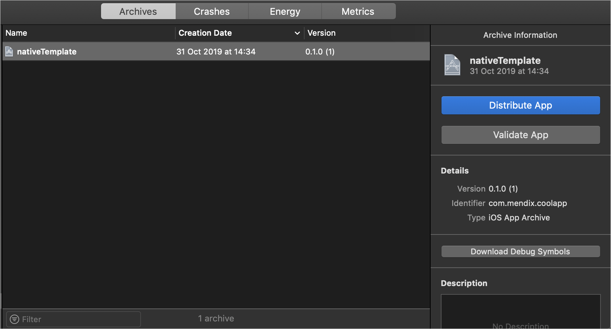
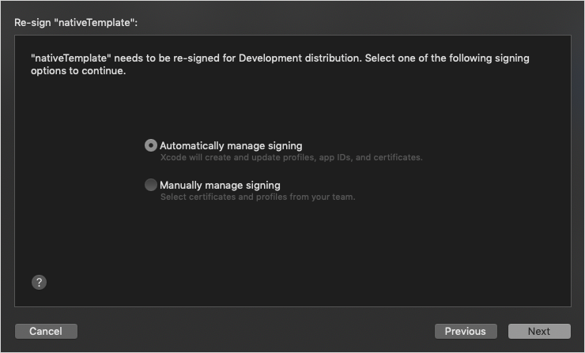
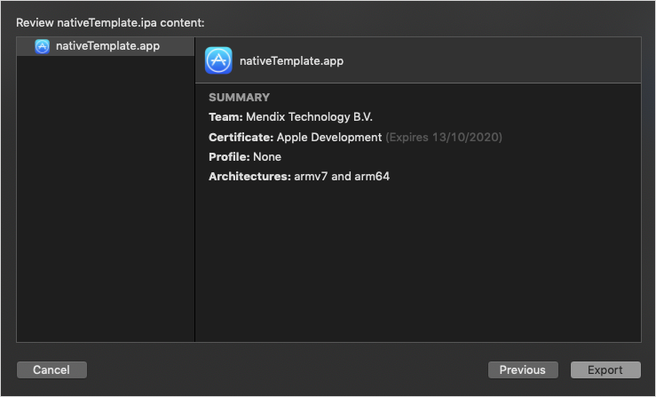

## 1. Introduction

This tutorial will teach you how to go from a blank slate to an app running on a device.

Every Native Builder project has configurations. These configurations are useful for preparing your app, and then creating builds on App Center and GitHub respectively. Configurations are also critical for making updates to apps already delivered to production devices.

The following configurations are required:

* Project name (`--project-name`) This unique configuration identifies what name should be given to the project on App Center and GitHub as well as locally on your machine for later reference

* The build number (`--build-number`) This unique configuration represents the version build number for the release builds for both Android and iOS. It also serves as the branch name on both App Center and GitHub. For over-the-air updates, each build is associated with a particular release group (`--deployment-target`)  which would get the update. By default, this value is set to **Production** and should usually be kept this way. If changed, the new value should be noted as only devices running on that environment would get updates.

## 2. Prerequisites

* Read the [Getting Started with Native Mobile](https://docs.mendix.com/howto/mobile/getting-started-with-native-mobile) guide and learn how to create, style and debug an application with Mendix Studio Pro
* Deploy your native app to the cloud via Studio Pro and have the cloud address of your deployed application available
* Have basic knowledge on how to use Windows' Command Line Interface program `cmd`
* Read up on the various parameters found in the [Nnative Builder guide](https://docs.mendix.com/refguide/native-builder#commands)
* If you plan to deploy your app for testing on an iOS device, do the following:
  * Register for an Apple Developer Account
  * Have an iOS device for testing the iOS package that will be produced
  * Have an iOS deployment certificate and a provisioning file for which your device is activated
  * Have Xcode installed on your computer for deploying the iOS package to your test device
* To deploy your app for testing on an Android device, it is expected to have an Android device available

## 3. Preparing Your Project

The native builder uses the `prepare` command, as well as a line of parameters, in your CLI to specify the details of your build. Below is a quick example of a complete set of paramaters:

```bash
native-builder.exe prepare --project-name CoolApp --java-home "C:\Program Files\Java\jdk-11.0.3" --project-path "Y:\Documents\Mendix\CoolApp\CoolApp.mpr" --mxbuild-path "C:\Program Files\Mendix\8.3.0.61600\modeler\mxbuild.exe" --github-access-token b609183aa226a8c2d962700be7a387bd7776e986 --appcenter-api-token 440725eb1311ddfced62894a4d23fc90843370c7 --appcenter-organization "cool-organization" --runtime-url "https://coolapp.mendixcloud.com" --app-name "My Cool App" --app-identifier com.mendix.coolapp
```

The `prepare` command  does the following:

* Generates a private GitHub repository which will house the project's source code and configurations
* Generates two different projects on App Center for Android and iOS respectively
* Modifies the default app icons and splash screen if any are provided
* Modifies the application's name and identifier for both Android and iOS if any are provided
* Modifies the Runtime URL for both Android and iOS if any are provided

The `prepare` command can be run multiple times to modify any of the aforementioned parameters. Running `prepare` the first time will produce this warning:


This warning is part of App Center's security policy which you must solve on their site. On visiting App Center's dashboard, you will already see the applications created by Native Builder:


*App Center Dashboard*

To address the warning, complete the following steps (you must repeat them for both your iOS and Android apps if you have one of each):

1. Navigate to [App Center](https://appcenter.ms/).
2. Select your newly created app.
3. Select **Build** on the left panel.
4. You will be greeted with a screen that allows you to link your account with a repository service.
5. Choose **GitHub**.
6. If you are not logged in already you will be asked to sign into your GitHub account. If asked, do so.
7. Select approve in the permission request.
8. Select the repository you want to connect to.
9. You will be redirected back to your App Center account. Your repository’s branches are now listed in the build page.

## 4. Making your First Build

By default, App Center builds are unsigned and not releasable on Google Play or the App Store. To release your apps, you must provide your signature keys to App Center. Signature keys prove the authenticity of your app and prevent forgeries. For more information to how to acquire these keys, See [Managing App Signing Keys](/refguide/managing-app-signing-keys). 

This is an example build:

```bash
native-builder.exe build --project-name CoolApp --build-number 1 --app-version 0.1.0
```

For more info on the parameters and what they are used for, see the [Commands](/refguide/native-builder#commands) section in the *Native Builder* guide.

The example above would initiate a new build for the already-prepared project *CoolApp* using a [Semantic version](https://semver.org/) *0.1.0* for the build, unique version build number *1*  and performing an dual-platform (Android and iOS) build. For a single-platform build, the `--platform` parameter can be used with `android` or `ios` with an example below.

```bash
native-builder.exe build --project-name CoolApp --build-number 1 --app-version 0.1.0 --platform android
```

This command does the following:

* Generates a Javascript deployment bundle and images of the Native App from Studio pro
* Creates a new build branch on GitHub and starts a build process on App Center

### 4.1 Signed Builds

For Android, If you do not intend to publish your app to the Google Play Store, you can skip this section. For iOS, this step prepares an already installable iOS App Store Package (*.ipa*). Without this section's instructions, an unsigned version of an iOS app (*.xcarchive*) would need to be signed manually using Xcode in order to deploy on a device or in the App Store.

To sign your app using App Center, do the following:

1. Navigate to [App Center](https://appcenter.ms/apps).
2. Select the application you wish to configure.
3. Select *Build* on the left panel.
4. Select the *branch* you would like to configure from the list.

The next steps differ depending on the type of app you want to configure.

#### 4.1.1 Signing a Build for iOS

1.  Click the **Wrench icon** in the top-right corner to open the **Build configuration** panel:

 

2.  Switch the **Sign builds** toggle on:

 

3. Upload your mobile provisioning profile. A **Distribution** profile is best, as App Center has a 30 minute limit for free accounts signing with a **Developer** profile.
4. Upload your *.p12* certificate.
5. Provide the password you used when exporting the *.p12* certificate.
6. Click **Save**, or **Save and build** if you wish to build immediately.

#### 4.1.2 Signing a Build for Android

1. Select the **Wrench icon** in the top-right corner to open the **Build configuration** panel:

 

2. In the **Build Variant** drop-down menu, select **release**:

 

3. Select **Sign builds**:

 

4. Upload your keystore file.
5. Provide the password to your keystore.
6. Provide the name of your key’s alias.
7. Provide the password of the key’s alias.
8. Click **Save**, or **Save and build** if you wish to build immediately.

Finally, either start a build for this branch manually or run the `build` command again with the same build number as before:

```bash
native-builder.exe build --project-name CoolApp --build-number 1 --app-version 0.1.0
```

This allows the Native Builder to build again using the same keys already configured on App Center.

### 4.2 Native Builder and App Center Build Phase

After your start your Native Builder build, you will see some or all of the following:

* The Native Builder starting a build:

 

* App Center starting a build:

 

* A successful app center build:

 

* A successful and downloaded Android build:

 

* A successful and downloaded iOS build:

 

At this point, the downloaded *.zip* archives can be retrieved from the path provided by Native Builder.

If your build times out, you can either sign your app locally as described in [Android Local Signing](#511-local-signing) and [iOS Local Signing](#521-local-signing) below, or upgrade to a paid App Center account. This build issue is more likely to affect iOS builds than Android builds as this is a limitation when signing with an iOS developer profile.

In case of failure, the build logs will be downloaded for your convenience. Please provide them when filing a [support ticket](/developerportal/support/submit-support-request) with Mendix.

## 5. Distributing

Unless [Signed](#41-signed-builds), the downloaded archives, `CoolApp-Android-1.zip` and `CoolApp-iOS-1.zip` would contain *non-release* builds, `app-debug.apk` and `nativeTemplate.xcarchive`. Otherwise, it would contain `app-release.apk` and `nativeTemplate.ipa` for Android and iOS platforms respectively.

For distributing a specific platform, see the subsequent sections below:

* [Distributing for Android](#51-distributing-for-android)
* [Distributing for iOS](#52-distributing-for-ios)

### 5.1 Distributing for Android

#### 5.1.1 Local Signing

You can skip this section if you completed [App Center Signing](#412-signing-android). To sign your Android app locally, use apksigner by following Google's [apksigner documentation](https://developer.android.com/studio/command-line/apksigner).

#### 5.1.2 Installing on a device

The *app-debug.apk* or *app-release.apk* can readily be installed on any device by sending the file over via any available means eg USB.

To install your app via USB, connect your device to a machine via USB. To Install an APK from your device's file manager app this way:

1. Follow the instructions on Google’s [Transfer files between your computer & Android device](https://support.google.com/android/answer/9064445?hl=en) to get the APK onto your device. Note which folder you transfer the APK into.
2. Open your phone’s file manager, navigate to the folder containing your APK, then tap the APK file to open it.
3. Tap the **Install** button.
4. Tap the **Done** button when prompted. You should now be able to access your installed app via your **App Drawer**, as well as by tapping the **Open** button after the installation completes.


You can also consult Google's [Run apps on a hardware device](https://developer.android.com/studio/run/device) for detailed instructions on testing your app using a physical Android device instead of an emulator.

#### 5.1.3 Uploading to Play Store

This section details publishing a signed Android app to the Google Play store. This section can only be be started if you done the following:

* Completed the [Signed](#41-signed-builds) section above
* Produced an *app-release.apk* build
* Read Google's overview of [the Android app publishing process](http://developer.android.com/tools/publishing/publishing_overview.html). 

Before submitting your app to an app store, you will have to complete Google's [signup steps](https://play.google.com/apps/publish/signup/). Also, [review the launch checklist](http://developer.android.com/distribute/tools/launch-checklist.html) before publishing your app. Beyond the launch checklist information, check Google's [Preparing your app for release](https://developer.android.com/studio/publish) for information on edge cases to resolve before publishing. 

Once you have satisfied those requirements, you can [Upload your app to the Play Console](https://developer.android.com/studio/publish/upload-bundle). Then, follow the steps in Google's [Prepare & roll out releases](https://support.google.com/googleplay/android-developer/answer/7159011) to create, prepare, review, and roll out your app release.

### 5.2 Distributing for iOS

#### 5.2.1 Local Signing

You can skip this section if you completed [App Center Signing](#411-signing-ios). The assumption here is that you just want to be able to test the app on a device and/or you don't have a Distribution certificate and run out of build minutes on App Center when signing with a Developer certificate.

In order to deploy the *nativeTemplate.xcarchive* on a device or on the App Store, an Apple developer account and a Development team is required. If one is available, do the following:

1. For an Xcode version less than version 11, double-click on the *nativeTemplate.xcarchive* file and it should open with the built-in *Application Loader* software.

2.  Click the *Distribute App* button to start the local signing flow.:

 

3.  Select **Development**:

 
 
4. Choose a **Development Team**:

 

5. Configure your **Development distribution options**:

 

6. Select a re-signing option:

 

7. Review your *.ipa* content and click **Export**:

 

8. Congratulations. You now have a signed *.ipa* file:

 

### 5.2.2 Installing on a device

You can now deploy your app to your device. An easy way to do this is with Apple iTunes.

To install the *ipa* on your device, follow these steps:

1.  Connect your Apple device to your computer. Both will show dialog boxes which ask you to confirm that you trust the devices. Tap **Continue** on your device, and **Trust This Computer?** on your mobile device to proceed:

 

2. Open iTunes and connect your iOS device to your computer.
3. Select the *.ipa* package file that you downloaded earlier, and drag it onto your device's **Devices** section on iTunes' left menu. Drop the *.ipa* file there to install it on your device.
4. If there is an existing version, iTunes will ask if you want to replace that existing version of the app. If there is one, do so.
5. Your app will show up in the list of apps. Click the **Install** button next to your app.
6. Click **Apply** at the bottom of the screen to execute the actual installation.

### 5.2.3 Uploading to App Store

This section and the next only applies when the build was [Signed](#41-signed-builds) for the Apple Store earlier.

1. Follow Apple's [Add an app to your account](https://help.apple.com/app-store-connect/#/dev2cd126805) tutorial to add an app entry to your account.
2.  After adding a new app to your account, follow Apple's [View and edit app information](https://help.apple.com/app-store-connect/#/dev97865727c) tutorial to describe your new app entry. Consult the other pages under the left menu's **Enter app information** category should they apply to your app:

 

1. Follow Apple's [Uploading builds overview](https://help.apple.com/app-store-connect/#/dev82a6a9d79) to upload a build of your app to App Store Connect.
2. Use Apple's [Upload tools guide](https://help.apple.com/app-store-connect/#/devb1c185036) to upload your *ipa*.
3. Use Apple's [Choose the build before you submit to review](https://help.apple.com/app-store-connect/#/dev7cbda8c55) to select the build which you will submit to App Review.
4.  Publish your app by following Apple's [Overview of publishing an app](https://help.apple.com/app-store-connect/#/dev34e9bbb5a) and the subsequent documents in the left menu's **Publish on the App Store** category:

 
