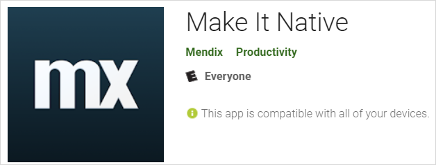
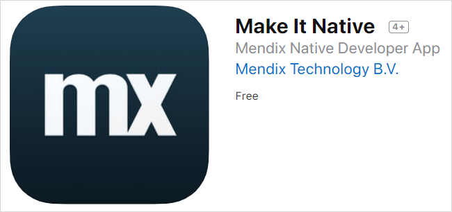
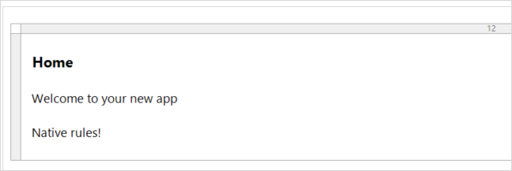

## 1 Introduction

To use Mendix Studio Pro's native app capabilities, you can use the [Native Mobile Quickstart](https://appstore.home.mendix.com/link/app/109511/) app from the Mendix App Store. This app is optimized to quickly build a native mobile app. Out of the box, this app gives you a native page, a native phone profile to enable native device navigation, a native layout with menus, and native widgets and actions which leverage device capabilities.

The Native Mobile Quickstart app also includes four modules:

* **Administration** – helps you manage users
* **Atlas UI Resources package** – allows for app styling
* **Nanoflow Commons** – contains generic useful nanoflow actions
* **Native Mobile Actions** – contains various native widgets and nanoflow actions that leverage device capabilities

## 2 Prerequisites {#prerequisites}

Before starting this how-to, make sure you have completed the following prerequisites:

* Have a mobile device to test your native app 
* For information on device requirements, see [System Requirements](/refguide/system-requirements)
* If you wish to use an emulator for Android mobile testing, install a product such as [Bluestacks](https://www.bluestacks.com/nl/index.html) or [Genymotion](https://www.genymotion.com/) (your emulator must have Google Play services supported)

## 3 Creating a New App Project Based on the Quickstart App {#quickstartapp}

For details on making a Mendix app using the Native Mobile Quickstart app template, download the Make It Native app on either the [Google Play store](https://play.google.com/store/apps/details?id=com.mendix.developerapp) or the [Apple App Store](https://apps.apple.com/us/app/make-it-native/id1334081181). This app template includes the latest version of Atlas UI, as well as the [Native Mobile Resources](/appstore/modules/native-mobile-resources) module containing widgets and nanoflow actions for native mobile apps. For more information on building native apps, see the [Build a Native Mobile Inspection App](https://gettingstarted.mendixcloud.com/link/path/66) learning path (you must be signed in to the Mendix Platform to see this learning path). Using the Make It Native app to view the changes to your Mendix app, see the sections below.

### 3.1 Starting a Quickstarter App Project

To start a new app based on a template, follow these steps:

1. Open Mendix Studio Pro. Select **File** > **New Project** , and then select the **Native Mobile Quickstart** app.
2. Click **Use this starting point**.
3. Click **Create app** to close the dialog box.
4. Click **Run Locally** to see the app in action.
5. After running your app, you may see a Windows Security Alert dialog box. Accept the permissions selected by default and click **Allow access** to close the dialog box.
6.  If asked to create database **'default'**, click **Yes**.

At this point you have a running native app. To view your app on a mobile device, however, you need to download the Make It Native app.

### 3.2 Downloading and Installing the Make It Native App

#### 3.2.1 Downloading for Android

To view your app on an Android device (or emulator), you must download and install the Make It Native app from the [Google Play store](https://play.google.com/store/apps/details?id=com.mendix.developerapp):

{}{}

#### 3.2.2 Downloading for iOS {#downloading-for-ios}

To view your app on a iOS device, you must download and install the Make It Native app from the [Apple App Store](https://apps.apple.com/us/app/make-it-native/id1334081181):

{}{}

### 3.3 Viewing Your App on Your Testing Device

Viewing your app on a mobile device will allow you to test native features and other aspects of your app. This section is written for mobile devices, but you may use an Android emulator mentioned in the [Prerequisites](#prerequisites) section above. To view your app, follow these steps:

1. Locate your app's QR code in Mendix Studio Pro by clicking the drop-down menu next to the **View** button, then selecting **View in the Mendix App** and navigating to the **Native mobile** tab. Here you will see your test app's QR code.
2. Start the Make It Native app by tapping its icon on your device.
3.  Tap the  **Scan a QR Code** button:

	{}{}

4. If prompted, grant the app permission to access your device's camera.
5. Point your mobile device's camera at the QR code. It will automatically launch your test app on your mobile device.

{}

Your mobile device has to be on the same network as your development machine for the Make It Native app to work. If this is the case and the connection still fails, make sure that communication between devices is allowed in the Wi-Fi access point.

{}

Now you can see your app on your device. While this is just a template app, whenever you make changes you will be able to view them live on your Make It Native app.

You may notice an **Enable dev mode** toggle on the Make It Native app home page. Turning this toggle on will give you more detailed warning messages during error screens, as well as additional functionality on the developer app menu:

{}{}

### 3.4 Viewing Changes to Your App on Your Testing Device {#viewingchanges}

To see how changes made in Mendix Studio Pro are displayed live on your testing device, make a small change to your app.

1.  Put a text widget on your app's home page. Then, write some text into it. In this example, "Native rules!" has been added: 

	

2. Click **Run Locally** to automatically update the running app on your device, and see your new text. When you click **Run Locally**, your app will automatically reload while keeping state. 

If you get an error screen while testing your app, there are easy ways to restart it: 

* Tap your test app with three fingers to restart your app
* With the **Enable dev mode** toggle turned on, hold a three-fingered tap to bring up the developer app menu – here you can access **ADVANCED SETTINGS** and **ENABLE REMOTE JS DEBUGGING** 

For more detailed instructions on debugging a native app, see [Debug Native Apps (Advanced)](native-debug).

## 4 Read More

* [Build Pluggable Widgets](../extensibility/pluggable-widgets)
* [Native Styling](/refguide/native-styling-refguide)
* [Debug Native Apps (Advanced)](native-debug)