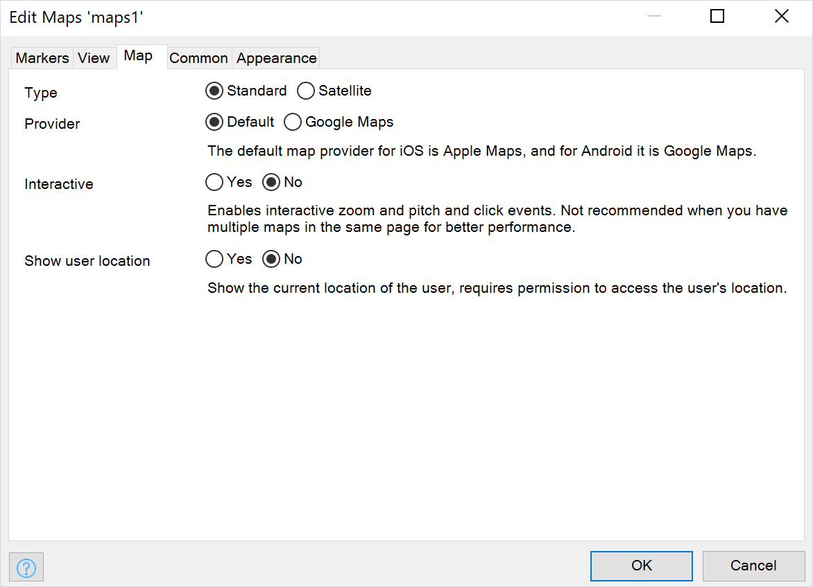
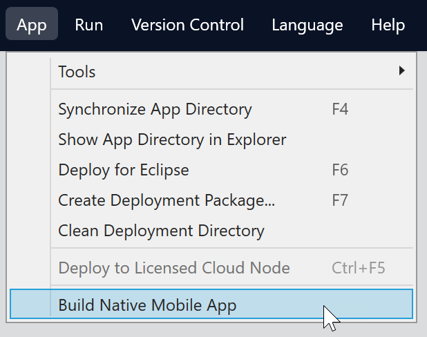
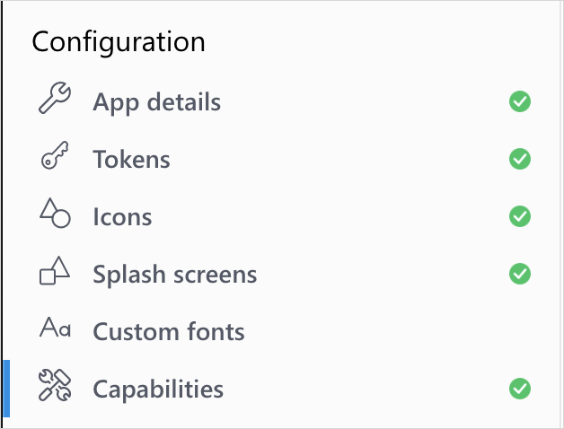

## 1. Introduction

The Maps module allows you to work with maps. 

## 2. Prerequisites

* Complete the [Prerequisites](/howto/mobile/deploying-native-app#prerequisites) section of *How to Deploy Your First Mendix Native Mobile App*
* Created an app on the [Google cloud console](https://console.cloud.google.com/google/maps-apis/overview] and have for Google Maps enabled for Android (and iOS, if you wish to use Google Maps on iOS as well) and also posses an API key  [https://developers.google.com/maps/documentation/android-sdk/get-api-key]. An important note: Before you can start using the Google Maps Platform APIs and SDKs, you must sign up and create a billing account [https://developers.google.com/maps/gmp-get-started#create-billing-account).
* Installed at least version *8.15.0* of Studio pro in order to use the Native Mobile App Builder

## 3. Setting up App Deep Linking {#set-up}

One would need an app containing the maps module. This is a core module so its available from the widgets panel. It can be added to either an existing project or a new one. 

### 3.1. Configuring map provider

Next step is to configure the maps widget provider. You can find this by double-clicking and selecting the “Map” tab. It comes with a “Default” and “Google Maps” provider.

* Default refers to using the default enabled map on the device which translates to Google Maps and Apple Maps on android and iOS respectively. 
* Google Maps as the name implies means that only google maps would be used on both platforms

### 3.2. Configuring maps capability 

1. Set up a native template with the **Native Mobile App Builder**. This can be launched from the Project menu as shown in [How to Deploy Your First Mendix Native Mobile App](/howto/mobile/deploying-native-app). Walk through the wizard and configure the project's details and tokens.

    

2. Once done with the wizard, Select the **Capabilities** menu item.

    

3. Enable the maps capability. This would expose a set of configurations as seen in the snap shot below.
    
    

    * As described in the prerequisite, the API key gives the maps widget access to Google Cloud services.
    * The Purpose string is a specialised text that describes to Apple why you need to use maps in your app which in turn uses the device location
    * The “I want to use Apple Maps for iOS” selection mirrors the decision made from section 3.1. 
    
4. Click on the **Save** button. Navigate to the build page and then, **Build**.

{}
When running locally from source, on iOS you have to run `pod install` once more
{}

## 4. Read more

* [Deploy Your First Mendix Native Mobile App](https://docs.mendix.com/howto/mobile/deploying-native-app)
* [Get Started with Native Mobile](https://docs.mendix.com/howto/mobile/getting-started-with-native-mobile)
