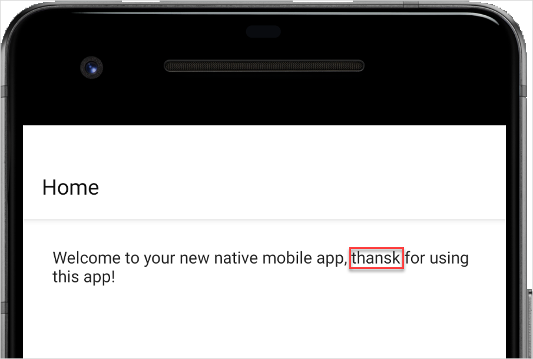
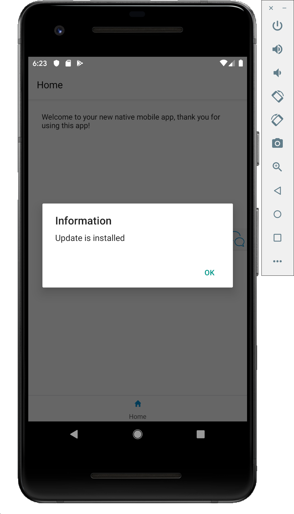
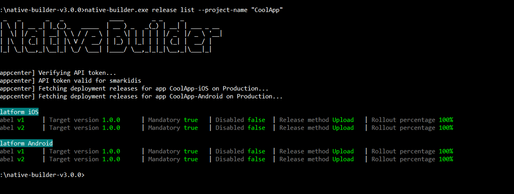

## 1 Introduction

Using Native Builder 3.0 and Mendix Studio 8.4, you can update your Mendix Native Apps over the air (OTA).
OTA updates are a fast and painless way of updating things like layouts, pages, assets or even you app's business logic (such as nanoflows and JavaScript actions).

Native Apps are seperated in two parts: a wrapper that is basically a Native iOS or Android app and a bundle that is being loaded dynamically by said wrapper. Things like your business logic and static assets are part of this dynamically-loaded bundle.

When you have changes you want to deploy, the Native Builder can bundle them in a new, updated bundle and painlessly deploy them. On the next app restart, your app's users will be updated to the latest version and continue their business as usual.

OTA updates are bound to a specific app version and build number. This allows you to target specific updates to specific versions of your app. Therefore you can push an update for version 1.0.0 that might be a legacy version that supports older devices, and also push an update for the 2.0.0 version of your app that might include more features.

**This how-to will teach you how to do the following:**

* Push an OTA update for a released app
* Rollback an update
* Configure an already pushed update 

## 2 Prerequisites

Before starting this how-to, make sure you have completed the following prerequisites:

* Install Native Builder 3.0.0 or higher
* Have completed [How to Deploy your First Mendix Native App](LINK HERE)
* Completed at least one successful build using Native Builder v3.0.0 and Native Template v2.0.0
* Have your app installed on a test device or emulator
* Have read the [Offline First]("/refguide/offline-first.md") reference guide

## 3 When to use over the air updates and when not

### 3.1 When OTA updates are safe to do without redeploying a new Mendix App {#safeToUpdate}

Over the air updates can be used without redeploying of a new Mendix App in cases like: 

* Style changes
* Changes to static images, text, or other static assets
* Layout changes
* JaveScript action changes
* Nanoflow changes
* Widgets shipped with Mendix added or removed
* A new custom Javascript-only widget or module was added
* Non-destructive model changes (see: [Offline First](/refguide/offline-first.md))

### 3.2 When you will need to orchestrate a redeploy of your Mendix App before OTA

Over the air updates are only for native client specific changes. It does not replace a Mendix deploy action.
Therefor, you will still need to redeploy you Mendix App to Mendix cloud as usual. In these cases please follow the following order of deploying your app.

1) Deploy your Mendix App to the cloud.
2) Push a new **mandatory** update to your clients using Native Builder.

### 3.3 When you will have to do a full release

As a rule of thumb, if you have done any changes directly to the iOS or Android project, for 
the changes to take effect, you will have to fully redeploy you app to the app stores.
In addition over the air updates cannot be performend in the following cases: 

* You radically changed the app's functionality. This is a App Store limitation and will require a re-release and re-review of your app by Apple. Your app might be removed if you do not comply.
* A new native module has been added
* The app has been renamed
* The app's launcher icons have been changed
* The splash screen has been changed

## 4 Deploying An Over The Air Update

Over the air updates let you correct mistakes in your published apps without issuing a new release. For example, imagine you issued a new release and later found a major typo on your welcome screen:

Before over the air updates, you would have to make a new release and configure it in the app stores. But over the air updates make fixing such a mistake easy.

To release a new version OTA, follow these steps:

1.  Change the title and message as follows [to do: check picture and write out]: 
   
   

2. Save your changes.
3. Note the version and build number of the app build you want to update. This how-to assumes an app version of 1.0.0 and a build number of 1.
4. Open a command line interface (CLI) such as Command Prompt.
5. Navigate to the directory of your Native Builder: (todo: change code below to an actual example filepath)

   `cd C:\<path to Native Builder>`

6. Run the following command to build and push a new update: 
   
   `native-builder.exe release push-update --project-name "CoolApp" --target-version "1.0.0" --build-number 1 --rollout-percentage 100 --mandatory`

   {}Text...
This command does the following: 
* Runs Mx Build to build your project 
* Packages your project to be pushed as a new update 
* Pushes the new update package for the app's version 1.0.0 
* Sets the rollout percentage to 100% (all app users) 
* Marks the update as mandatory for the app's users to install
   {}

7. Wait for Native Builder to complete.
8. Restart the app on your testing device. You should be greeted with the following message:

   

9.  Tap **Confirm** to update your app.
10. The app should reload and greet you with the following dialog box:

   

## 5 How to roll back updates
Sometimes and update might not perform as expected. Out of the box, when an update has failed, the auto update mechanism will try to recover by switching back to the bundle packaged with your app's binary. Non the less you will want to update your bundle by either fixing the issue and pushing a new update or by rolling back to the previous version.
Let us assume that we want to rollback an update. Maybe we released it to early or something is wrong with the latest update.

1. Get your list of available releases by running the following command: 

   `native-builder.exe release list --project-name "CoolApp"`

   

2. To roll back from {v2} to {v1} type the following command: 

   `native-builder.exe release rollback-update --project-name "CoolApp" --label "v1"`

   

3. Next time you open your app, you should be greeted with the **Update available** dialog box. Tap **Confirm** to roll your app back on your device.

## 5 Initiating a Partial Initial Rollout

### 5.1 When is it safe to roll back an update

Please see [When OTA updates are safe to do without redeploying a new Mendix App ](#safeToUpdate)

## 6 Configure an already pushed update

You might want to reconfigure an already pushed update for the following reasons: 

- You did a partial rollout and want to raise the number
- You want to make a update mandatory

The key here is `patch-update`. The `patch-update` command allows you to modify a pushed updated. You can modify things like a rollout percentage, or you can choose to make a release mandatory.

### 6.1 Partial initial rollout

Say you wanted to test the stability of the new update. In this case it is good practice to test releases on a small number of your user base before fully rolling them out.

To roll out your app to only *some* of your users, run this command: 
  
   `native-builder.exe release push-update --project-name "CoolApp" --target-version "1.0.0" --build-number 1 --rollout-percentage 50 --mandatory`

Instead of passing a rollout percentage of 100%, you are passing 50%. This means the update will be distributed to 50% of the app's user base. This number can be an any integer from 1 to 100, representing the percentage of your user base which will recieve the update.

To fully roll out the update, run this command: 

   `native-builder.exe release patch-update --project-name "CoolApp" --target-version "1.0.0" --build-number 1 --rollout-percentage 100`

### 6.2 Releasing an optional update

As an extension of `rollout-percentage` you can make builds optional. 
To do so do: 
  
  `native-builder.exe release push-update --project-name "CoolApp" --target-version "1.0.0" --build-number 1 --rollout-percentage 100 --mandatory false`

Instead of the mandatory update popup, you app's users should now be greeted with a optional popup, allowing them to choose if they want to install the update or not. 

## 7 Preserving your Model's Integrity 

Before issuing OTA updates or releasing new versions, please read and understand the [Offline First]("/refguide/offline-first.md") reference guide. It is important to understand the implications of offline first.

Mendix Native Apps are offline first. This means you should be cautious when changing the following elements, and should avoid changing them if possible: 

* The navigation profile
* An offline first entity, for example entity name changes, new entity relationships, and more

Generally, you should avoid doing destructive changes to offline-synced entities. In the rare cases this is unavoidable, releasing a new app version or doing over the air updates might put your app's users in an unrecoverable state. 

### 7.1 Offline Apps and Data Loss

Data loss can occur when OTA updates or new releases coincide with apps being offline (todo: check tech). For example, imagine your Mendix developers were hard at work optimizing the data store entity structure to speed up sync operations. They are quite happy with their results and release that morning. They push a new runtime by pressing the **Run** button in Studio Pro, and then run the Native Builder to push a new update to the apps. All seems to work fine. 

That same morning however, your engineers were hard at work gathering field data in a remote area. Later that afternoon the engineers return back to the city and attempt to synchronize their data using the app's built-in synchronize button. Their synchronization fails. They  do the only thing they can think of: restart the app. When the app starts they are greeted with the **Update Available** screen. They hit the continue button, get updated, and their data is lost or partially synchronized.

This issue is independent from OTA updates and specific to offline apps. Your offline app runs a snapshot of your runtimes model locally. So as a Mendix Developer you have to think twice before doing major chages that might make the app's state unrecoverable. In the example above the entity model was changed, and when the app attempted to synchronize it failed. This can create unrecoverable situations that will require a re-installation of the app, and can lead to data loss for unsynced data.

## 8 Read More

* [Offline First reference guide]("/refguide/offline-first.md")
* [Codepush Introduction](https://docs.microsoft.com/en-us/appcenter/distribution/codepush/)
* [Using the CodePush UI](https://docs.microsoft.com/en-us/appcenter/distribution/codepush/using-ui)
