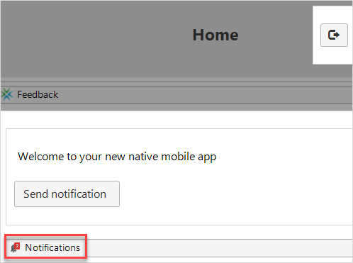
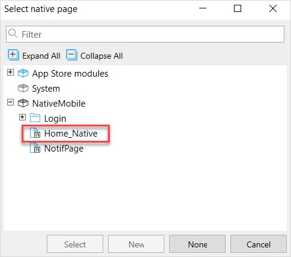
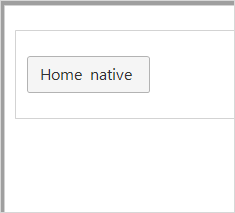

{}
The Make it Native app is currently experiencing limitations which interfere with notifications. We are currently fixing those limitations. To test your local notification actions, please use a native release app installed on a mobile testing device instead of the Make It Native app. To build a native release app, complete [NativeMobileApp](https://docs.mendix.com/howto/mobile/deploying-native-app) document.
{}

## 1 Introduction

Several apps which use push notifications will also need actions to trigger after a user taps a notification. This step-by-step guide will teach you to make a tapped notification show a specific page.

## 2 Prerequisites

Before starting this how-to, make sure you have completed the following prerequisites:

* Review the [basic differences](https://developer.apple.com/library/archive/documentation/NetworkingInternet/Conceptual/RemoteNotificationsPG/) between local notifications and push notifications
* Install the [Make It Native](/refguide/getting-the-make-it-native-app) app on your mobile device
* Complete the preceding tutorials in this [Use Local Notifications](local-notif-parent) series

## 3 Setting an Action for When a Notification is Tapped

In this section you will learn to show a page when a user taps a notification.

1.  Drag and drop a **Notifications** widget onto your native home page. 

	{}{}

2. Double-click the widget.
3. Click **Actions** > **New**. 
4. Name your action *show_page*.
5. Select **On open to** > **Show a Page**.
6. Click **New** to make a new page.
7. Type *NotifPage* into **Page Name**.
8. Click **Blank** pane on the left and select the **Blank** page template. 
9. Click **OK** to create your page. 
10. Drag and drop an **Open page button** widget onto **NotifPage**.
11. When prompted, click your **Home_Native** page:

	{}{}

12. Click **Select**. Now you have a button which will bring you back to your home screen when you are testing:

	

13. Navigate back to your **ACT_CreateAndSendNotification** nanoflow. 

In **ACT_CreateAndSendNotification** you will set up the logic for tapping a notification which brings you to a page. This process requires you set up a string variable. However, because this string variable will never be used with other variables—it will only be used for internal notification functionality—you will not set it up by dragging and dropping a create variable activity like you did before. You will set it up with an expression.

1.  Double-click your **Display Notification** activity:

	

2. Click **Action Name** > **Edit** 

	{}{}

3.  Type `'show_page'` into the expression field:

	{}{}

4. Click the **OK** buttons until you are back at your nanoflow.

Great job setting up your notification. Now you can test it:

1. Click **Run Locally** to update your app.
2. Start the app on your mobile device.
3. Tap your **Send notification** button.
4. Tap the notification to navigate to the page you selected.
5. Tap the **Return to home page** button to navigate back to your home page.

Now you can show pages after notifications are tapped. Next, in [How to Use Local Notifications Part 4: Data](local-notif-data), you will learn to pass data to such pages.

## 4 Read More

* [Implement Push Notifications](implementation-guide)
* [Build JavaScript Actions](/howto/extensibility/build-javascript-actions)
