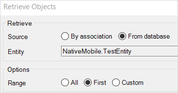
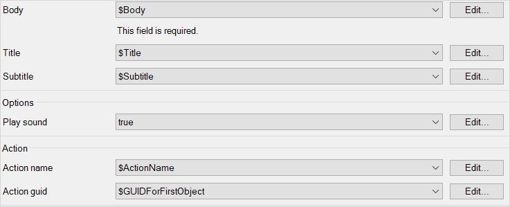
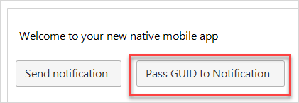
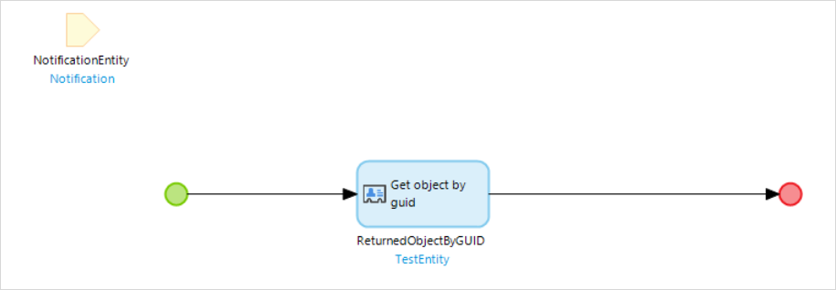
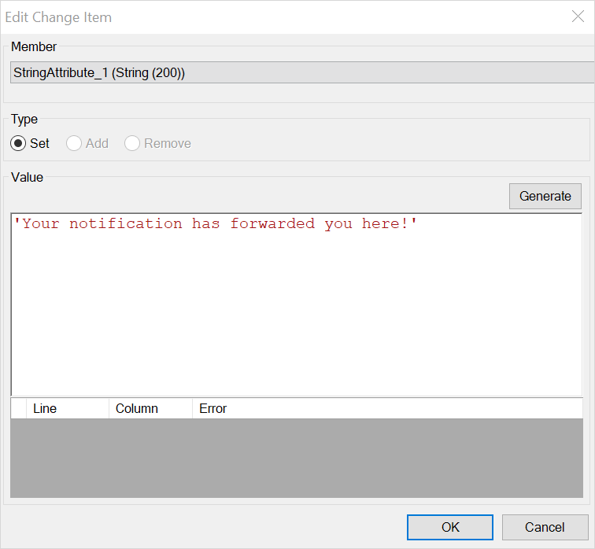
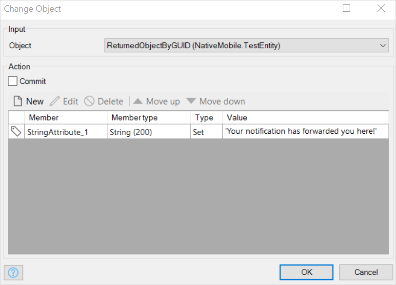
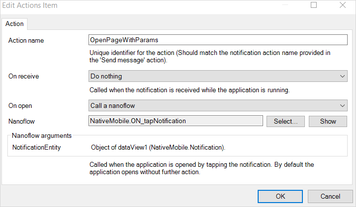

##  1 Introduction

Several apps make it so that when user taps a notification, the user is taken to specific page with specific parameters set. You can achieve this by sending data along with a notification. 

For example, a user could tap a notification about an entity object. They should be brought to a details page which shows an entity object's details. But in order to make that happen, you must set your notification up to pass that particular entity to its details page.

Every entry in the Mendix database has an unique ID. If you want to pass an object, your GetGUID JavaScript action must retrieve that object's GUID and pass it to your local notification. When the notification is tapped, the widget can use the object's GUID to retrieve that object using the GetObjectByGUID JavaScript action. Finally, your object will be passed to the action you specify in your notification.

You will create the following things to send data to pages:

* **Two entities** — *TestEntity* to test how to show particular object, and *Notification* to help pass data to your page
* **One page** — *DetailTestEntity* which will be shown on tapping a notification
* **One microflow** — *DS_TestEntity* to create dummy data for testing
* **Three nanoflows** — *DS_Notification* to create a dummy notification object, *ACT_PassGUIDToNotification* to pass a GUID, and *On_tapNotification* to process data from your notification

## 2 Prerequisites

Before starting this how-to, make sure you have completed the following prerequisites:

* Review the [basic differences](https://developer.apple.com/library/archive/documentation/NetworkingInternet/Conceptual/RemoteNotificationsPG/) between local notifications and push notifications
* Install the [Make it Native](/refguide/getting-the-make-it-native-app) app on your mobile device
* Complete the preceeding how-to's in this [Use Local Notifications](local-notif-parent) series

## 3 Sending Data to Pages

To make your two entities, do the following:

1.  Navigate to your domain model.
2.  Drag and drop a new entity onto your domain model: 

	{}{}

2.  Double-click it and name it *TestEntity*:

	{}{}

3.  Click **Attributes** > **New**, name it *StringAttribute_1*, and click **OK**:

	{}{}

4. Click **OK** again until you are back at the domain model.
5.  Create an entity *Notification* on your domain model with a string attribute *GUIDString*:

	{}{}

To set up a notification nanoflow, do the following:

1. Create a nanoflow named *DS_Notification*.  
2. Drag and drop a create object activity onto your nanoflow.
3. Double-click your create object activity.
4. Click **Entity** > **Select**.
5. Click **Notification**, then click **Select**.
6. Click **OK**.
5.  Right-click your create object activity and select **Set $NewNotification as return value**:  

	{}{}

To set up your microflow, do the following:

1. Create a microflow named *DS_TestEntity*.
2. Drag and drop a create entity activity onto your microflow.
3. Double-click your create entity activity.
4. Click **Entity** > **Select**.
5. Click **NativeMobile.TestEntity**.
6. Click **Select**.
7. Click **OK**.
8. Drag and drop a commit object activity onto your microflow.
9. Double-click your commit object activity.
10. From the **Object or List** drop-down menu, select **NewTestEntity (NativeMobile.TestEntity)**.
11. Click **OK**.
12. Double-click your end event, make sure its **Type** is **Boolean**, then type *true* into the value field and click **OK**:

	{}{}

To make this microflow run after startup, do the following:

1.  Double-click **Settings** in your Project Explorer:

	{}{}

2.  Click the **Runtime** tab:

	{}{}

3.  Click **After startup** > **Select**:

	{}{}

4.  Click **DS_TestEntity** then click the **Select** button to achieve this result:

	{}{}

5. Click **OK**

To make your page, do the following: 

1. Crete a new blank native page named *DetailTestEntity*.
2. Drag and drop a data view widget onto your new page.
3. Double-click your data view widget.
4. In **Data Source**, click **Entity (path)** > **Select**.
5. Click **TestEntity**.
6.  Click **Select** to see the following:

	

7.  Click **OK**. 
8.  When asked "Do you want to automatically fill the contents of the data view?" click **Yes**.
9.  This will be the page your user sees when they tap the notification:

	{}{}

Next you will learn how to pass data to pages after you have tapped a notification. First, make a nanoflow:

1. Create a nanoflow named *ACT_PassGUIDToNotification*.

2. Add a retrieve action to your nanoflow, set **Source** to **From Database**, and set **Range** to **First**. Click **Entity** > **Select** and select the **TestEntity**. In **Object name** type *FirstTestEntityObject*. Then click **OK**. This will be the object that gets the GUID: 

	

3. Add a JavaScript Action Call activity to your nanoflow.
4. Double-click the action call activity.
5. Click **JavaScript Action** > **Select**.
6. Type *GetGuid* into the search field, click **GetGuid**, and click **Select**. (You are able to find the GetGuid JavaScript action because it is included in the NanoflowCommons module inside the Native Quickstarter template.)
7. Click **Entity Object** drop-down and click **$FirstTestEntityObject**.
8. In **Variable name** field type **GUIDForFirstObject**.
9. Click **OK**.
10. Drag and drop four create variable activities onto your nanoflow: *Title*, *Subtitle*, *Body*, and *ActionName*. Give them the values *'title1'*, *'subtitle1'*, *'body1'*, and *'OpenPageWithParams'* respectively:
	
	{}{}
	
	{}{}
	
	{}{}
	
	{}{}

	This is how all of your activities will look:
	
	{}{}
	
11. Drag and drop a JavaScript action call activity onto your nanoflow. 
12. Double-click the action call.
13. Click **JavaScript action** > **Select**.
14. Type *DisplayNotification* into the search field, click the corresponding JavaScript action, and click **Select**.
15. Set the **Body**, **Title**, **Subtitle**, **Action name**, and **Action guid** to the corresponding variables you created previously, and set **Play Sound** to **True**:

	{}{}

16. Click **OK**.
17. Drag and drop this nanoflow onto your app's **Home_Native** page to create a button which calls it, and name the button *Pass GUID to Notification*:
	
	{}{}
	

Good job! When a user taps a notification from the **Pass GUID to Notification** button, they will now be brought to the **DetailTestEntity** page. Next you will create a nanoflow which receives **notificationEntity** as a parameter, retrieves an object via this parameter, and passes the object to a page.

1. Make a new nanoflow named *ON_tapNotification*.
2. Drag and drop a parameter onto your nanoflow. 
3. Click **Data Type** > **Select**. Click **Notification**, then click **Select**.
4. Fill **Name** in as *notificationEntity*.
5.  Click **OK**:

	

6. Drag and drop a JavaScript action call onto your nanoflow.

7. Double-click the JavaScript action call, then click **Select**. 

8. Type *GetObjectByGuid* into the search field, click that action, then click **Select**. 

9. Click **TestEntity** and then click **Select**.

10. Next to the **Object guid** drop-down menu click **Edit**.

11. Type *$NotificationEntity/GUIDString* into your argument field and click **OK**.

12. Select **Use Return Value** > **Yes**.

13. In **Object name** write *ReturnedObjectByGUID*:

	{}{}

14. Click **OK** to save and close your JavaScript Action settings:

	{}{}

15. Drop a **Change object** activity onto your nanoflow:

	{}{}

16. Double-click the change object activity.
17. Select **Object** > **ReturnedObjectByGUID (NativeMobile.TestEntity)** from the drop-down menu.
18. Click **Action** > **New**, make sure **Member** is set to the string attribute, and into **Value** type *'Your notification has forwarded you here!'*:

	{}{}

19. Click **OK**. Check that your dialog box looks like this, then click **OK** again to close it: 

	{}{}

Next you are going to create a show page action for **ON_tapNotification**.

1.  Drag and drop a **Show Page** action onto your nanoflow:

	{}{}

2. Double-click the show page activity.

3. From the **Object to pass** drop-down menu select **ReturnedObjectByGuid**.

4.  Click **Page** > **Select**, click **DetailTestEntity**, then click **OK**:

	{}{}

5. Click **OK** to close the **Show Page** activity settings, then navigate to your **Home_Native** page.

Now you will set up a data view on your home page.

1. Drag and drop a **Data View** widget on your **Home_Native** page.
2. Double-click your data view.
3. Select **Data source** > **Type** > **Nanoflow**.
4. Click **Nanoflow** > **Select** and choose **DS_Notification**.
5. Click **OK** to go back to your home page, and click **OK** on the subsequent data view dialog box.
6. Move the **Notifications** widget inside this data view.
7.  Confirm that the text box in your data flow is using **GUIDString** as its data source:

	{}{}

8. Double-click your notifications widget.
9. Click **GUID** > **Select**.
10. Click **GUIDString (String (200))**, then click **Select**. Your results will look like this:

	{}{}

9. Click **Actions** > **New**.
10. Create a **New Action** named *OpenPageWithParams*, set **On open** to **Call a nanoflow**, and select **ON_tapNotification**.

	{}{}

11. Start and load the app on your mobile device, tap the nanoflow button you created in 3.e, then tap the notification to navigate to the **DetailTestEntity** page with the proper object.

## 4 Read More

* [Implement Push Notifications](implementation-guide)
* [Build JavaScript Actions](/howto/extensibility/build-javascript-actions)