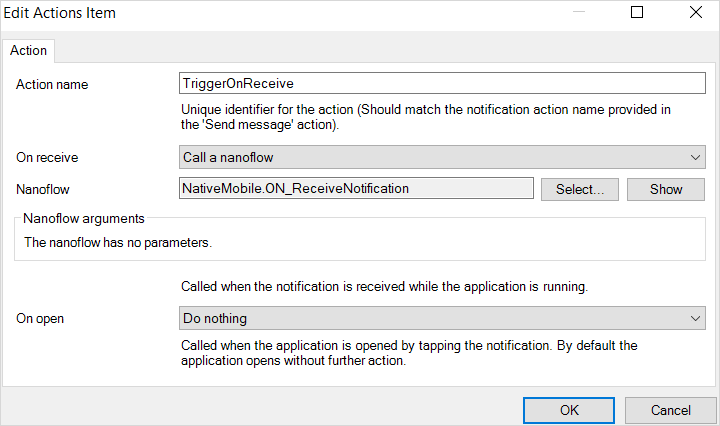
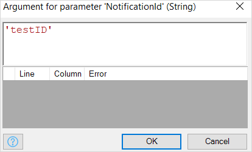

## 1 Introduction

Local notifications should rarely notify a user right after they do an action. Here you will learn to configure local notifications to trigger after a period of time. To do this, you will use a JavaScript action named **ScheduleNotification**.

## 2 Prerequisites

## 3 Scheduling a Notification

To schedule a notification for a specific time, do the following:

1. Navigate to your **ACT_CreateAndSendNotification** nanoflow. 
2.  Replace your **Display notification** JavaScript action with a new **Schedule notification** action:

	

3. Double-click your new **Schedule notification activity**.
4. Set the **Date** to **EndOfCurrentMinute**.
5. Change the **body**, **title**, and **subtitle** to the variables that you created.
6. Set **Play sound** to **true**.
7. For now, set **Notification id** to **empty**.
8. Set **Action name** and **Action guid** to **empty**.
9. Click **OK**.
10. Start and load the app on your mobile device.
11. Tap the **Send notification** button, then quickly minimize your app.

The notification should be displayed at the end of the minute.

If your app is open, it will not show the notification due to iOS and Android user guidelines. However, notifications for open apps can still trigger onReceive events. This allows you to design custom actions for notifications, such as showing a page with pop-up layout. Follow these steps to model an onRecieve event:

1. Make a new nanoflow named *ON_RecieveNotification*.
2. Drag and drop a **Log message** activity on your nanoflow.
3. Double-click this activity. 
4. In **Template** write *I triggered on recieve notification* then click **OK**.
5. Double-click your home page's notifications widget.
6. Click **Actions** > **New**.
7. Create a **New Action** named *TriggerOnRecieve*, set **On receive** to **Call a nanoflow**, and select **ON_RecieveNotification**:

	

8. Click **OK** then **OK** again.
8. In **ACT_CreateAndSendNotification**, double-click your schedule notification activity.
10. Click **Action name** > **Edit**.
11. Type *'TriggerOnRecieve'* into the argument field and click **OK**.
11. Click **OK**.
12. Start and load the app on your mobile device.
13. Tap the **Send notification** button, and *do not* minimize your app.
14. You will see the log **I triggered on receive notification** in the Studio Pro console.

But what if you want to cancel a scheduled notification? Read on to learn more.

## 4 Cancelling Scheduled Notifications

To cancel a scheduled notification, you can use either the **Cancel Scheduled Notification** or **Cancel All Scheduled Notification** JavaScript actions. To cancel a specific notification, provide an identifier of that particular notification to **Cancel Scheduled Notification**. To cancel all notifications, call the **Cancel All Scheduled Notification** JavaScript action. For further information, see the subsections below.

### 4.1 Cancelling all Scheduled Notifications

To cancel all scheduled notifications, do the following:

1. Create a nanoflow named  *ACT_CancelAllScheduledNotifications*.
2.  Drag and drop a JavaScript action named **Cancel all scheduled notifications** onto your nanoflow: 

	

3. Double-click your new cancel notification action.
4. Select  **Use return value** > **No**.
5. Click **OK**.
6.  Drag and drop this nanoflow to your home screen and name its button *Cancel all*.

	

To test your new cancel button, do the following:

1. Start and load the app on your mobile device.
2. Tap your **Send notification** button.
3. Tap your **Cancel all** button.
4. Minimize your app.

You will not see a notification at the end of the minute, proving your cancel action a success!

### 4.2 Cancelling a Specific Scheduled Notification

To cancel a specific scheduled notification, you will need to supply a notification ID for the notification you wish to cancel. 

1. Navigate to **ACT_CreateAndSendNotification**.
2. Double-click your **Schedule notification** activity.
3. Click **Notification id** > **Edit**. 
4.  Type *'testID'* into the argument field and click **OK**:

	

5. Click **OK** once more to close the dialog window. 
4. Create a nanoflow named *ACT_CancelScheduledNotifications*.
5.  Drag and drop a JavaScript Action named **Cancel scheduled notification** onto your nanoflow:

	

6. Double-click your new cancel notification action.
7. Click **Notification id** > **Edit**.
8. Type *'testID'* into the parameter argument field and click **OK**.
9. Click **OK** again to close the dialog window.
7.  Drag and drop this nanoflow onto your home screen and name its button *Cancel a specific notification*:

	

To test your new cancel button, do the following:

1. Start and load the app on your mobile device.
2. Tap your **Send notification** button.
3. Tap your **Cancel a specific notification** button.
4. Minimize your app.

You will not see a notification at the end of the minute, proving your cancel action a success!

## 5 Read More

* [Implement Push Notifications](implementation-guide)
* [Build JavaScript Actions](/howto/extensibility/build-javascript-actions)