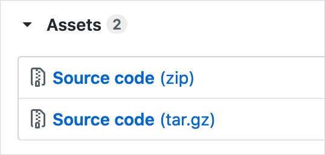
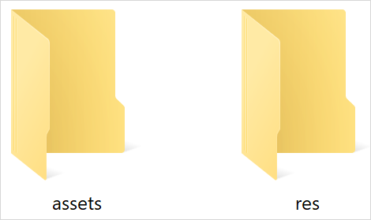

## 1 Introduction

While the Native Builder command-line interface (CLI) is is the standard way to build Mendix native mobile apps, certain conditions such as limited internet connectivity might prevent you from using the Native Builder CLI. In those situations, you can build your apps locally without an internet connection.

Mendix native mobile apps are first and foremost React Native (RN) apps and follow the same rules as other RN apps:

* The JS code and static assets need to be bundled together for RN to use
* The bundled code and assets are put into a React Native Template that represents an iOS and Android app

In a similar fashion, MXBuild and the Mendix Native Template folow these rules:

* When using MXBuild, the JS code and static assets are bundled together
* The bundled code and assets are put into the Mendix Native Template that [represents an iOS and Android app](better verb for represents? provides a foundation for both an iOS and Android version of your app)

## 2 Prerequisites {#prerequisites}

Before starting this how-to, make sure you have completed the following prerequisites:

* Have a Mac OS X machine 
* Install XCode and CocoaPods 
* Install Android SDK and platform tools
* Install Node and NPM 
* Have the latest Native Builder CLI

## 3 Get the Native Template

The Native Template is the base for building native mobile apps with Mendix. In essence, it is a React Native template with the extra dependencies and configurations required to run your Mendix app.

The Native Template is versioned against Mendix Studio Pro. This means the Studio Pro version you use to create your Mendix app dictates which version of Native Template you should use. When using the Native Builder this is handled internally using the `--mendix-version` flag.

#### 3.1 Determine Which Native Template Version to Use

To determine which version of the Native Template you should use, do the following:

1. Note which version of Studio Pro you are using.
1. Navigate to the [Native Template GitHub repository](github.com/mendix/native-template).
1. At the root of your project, open the *mendix_version.json* JSON file.

The keys of the dictionary represent the Mendix Studio Pro version, the **min** and **max** values are the the minimum and maximum Native Template versions supported. In the case of Mendix Studio Pro 8.9.x, you could choose any Native Template version from 4.0.0 to the latest. Ideally you should choose the most recent supported version.

{}{}

How you should proceed depends on if you have Git installed or not.

#### 3.1.1 With Git installed

If you have Git installed, do the following:

1. Use `git@github.com:mendix/native-template.git` or `https://github.com/mendix/native-template.git` to clone the project locally. 
1. Run the following command: `git clone --single-branch --branch <release/version-number> <repo-url>`.
1. Run `npm i && cd ios && pod install` to install the required dependencies.

#### 3.1.2 Without Git

If you do not have Git installed, do the following:

1. Navigate to the [Native Template releases](github.com/mendix/native-template/releases).
1. Scroll to the version you want to download.
1. Select the source code binary to download a copy of the code.

   {}{}

1. Unzip the file.
1. Run `npm i && cd ios && pod install` to install the required dependencies.

## 4 Bundle your Mendix App

For bundling your resources, the Native Builder supports an offline command that runs MXBuild and generates the required bundle and assets. To bundle your app, do the following:

1. Run the following command:

   ```native-builder.exe bundle --project-name "CoolApp" --output-path "C:\bundles" --project-path "<absolute-path>" --java-home "<absolute-path>" --mxbuild-path "<absolute-path>"
   ```

   The ouput path can be any location files could go. This command will do the following:

   * Run MXBuild against your project to generate the required bundle and assets
   * Zip the output
   * Move the zipped bundle and assets to the `--output-path`

   When completed you should have two zipped binaries: one for Android and one for iOS.

1. Unzip the iOS binary. The folder structure should be the following:

   {}{}

1. Move the folder's content to `{your Native Template root}/ios/Bundle`.
1. Unzip the Android binary. The folder structure should be the following:

   {}{}

1. Move the folder's content to `{your Native Template root}/android/app/src/main`. Choose to ovewrite if requested to do so.
1. Open `{your Native Template root}/android/app/src/main/res/raw/runtime_url` using a text editor.
1. Replace the URL with the correct URL for your runtime.
1. Open `{your Native Template root}/ios/Config/config.xcconfig`, then replace the value of `RUNTIME_URL=` with the correct URL for your runtime.

Now you have completed the basic setup of the Native Template with the latest bundle and assets of your Mendix project. 

## 4 Adding or Removing Dependencies

Mendix native mobile apps [todo: correct?]() are build on top of React Native. Therefore, any React Native module can be added and used in a project. The same rules apply as with any React Native project.

### 4.1 For Native Templates v4.0.0 and Above

From Native Template v4.0.0 and above Mendix supports RN 0.6.x and therefore auto-linking. [Need some intro to the instrucitons below here]()

1. Add the dependency to the root *package.json* of your Native Template using `npm i -s <dependency name>`.
1. If the dependency supports auto-linking when `npm install` is run it will automatically add itself correctly to the Android and iOS project. If the dependency does not support auto-linking or requires more configuration, follow its documentation to add the required entries manually.

### 4.2 For Native Templates Below v4.0.0

Native Template versions below v4.0.0 do not support React Native's auto-linking. Therefore always follow the manual steps of the dependency to add it to the Android and iOS projects respectively.

### 4.3 Removing Dependencies

#### 4.3.1 Dependencies Which Support Auto-Linking

1. Remove the dependency entry from the *package.json* file.
1. Run `npm i`.

#### 4.3.2 Dependencies Which Do Not Support Auto-Linking

1. Remove the dependency's entry from the *package.json* file.
1. Remove the dependency's entry from the *ios/Podfile* file.
1. Remove the dependency's `include` and `project` entries from the `android/setting.gradle`. For example, to remove the Firebase module remove the following: 

   ```
   include ':react-native-firebase' 
   project(':react-native-firebase').projectDir = new File(rootProject.projectDir, '../node_modules/react-native-firebase/android')
   ```

1. Remove the dependency's `implementation` entry in the `android/app/build.gradle`. For example, to remove the Firebase module remove the following:

   ```
    implementation project(":react-native-firebase")
   ```

1. Remove any custom code included in the iOS or Android project.
