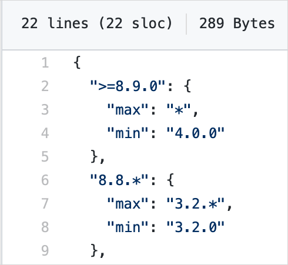

## 1 Introduction

While the Native Builder CLI is an easy way to get started with Mendix Native Apps; sometimes you might find yourself in situations were due to connectivity or policies using Native Builder might not be possible.

Mendix Native Apps, are first and foremost React Native (RN) apps and follow the same rules as any other React Native app:

- The JS code and static assets need to be bundled together for RN to use
- The bundled code and assets are put into a React Native Template that represents an iOS and Android app

In similar fashion in Mendix:

- Using MXBuild the JS code and static assets are bundled together
- The bundled code and assets are put into the Mendix Native Template that represents an iOS and Android app

## 2 Prerequisites {#prerequisites}

Before starting this how-to, make sure you have completed the following prerequisites:

- Have Mac OSX machine ready
- XCode & Cocoapods installed
- Android SDK and platform tools installed
- Node and NPM installed
- Have the latest Native Builder CLI

## 3 Get Native Template

Native Template is the base for building native apps with Mendix. In essence, it is a React Native template, with the extra dependencies and configurations required to run your Mendix App.

Native Template is versioned against Mendix Studio Pro meaning, the Studio Pro version used to create your Mendix App dictates which version of Native Template is compatible. For example when using Native Builder this is handled internally using the `--mendix-version` flag.

#### Finding out the correct version of Native Template

1. Find out the version of Studio Pro you are using.

2. Navigate to the [Native Template GitHub repository](github.com/mendix/native-template).

3. Open the `mendix_version.json` JSON file found at the root of the project.

   The keys of the dictionary represent the Mendix Studio Pro version, the min and max values the minimum and maximum Native Template version supported.

   In the case of Mendix Studio Pro 8.9.x, we could choose any version from 4.0.0 to the latest.

   Ideally we would choose the max supported.

   {}{}

### 3.1 With Git installed

1. Use `git@github.com:mendix/native-template.git` or `https://github.com/mendix/native-template.git` to clone the project locally. Run:

   `git clone --single-branch --branch <release/version-number> <repo-url>`

2. Run `npm i && cd ios && pod install` to install the required dependencies.

### 3.2 Without Git

1. Navigate to the [Native Template releases](github.com/mendix/native-template/releases).

2. Scroll to the version your want to download.

3. Select the source code binary to download a copy of the code.

   {}{}

4. Unzip the file.

5. Run ``npm i && cd ios && pod install` to install the required dependencies.

## 4 Bundle your Mendix App

For bundling your resources Native Builder supports an offline command that runs MXBuild and generates the required bundle and assets.

1. Run

   `native-builder.exe bundle --project-name "CoolApp" --output-path "C:\bundles" --project-path "<absolute-path>" --java-home "<absolute-path>" --mxbuild-path "<absolute-path>"`

   The ouput path can be an arbitary system path, e.g. your desktop.

   This command will:

   - Run MXBuild against your project to generate the required bundle and assets
   - Zip the output
   - Move the zipped bundle and assets to the --output-path

   When completed you should have 2 zipped binaries; one for Android and one for iOS.

2. Unzip the iOS one. The folder structure should be the following:

   {}{}

3. Move the folder content to `<Native Template root>/ios/Bundle`.

4. Unzip the Android one. The folder structure should be the following:

   {}{}

5. Move the folder conent to `<Native Template root>/android/app/src/main`. Choose to ovewrite if requested to do so.

6. Open `<Native Template root>/android/app/src/main/res/raw/runtime_url` using a text editor.

7. Replace the URL with the correct URL for your runtime.

8. Open `<Native Template root>/ios/Config/config.xcconfig` replace the value of `RUNTIME_URL=` with the correct URL for your runtime.

With that we have completed the basic setup of Native Template with the latest bundle and assets of the Mendix project. 

## 4 Adding or removing dependencies

Mendix Native is build on top of React Native. With that any React Native module can be added and used in a project. The same rules apply as with any React Native project.

### 4.1 For Native Template v4.0.0 and newer

From Native Template v4.0.0 we support RN 0.6.x and therefor auto linking.

1. Add the dependency to the root package.json of your Native Template using `npm i -s <dependency name>`.

2. If the dependency supports auto linking when npm install is run it will automatically add itself correctly to the Android and iOS project. if the dependency does not supprot auto linking or requires more configuration, follow its documentation to add the required entries manually.

### 4.2 For Native Template older than v4.0.0

Older Native Template versions do not support React Native's auto linking. Therefor always follow the manual steps of the dependency to add it to the Android and iOS projects respectively.

### 4.3 Removing dependencies

#### For dependencies supporting auto linking

1. Remove the dependency entry from the package.json file.

2. Run `npm i`.

#### For dependencies not supporting auto linking

1. Remove the dependency's entry from the package.json file.

2. Remove the dependency's entry from the `ios/Podfile` file.

3. Remove the dependency's include and project entries from the `android/setting.gradle`. For example to remove the Firebase module remove: 

   ```
   include ':react-native-firebase' 
   project(':react-native-firebase').projectDir = new File(rootProject.projectDir, '../node_modules/react-native-firebase/android')
   ```

4. Remove the dependency's implementation entry in the `android/app/build.gradle`. For example to remove the Firebase module we would remove the line

   ```
    implementation project(":react-native-firebase")
   ```

5. Finally remove any custom code included in the iOS and Android project.
