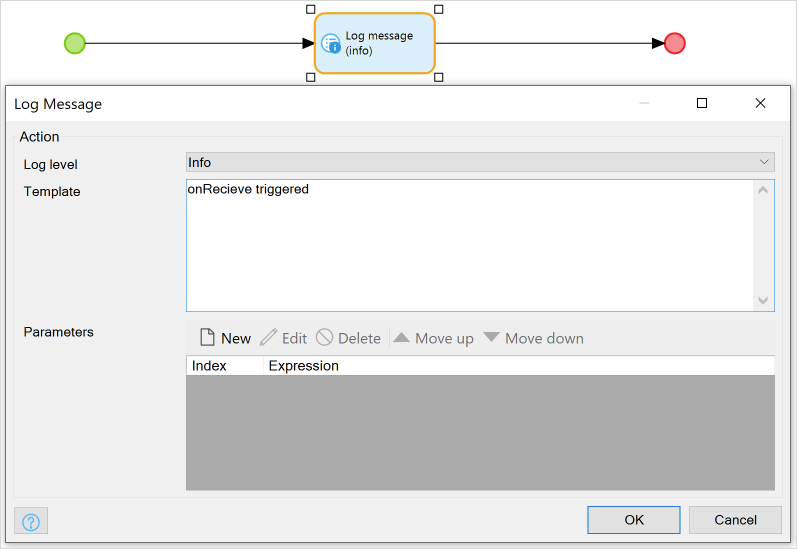
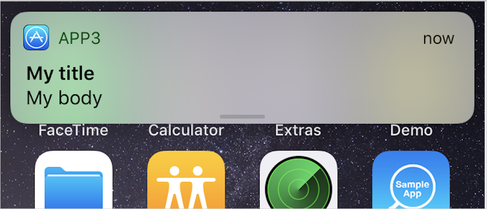
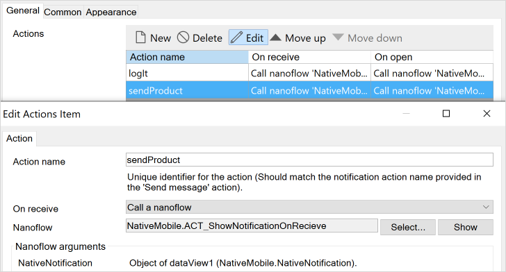
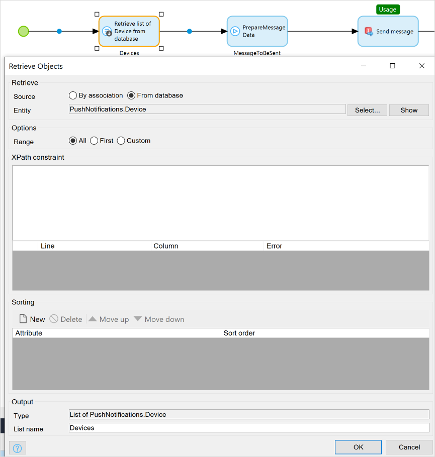

## 1 Introduction

## 2 Prerequisites

If you want to use push notifications with custom apps which created with native builder, make sure you have completed the following prerequisites:

* Setting up native push notifications with native builder [Native Builder](https://docs.mendix.com/howto/mobile/native-builder#1-introduction) 

## 4 Setting Up Your Mendix Project

Create a Native starter project. [todo: the Native Mobile Quickstart starter app?]

### 4.1 Installing Your Module 

1. Add the [Community Commons](https://appstore.home.mendix.com/link/app/170/) module to your app project.
2. Add encryption to your module [todo: how? if this is one step, delete this step and replace it with 2.1]

    2.1 Set the private key

    

3. Add the [Push Notifications Connector](https://appstore.home.mendix.com/link/app/3003/) module to your app project.

### 4.2 Set Up a Notification Widget

1. Drag and drop an app events widget onto your app's home page, double-click it, and do the following: 
    a. Page load / on load to `PushNotifications.OnPageLoad_RegisterPushNotifications` 
    b. App resume / on resume `PushNotifications.OnPageLoad_RegisterPushNotifications` 
    
    

    This will allow devices to register automatically when they opened the mendix app

2. Create an entity called *NativePush* in your domain model with one `objectGUID` field:

    

3. Create a new *DS_Notification* nanoflow which creates a *NativePush* entity object and then returns it:

    

4. Drag and drop a data view [todo check] onto your homepage, set its **Source** to **Nanoflow** > **DS_Notification**:

    

5. Inside of the data view, drag and drop a notifications widget [todo check]

6. Set the notifications widget's GUID to **NotificationEntity/objectGUID**:

    

    This will allow you to pass objects with notifications.

7.  In *PushNotification/_USE ME/Administration* add one more **Show page** item to your responsive profile navigation [todo check]: 

    

### 4.3 Adding Actions to Your Notifications Widget

1. Create two nanoflows (*ACT_OnRecieve* and *ACT_OnOpen*) which will create two different logs (**onRecieve triggered** and **onOpen triggered**):

    

2. Double-click your notifications widget and do the following:: 
    a. Add an action called *logIt*. 
    b. For **on recieve** select **ACT_OnRecieve**. 
    c. For **on open** select **ACT_OnOpen**:

    

### 4.4 Adding Firebase Configurations

[todo: add link] Deploy your project and open Google Firebase's [administration page]() . Do the following:

1. Add new FCM configuration.
2. Select **Enabled**.
3. Name your configuration.
4. Set it as **Development** / it wont affect any functionality, it is a helper (TODO: what? Maybe just delete extra info).
5. Set the project id to the project id you set in [here](#2-firebase-setup) [todo: fix link].
6.  Upload the private key:

    

7. Set the messaging service settings in the dropdown for both iOS and Android.
8.  Set the messaging service type for ios and android for FCM:

    

Next you will test the implementation of your configurations.

### 4.5 Sending a Push Notification

1. Reload the app on your phone.
2. Put the app in the background.
3. Go to devices tab in the admin module.

Now you should be able to see registered devices

1. Select **device** and click **new message**.
2.  Set title-body and action name to *logIt*:

    

3.  [todo: change this to imperative? "put your app in the background, then send the notif"?]When the app is in the background, you will see your notification be handled by your OS then see this message:

    

4. Tap the notification. You will see a log message in your modeler console: **onOpen triggered**.
5. Now send and tap a notification while keeping the app open. You will see a different log in your modeler console: **onRecieve triggered**. 

## 5 Sending Data Using Push notifications

Imagine your business has several products, and you want to send one product to a user via an administration module interface. How would you achieve this goal?

In this section you will learn the following:
* How to show a push notification to a user if app is in the backgroud — when a user taps it, they will be brought to a product page
* How to show a small view to a user if app is in the foreground a certain amount of time — when a user taps the button in the animation, they will be brought to a product page

### 5.1 Setting Up an Example Entity

1. Add `Product` entity with `ProductName` attribute 
2.  Right-click `ProductName` [todo: redo language to match product]to generate overview pages  => `Product_NewEdit`, `Product_Overview`

    

    

3. Drag and drop `Product_Overview` onto your app's homepage to make it more accessible. [todo: do you mean easier to nav to?]
4. Create a native page called `NativeProductOverview` that has a dataview which listens contexts with entity: Product. Fill the contents => This page will be opened with proper product when user taps the notification

### 5.2 Synchronizing Unused Entities [todo clarify title and section]

Studio Pro does smart data syncing, meaning if an entity has not been retrieved in native side, it will not be there. This situation will not occur in most apps since Studio Pro does retrieve entities which you want to show. [todo: add link to relavant doc link. Offline First?]

Your case does not retrieve any products in any of the pages [todo "which means you risk not seeing X"]. Fix this by doing the following:

1. Create a list of `Products` [todo: is this a list of data objects?] in one of your app's native pages. The data source does not matter since the list is bound to retrieve the entities
2. Change Navigation/Native mobile/ Sync config/ Product => Download All Object

    

### 5.3 Getting the GUIDs of the Objects in Edit View

For an example we want to keep the things simple:

1.  Create a nanoflow `ACT_GetGUIDAndLog` following these steps: 
    a. Product object as a parameter. 
    b. Javascript action Get guid, set the object the Parameter object. 
    c. Log the returned value:
    
    

2.  Drag and drop this nanoflow to the `Product_NewEdit` inside of the Dataview:

    

### 5.4 Creating a Data Passing Nanoflow

1.  Create a nanoflow `ACT_GetProductAndShowPage` following these steps: 
    a. Notification object as a parameter 
    
    
    
    b. JS action `get object from a GUID` where `Entity type` is `Product` and GUID is `parameter/objectGUID` name the return value to `ProductObject` 
    
    
    
    c. Show `NativeProductOverview` page with passed object: `ProductObject`
    
    

2.  Go to your Home_Native/ Notification widget and create new action named `sendProduct`, on open triggers `ACT_GetProductAndShowPage`

    

### 5.5 Testing the Implementation

1. Get a Product GUID by clicking the button [todo: rename to "click X"?] you created in [Get the GUIDs of the objects in Edit view](todo: set anchor link)

2. Follow the steps in the [simple push notification](#sending-simple-push-notification) section above again, but with the following changes: 
    a. Set the action name to `sendProduct` 
    b. Set `Context object guid` to the GUID you got

    

3. Put the app in the backgorund, send the message, and tap the notification. This will navigate to the `NativeProductOverview` page with the proper object.

## 6 Now lets cover when the app is in the foreground [todo: fix title, check if section is subsection equal to one above]

1.  Add one more `boolean` field named `showNotification` to the `NativePush`:

    

2. In your `Home_Native` page inside of the NativeNotification Dataview: 
    a. add a Container. 
    b. Sets its visibility to `NativeNotification/showNotification`. 
    c. Add a text field saying `You have recieved a product`. 
    d. Drag and drop `ACT_GetProductAndShowPage` nanoflow next to it.

    

3. Create a nanoflow called `ACT_ShowNotificationOnRecieve` which will be responsible for switching `NativeNotification/showNotification` attribute: 

    a. NativeNotification as a parameter. 
    b. Change the `NativeNotification/showNotification` to `true`, without committing. 
    c. Javascript action `Wait` for `5000` ms. 
    d. Change the `NativeNotification/showNotification` to `false`, without committing.

4. Home_Native/ Notification widget => Change action named `sendProduct`, on recieve triggers `ACT_ShowNotificationOnRecieve`

    

Follow steps for the previous sections in [here](###testing-the-implementation) but this time put the app in the foreground. You will see the the text with a button for 5 seconds.

#### Sending notifications programetcally via Push Notifications API (This section can be split from the rest) [todo fix title and number]

What if we want to send messages to all devices, and doesn't want to handle the GUID retrieval. In this section we will cover this scenario where we will send a product from web to all devices with a single button click.

##### Create a microflow which will send particular product to all devices [todo fix title and number]

- Create a microflow `ACT_SendProductToAllDevices` which has:

     - Product as a parameter
     - Retrieve list of devices from database: `PushNotifications.Device`
     
     - PrepareMessageData Microflow from `PushNotifications/_USE ME/API`
          - title: myTitle
          - body: myBody
          - time to live: 0 
          - badge: 0
          - actionName `sendProduct`
          - ContextObjectGuid to `empty`
     

     As you can see we set the ContextObjectGuid to empty since we will pass the object itself to the SendMessageToDevices Java action where it will be retrieved automatically for us. 

     - SendMessageToDevices Java Action in `PushNotifications/_USE ME/API`
          - Message data param: $MessageToBeSent
          - Device param: $Devices
          - Context object: $Product
     
     
- Go to `Product_NewEdit`, drag and drop the `ACT_SendProductToAllDevices` inside of dataview so that we can trigger this microflow

##### Test the implementation

Now run the app
- Put the Native app in the background
- In web go to a particular product and press `ACT_SendProductToAllDevices` microflow button. This will send notification to all available devices and when the user taps the notification it will be redirected to the particular product page that we modeled.

## 4 Read More

All JAVA actions which is available in Push notifications module with small explanations:

### PrepareMessageData Microflow

This allows users to create their own user interface in order to alter and create a push notification message. 

### ​SendMessageToDevice & ​SendMessageToDevices Java Action

We covered this Java action in this documentation. Params:
- `MessageDataParam` (PushNotifications.MessageData): This param can be generated by the PrepareMessageData microflow.
- `DeviceParam` (List of PushNotifications.Device): Can be used to send same message for a list of devices.
- `ContextObject`: Any mendix object which will be passed to the notification as GUID string.

### SendMessageToUsers & SendMessageToUser Java Action

Every user is allowed to have more than one device. In case of sending push notifications to every device of a particular user `SendMessageToUser` can be used.

In case of sending a push notification to all users `SendMessageToUsers` can be used.

