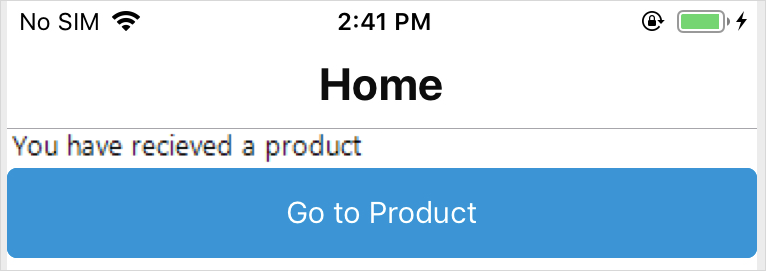
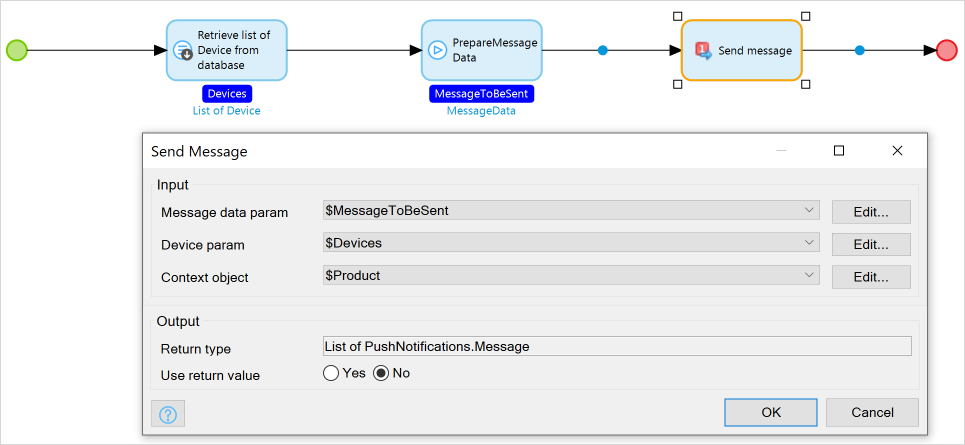

## 1 Introduction

## 2 Prerequisites

If you want to use push notifications with custom apps which created with native builder, make sure you have completed the following prerequisites:

* Setting up native push notifications with native builder [Native Builder](https://docs.mendix.com/howto/mobile/native-builder#1-introduction) 

## 4 Mendix project setup

Create a Native starter project.

### Module installation 
- Add Community commons
- Add encryption
     - Set the private key

- Add push notification module

### Set up Notification widget

1) Drag and drop an App events to your home page and set:
    - Page load / on load to `PushNotifications.OnPageLoad_RegisterPushNotifications`
    - App resume / on resume `PushNotifications.OnPageLoad_RegisterPushNotifications`
    
    

This will allow devices to register automatically when they opened the mendix app

2) Create an entity called `NativePush` in your domain modal with one field:
    - objectGUID

3) Create `DS_Notification` nanoflow where it creates a `NativePush` entity object then returns it.

4) Drag and drop a Dataview to your homepage, set:
    - its Source to Nanoflow=> DS_Notification

5) Inside of the Dataview drag and drop the Notifications widget, set its GUID
 to NotificationEntity/objectGUID

This will allow us to pass objects with notification

- Add one more Show page item to your responsive profile navigation => PushNotification/_USE ME/Administration

## Add actions to your notification widget

- Create two nanoflows (`ACT_OnRecieve`,`ACT_OnOpen`) which will simply two different logs => "onRecieve triggered" - "onOpen triggered"

- Go to your Notification widget/ 
     - add an action called `logIt`
     - on recieve select the nanoflow `ACT_OnRecieve`
     - on open select the nanoflow `ACT_OnOpen`

## Add firebase configuration  
Deploy the project and head for the administartion screen of the push notifications, we will add configurations

- add new FCM configuration
- check enabled
- Give a random name
- Set it as Development / it wont affect any functionality, it is a helper (TODO: How ?)
- Set the project id to the project id we referred in [here](#2-firebase-setup)
- upload the private key

- Set the messaging service settings in the dropdown for both ios and adroid
- Set the messaging service type for ios and android for FCM

Lets test the implementation

## Sending simple push notification

- Reload the app in the phone
- Put the app in the background 
- Go to devices tab in the admin module

Now you should be able to see registered devices

- Select device and click new message
- Set title-body and action name to `logIt`

When the app is in the background you will see that notification is handled by OS and shown a message. 

When you tap the notification you will recieve a log in your modeler console  `onOpen triggered` 

When the app is in the foreground you wont see that notification but you will recieve a log in your modeler console  `onRecieve triggered` 

## Sending data via push notification

Lets imagine we have bunch of products and we want to send A product to a user via administration module interface.  

In this section we will cover a scenario where we will:
- Show push notification to a user if app is in the backgroud, when user taps it, it will go to a proper product page.
- Show a small view to a user if app is in the foreground for X amount of seconds, when user taps the button in the animation, it will go to a proper product page.

### Setup example entity

- Add `Product` entity with `ProductName` attribute and right click to generate overview pages  => `Product_NewEdit`, `Product_Overview`

- Drag and drop `Product_Overview` to your homepage so it can be accessible

- Create a native page called `NativeProductOverview` that has a dataview which listens contexts with entity: Product. Fill the contents => This page will be opened with proper product when user taps the notification

#### Sync the unused entities in the native side

In mendix we do smart syncing, meaning if an Entity has not been retrieved in native side, it wont be there. This situation wont occur in 90% of the apps since we DO retrieve entities that we want show. 

But for our case, we dont retrieve any products in any of the pages, this could be fixed in two easy cases:
1) Create a list of `Products` in one of the native pages. Datasource doesnt matter since it is bound to retrieve the Entities
2) Change Navigation/Native mobile/ Sync config/ Product => Download All Object

### Get the GUIDs of the objects in Edit view

For an example we want to keep the things simple:

- Create a nanoflow `ACT_GetGUIDAndLog` which has:
    - Product object as a parameter
    - Javascript action Get guid, set the object the Parameter object
    - Log the returned value
    

- Drag and drop this nanoflow to the `Product_NewEdit` inside of the Dataview

### Create a nanoflow which will handle data passing for notification

Create a nanoflow `ACT_GetProductAndShowPage` which has:
- Notification object as a parameter

- JS action `get object from a GUID` where `Entity type` is `Product` and GUID is `parameter/objectGUID` name the return value to `ProductObject`

- Show `NativeProductOverview` page with passed object: `ProductObject`

Go to your Home_Native/ Notification widget and create new action named `sendProduct`, on open triggers `ACT_GetProductAndShowPage`

#### Testing the implementation

- Get a Product GUID by clicking the button that we created in `Get the GUIDs of the objects in Edit view`

Follow the steps for sending [simple push notification](#sending-simple-push-notification). This time we will set:
- action name to `sendProduct`
- set `Context object guid` to the GUID we got

Put the app in the backgorund and send the message, when we tap the notification, it will navigate to the `NativeProductOverview` page with proper object.

## Now lets cover when the app is in the foreground

- Add one more `boolean` field named `showNotification` to the `NativePush`  

- In your `Home_Native` page inside of the NativeNotification Dataview:
    - add a Container
    - Sets its visibility to `NativeNotification/showNotification`
    - Add a text field saying `You have recieved a product`
    - Drag and drop `ACT_GetProductAndShowPage` nanoflow next to it

- Create a nanoflow called `ACT_ShowNotificationOnRecieve` which will be responsible for switching `NativeNotification/showNotification` attribute:

    - NativeNotification as a param
    - Change the `NativeNotification/showNotification` to `true`, without committing
    - Javascript action `Wait` for `5000` ms
    - Change the `NativeNotification/showNotification` to `false`, without committing

- Home_Native/ Notification widget => Change action named `sendProduct`, on recieve triggers `ACT_ShowNotificationOnRecieve`

Follow steps for the previous sections in [here](###testing-the-implementation) but this time put the app in the foreground. You will see the the text with a button for 5 seconds.

#### Sending notifications programetcally via Push Notifications API (This section can be split from the rest)

What if we want to send messages to all devices, and doesn't want to handle the GUID retrieval. In this section we will cover this scenario where we will send a product from web to all devices with a single button click.

##### Create a microflow which will send particular product to all devices

- Create a microflow `ACT_SendProductToAllDevices` which has:

     - Product as a parameter
     - Retrieve list of devices from database: `PushNotifications.Device`
     
     - PrepareMessageData Microflow from `PushNotifications/_USE ME/API`
          - title: myTitle
          - body: myBody
          - time to live: 0 
          - badge: 0
          - actionName `sendProduct`
          - ContextObjectGuid to `empty`
     

     As you can see we set the ContextObjectGuid to empty since we will pass the object itself to the SendMessageToDevices Java action where it will be retrieved automatically for us. 

     - SendMessageToDevices Java Action in `PushNotifications/_USE ME/API`
          - Message data param: $MessageToBeSent
          - Device param: $Devices
          - Context object: $Product
     
     
- Go to `Product_NewEdit`, drag and drop the `ACT_SendProductToAllDevices` inside of dataview so that we can trigger this microflow

##### Test the implementation

Now run the app
- Put the Native app in the background
- In web go to a particular product and press `ACT_SendProductToAllDevices` microflow button. This will send notification to all available devices and when the user taps the notification it will be redirected to the particular product page that we modeled.

## 4 Read More

All JAVA actions which is available in Push notifications module with small explanations:

### PrepareMessageData Microflow

This allows users to create their own user interface in order to alter and create a push notification message. 

### ​SendMessageToDevice & ​SendMessageToDevices Java Action

We covered this Java action in this documentation. Params:
- `MessageDataParam` (PushNotifications.MessageData): This param can be generated by the PrepareMessageData microflow.
- `DeviceParam` (List of PushNotifications.Device): Can be used to send same message for a list of devices.
- `ContextObject`: Any mendix object which will be passed to the notification as GUID string.

### SendMessageToUsers & SendMessageToUser Java Action

Every user is allowed to have more than one device. In case of sending push notifications to every device of a particular user `SendMessageToUser` can be used.

In case of sending a push notification to all users `SendMessageToUsers` can be used.

