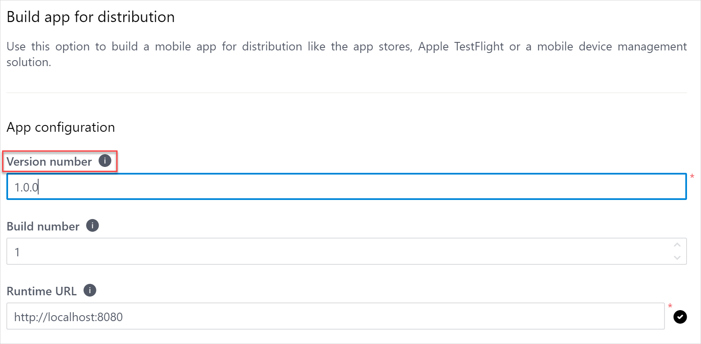

## 1 Introduction

Mendix Native apps support OTA updates using App Center's CodePush. The Mendix Native Mobile Builder allows you to build your app
so it includes support for OTA updates using App Center's CodePush. The Mendix Native Mobile Builder can also push your OTA updates. 

## 2 Prerequisites {#prerequisites}

Before starting this how-to, make sure you have completed the following prerequisites:

* Install Mendix Studio Pro v8.15 or above using the online installer. The offline installer does not include the Mendix Native Mobile Builder dependency.
* Deploy your app by completing [How to Deploy Your First Mendix Native Mobile App](deploying-native-app).
* Configure the App Center service for the Mendix Native Mobile Builder.

## 3 Build an App That Can Use CodePush OTA Updates {#build-with-ota-support}

To make OTA updates via App Center's CodePush available to your app's users, you must toggle the **App Center OTA Support** capability on. Next you must build new binaries with this capability on, and then release the apps to their respective app stores (only users with the new apps will be able to receive OTA updates). Do do these things, follow these general steps:

1. Click **Project** > **Build Native Mobile App**.
1.  Navigate to **Capabilities**: 

    {}{}

1.  Toggle App Center's **CodePush OTA Support** on: 

    {}{}

1. Click **Save**.
1.  Now build an application for distribution and make a note of the version number used: 

    {}{}

1. To make the OTA update functionality available to your users, please release a new update via the appropriate app stores. 

## 4 Release an OTA Update for Your App {#release-ota-update} 

After you have released an OTA-capable app, do the following to release a new OTA update:

1.  Select **Deploy an OTA update via CodePush**:

    {}{}

1.  Type in the target app version you wish to release the OTA update for. This version needs to match exactly with the app version used for building the app binaries in the previous step, or the one released on the app stores:

    {}{}

1. Click **Release an OTA update via CodePush**.
1.  The Mendix Native Mobile Builder will compile your project and resources and release the OTA updates:

    {}{}

1.  On compilation you will recieve links to the CodePush OTA update administration pages for your Android and iOS apps:

    {}{}

    {}{}

## 4 How to Transfer a CLI OTA-Compatible app to the Mendix Native Mobile Builder {#from-cli-to-ui}

The transition from the CLI to Mendix Native Mobile Builder for OTA supporting apps requires a few manual steps. These steps ensure you do not have to release your apps to the app stores again. 

### 4.1 Gather the Required Information 

1. Navigate to App Center: https://appcenter.ms
1. Find the Android and iOS apps used for building your project
1. Check the URL and note down the application id as seen in the URL. For example, in **https://appcenter.ms/users/user.name/apps/App-Android/distribute/code-push**, **App-Android** is the Android app's id. 

### 4.2 Move Your App to the Mendix Native Mobile Builder

1. Launch the Mendix Native Mobile Builder for your project.
1. If you have not yet completed the setup wizard, please complete it now.
1. Quit the tool completely. 
1. Navigate to your app's directory and find the **nativemobile** folder (for example **C:\Users\user\Documents\Mendix\App\nativemobile**).
1. Enable **Hidden items** in Explorer to be able to see the **.config** file if it is not visible. 
1. Open the **.config** file using Notepad and look for a key named **App Center**. If it is there it might contain some app names already, for example: 

    ```  
    "appcenter": {
        "iosAppName": "App-iOS",
        "androidAppName": "App-Android"
    },
    ```
    
    If the file does not exist add it manually. Either way, **make sure to change the names to reflect the IDs of your App Center apps**. Then make sure the newly changed file is still a valid JSON.
1. Restart the Mendix Native Mobile Builder for your project. If the tool does not start, verify once more that the **.config** file is a valid JSON.

Try to push an OTA update for an unreleased version of your app, for example v0.1.0. If the OTA update shows up on your App Center app's CodePush administration page, congratulations! You successfully transfered your project over to the Mendix Native Mobile Builder.

## 5 Read More

* [How To Get Started with Native Mobile](/howto/mobile/getting-started-with-native-mobile)
