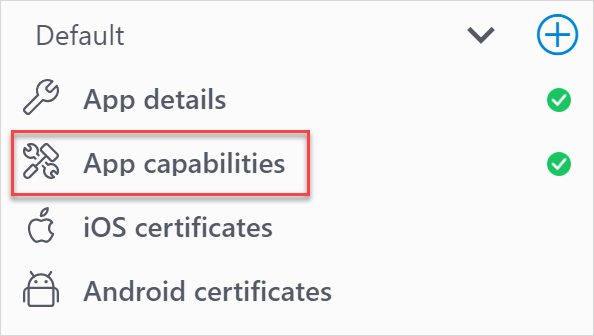
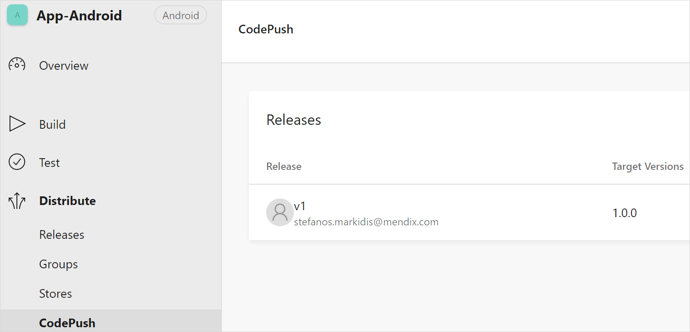

## 1 Introduction

Mendix Native apps support OTA updates using App Center's CodePush. The Mendix Native Mobile Builder allows you to build your app
so it includes support for OTA updates using App Center's CodePush. The Mendix Native Mobile Builder can also push your OTA updates. 

## 2 Prerequisites {#prerequisites}

Before starting this how-to, make sure you have completed the following prerequisites:

* Install Mendix Studio Pro v8.15 or above using the online installer. The offline installer does not include the Mendix Native Mobile Builder dependency.
* Deploy your app by completing [How to Deploy Your First Mendix Native Mobile App](deploying-native-app).
* Configure the App Center service for the Mendix Native Mobile Builder.

## 3 Build an App That Can Use CodePush OTA Updates {#build-with-ota-support}

To make OTA updates via App Center's CodePush available to your app's users, you must toggle the **App Center OTA Support** capability on. Next you must build new binaries with this capability on, and then release the apps to their respective app stores. Only users with the new apps will be able to receive OTA updates.

Complete the following steps:

1. Click **Project** > **Build Native Mobile App**.
2.  Navigate to **Capabilities**: 

    {}{}

3.  Toggle App Center's CodePush OTA Support on: 

    {}{}

4. Click **Save**.
5.  Now build an application for distribution and make a note of the version number used: 

    {}{}

6. To make the OTA update functionality available to your users, please release a new update via the appropriate app stores. 

## 4 Release an OTA update for your app {#release-ota-update} 

Given you have released an OTA capable app, to release a new OTA update follow these steps:

1. Select to deploy an OTA update via CodePush
{}{}
2. Type the target app version, to release the OTA update for. This need to match exactly the app version used for building the app binaries in the previous step or the one released on the app stores.
{}{}
3. Press **Release an OTA update via CodePush**
4. The Mendix Native Mobile Builder will compile your project and resources and released the OTA updates. 
{}{}
5. On complition you get links to the CodePush OTA update administration pages for your android and iOS apps.
{}{}
{}{}

## 4 How to transfer a CLI OTA compatible app to Mendix Native Mobile Builder {#from-cli-to-ui}

The transition from the CLI to Mendix Native Mobile Builder for OTA supporting apps, requires a few manual steps to avoid having to release your apps to the app stores again. 

### 4.1 Gather the required information 

1. Navigate to App Center: https://appcenter.ms
1. Find the Android and iOS apps used for building your project
1. Check the URL and note down the application id as seen in the URL. 
    For example: 
    `https://appcenter.ms/users/user.name/apps/App-Android/distribute/code-push` 
    
    **App-Android** is the id of the Android app. 

### 4.2 Move your project to Mendix Native Mobile Builder

1. Launch Mendix Native Mobile Builder for your project.
1. If you have not yet completed the setup wizard please complete it now.
1. Quit the tool completely. 
1. Navigate to your project's directory and find the nativemobile folder. e.g. `C:\Users\user\Documents\Mendix\App\nativemobile`
1. Enable *Hidden items* in Explorer to be able to see the `.config` file if it is not visible. 
1. Open the .config file using Notepad and look for a key named App Center. If it is there it might contain some app names already: 
    ```  
    "appcenter": {
        "iosAppName": "App-iOS",
        "androidAppName": "App-Android"
    },
    ```
    If it does not exist add it manually. Either way, make sure to change the names to reflect the IDs of your App Center apps. 
    Make sure the newly changed file is still valid JSON.
1. Restart Mendix Native Mobile Builder for your project. 
    If the tool does not start, verify once more that the *.config* file is valid JSON.

Try to push an OTA update for an unreleased version of your app, e.g. 0.1.0. If the OTA update shows up on your App Center app's CodePush administration page, you successfully transfered your project over to Mendix Native Mobile Builder.


## 5 Read More

* [How To Get Started with Native Mobile](/howto/mobile/getting-started-with-native-mobile)
