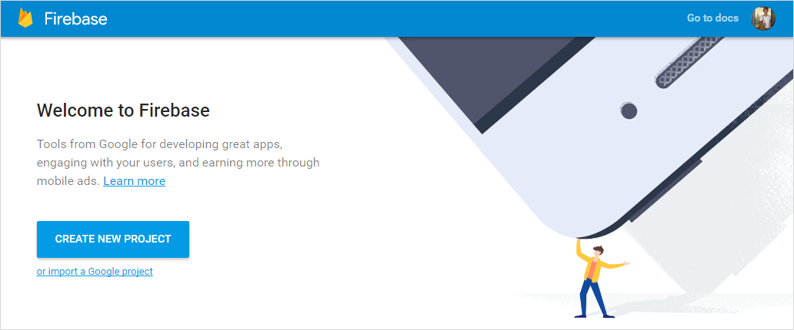

## 1 Introduction

You can use Google's Firebase Cloud Messaging (FCM) service to send push notifications to both Android as well as iOS. In order to send push notifications using FCM from this module, you need to set up a Firebase account with FCM enabled. To register for FCM and configure the service in the app, perform the steps below.

## 2 Prerequisites

Before starting this how-to, make sure you have completed the following prerequisites:

* Have a Firebase account

## 3 Setting up a Firebase Project

There are two possible scenarios: you can create a new FCM project, or you can update your existing GCM project to FCM. Both scenarios are described below.

### 3.1 Migrating a GCM project to FCM

To prevent the degraded reliability of push notifications delivery, you should migrate existing GCM projects to FCM and upgrade credentials if needed.

#### 3.1.1 Logging In to the Developers Console

Open up the [Firebase developers console](https://console.firebase.google.com/) and log in with your Google ID.

#### 3.1.2 Importing the Project

In the Firebase console, select **Import Google Project**. Select your GCM project from the list of existing projects, select a region, and click **Add Firebase**.

From here, continue with [Configuring APNs Credentials](#configuring) below.

### 3.2 Creating a New FCM Project

#### 3.2.1 Logging In to the Developers Console

Open up the [Firebase developers console](https://console.firebase.google.com/) and log in with your Google ID.

#### 3.2.2 Creating the Project

Click **Create new project** and fill in the project name and region for your application. Then click **Create**.

## 4 Configuring APNs Credentials (Optional) {#configuring}

If you wish to send push notifications to iOS devices through FCM, you will need to configure your APNs credentials. To do so, click in the top-left corner of the screen and select **Project settings**.

Navigate to the **Cloud messaging** tab.

On this tab, upload either your APNs key or your APNs certificate(s).

## 5 Setting Up a Service Account

In the top-left corner of the screen, click the cogwheel and select **Project settings**. Then navigate to the **Service accounts** tab.

On this page, press **Generate new private key**. Store the resulting file in a secure location. You will use this file when configuring FCM in the back-end of your Mendix application.

The file you just created gives API access to all available Firebase services for your app. If you want a more restrictive service account, click **Manage all service accounts** in the top-right of the screen, then create a service account that is restricted to using the Cloud Messaging functionality.

## 6 Downloading the Google Services Config Files

In addition to the back-end configuration set up in the previous steps, you will need additional files that will be bundled as part of your mobile application. To obtain these, again click the cogwheel in the top-left of the screen and select **Project settings**. Then navigate to the **General** tab.

The list at the bottom shows the Android and iOS applications that you have configured for your Firebase project. Select the Android application and click **google-services.json**. Then click the iOS application and click **GoogleService-Info.plist**. Store both files in a secure location. You will need these when building your mobile application.

## 7 Configuring FCM in Your Application

Open your Mendix application, log in as an Admin, and open the **PushNotifications_Administration** page. Scroll to the FCM section and create or edit a configuration. 

Configure FCM as follows:

* Select the **Enabled** checkbox
* Choose a name for the new configuration
* Enter your Firebase project ID (find this on the Firebase console website)
* Upload the private key you downloaded earlier when you created a service account
