## 1 Introduction

Automated tests can be created with different tools, depending on the type of tests. Integration tests can be created with [SoapUI](testing-web-services-using-soapui), unit tests with the [UnitTesting module](testing-microflows-using-the-unittesting-module), and UI tests with [Selenium IDE](testing-mendix-applications-using-selenium-ide). With Selenium IDE you can create scripts to aid in automation-aided exploratory testing. If you’re looking to create robust, browser-based tests, you should look into using a testing framework with Selenium.

TestNG is a Java testing framework that can be used to drive Selenium. In this how-to you will learn how to create an automated test with TestNG.

**This how-to will teach you how to do the following:**

* Create TestNG test files
* Run automated tests with TestNG
* Generate reports with TestNG

## 2 Prerequisites

Before starting with this how-to, make sure you have completed the following prerequisites:

* Download and install [Eclipse](http://www.eclipse.org/downloads/)
* Download [Selenium Client & WebDriver](http://www.seleniumhq.org/download/):
     
* Open the [Company Expenses app](https://appstore.home.mendix.com/link/app/240/Mendix/Company-Expenses) in the Modeler and run it locally

## 3 Creating a Java Project

In this chapter you will install the TestNG plug-in and create a Java project in Eclipse including the TestNG and Selenium libraries:

1. Open Eclipse and select **Help** > **Eclipse Marketplace...**:
    

2. In the **Find** section of the **Eclipse Marketplace** dialog box, enter *TestNG* and click **Go**. "TestNG for Eclipse" will be shown in the search results. 
3. Click **Install** to install the TestNG plug-in for Eclipse:
    

4. Click **Confirm** to confirm the features:
    

5. Review the licenses and click **Finish**. The plug-in will be installed:
    
6. Restart Eclipse for changes to take effect.
7. Click the **New** icon:
    
8.  Select **Java Project** and click **Next**:
    

9. Enter *MyFirstTestNGProject* as the project name and click **Next**.
10. Select the **Libraries** tab.
11. Click **Add Library...**.
12. Select **TestNG** and click **Next**.
13. Click **Finish** to set the default TestNG library to this project.
14. Click **Add External JARs...** and navigate to where you saved the Selenium JAR files.
15. Add all the JAR files inside the **selenium-[version]** and **libs** folders:
    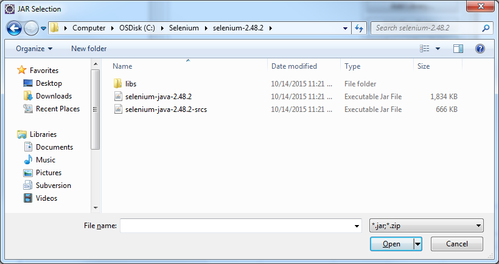
16. Click **Finish** to create the Java project. **MyFirstTestNGProject** will be shown in the **Package Explorer**:
    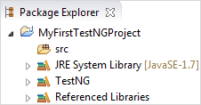

You are now done setting up your project!

## 4 Create a TestNG File

To create a new TestNG file, follow these steps:

1. Right-click the **src** folder and select **New** > **Other...**:
2. Select **TestNG class** and then click **Next**:
    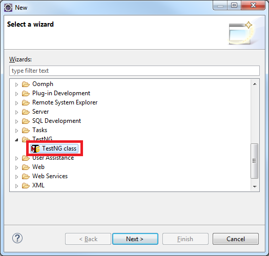

3. Click **Browse...** to select a source folder, select **MyFirstTestNGProject** > **src**, and click **OK**.
4. Enter the following information:
    * **Package name**: *myfirsttestngpackage*
    * **Class name**: *MyFirstTestNGFile*
    * **@BeforeTest**: true
    * **@AfterTest**: true
    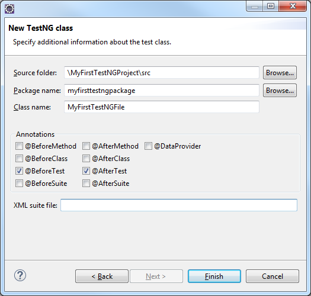
5. Click **Finish**. The template for your first TestNG file will be created automatically:
    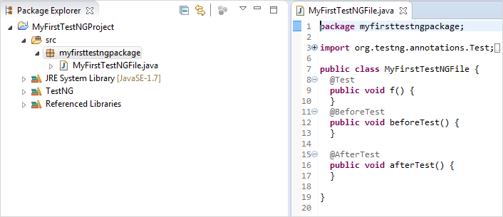

    The `@Test` annotation is used to state that the method under it is a test case. In this case, the method `f` is a test case. The `@BeforeTest` annotation is used to state that the method under it will be executed before the first test case. The `@AfterTest` annotation is used to state that the method under it will be executed after the last test case.

## 5 Creating a Test Case

Let's now code your test case.

### 5.1 Add a WebDriver

To create a variable to be used for the WebDriver, follow these steps:

1. Search for the following:

    ```java
    public class MyFirstTestNGFile {
    ```

2. Add the code below on the next line. This will create a `driver` variable of the WebDriver type:

    ```java
    public WebDriver driver;
    ```

3. Press Ctrl+Shift+O to organize the imports. This will import the missing statements and remove the unused import statements. The following statement will be imported:

    ```java
    import org.openqa.selenium.WebDriver;
    ```

### 5.2 Add a BeforeTest Method

The `@BeforeTest` annotation is used to state that the method under it will be executed before the first test case. Before the first test case, open the Firefox browser by following these steps:

1.  Change the following code:

    ```java
    @BeforeTest
    public void beforeTest() {
    }
    ```

    into:

    ```java
    @BeforeTest
    public void beforeTest() {
    	driver = new FirefoxDriver();
    }
    ```

    This creates a new instance of the Firefox driver and opens the Firefox browser.

2.  Press **CTRL+SHIFT+O**. The following statement will be imported:

    ```java
    import org.openqa.selenium.firefox.FirefoxDriver;
    ```

### 5.3 Add an AfterTest Method

The `@AfterTest` annotation is used to state that the method under it will be executed after the last test case. After the last test case, close the browser by changing the following code:

```java
@AfterTest
public void afterTest() {
}
```

into:

```java
@AfterTest
public void afterTest() {
driver.close();
}
```

This will close the Firefox browser.

### 5.4 Add the First Test Method

To add the first test method, open a URL in the browser, and then change the following code:

```java
@Test
public void f() {
}
```

into:

```java
@Test(priority=1)
public void openApp() {
driver.get("http://localhost:8080/index.html");
}
```

This test method will open the URL *http://localhost:8080/index.html* in the Firefox browser. By default, the methods annotated by `@Test` are executed alphabetically. You can use parameters to modify the annotation's function. The `priority` parameter can be used to execute the methods in a different order. TestNG will execute the `@Test` annotation with the lowest priority value up to the largest.

### 5.5 Add the Second Test Method

Now that you are on the login window, you will want to log in. To add the second test method, follow these steps:

1. Open Firefox and go to _http://localhost:8080/index.html_.
2. Click the "firebug" button in the Firefox toolbar:
    

3. Click the **FirePath** tab:
     

4. Click the "inspect element" button:
    

5. Click the **User name** input field. The ID of the this field is _usernameInput_. The CSS selector of an ID is a hashtag (`#`) + the name of the ID. For the **User name** field, this will be _#usernameInput_. The same principle is used for the other steps.
    
    The CSS selector _#usernameInput_ is unique. There is one matching node:
    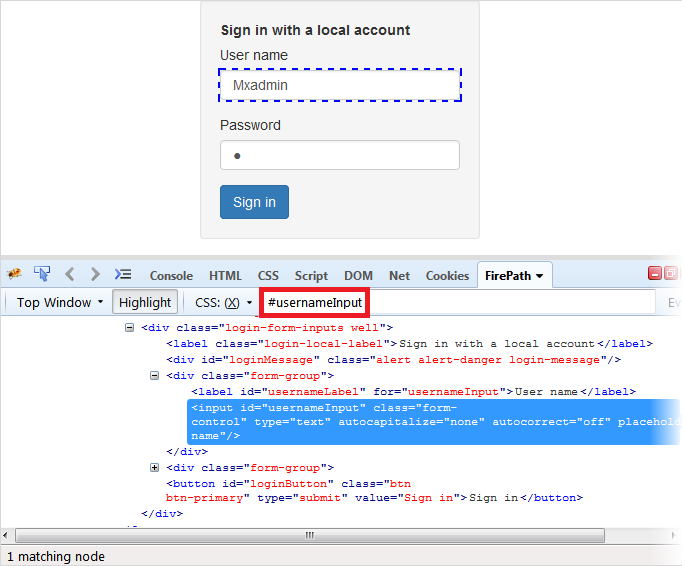
6. Repeat steps 5–6 for the **Password** input field and the **Sign in** button:

    Element | CSS Selector
    --- | ---
    **Password** input field | `#passwordInput`
    **Sign in** button | `#loginButton`

7.  Add a new test method called `login`. Use the following code:

    ```java
    @Test(priority=2)
    public void login() {
        driver.findElement(By.cssSelector("#usernameInput")).sendKeys("MxAdmin");
        driver.findElement(By.cssSelector("#passwordInput")).sendKeys("1");
        driver.findElement(By.cssSelector("#loginButton")).click();
    }
    ```

This test method contains the following test steps:

1. Enter _MxAdmin_ as the user name.
2. Enter _1_ as the password.
3. Click the login button.

### 5.6 Add the Third Test Method

Now that you are logged in, you will want to navigate to the **Expenses** tab. To add the third test method, follow these steps:

1. Open the Mendix Modeler, and then open the **Desktop_AdminMenu** page:
    
2. Select the **Expenses** tab:
    

    The name of the **Expenses** tab is `tabPage4`. Every element will automatically get the CSS class `mx-name-[Name]`, so the expenses tab will get the CSS class `mx-name-tabPage4` when the app is running.

    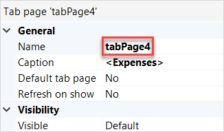
3. Go back to **Eclipse**.
4.  Add a new test method called `openExpensesTab`. Use the following code:

    ```java
    @Test(priority=3)
    public void openExpensesTab() {
        WebDriverWait wait = new WebDriverWait(driver, 10);
        wait.until(ExpectedConditions.visibilityOfElementLocated(By.cssSelector(".mx-name-tabPage4"))).click();
    }
    ```

    This test method calls `ExpectedCondition` every 500 milliseconds until it either returns successfully or 10 seconds have passed. When 10 seconds have passed and the element is not located, a TimeoutException will be thrown. If the element is located within 10 seconds, the method will click the element with class name `mx-name-tabPage4`. The class of the expenses tab is `mx-name-tabPage4`. The CSS selector of a class is a dot (`.`) + the class name, so for the expenses tab, it will be `.mx-name-tabPage4`. 

### 5.7 Add the Fourth Test Method

Now that you are on the **Expenses** tab, you will want to create a new expense. To add the fourth test method, follow these steps:

1. Open the Modeler and then open the **Desktop_AdminMenu** page.
2. Select the **New Expense** button:
    

    The name of the **New Expense** button is `newButton3`, so the button will have the `mx-name-newButton3` CSS class:

    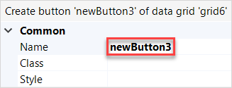

3. Open the **Desktop_Expense_NewEdit_Admin** page.
4.  Find the names of the following elements (as you did in step 3):

    | Element | Name |
    | --- | --- |
    | Amount field | `textBox6` |
    | Description dropdown | `referenceSelector1` |
    | Save button | `saveButton1` |

    {}

    The name of an element in your app may be different than the name shown in the Name column. In step 7, use the name of the element of your app.

    {}
5. Go back to **Eclipse**.
6.  Add a new test method called `createExpense`. Use the following code:

    ```java
    @Test(priority=4)
    public void createExpense() {
    	driver.findElement(By.cssSelector(".mx-name-newButton3")).click();
    	driver.findElement(By.cssSelector(".mx-window-active .mx-name-textBox6 input")).clear();
    	driver.findElement(By.cssSelector(".mx-window-active .mx-name-textBox6 input")).sendKeys("15.00");
    	driver.findElement(By.cssSelector(".mx-window-active .mx-name-referenceSelector1 option:nth-child(2)")).click();
    	driver.findElement(By.cssSelector(".mx-window-active .mx-name-saveButton1")).click();
    }
    ```

    This test method contains the following test steps:

    1. Click **New Expense**.
    2. Clear the **Amount** field.
    3. Enter _15.00_ in the **Amount** field.
    4. Select the second option from the **Description** drop-down menu.
    5. Click **Save**.

    A pop-up window will be shown after clicking **New Expense** (`.mx-name-newButton3`). To be sure the element of the active page is retrieved (which in this case is the pop-up), you need to add `.mx-window-active` to the CSS selector of the elements in the pop-up.

    For every input field, you need to add `input` at the end of the CSS selector.

    The default value of the amount field is 0.00. To enter a new value, you first need to clear the field.

    The reference selector has six options; empty, Accomodation, Meal, Other, Supplies, Transport. To select Accomodation (the second option), you need to add `option:nth-child(2)` at the end of the CSS selector.

### 5.8 Add the Fifth Test Method

After you have created an expense, you will want to sign out. To add the fifth test method, follow these steps:

1. Open Modeler and then open the **Desktop_MyInfo** snippet.
2.  Find the name of the following element:

    | Element | Name |
    | --- | --- |
    | Sign out button | `signOutButton1` |

3.  Add a new test method called `signOut`. Use the following code:

    ```java
    @Test(priority=5)
    public void signOut() {
    	driver.findElement(By.cssSelector(".mx-name-signOutButton1")).click();
    }
    ```

    This test method will click the element with the `mx-name-signOutButton1` class name.

## <a name="RuntheTest"></a>6 Run the Test

You are now ready to run the test. To run the test, follow these steps:

1. Right-click the **MyFirstTestNGProject** folder.
2. Select **Run as** > **TestNG Test**:
    

    The results of the test will be shown in the console window and in the TestNG results window:

    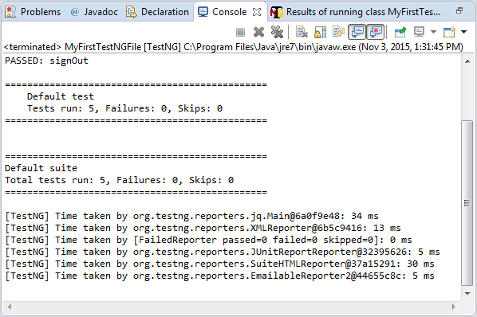

    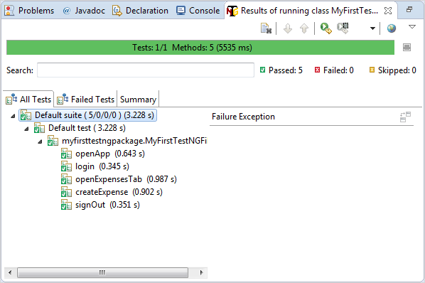

## 7 Test Report

TestNG generates reports in the HTML format. To test the report, follow these steps:

1. Right-click the **MyFirstTestNGProject** folder and select **Refresh**. A test-output folder will be created:
    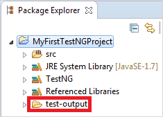
2. Open the **test-output** folder.
3. Right-click the **index.html** file.
4. Select **Open with** > **Web Browser**. The report will look like this:
    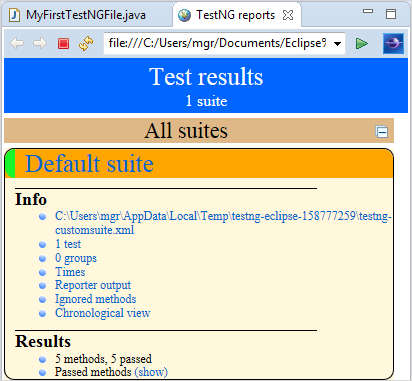
5. Click **(show)**. The test methods are shown alphabetically:
    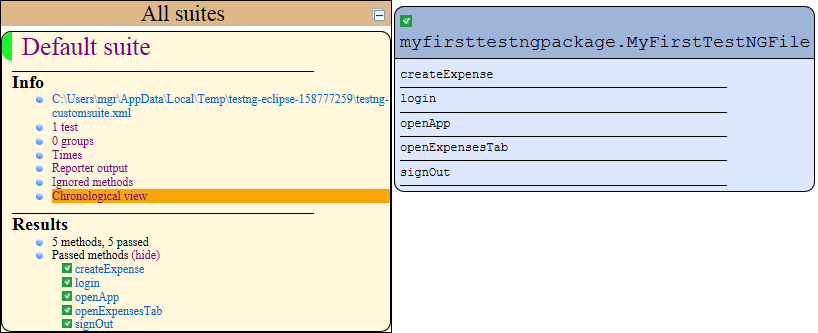
6. Click the **Chronological** view. An overview with the methods in chronological order will be shown:
    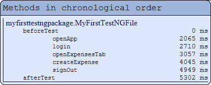

## 8 Creating a Test Suite

When you run your test as you did in [Run the Test](#RuntheTest), a test suite is created automatically. This test suite contains all testNG files that can be found in the project. But what if you only want to run specific tests? Than you need to create a test suite yourself.

1. Right-click the **src** folder and select **New** > **Other**.
2. Open the **XML** folder and select **XML File**:
    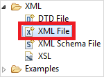 
3. Click **Next**.
4. Change the file name to _MyFirstTestSuite.xml_.
5. Click **Finish** to create the XML file:
    
6. Click the **Source** tab:
    
7.  Change the following code:

    ```xml
    <?xml version="1.0" encoding="UTF-8"?>
    ```

    into

    ```xml
    <?xml version="1.0" encoding="UTF-8"?>
    <suite name="MyFirstTestSuite">
    	<test name="Test1">
    		<classes>
    			<class
    				name="myfirsttestngpackage.MyFirstTestNGFile" />
    		</classes>
    	</test>
    </suite>
    ```

    This will create the new test suite `MyFirstTestSuite`. The test suite contain one test: `Test1`. The test contain one testNG file, `myfirsttestngpackage.MyFirstTestNGFile`.

10. Right-click the **MyFirstTestSuite.xml** file and select **Run as** > **1 TestNG Suite**.

Well done! You created your first TestNG Suite!

## 9 Run Your Test Suite on Multiple Browsers Using @Parameters

The test you created is now run on Firefox only. If you want to make sure the functionality works as expected in other browsers, you need to perform multi-browser testing. With TestNG it is very easy to perform the same test on different browsers.

1. Download the ChromeDriver here: [https://sites.google.com/a/chromium.org/chromedriver/downloads](https://sites.google.com/a/chromium.org/chromedriver/downloads).
2. Download the IEDriver here: [http://selenium-release.storage.googleapis.com/index.html](http://selenium-release.storage.googleapis.com/index.html).
3.  In Eclipse, open **MyFirstTestNGFile** and change the following code:

    ```java
    @BeforeTest
    public void beforeTest() {
    	driver = new FirefoxDriver();
    }
    ```

    into:

    ```java
    @Parameters("browser")
    @BeforeTest
    public void beforeTest(String browser) {
    	if(browser.equalsIgnoreCase("chrome")){
    		System.setProperty("webdriver.chrome.driver", "C://Selenium/chromedriver.exe");
    		driver = new ChromeDriver();
    	}
    	else if(browser.equalsIgnoreCase("ie")){
    		System.setProperty("webdriver.ie.driver", "C://Selenium/IEDriverServer.exe");
    		driver = new InternetExplorerDriver();
    	}
    	else{
    		driver = new FirefoxDriver();
    	}
    }
    ```

    `@Parameters` is used to insert a parameter (in this case `browser`) from the test suite XML. If the browser parameter is `chrome`, a Chrome driver will start. 

    In this section, *chromedriver.exe* is stored in the *C://Selenium* folder. Be sure to use the right path in this code.

4.  Press Ctrl+Shift+O, and the following statements will be imported:

    ```java
    import org.openqa.selenium.chrome.ChromeDriver;
    import org.openqa.selenium.ie.InternetExplorerDriver;
    import org.testng.annotations.Parameters;
    ```

5.  Open **MyFirstTestSuite** and change the following code

    ```xml
    <?xml version="1.0" encoding="UTF-8"?>
    <suite name="MyFirstTestSuite">
    	<test name="Test1">
    		<classes>
    			<class
    				name="myfirsttestngpackage.MyFirstTestNGFile" />
    		</classes>
    	</test>
    </suite>
    ```

    into:

    ```xml
    <?xml version="1.0" encoding="UTF-8"?>
    <suite name="MyFirstTestSuite">
    	<test name="ChromeTest">
    		<parameter name="browser" value="chrome" />
    		<classes>
    			<class name="myfirsttestngpackage.MyFirstTestNGFile" />
    		</classes>
    	</test>
    	<test name="IETest">
    		<parameter name="browser" value="ie" />
    		<classes>
    			<class name="myfirsttestngpackage.MyFirstTestNGFile" />
    		</classes>
    	</test>
    	<test name="FirefoxTest">
    		<parameter name="browser" value="firefox" />
    		<classes>
    			<class name="myfirsttestngpackage.MyFirstTestNGFile" />
    		</classes>
    	</test>
    </suite>
    ```

    The first test (called `ChromeTest`) has the browser parameter `chrome`. This parameter will be used in the `@BeforeTest` method in MyFirstTestNGFile.

6. Right-click the **MyFirstTestSuite.xml** file and select **Run as** > **TestNG Suite**:
    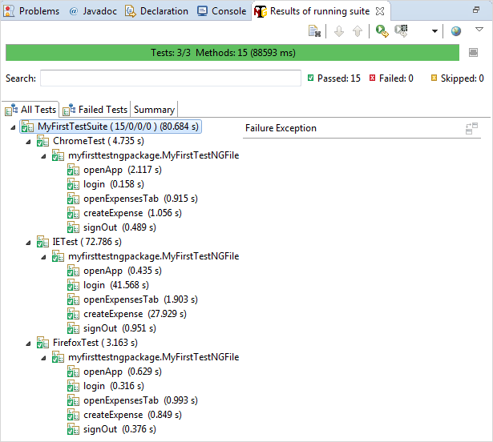

Well done! You created your first automated cross-browser test with TestNG!

Now you know how to create a TestNG test file, how to create a test suite and how to run the automated test(s) on multiple browsers.

Happy testing!

## 10 Related Content

* [Test Mendix Applications Using Selenium IDE](testing-mendix-applications-using-selenium-ide)
* [Test Microflows Using the UnitTesting Module](testing-microflows-using-the-unittesting-module)