## 1 Introduction

To smarten up your app with business logic you can use microflows. To verify that your microflow works as expected you can create unit tests using the Unit Testing module. The Unit Testing module provides an easy to use interface to manage and run unit tests. The module supports unit tests that are created using microflows and unit tests that are created using JUnit.

**This how-to will teach you how to do the following:**

* Set up the Unit Testing module
* Create a microflow unit test

## 2 Preparation

Before you can start with this how-to, make sure you have completed the following prerequisites:

* Download [Mendix Studio Pro](https://appstore.home.mendix.com/link/modelers/)
* Review the Marketplace components used in this how-to:

    | Component | Version Used in This How-to |
    | --- | --- |
    | [Unit Testing](/appstore/modules/unit-testing) | 8.0.0 |
    | [Community Commons Function Library](/appstore/modules/community-commons-function-library) | 8.1.0 |
    | [Object Handling](/appstore/modules/object-handling) | 3.0.0 |

	{}All the images, names, and steps in this how-to are based on the Marketplace component versions listed above. When using later versions of this content, images and/or names on your screen may be different than what is used in this how-to.
	{}

## 3 The Unit Testing Module

In this chapter you will set up the unit testing module and run the example tests.

1. Create a new app.
2. Download the [Unit Testing](/appstore/modules/unit-testing) module.
3. Download the [Community Commons Function Library](/appstore/modules/community-commons-function-library) module.
4. Download the [Object Handling](/appstore/modules/object-handling) module.
5.  Open the **Settings** of the app:

	

6. Click the **Runtime** tab.
7. Click the **Select** button to select an **After startup** microflow:

	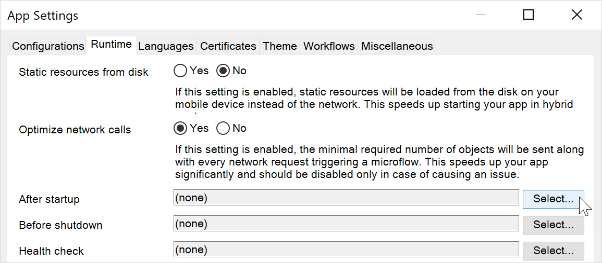

8.  Select the **Startup** microflow from **Unit Testing** > **USE ME** > **Microflows**:

	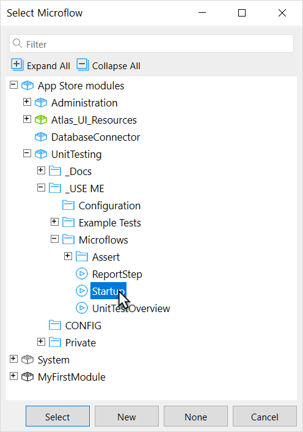

9. Click **OK**.
10. Open the **Navigation** of the app.
11. Click **New item** to add a new item to the menu.
12. Enter _UnitTestOverview_ in the **Caption** field.
13. Select **Call a microflow** for the **On click** action, and then select the **UnitTestOverview** microflow:

	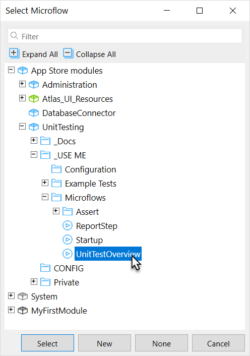

14. Click **OK**:

	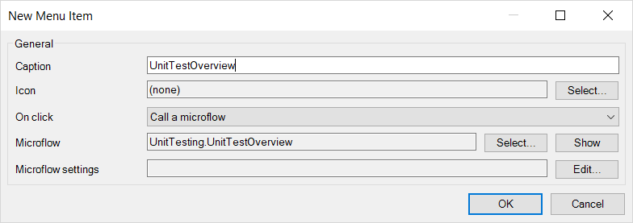

15. Run the app locally.
16. Go to `http://localhost:8080/index.html`.
17. Click **UnitTestOverview** in the navigation.

	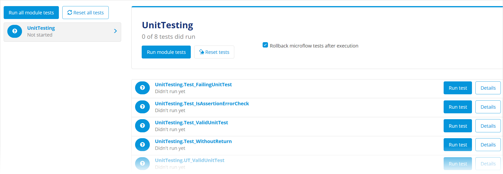

	On the left side of the page, two buttons are shown. When you click **Run all module tests**, all the unit tests are executed (with check mark icons). When you click **Reset all tests**, the status of the tests change to not executed (with question mark icons).

	Beneath these buttons, the modules that contain unit tests are shown. To begin with and in this scenario, **Unit Testing** is the only module that contains unit tests. When you click a module, all the unit tests of the module are shown.

	If you want to save all the changes made in the microflow to the database, you need to clear the **Rollback microflow tests after execution** box. Keep the box checked if you want to roll back all the changes.

	On the right side of the page, the unit tests of the selected module are shown. In this scenario, five main unit tests are shown. When you click **Run module tests**, all the unit tests are executed. When you click **Run test** next to a unit test, only that unit test is executed.

18. Click **Run Test** for **UnitTesting.Test_ValidUnitTest**. The color of the test case changes to red if failed and to green if passed:

	

19. Click **Details** for Unit Testing.TestValidUnitTest to see the relevant details of the test case:

	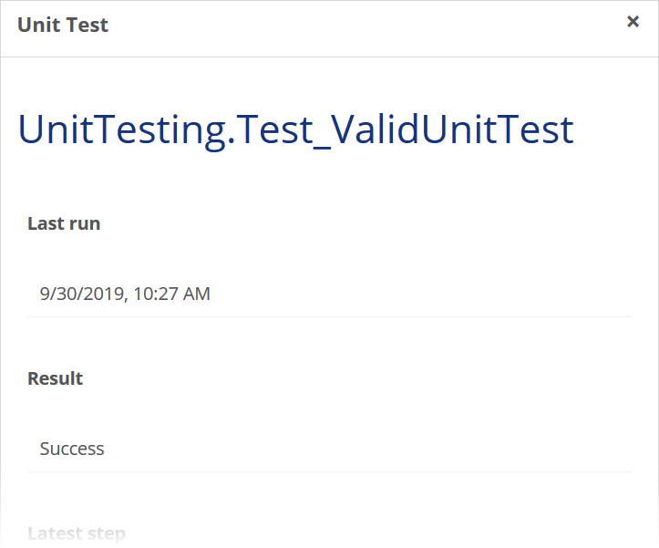

## 4 Creating a Microflow Test

In this section, you will learn how to create a microflow test. To create a new microflow test in a module, you need to add a microflow with a name that starts with *Test*. A test microflow should have no input arguments and a Boolean or string as the result type. For a Boolean result type, true means success, false means the test failed. For a string result type, any non-empty string indicates a failed test.

### 4.1 Creating a Microflow

To create the microflow, follow these steps:

1.  Create a new enumeration and name it *Level* with three enumeration values: *Junior*, *Medior*, and *Senior*.
  
	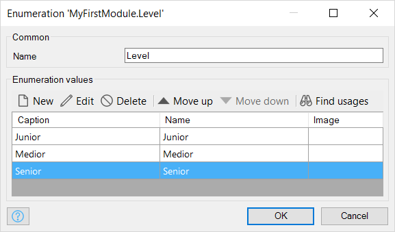

2.  Open the domain model of **MyFirstModule**.
3.  Create a new entity, name it *Employee*, and add two attributes: *Name* (of the **String** type) and *Level* ( of the  **Enumeration** > **Level** type).

	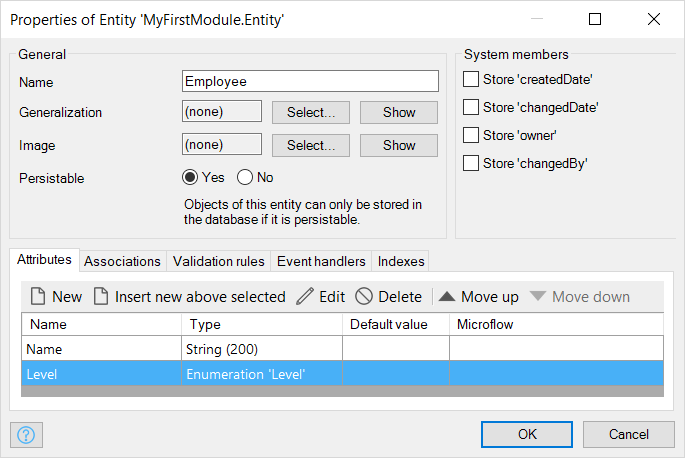

4.  Create a microflow called **Promote** that looks like this:

	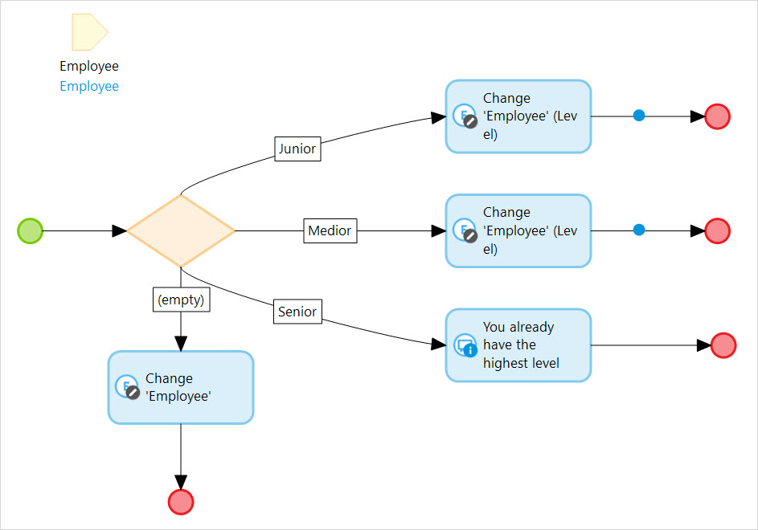

### 4.2 Creating a Unit Test

1. Add a new folder to MyFirstModule and name it _UnitTests_.
2. Add a new microflow to the **UnitTests** folder and name it *Test_PromoteEmployeeToJunior*.
3. Add one input parameter to the microflow for **Employee**.
4. Add a new **Create object** activity for the **Employee** entity and set **Commit** to **Yes**.
5. Add a new **Member** with *John* set for **Name**:

	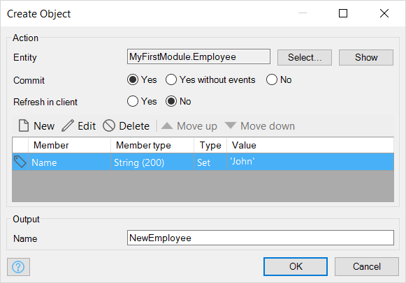

6. Now, you need to call the **Promote** microflow with the **Employee** object you just created. So, add a new activity of the **Microflow call** type, select the **Promote** microflow, and enter `$NewEmployee` for the argument:

	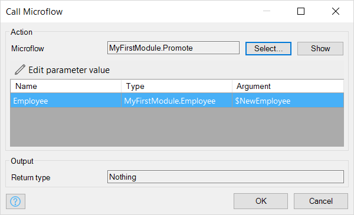

7. Now, the the employee needs to be promoted to the right level. Add a new activity of the **Microflow call** type and select the**UnitTesting.AssertTrue1** microflow.
8. Set the argument of **ValueToAssert** parameter to `$NewEmployee/Level = MyFirstModule.Level.Junior`:

	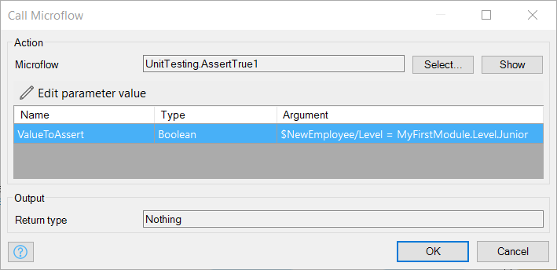

9. Right-click the **AssertTrue1** activity you just configured, select **Edit caption**, then enter *Promoted to Junior?* for the new caption.
10. For failed tests, the last step information can be very useful. You can provide this information in your microflow by calling the **ReportStep** sub-microflow. So, add a new activity of the **Microflow call** type between **Create Employee** and **Promote** and select the **UnitTesting.ReportStep** microflow.
11. Set the argument of parameter **Message** to `'Employee created'`.
12. Add a new activity of the **Microflow call** type between **Promote** and **Promoted to Junior?** and select the **UnitTesting.ReportStep** microflow .
13. Set the argument of parameter **Message** to `'Employee promoted'`.
14. Double-click the **End event**, select **Boolean** as the return **Type**, and enter `true` as the **Return value**.
15. The microflow should look like the model below:

	

16. Create three more test microflows as shown below:

	
	
	

		

17. Run the app locally and view it. 
18. Click **UnitTestOverview** in the navigation, and click **MyFirstModule** in the list of modules that contain one or more test cases:

	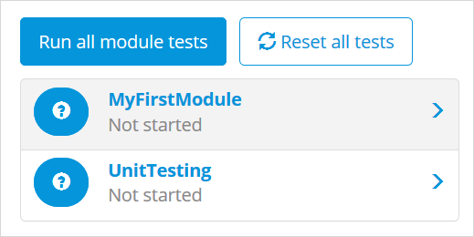

	This will display all the test cases for **MyFirstModule**.

19. Verify the **Rollback microflow tests after execution** box is checked.
20. Click **Run all module tests**. All the test cases should pass.

Congratulations! You created your first unit tests using the Unit Testing module.

{}
It is possible to create a "Setup" and "TearDown" microflow per module. The "Setup" microflow is invoked once before each test run, and the "TearDown" microflow is invoked once after each test run (regardless of whether the test run consists of one or multiple unit tests).
{}

{}
Do not test everything, focus on the most used and complex microflows!
{}

## 5 Read More

* [How to Create Automated Tests with TestNG](create-automated-tests-with-testng)
