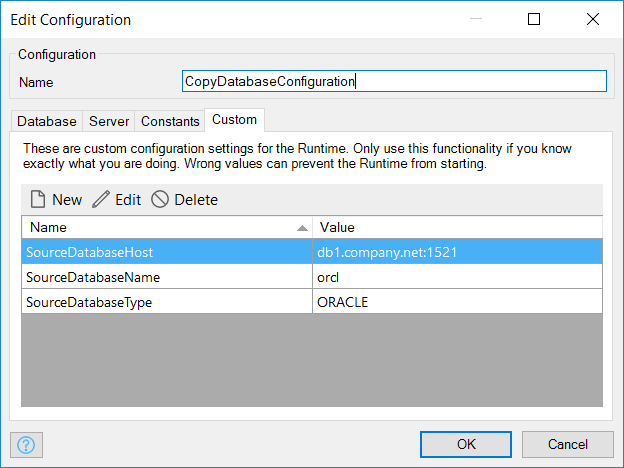
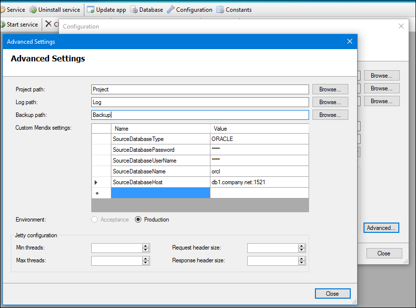

## 1 Introduction

This document explains how to migrate the data in an existing Mendix database to another Mendix database. This can be useful if you want to migrate from one type of database to another, for example MS SQL Server to PostgreSQL.

**After completing this how-to you will know:**

*   How to migrate a non-PostgreSQL database to a PostgreSQL database
*   How to export a PostgreSQL database
*   How to upload an exported PostgreSQL database to the Mendix cloud
*   How to export a Mendix cloud database
*   How to import into an on-premise PostgreSQL database
*   How to migrate a PostgreSQL database to a non-PostgreSQL database

## 2 Overview

You can copy all the data from any Mendix-supported database management system to any other Mendix-supported database management system. For example you can copy demo, test, and production databases from built-in to PostgreSQL, and from PostgreSQL to built-in. You can also migrate production data from SQL Server or Oracle (on-premises) to PostgreSQL in our cloud.

To do this, start your app on the database you would like to copy the data to. This database should already exist and should be totally empty. To let Mendix know from which database all data should be copied, you have to set some custom configuration settings. These custom settings define the type of the source database, the host name, the user name and password, etc.

The most commonly used custom settings for database migration are:

*   SourceDatabaseType (HSQLDB, MYSQL, ORACLE, POSTGRESQL, SQLSERVER)
*   SourceDatabaseHost
*   SourceDatabaseName
*   SourceDatabaseUserName
*   SourceDatabasePassword

See [Custom Settings](/refguide7/custom-settings) for more information on the full list of available settings. These settings can be configured as follows:

* Modeler: in **Project Explorer**, expand **Project**, double-click **Settings**, edit a configuration, go to the right-most tab called **Custom**:

   

* Service Console: click an app in the left pane, click **Configuration**, click **Advanced**, see Custom Mendix settings.

   

* m2ee-tools: add the custom settings to the mxruntime section. See [https://github.com/mendix/m2ee-tools/blob/develop/examples/full-documented-m2ee.yaml](https://github.com/mendix/m2ee-tools/blob/develop/examples/full-documented-m2ee.yaml)

You can migrate databases using either the Modeler, the Service Console or m2ee-tools. The Service Console gives you the advantage of seeing a progress bar during the copy process, which is handy if you copy a lot of data which takes a long time to execute.

{}

Database migration is handled by Mendix as a normal database synchronization phase during the start-up process of an app. As a consequence, it is possible that during the start-up process you will get to see messages like ‘The database has to be synchronized’ or you will see an empty message. In the future, tools like the Service Console and m2ee-tools will recognize this phase better and give more appropriate messages. However, these tools already correctly handle the database migration.

{}

{}

Before the data copy process starts, the source database will also be synchronized with the model, just like the main database. This is necessary to ensure that all data is copyied without problems.

{}

## 3 Migrating a Non-PostgreSQL Database to a PostgreSQL Database

The Mendix cloud environment only uses PostgreSQL as a database server. The recommended way is to migrate your existing on-premises non-PostgreSQL source database to a new on-premises PostgreSQL target database. 

The source database is the database with the data that you would like to migrate to the cloud. The target PostgreSQL database should be completely empty, as in, it should not contain any tables. In the Mendix project the active configuration in Settings should point to the target database, and you should add the Custom configuration settings for the source database as explained above in the overview.

Having configured the Mendix project, just run the application locally and it will automatically migrate the database schema and all the data from the source database to the target database. Before exporting the target database, you should always validate it first by viewing the application in a browser. 

### 3.1 Exporting a PostgreSQL Database

To export a PostgreSQL database, refer to either the [pg_dump](https://www.postgresql.org/docs/current/backup-dump.html) command line tool or the [PG Admin](https://www.pgadmin.org/docs/1.22/backup.html) visual tool documentation to understand how to create a backup of your new PostgreSQL database.

### 3.2 Uploading an Exported PostgreSQL Database to the Mendix Cloud Database

Use Developer Portal to upload the migrated, exported database backup to the Mendix cloud. This can be accessed using the Nodes page in the Developer Portal: select your app and environment, click **Details**, click the **Backup** tab and use the **Upload Data** button to upload your Database using the file chooser to select the exported database file from your local file system. This will stop and clear your existing environment.

## 4 Exporting a Mendix Cloud Database

The same procedure can be used to export an existing Mendix cloud database, import it into an on-premises PostgreSQL source database and migrate that to an on-premises non-PostgreSQL target database.

Export the Mendix cloud database via the Developer Portal. This can be accessed using the Nodes page in the Developer Portal: select your app and environment, click **Details**, click the **Backup** tab, select an existing Backup from the list, and click the **Download Backup** button to download the database to your local file system using the Database URL shown in the dialogue. A fresh backup with recent data could also be created first using the **Create Backup** button.

### 4.1 Importing into an On-premises PostgreSQL Database

To import a PostgreSQL database using the downloaded database file, refer to either the [pg_dump](https://www.postgresql.org/docs/current/backup-dump.html) command line tool or the [PG Admin](https://www.pgadmin.org/docs/1.22/restore.html) visual tool documentation to understand how to restore your downloaded database file.

### 4.2 Migrating a PostgreSQL Database To a Non-PostgreSQL Database

The source database is a PostgreSQL database with the downloaded database from the Mendix cloud. The target non-PostgreSQL database should be completely empty, as in, it should not contain any tables. In the Mendix project the active configuration in Settings should point to the target database, and you should add the Custom configuration settings for the source PostgreSQL database as explained above in the overview.

Having configured the Mendix project, just run the application locally and it will automatically migrate the database schema and all the data from the source database to the target database. You should always validate it first by viewing the application in a browser.
