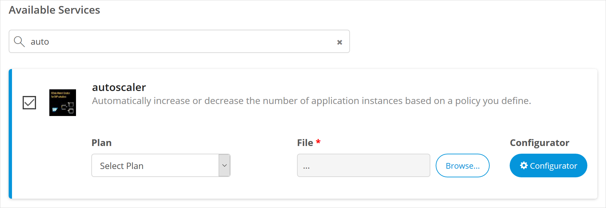

## 1 Introduction

The **Application Autoscaler** service for SAP Cloud Platform enables applications to automatically increase or decrease the number of instances of your app. This can be based on a schedule, or based on the value of a metric.

For more information on the Application AutoScaler see [Application Autoscaler Service](https://help.sap.com/viewer/7472b7d13d5d4862b2b06a730a2df086/Cloud/en-US/4ad999a0be664160a08514ba4ce6430c.html) on the *SAP Help Portal*.

## 2 Binding the Application Autoscaler

The autoscaler service can be found on the [services tab](/developerportal/deploy-sap-cloud-platform#binding-services) of the environment details page of your app's environment.

Selecting the autoscaler service will expand the entry to allow you to enter more details about the service you wish to bind, namely the **Plan** and the **File** which contains the configuration.

You will need to specify the following:

* **Plan** – the plan you wish to use for the autoscaler, either *Lite* or *Standard*
* **File** – the file which contains the JSON to configure the autoscaler — more information, including the contents of the configuration file can be found in [Application Autoscaler Service](https://help.sap.com/viewer/7472b7d13d5d4862b2b06a730a2df086/Cloud/en-US/4ad999a0be664160a08514ba4ce6430c.html) on the *SAP Help Portal*

Having provided this information, you can click **Connect Services** to connect the autoscaler to your app.

{}
You must restart your app to bind the autoscaler to your app.
{}