## 1. Introduction

The **BAPI Connector for SAP solutions** is a connector for integrating with SAP back-end systems which provide integration through the SAP Business API (SAP BAPI), such as SAP Business Suite (SAP ERP 6.0), SAP S/4HANA, and SAP S/4HANA Cloud.
The BAPI connector is a Mendix module that provides capability to call SAP BAPIs available on SAP R/3 or SAP S/4 HANA systems.

The BAPI connector uses the [SAP Java Connector](https://support.sap.com/en/product/connectors/jco.html) (JCo) to make Remote Function Calls (RFCs) to SAP systems. Once you have made a connection to your JCo destination, you will have access to all the BAPIs which are authorized for that destination.

This connector allows you to do the following:

* Search BAPIs within your SAP back end(s)
* View BAPI details
* Generate a metadata file for a BAPI (which is used to create a Mendix module containing the domain model of the BAPI)
* Call BAPIs or BAPI sequences
* Use the BAPI response in your application

## 2. Prerequisites:
1. An SAP back-end system (SAP ERP, SAP S/4HANA, SAP S/4HANA Cloud) which has Remote Function Modules/BAPI enabled.
2. Access to the SAP System over the network from where the Mendix application is deployed.
3. Mendix Studio Pro version 8.18.10 or above.
4. At least 1GB memory if running on SAP BTP.

## 3. Developing using the BAPI Connector for SAP Solutions

This section describes how to use BAPI Connector for SAP Solutions in your Mendix application to call the BAPI of your choice. 

1. Set up the developer environment as described in [+BAPI Connector – Developer Guide: Setting-up-Developer-Environment](https://paper.dropbox.com/doc/BAPI-Connector-Developer-Guide-Setting-up-Developer-Environme-h4NZrLP2cLDNaPBtKDSYr#:uid=707066185207737788818976&amp;h2=Setting-up-Developer-Environme) 
2. Test the connection to the SAP Backend using the microflow “TestConnection”.
3. Add the microflow `Create_BAPIExplorer` to the navigation of your app to allow you to search for the BAPI(s) you need.

    Searching for BAPIs is provided as a microflow rather than a separate app so that you can set up the JCo destination securely. This microflow will not be used by end-users of any app you build using the Mendix BAPI Connector.
4. Search for the BAPI(s) you need, download the schema(s), and generate Mendix BAPI module(s) using the [Model Creator](https://sapodatamodelcreator-beta.mendixcloud.com/) [for SAP Solutions](https://sapodatamodelcreator-beta.mendixcloud.com/).
5. Import the generated Mendix BAPI module .mpk to your Mendix application using the instructions in [Import & Export Objects](https://docs.mendix.com/howto/integration/importing-and-exporting-objects). A module with the same name as the BAPI is added to the project. 

    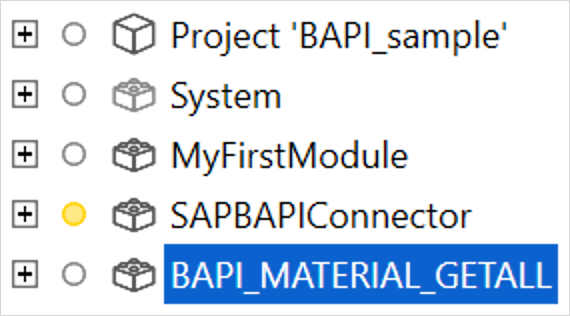

6. Create a microflow to call the BAPI, as shown in the example below.

    

    * Add the action “GetJCoDestination”. This will retrieve the JCoDestination to communicate with SAP system.
    * Add the action “CallBAPI” with the parameters shown below. This will call the BAPI and map the response to the entity given in the **Response type** parameter.
        

    * Use the response in further actions. In this microflow, display details on a Mendix page called ‘MaterialDetails’.

## 4. Setting Up the Developer Environment 

1. Get the [BAPI Connector for SAP solutions module](https://example.com/BAPIConnector).
2. Import the BAPI Connector for SAP solutions module into a new or existing application in Mendix Studio Pro version 8.18.0 or above. On successful import this module will be visible in your application as **SAPBAPIConnector**

    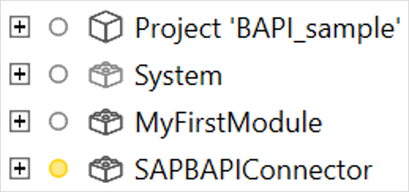

3. Download following files from [SAP Support](https://support.sap.com/en/product/connectors/jco.html). You need the versions for *Microsoft Windows and Windows Server*
    1. sapjco3.dll
    2. sapjco3.jar
        
    Put both of these files in the `/userlib` folder where your Mendix application is stored (that is `<app location>/userlib` )
        
4. Configure the connection details by doing the following:
    - Go to JCO_Constants folder and set the SAP system connection details.

### 4.1 SAP System Connection Details

**DestinationName:** The user-defined name for the JCoDestination.

Please refer to [JCo Property Settings](https://help.sap.com/viewer/a33d7bdbf6b84a708a1ad4e65eb65ad2/7.04%20SP10/en-US/3eb536d067f145378fbc34bb24f2e594.html) the SAP Help Portal for information on how to fill these in.

The following JCo Properties map directly to these constants in the module:

| Constant Name | JCO Property     |
| ----------------- | -------------------- |
| Language          | jco.client.lang      |
| Client            | jco.client.client    |
| Username          | jco.client.user      |
| Password          | jco.client.passwd    |
| Host              | jco.client.ashost    |
| SystemNumber      | jco.client.sysnr     |
| RouterAddress     | jco.client.saprouter |

If you need to set additional JCoProperties for which a constant is not available, you can create a List of objects of the Property entity (see the domain model section, below) and use the `GetJCoDestination` action. You need to set the following attributes in the Property object:

* Name – is the actual JCoProperty key — for example to set maximum pool size, Name would be `jco.pool.maxpoolsize`
* Value – the value to be assigned to this property.

## 5. Domain Models

This section describes two different domain models. The domain model in the SAPBAPIConnector module is used to control how your app communicates with an SAP BAPI. The domain model in a Mendix BAPI module describes a specific SAP BAPI which you want to use in your app.

### 5.1 SAP BAPI Connector Domain Model

This is part of the SAPBAPIConnector module and contains the entities which are used by the BAPI Connector to create objects required for calling a BAPI

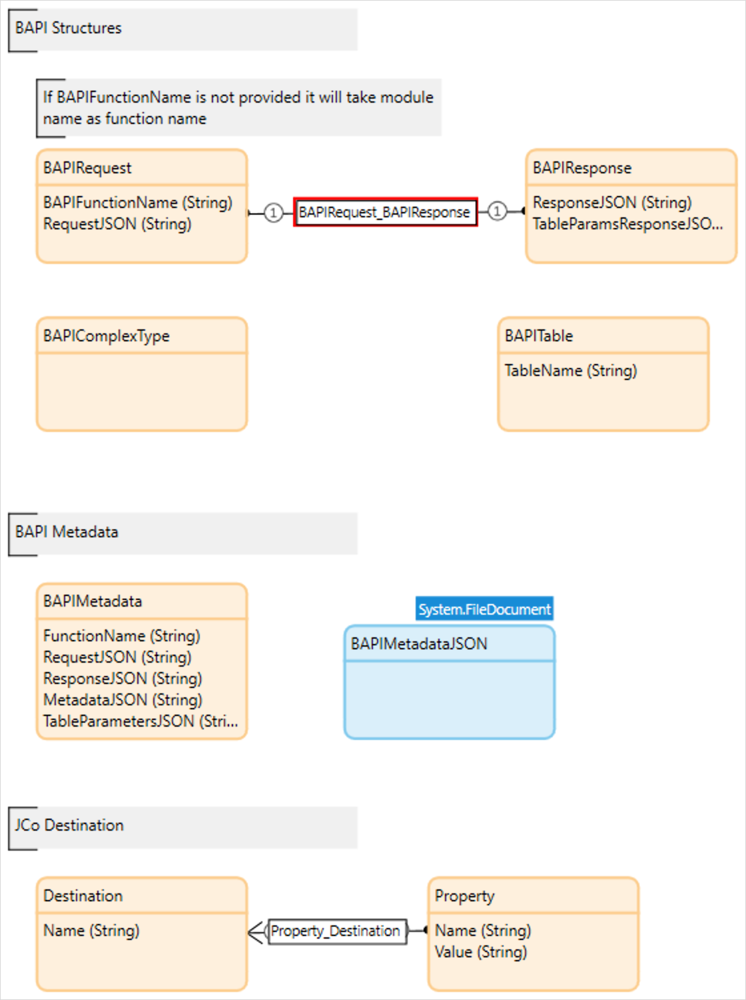

 **BAPIRequest**
This is a generic entity which represents a BAPI request. Any entity that represents a specific BAPI request is a specialization of the `BAPIRequest` entity. Objects of this entity contain the import parameters of a BAPI.

 **BAPIResponse**
This is a generic entity which represents a BAPI response. Any entity that represents a specific BAPI response is a specialization of the `BAPIRe``sponse` entity. Objects of this entity contain the export parameters of a BAPI.

 **BAPIComplexType**
Any entity in a Mendix BAPI module which is associated with the BAPIRequest and BAPIResponse entity and part of BAPI Import or Export parameters is a specialization of this entity. 

 **BAPITable**
This represent an entity in a Mendix BAPI module which has attributes which are mapped to the Table parameters of a BAPI.

 **BAPIMetadata**
This holds all the attributes which represent the metadata of an SAP BAPI. It is used to generate a metadata.json file which is used in the Model Creator for SAP Solutions to create a domain model for a Mendix BAPI module. 

 **Destination**
This entity holds the JCo Destination name and properties.

### 5.2 Mendix BAPI module Domain Model

This is the domain model which represents a specific BAPI. You can have one or more of these modules in your Mendix application, each defining a single BAPI. 
The microflow actions of the BAPI Connector for SAP solutions make use of the domain model representing an SAP BAPI. The entities in the domain model have attributes which define Import, Export, and Table parameters of an SAP BAPI.

You can create Mendix BAPI modules for the SAP BAPIs you want to use with the [Model Creator](https://sapodatamodelcreator-beta.mendixcloud.com/) [for SAP Solutions](https://sapodatamodelcreator-beta.mendixcloud.com/) (see [the section](https://paper.dropbox.com/doc/BAPI-Connector-Developer-Guide-h4NZrLP2cLDNaPBtKDSYr#:uid=172684995887173896024271&h2=Create-a-Mendix-BAPI-Module-Us) below).

A Mendix BAPI module domain model contains entities which are specializations of the entities defined in section [BAPI Connector Domain Model](https://paper.dropbox.com/doc/BAPI-Connector-Developer-Guide--BWZv~6jx2CF7rQQGuaTmzff5Ag-h4NZrLP2cLDNaPBtKDSYr#:h2=SAP-BAPI-Connector-Domain-Mode) above to model the SAP BAPI you are using.

For example, consider the domain model for **BAPI_QUOTATION_CREATEFROMDATA2****,** shown below

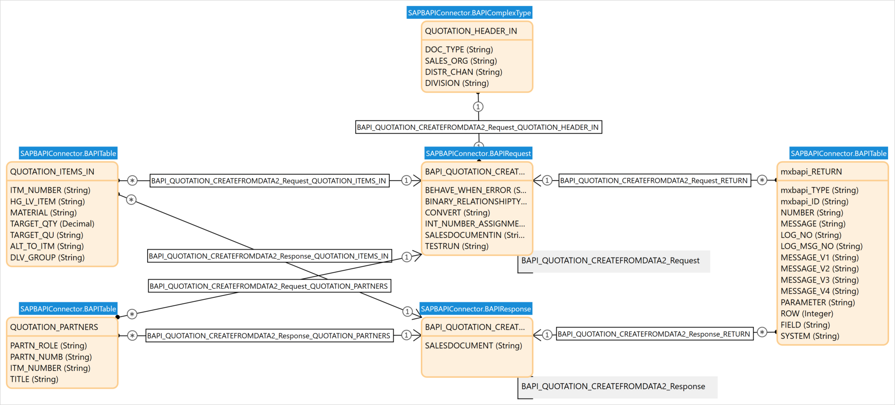

The entities in this domain model are as follows.

* BAPI_QUOTATION_CREATEFROMDATA2_Request – a specialization of  BAPIConnector.BAPIRequest. Objects of this entity will be used as the BAPIRequest for the CallBAPI action
* BAPI_QUOTATION_CREATEFROMDATA2_Response – a specialization of  BAPIConnector.BAPIResponse. Objects of this entity will be returned from a CallBAPI action.
* QUOTATION_HEADER_IN – a specialization of BAPIComplexType. Objects of this entity contain attributes used as import parameters of BAPI.
* QUOTATION_PARTNERS and QUOTATION_ITEMS_IN – specializations of BAPITable. Objects of this entity contain attributes corresponding to table parameters of BAPI_QUOTATION_CREATEFROMDATA2. As the Table parameters can be part of a BAPI request or response, entities of BAPITable have associations with both request and response entities. Here they are associated with BAPI_QUOTATION_CREATEFROMDATA2_Request and BAPI_QUOTATION_CREATEFROMDATA2_Response.

BAPI parameters which are reserved words in Mendix will be prefixed with “mxbapi_”. For example, mxbapi_RETURN in the above domain model.

## 6. Microflow Actions

The BAPI Connector provides the following microflow actions. These can be used as activities in your microflows to consume the BAPIs available in your SAP system for which you have imported Mendix BAPI modules.

**GetJCoDestination**
The action “GetJCoDestination”, is used to get the JCoDestination. Assign the values from the *JCO_Constants* described in *the* *Configure Connection Details* section above. The action returns a `Destination` object which is used when making calls to a BAPI.

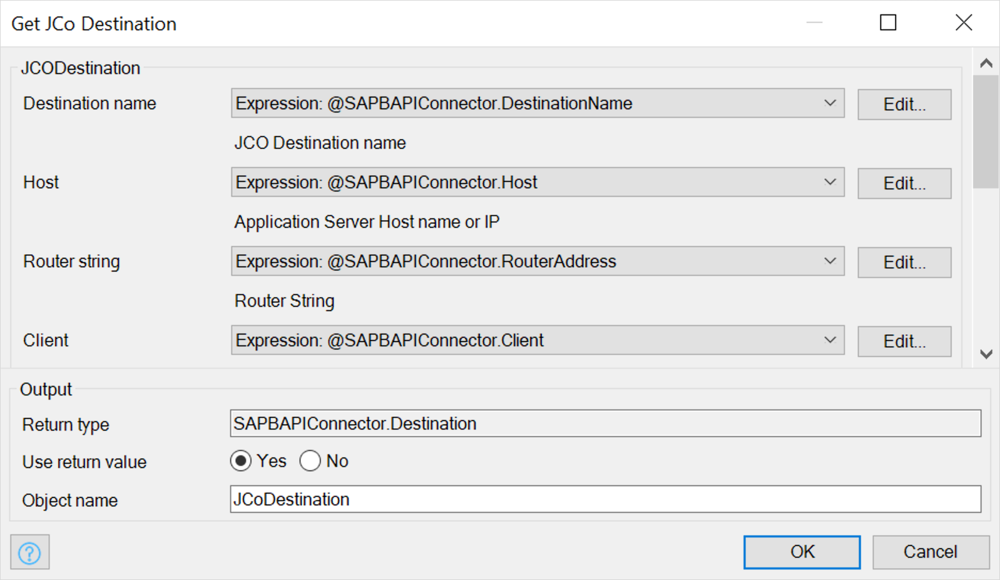

In order to set additional properties which are not available as JCO Constants, these can be set in this GetJCoDestination as “Property” Entity list. 
This example shows setting of below properties to GetJCoDestination action

    - jco.pool.maxconn
    - jco.pool.maxpoolsize
    

### 6.1 Create_BAPIExplorer
This microflow opens the BAPI explorer page which allows you to find all the BAPIs available at your JCo destination. 

For more information on how to use this microflow, see [BAPI Schema for Model Creator](https://paper.dropbox.com/doc/BAPI-Connector-Developer-Guide-h4NZrLP2cLDNaPBtKDSYr#:uid=785153047294896166617350&h2=BAPI-Schema-for-Model-Creator), below.

### 6.2 CallBAPI
This microflow action is used to call a BAPI function.

| Parameters      | Description                                                                                                                         |
| ------------------- | --------------------------------------------------------------------------------------------------------------------------------------- |
| Destination         | JCoDestination Object                                                                                                                   |
| BAPI request object | Input object to call BAPI having import parameters set. This object will be of an Entity type defined in your BAPI module domain model. |
| Response type       | Type of the BAPIRespnseObject having export parameters set. The Entity type defined in your BAPI module domain model.                |
| Commit transaction  | Setting it true will call BAPI_COMMIT_TRANSACTION to commit changes. Not required for Get calls                                         |

### 6.3 CallBAPISequence
Use this microflow action when you want to call more than one BAPI in a given order. This microflow action is only required when you want to call more than one BAPI in a single [JCoContext](https://javadoc.io/doc/com.sap.cloud/neo-java-web-api/2.35.9/com/sap/conn/jco/JCoContext.html). This executes an additional call to BAPI_COMMIT_TRANSACTION to commit the transactions in single JCOContext. 

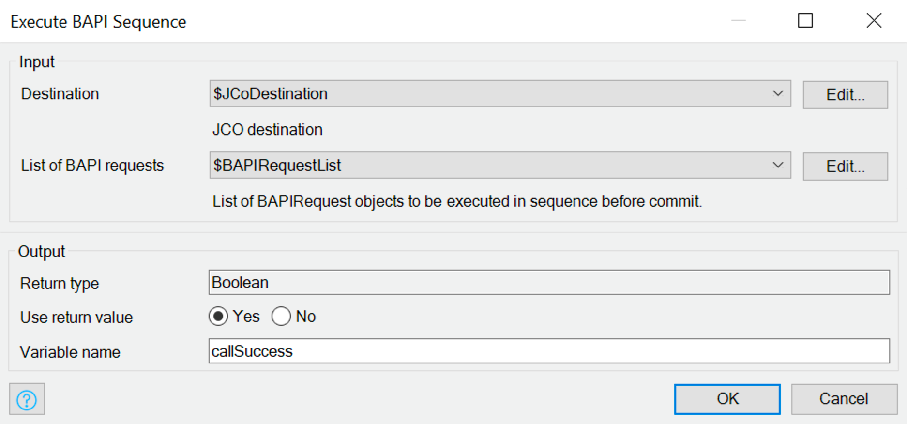

| Parameters        | Description                                                                                                                           |
| --------------------- | ----------------------------------------------------------------------------------------------------------------------------------------- |
| Destination           | JCoDestination Object                                                                                                                     |
| List of bapi requests | List of BAPIRequest Object.                                                                                                               |
| Output                | Boolean. indicates success or failure of BAPI call sequence. If you use the return value, the result will be returned as `Variable name`. |

### 6.4 GetBAPIResponse
This microflow action is used together with CallBAPISequence. It returns the response for one of the BAPIRequest objects which was in the list which was supplied to a CallBAPISequence action. You need to add this action to your microflow for every BAPIRequest object for which you need the response.

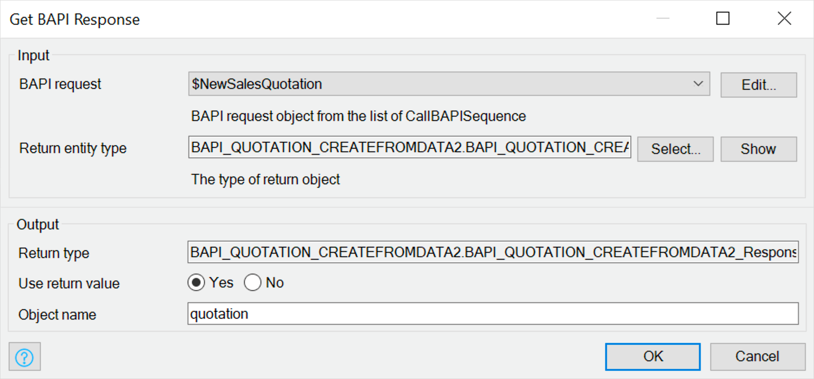

| Parameters     | Description                                                                                                                                                  |
| ------------------ | ---------------------------------------------------------------------------------------------------------------------------------------------------------------- |
| BAPI request       | One BAPIRequest object specialization supplied to the CallBAPIsequence action.                                                                                   |
| Return entity type | The BAPIResponse specialization entity associated with a BAPIRequest  entity given in request.  This entity will be defined in your BAPI module domain model. |
| Output             | The object of the entity type mentioned in Return entity type                                                                                                    |

### 6.5 TestDestinationConnection
This action can be found in the **Internal > microflows** folder of the SAPBAPIConnector module.

This action is used to verify whether your application is able to reach SAP system using the configured JCoDestination. It is not intended for use in a production app, but can be used to ensure that you have a correctly JCo Destination when developing or troubleshooting.

This can be done by calling the given internal microflow “TestConnection”. On successful connection success dialog will be displayed.

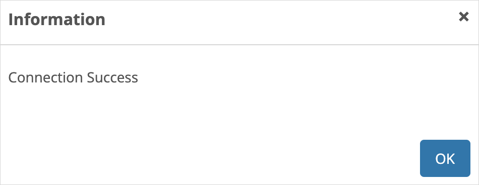

## 7 BAPI Schema for Model Creator

The BAPI Connector for SAP Solutions contains the microflow **Create_BAPIExplorer**.

This can be used to find all BAPIs from SAP systems which are available to you. You can then select the BAPI or BAPIs which you need for your app and download the schema(s) which you can convert into Mendix BAPI module(s) for use in your app.

The **Create_BAPIExplorer** microflow displays BAPIs grouped by SAP Object Name in alphabetical order. 
You can see all the BAPIs for an SAP object by clicking the `+` symbol next to the object. You can also search for the BAPI you need in the search box.

When you find a BAPI, you can click the info icon (🛈) to see details including documentation, import, export, and table parameters.

Once you find the BAPI you need, select it and click **Next** to generate the BAPI schema file. Download the schema json, which you will use in the Model Creator for SAP Solutions to create the Mendix BAPI module containing the domain model which supports this BAPI.

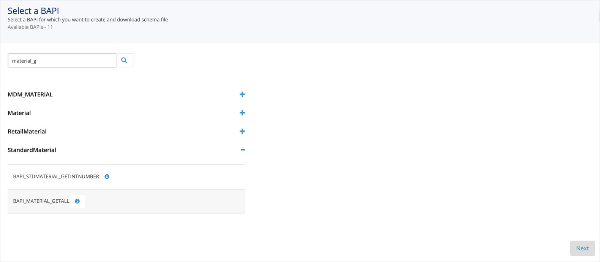

## 8 Create a Mendix BAPI Module Using the Model Creator

Use [Model Creator](https://sapodatamodelcreator-beta.mendixcloud.com/) [for SAP Solutions](https://sapodatamodelcreator-beta.mendixcloud.com/) to generate a Mendix BAPI module containing the domain model for a BAPI using the schema file downloaded from BAPI explorer. 

1. Go to [Model Creator](https://sapodatamodelcreator-beta.mendixcloud.com/) [for SAP Solutions](https://sapodatamodelcreator-beta.mendixcloud.com/) and click **SAP BAPI**.

    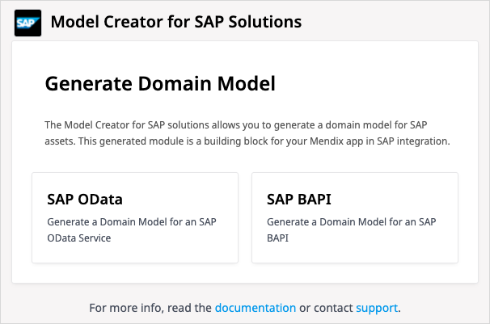

2. Upload a BAPI schema file and click **Next**.

    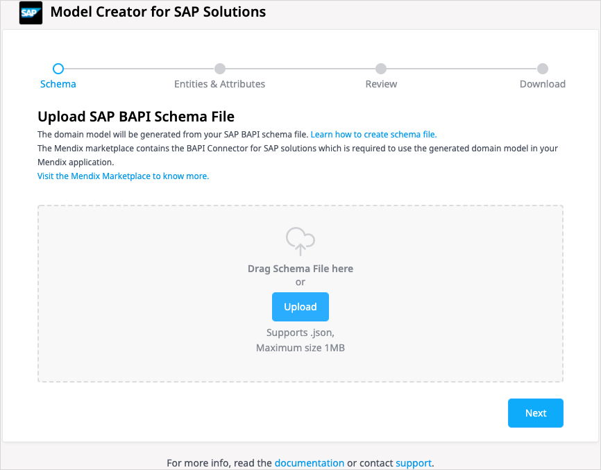

    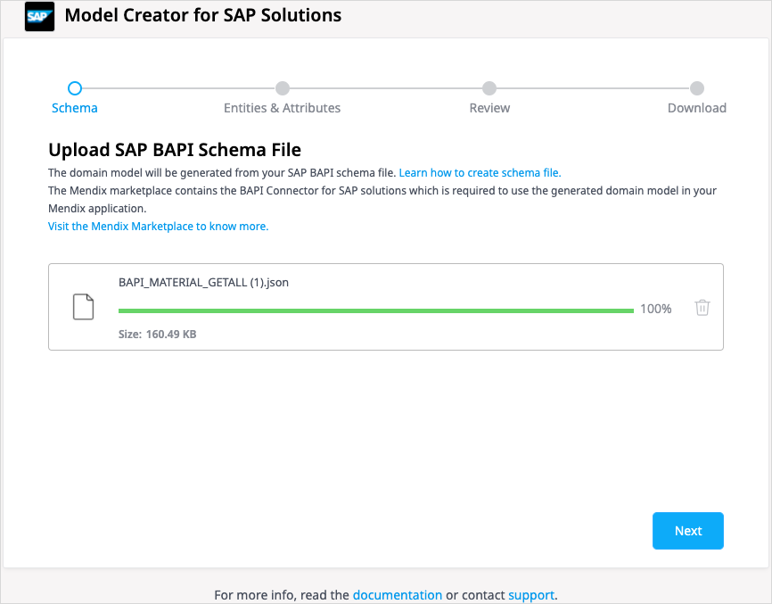

3. Select the entities you need, then click on **Included Attributes** to go to Attribute selection page for each of the entities.

    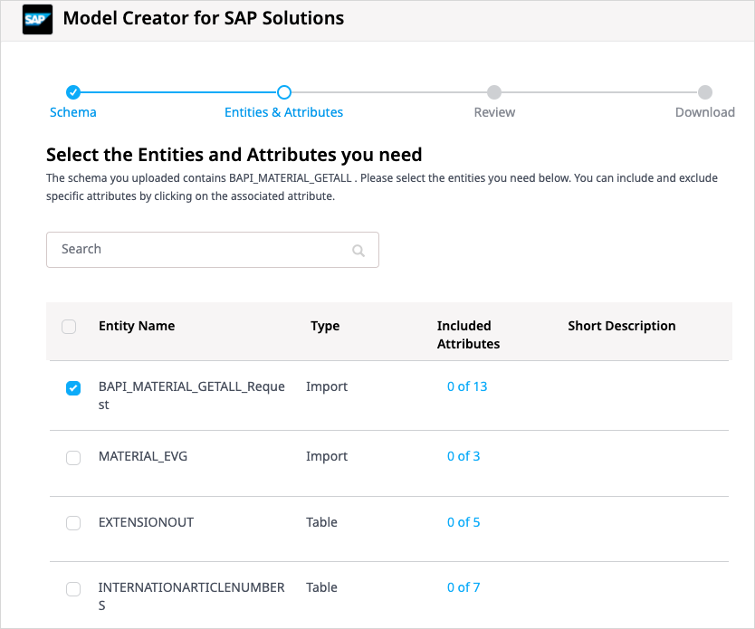

4. For each entity, select the attributes you need to include and click **Save**. The number of selected attributes number will be reflected in the **Included Attributes** column.
    
    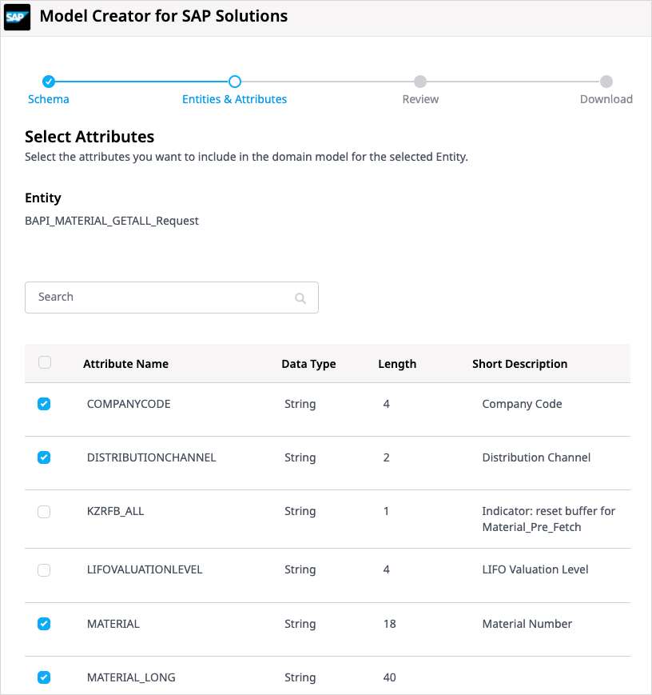

    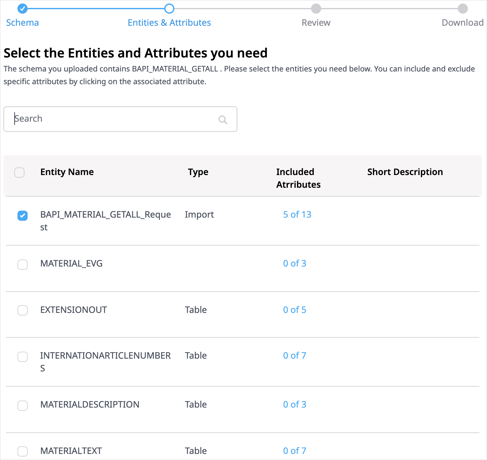

    This step must be repeated for every entity you want to include in domain model.
    
5. Once you have selected all the entities and attributes you need, click **Next** to review the selection.
6. Review selection and click **Generate Domain Model**.
    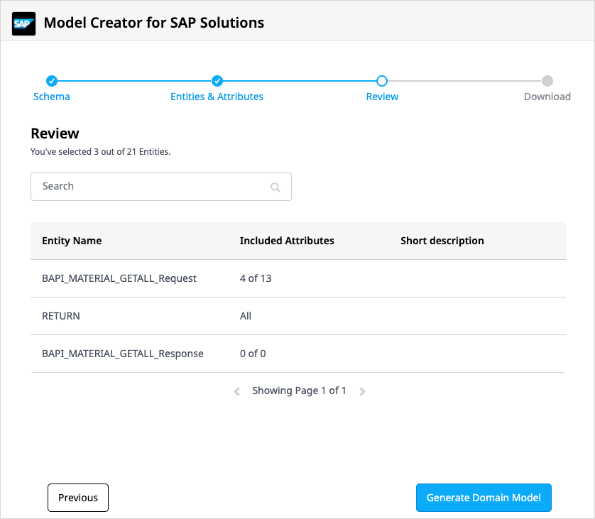

7. Click **Generate .mpk** to create the module containing the BAPI domain model.

    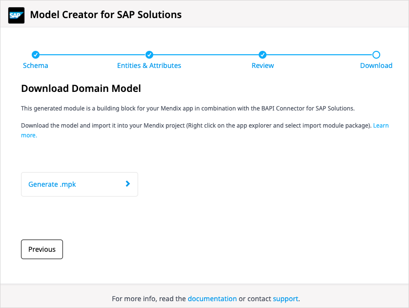

8. Click **Download** to save the Mendix BAPI module for this BAPI schema.

    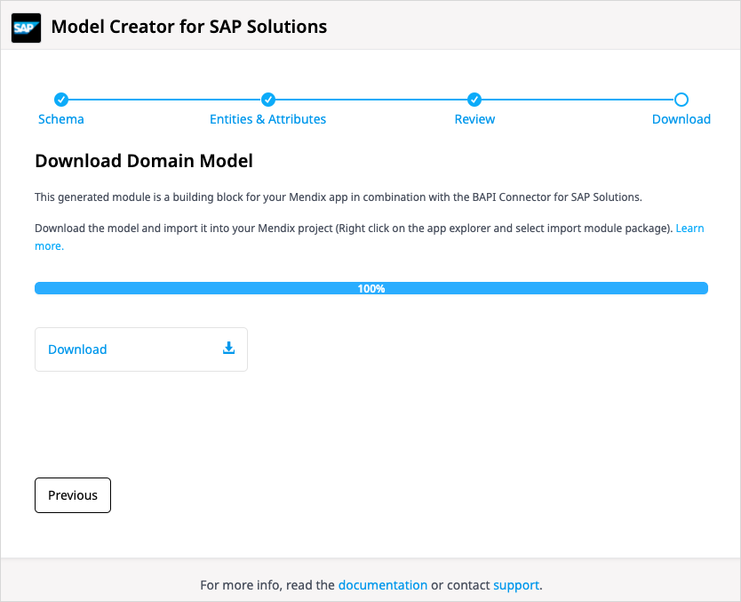

## 9 Known Issues

1. SAP Hierarchical View is unavailable in BAPI explorer.
2. We do not import the detailed documentation of the BAPI into the Mendix BAPI module documentation. Only a short description is provided. 
3. The entity description provided by BAPI is not visible in the Model Creator for SAP Solutions.
4. You can only generate a schema for BAPIs. Remote-enabled Function Modules (RFMs) available to the JCo are not listed by Create_BAPIExplorer.

{}
Minimum 1GB memory is required to run application on SAP BTP.
{}
