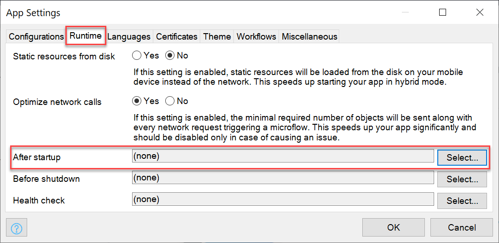
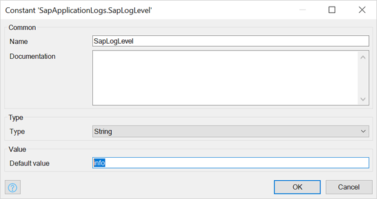

## 1 Introduction

The SAP Logger Connector allows a Mendix app to output logs in a format supported by the Kibana dashboard provided by the _SAP Cloud Platform Application Logging_ service. Without this connector, logs sent to Kibana will not have the correct structure and log level.

By using this connector, logs will be output in a JSON format with the following fields:

* `msg` - the actual log message
* `level` - the log level
* `written_at` - the log timestamp as reported by the Mendix app
* `written_ts` - the log timestamp which can be used for ordering the logs
* `stacktrace` - the stack trace attached to the log message (if it exists)

In addition, the Connector supports multiline log messages.

## 2 Getting the SAP Logger Connector

To use the SAP Logger Connector, you need to import it into your app from the App Store. For more information on importing modules from the App Store, see [Use App Store Content](/developerportal/app-store/app-store-content).

The SAP Logger Connector is available here: [https://appstore.home.mendix.com/link/app/110219/](https://appstore.home.mendix.com/link/app/110219/).

## 3 Using the Connector

To format all the log messages, the SAP Logger Connector needs to be initialized during the startup of the Mendix application<small>[1]</small>.

To initialize the logger, do the following:

1. Open **Project … > Settings** in the **Project Explorer**:

    

2. Switch to the **Runtime** tab.

3. Go to the **After startup** microflow by clicking **Show** next to the **After startup** microflow:

    

    {}If there's no existing microflow (as indicated by the text `(none)`, instead of a microflow name), click **Select…** and create a new microflow by clicking **New**:    
    {}

4. Drag and drop the **RegisterSubscriber** action at the end of the *After startup* microflow:

    

5. Double-click the **RegisterSubscriber** action make sure that **Log level** is set to the constant *SapLogLevel*:

    
	
6. Edit the constant **SapLogLevel** to select the minimum log level which you want to send to the *SAP Cloud Platform Application Logging service*. The supported log levels (case-insensitive) are `Debug`, `Trace`, `Info`, `Warning`, `Error`, and `Critical`.

    
 
Now, when the application is started, it will produce logs in the JSON format supported by Kibana.

## 4 Notes

* Due to technical limitations, the **SAP Logger Connector** is activated with a 5 second delay. This means that logging configuration is updated after the *RegisterSubscriber* action is completed.
* The *RegisterSubscriber* action checks to see if the Mendix application is running in an SAP environment with the *SAP Cloud Platform Application Logging* service. If the *SAP Cloud Platform Application Logging* service cannot be found, *RegisterSubscriber* assumes that the app is running locally and doesn't change the logging configuration.
* When log messages are generated rapidly, it is possible that Kibana will display them in the wrong order. The `written_at` field can be used to sort the log messages.
