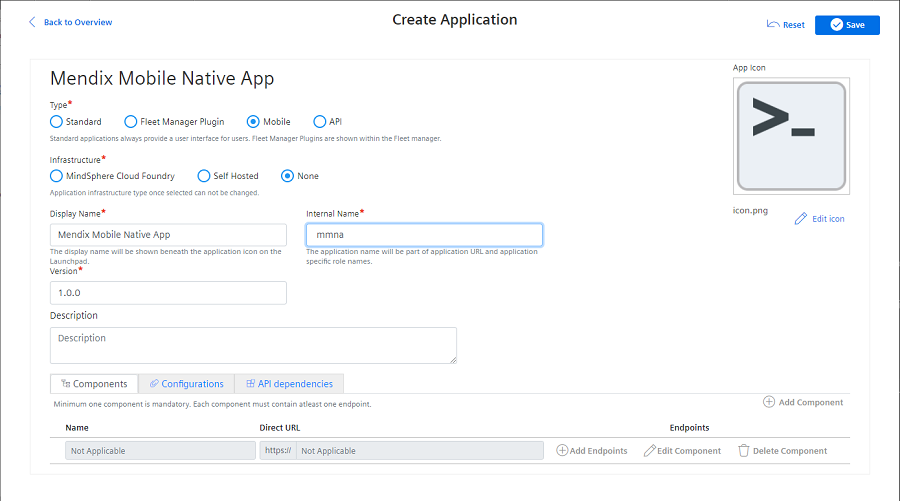
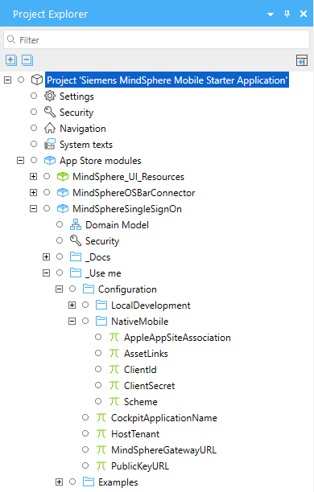
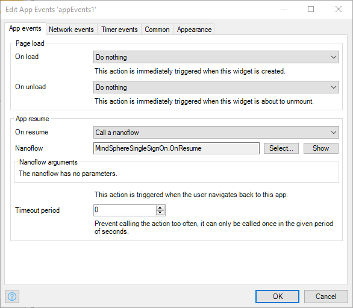
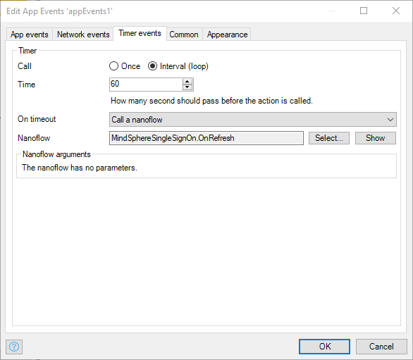

# MindSphere Mobile Native

## 1 Introduction

This documentation describes the adoptions needed to develop native mobile apps for MindSphere with Mendix. Native mobile apps do not render inside a web view - they use native UI elements. This enables fast performance, smooth animations and allow access to all native device capabilities.
Details about native mobile app development with Mendix can be found [here.](https://docs.mendix.com/howto/mobile/native-mobile)

The **Siemens MindSphere Mobile Starter Application** is an app template which is based on the **Native Mobile Quickstart** from Mendix and includes all you need to start developing a native mobile app for your MindSphere tenant.

On a phone there is no MindSphere launchpad - therefore the app has to implement the login to MindSphere itself. The template contains a login page which is shown at startup to the user.
The login itself to MindSphere on your device is done outside of our native application in a browser and your app is started after successful login via a "Deep Link". Details about this process can be found [here](https://developer.mindsphere.io/howto/howto-develop-mobile-app-with-mdsp.html) - but do not worry - the implementation is already part of the app template - just use it.
To support deep links with your app, you have to create your own [Custom Development App](https://docs.mendix.com/howto/mobile/how-to-devapps) and register a deep link corresponding to your app registration.

As prerequisite we recommend to do the [build a native mobile inspection-app](https://academy.mendix.com/link/path/66/Build-a-Native-Mobile-Inspection-App) tutorial from the academy to get yourself familiar with mobile app development. Also you should be familiar with the basics of the source code management system [git](https://git-scm.com/) as we have to update the standard [Custom Development App](https://docs.mendix.com/howto/mobile/how-to-devapps).

This documentation is structured in two main parts:

* [Setup development environment](./mindsphere-mobile-native#setupdevenv) - explains everything to get you started
* [Module Details](./mindsphere-mobile-native#moduledetails) - describes the solution and what should be considered during development

## 2 Setup development environment{#setupdevenv}

The setup of your development environment contains the following steps:

* Registration of a new mobile app in Developer Cockpit
* Create project based on "Siemens MindSphere Mobile Starter Application"
* Build your own development app
* .well-known files
* Try it out

### 2.1 Registration of your mobile app in Developer Cockpit

The **Siemens MindSphere Mobile Starter Application** template provides the functionality that a user can sign in to MindSphere from within a mobile application. To get the mobile authentication running it is necessary that the application itself is registered within MindSphere. This registration can be done with the MindSphere Developer Cockpit in some easy steps.

1. Open the *Developer Cockpit* via the Launchpad of your *Developer Tenant*.

    

1. Hit **Add application** and fill in the following:

    * ```Type = Mobile```
    * ```Infrastructure = none```
    * ```Display Name``` give your app a nice display Name. Currently this name is only used in Developer Cockpit
    * ```Internal Name``` give an internal name. We need this name later and will call this name **internal_name**
    * ```Version = 1.0.0```

    

1. Hit **Save** to save your new app.

You have to map Mendix user roles with MindSphere user roles (see more detailed discussion of MindSphere and Mendix roles and scopes in the [Roles & Scopes](https://docs.mendix.com/partners/siemens/mindsphere-module-details#rolesscopes) section of *MindSphere Module Details*). The standard template will be delivered with the roles **Admin** and **User** therefore we will create corresponding MindSphere scopes as well. If this is not matching your application please adapt accordingly.

Note: The standard template also includes the role **Anonymous** which will be used for the authentication process. Please do not register this role in the Developer Cockpit.

1. Hit **Configure** to open the **Roles and Scopes Management**.

    

1. Extend the **Application Scopes** section and hit the **Create Scope** button.

1. Add a scope with name **admin** and assign it the role **admin**.

1. Hit the **Create Scope** button again and enter **user** as scope name and assign it to the **admin** and **user** role.

1. The final result should look similar to

    

1. Hit **Back to App** and **Register** to finalize the registration at MindSphere

     

1. You will see the following popup after registration:

    

    We will need the **Client ID** and the **Client Secret** later - so copy them somewhere - we will call these constants **client_id** and **client_secret**.

1. Last step is to grant yourself the *user* or *admin* role in the **Settings** app.

    

Very good, you now have successfully registered your application within the Developer Cockpit.

Note: With the **MindSphere Mobile Starter Application** you can build applications for native mobile apps as well as for 'normal' Web applications. Right now the MindSphere Developer Cockpit supports either the registration of a mobile or a Web app but not for both together. But don't worry, this can be achieved. You only have to setup another registration in the Developer Cockpit for your Web application. With this application you also will achieve to get your application on the MindSphere Launchpad. If you have a Web part than do this registration as described in [Setting up MindSphere Launchpad](https://docs.mendix.com/developerportal/deploy/deploying-to-mindsphere#launchpad), otherwise you can skip this.

### 2.2 Start developing your app with Mendix Studio Pro

First you have to create a new Mendix Team server project based on the **Siemens MindSphere Mobile Starter Application** template.

There are some configurations need to be done in the project itself.
In the project explorer open the configuration of the app store module **MindsphereSingleSignOn**



At the moment you have to adopt these constants:

* **HostTenant** = name of your tenant

optional, in case you are not working on *eu1.mindsphere.io*

* **MindSphereGatewayURL**

* **PublicKeyURL**

and in the NativeMobile folder

* **ClientID** = **client_id** from app registration in developer cockpit

* **ClientSecret** = **client_secret** from app registration in developer cockpit

That's it for now. In the chapter [well known files](./mindsphere-mobile-native#wellknownfiles) we will also provide some values for the **AppleAppSiteAssociation** and **AssetLinks** constants.

### 2.3 Build your own development app{#buildcustomapp}

In this chapter you will create your own custom development app and register a deep link.

1. Follow the description on how to create a [Custom Development App](https://docs.mendix.com/howto/mobile/how-to-devapps) and install it on your device or emulator as described there.

1. Configure the DeepLink.

    The configuration of the deep links has to be done (at the moment) on the native part for Android and iOS separately. Currently the "Native Builder App" has limited configuration possibilities for deep links so we will enable them manually.

If not already done in step 2 clone your github repo locally in order to make the needed changes and checkout the **developer** branch.

#### 2.3.1 Android

On the the **developer** branch two files needs to be adopted:

##### AndroidMainfest.xml

Open the file `./android/app/src/main/AndroidManifest.xml` with an editor of your choice e.g. [Visual Studio Code](https://code.visualstudio.com/)

Set the `android:launchMode` in the main activity to `singleTask`

```xml
<activity
    ...
    android:launchMode="singleTask">
```

Add the following `<activity>` to the `<application>` tag:

```xml
...
<activity android:name="com.mendix.mendixnative.activity.MendixReactActivity">
    <intent-filter android:autoVerify="true">
        <action android:name="android.intent.action.VIEW" />
        <category android:name="android.intent.category.DEFAULT" />
        <category android:name="android.intent.category.BROWSABLE" />
        <data
            android:scheme="https"
            android:host="TENANT-INTERNAL_NAME-TENANT.eu1.mindsphere.io"
            android:path="/login" />
    </intent-filter>
</activity>
```

Replace the placeholders `TENANT` and `INTERNAL_NAME` in the `android:host` attribute with your tenant name (2x) and the **internal_name** of your application registration. Example given:

```xml
    <data android:scheme="https" android:host="demo-mmna-demo.eu1.mindsphere.io" />
```


That's it - commit the changed file to your developer branch, push the change to the github repo and build your developer app again. You can do this with the "Build Native App" application from Mendix Studio Pro - or build it [locally](https://docs.mendix.com/howto/mobile/native-build-locally#5-1-building-an-android-app-with-android-studio) with [Android Studio](https://developer.android.com/studio)

#### 2.3.2 iOS

We recommend to make the required changes with the help of Xcode and build your developer app locally. Details about this process can be found [here](https://docs.mendix.com/howto/mobile/native-build-locally#5-2-building-an-ios-app-with-xcode).

Ensure that you have cloned the github repo locally and have checked out the **developer** branch.

* Open a terminal at the project root directory (the folder where you have cloned the github repo) and run

    ```bash
    npm install
    ```

    to install the required dependencies.

* Change directory by running `cd ios` and run

    ```bash
    pod install
    ```

    to install the iOS dependencies. The iOS project is using CocoaPods for its dependency management. For more information on installing the CocoaPods dependency manager on your machine see CocoaPods documentation.

* Open the .xcodeworkspace in the ios folder using Xcode.

    Navigate to **Signing and Capabilities**, select as target `dev` and choose your **Team** from the drop-down menu:

    

    As with the Android Build Variants the iOS app makes use of Build Targets to switch between building a custom developer app (target *dev*) or a release app (target *nativeTemplate*).

    Adopt also the `Bundle Identifier` as it has to be unique.

    Click on `Capability` and add `Associated Domains`.

    

    Add the following domain:

    ```bash
    applinks:TENANT-INTERNAL_NAME-TENANT.eu1.mindsphere.io
    ```

    Replace the placeholders `TENANT` and `INTERNAL_NAME` with your tenant name (2x) and with the **internal_name** of your application registration in the developer cockpit e.g.

    ```bash
    applinks:demo-mmna-demo.eu1.mindsphere.io
    ```

    

* In the `project navigator` open the file `nativeTemplate/NativeTemplate/AppDelegate.m`

  Add the following import

  ```objc
  #import "React/RCTLinkingManager.h"
  ```

  and the method `continueUserActivity`

  ```objc
  - (BOOL)application:(UIApplication *)application continueUserActivity:(NSUserActivity *)userActivity
      restorationHandler:(void (^)(NSArray * _Nullable))restorationHandler
  {
      return [RCTLinkingManager application:application
          continueUserActivity:userActivity
          restorationHandler:restorationHandler];
  }
  ```

* From the drop-down menu choose `dev` and the device you would like to run the app on, then click the play button to
    start a build for your app:

    

    After the build succeeds the app should be starting on the selected device.

### 2.4 Well Known Files / Associate website{#wellknownfiles}

The configuration of the .well-known files is a prerequisite (for ios) to work.
On Android this is optional. If provided the phone will not ask which app should be opened for the deep link.

#### For iOS

In Mendix Studio Pro open the *NativeMobile* folder in the **MindSphereSSO** module and adopt the constant
**AppleAppSiteAssociation**  with

```json
{
    "applinks": {
        "apps": [],
        "details": [
            {
                "appID": "TEAM_ID.BUNDLE_IDENTIFIER",
                "paths": ["/login"]
            }
        ]
    }
}
```

replace the value of the **appID** property with your **TEAM_ID** and your **BUNDLE_IDENTIFIER**.
Do not remove the "." between the two parts.

Info: You can find the **TEAM_ID** in the [Apple developer center](https://developer.apple.com/membercenter). Log into the web site, click on Membership, then look for Team ID in the Membership Information section.

Attention: You have to remove all `/r/n` from the json object before saving the constant in Mendix Studio Pro. This could be done for example [here](http://jsoneditoronline.org/)

#### For Android

To generate the needed file you have to use Android Studio. In the chapter [build your own development app](./mindsphere-mobile-native#buildcustomapp) you have already cloned your github repo locally. Use the developer branch.

1. Open the **root** folder of this repo in a terminal and if not already done run `npm install`.

    Note: during our tests we faced issues when one of the patches should be applied

    

    This can be fixed by changing the line feed from the file **patches/react-native-image-picker+2.3.4.patch** from **CR LF** to **LF**. This can be done with editors like Visual Studio Code easily.

1. Start Android Studio and open the **android** folder as a new project. Android Studio automatically starts some build process, for the next step you have to wait till these are done.

1. Ensure to use the build variant **devDebug**

1. Open the **File** menu and hit the **Sync Project with Gradle Files**.

   

1. Wait till the Gradle sync is ready and Android Studio is activating the **App Links Assistant** in the **Tools** menu.

1. Open the **App Links Assistant** from the **Tools** menu.

   

1. To generate your **assetlinks.json** file, hit the **Generate Digital Asset Links file** button at step 3 in the **App Links Assistant**.

   

1. Copy the content from the preview window and use it as the value for the constant **AssetLinks**.
   You find this constant in Mendix Studio Pro in the **MindSphereSSO** module.

   Attention: You have to remove all `/r/n` from the json object before saving the constant in Mendix Studio Pro. This could be done for example [here](http://jsoneditoronline.org/)

#### Make your .well-known files public available

The **Siemens MindSphere Mobile Starter Application** implements a rest endpoint which serves the .well-known files for you. Press the **Run** button to deploy your app to the Mendix cloud.

Once it is deployed adopt the app registration in the developer cockpit for the .well-known files.

* Open your app in the developer cockpit and press **Deregister**.

* Click on the tab **Configuration** and fill in the values for android and ios:

    * android = `https://SANDBOXURL/.well-known/assetlinks.json`
    * ios = `https://SANDBOXURL/.well-known/apple-app-site-association`

* Replace **SANDBOXURL** with your deployment URL.

* Click on **Register** again to save the changes to MindSphere.

* Try out if the files are served correctly by open a browser at the following URL:

    ``` bash
    https://TENANT-INTERNAL_NAME-TENANT.eu1.mindsphere.io/.well-known/assetlinks.json
    ```

    and

    ``` bash
    https://TENANT-INTERNAL_NAME-TENANT.eu1.mindsphere.io/.well-known/apple-app-site-association
    ```

    Replace **TENANT** (2x) and **INTERNAL_NAME** with your values.

### 2.5 Try out your application

Well done, you should now be ready to start your application for the very first time on your mobile phone. For this press the **Run Locally** button so that your own native application can connect to your Mendix Studio Pro.
If your application is up you should see the login page of the Anonymous user role.


Please provide your developer tenant name and hit the **Login** button.
The default browser of your phone will open and show you the MindSphere credential page where you can sign in with your MindSphere credentials.


After a successful login, your app will be started again and create your session. At the end your native home page comes up.

Note: if you ever have trouble by signing in to your application it is a good idea to clear the cookies of your mobile browser. Please see documentation of your browser for further information.

### 2.6 Next steps

You now have a blank application which is supporting the authentication for your specific MindSphere application, which is an excellent starting point for your further app development. We recommend also to visit the basic tutorial for MindSphere web applications [Build a MindSphere app with Mendix](https://gettingstarted.mendixcloud.com/link/path/80/Build-a-MindSphere-app-with-Mendix) to learn more about MindSphere application development in general.

Most important will be to enhance your application with MindSphere API calls to use the IoT capabilities of MindSphere. For this you have to consider the following two steps:

* Authorize your MindSphere API calls.
* Add MindSphere API roles to your existing MindSphere gateway registration.

#### 2.6.1 Authorize your MindSphere API calls

With each MindSphere API call you have to assure that the corresponding user token is part of the request. Do this by adding the **MindSphere Access Token** node before your REST calls and set the **Authorization** header accordingly.


#### 2.6.2 Extend your application registration with MindSphere API roles

As of now your application has the user roles **admin** and **user**, but none of those roles has the rights to access MindSphere APIs. Do the following steps to achieve this.

1. Open the *Developer Cockpit* via the Launchpad of your *Developer Tenant*.

    

1. Select your application.

1. Click the **Configure** button to open the roles tab.

    

1. Open the **MindSphere API Roles section** and press the **Add MindSphere API Role** button.

    

1. Select the corresponding role you need for your particular API call and assign it to your user roles e.g.

    

Note: your application has now been updated to be allowed for the API calls, to get this active for your local test session you have to enforce a logout of the user. For this please press the logout button within your mobile application and clear the cookies within your mobile browser. Afterwards sign in again. The provided token includes the added API roles now.

## 3 Module Details{#moduledetails}

The **Siemens MindSphere SSO** module provides a couple of nanoflows which should be used to achieve a seamless integration into MindSphere. This nanoflows can be found in the folder **_Use me/NativeMobile** of the SSO module. The **Siemens MindSphere Mobile Starter Application** contains the SSO module and is using the provided nanoflows. The starter template just needs to be configured to get an application running. Nevertheless we like to explain some details here.

### 3.1 Authentication

The authentication is based on the usage of **Anonymous** users and is enabled in the project securities.


When the application starts it will provide the **Login** page from the **Login** folder where the user can provide the tenant name he likes to authenticate against. To get this work, the **Login** page is registered as default homepage for the Anonymous role.


A click on the **Sign in** button calls the nanoflow **ACT_Login** which will open the browser so that the user can provide his credentials.
After a successful login, the deep link handler of the SSO module will fetch the MindSphere Mobile Token and will start the user session accordingly.
At the end of the authentication process the app will be restarted and provide the home page of the corresponding user role.

If something went wrong during the authentication process, the corresponding error code will be visualized via the Login page.

### 3.2 MindSphere APIs and Token Handling

When you have already developed a Web application for MindSphere you are aware that you need the **Access Token** node included and used with your REST calls.


 The very good news for native mobile is, this do not change. You can use the very same microflows for Web apps and native apps to fetch MindSphere APIs.

If you are new to MindSphere app development please checkout [MindSphere Development Considerations](https://docs.mendix.com/partners/siemens/mindsphere-development-considerations) to learn more about this topic.

To support mobile native applications, MindSphere provides a special mobile token, which is called MindSphere Mobile Token. As a Mendix developer you luckily don't have to take care much on this token as this has been done in the **Siemens MindSphere Mobile Starter Application**, but it is maybe worth to have some details to understand the impact on your application better.

Actually the Mobile Token is not only one token. It contains two tokens

* the **Access Token** which you need to fetch the MindSphere APIs which has an expiration time of half a hour and
* the **Refresh Token** which will be used to refresh the Access Token when this expires. The refresh token itself is valid for 12hours, latest after this time the user has to sign in again into the application to acquire a new token.

As tokens can expire, there are some events on the lifecycle of a mobile app which needs to be considered. At each event the tokens has to be checked and the result will be one of the following three:

1. The token is still valid and nothing has to be done.
2. The access token which is only valid for half an hour is no longer valid but the refresh token is still valid. In this case refreshing your access token is sufficient.
3. Both the access token as well as the refresh token has expired. In this case the user will be logged out and has to sign in again.

As you need a valid MindSphere token to call MindSphere APIs it is very important that this checks are done before you call a flow to access a MindSphere API. The **Siemens MindSphere Mobile Starter Application** helps you to ensure this by taking care of the following events:

* Application startup: The standard mobile homepage of the Native Mobile Application already has a Data view calling the nanoflow **OnSessionStartup**. OnSessionStartup will take care of the checks mentioned above.

    

* Application resume: Within the provided Data view also an **App events** element is placed where the **On resume** event will call the nanoflow **MindSphereSingleSignOn.OnResume** which do the checks mentioned above.

    

* Application gets online: Same as on application resume but now the **On online** event of the App events will call the OnResume nanoflow.

* Periodically your token needs to be checked when your app is running. Therefore the **MindSphereSingleSignOn.OnRefresh** nanoflow is configured to be called every minute.

    

For sure you will like to change the provided home page fitting to the rest of your home page. Please do this, but always make sure not to delete the initial provided Data view and App events.

### 3.3 Additional user role home pages

If you like to create new home pages for different user roles, please ensure that it includes the Data view with the **OnSessionStartup** nanoflow and the **AppEvents** as provided via the default mobile home page as well. This ensures that the MindSphere token handling working properly for this user roles as well.
