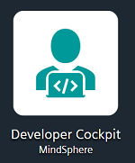
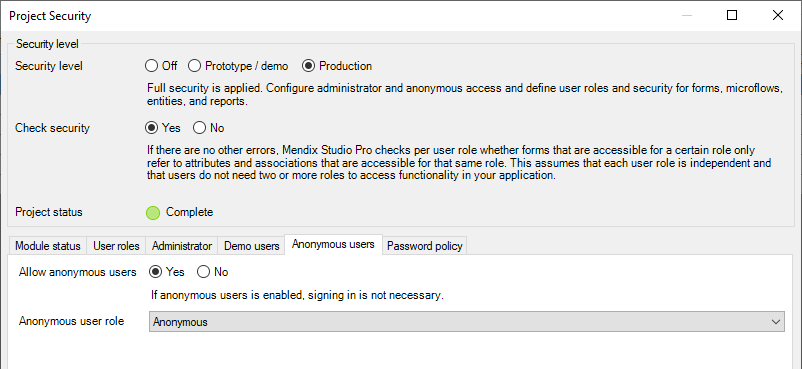

## 1 Introduction

When developing a Mendix app which will be deployed to MindSphere, there are a number of extra things you need to take into consideration. The following subjects are discussed below:


## Registration of your mobile app in Developer Cockpit
1. Open the *Developer Cockpit* via the Launchpad of your *Developer Tenant*.

    

1. Hit **Add application** and fill in the following:

    * ```Type = Mobile```
    * ```Infrastructure = none```
    * ```Display Name``` give your app nice display Name. Currently this name is only used in Developer Cockpit
    * ```Internal Name``` give an internal name. We need this name later and will call this name **internal_name**
    * ```Version = 1.0.0```

    

1. Hit **Save** to save your new app.

You have to map Mendix user roles with MindSphere user roles (see more detailed discussion of MindSphere and Mendix roles and scopes in the [Roles & Scopes](mindsphere-module-details) section of *MindSphere Module Details*). The standard template will be delivered with the roles **Admin** and **User** therefore we will create MindSphere corresponding MindSphere scopes as well. If this is not matching your application please adapt accordingly.

{}

The standard template also includes the role **Anonymous** which will be used for the authentication process. Please do not register this role in the Developer Cockpit.

{}

1. Hit **Configure**  > to open the **Roles and Scopes Management**

1. Extend the **Application Scopes** section and hit the **Create Scope** button.

1. Add as scope name **admin** and assign it the role **admin**.

1. Hit the **Create Scope** button again and enter **user** as scope name and assign it to the **admin** and **user** role.

1. The final result should looks like
    

1. Hit **Back to App** and **Register**  the app at Mindgate.
You will see the following popup after registration:

    

    We will need the **Client ID** and the **Client Secret** later - so copy them somewhere - we will call these constants **client_id** and **client_secret**.

1. Last step is to grant yourself the *user* or *admin* role in the **Settings** app.

    

Very good, you know have successfully registered your application within the Developer Cockpit.

Note: With the **MindSphere Mobile Starter Application** you can build applications for native mobile apps as well as for 'normal' Web applications. Right now Developer Cockpit supports only the registration of a mobile or a Web app but not for both together. But don't worry, this can be achieved. You only have to setup another registration in the Developer Cockpit for your Web application. With this application you also will achieve to get your application on the MindSphere Launchpad. If you have a Web part than do this registration as described in [Setting up MindSphere Launchpad](/developerportal/deploy/deploying-to-mindsphere)

## Module Details

The **Siemens MindSphere SSO** module provides a couple of nanoflows which should be used to achieve a seamless integration into MindSphere. This nanoflows can be found in the folder **_Use me/NativeMobile** of the SSO module. The **Siemens MindSphere Mobile Starter Application** contains the SSO module and is using the provided nanoflows. The starter template just needs to be configured to get an application running. Nevertheless we like to explain some details here.

### Basic Authentication

The authentication is based on the usage of **Anonymous** users and is enabled in the project securities.


When the application starts it will provide the **Login** page from the **Login** folder where the user can provide the tenant name he likes to authenticate against. To get this work, the **Login** page is registered as default homepage for the Anonymous role.


When the **Sign in** button will be clicked, the nanoflow **ACT_Login** will be called which will open the browser so that the user can provide his credentials.
After a successful login, the Deep Link handler of the SSO module will fetch the MindSphere Mobile Token and will start the user session accordingly.
At the end of the authentication process the app will be restarted and provide the home page of the corresponding user role.

### MindSphere APIs and Token Handling

When you have already developed a Web application for MindSphere you are aware that you need the **Access Token** node included and used with your REST calls. The very good news for native mobile is, that this doesn't need to change. You can use the very same microflows for Web apps and native apps to fetch MindSphere APIs.

If you are new to MindSphere app development please checkout [MindSphere Development Considerations](mindsphere-development-considerations) to learn more about this topic.

To support mobile native applications, MindSphere provides a special mobile token, which is called MindSphere Mobile Token. As a Mendix developer you luckily don't have to take care much on this token as this has been done in the MindSphere Mobile Starter Application, but it is maybe worth to have some details to understand the impact on your application better.

Actually the Mobile Token is not only one token. It contains two tokens

* the **Access Token** which you need to fetch the MindSphere APIs which has an expiration time of half a hour and
* the **Refresh Token** which will be used to refresh the Access Token when this expires. The refresh token itself is also only valid for 12hours, latest after this tme the user has to sign in again into the application to acquire a new token.

As tokens can expires, there are some events on the lifecycle of a mobile app which needs to be considered. At each event the tokens has to be checked and the result  will be one of the following three:

1. The token is still valid and nothing has to be done.
2. The access token which is only valid for half an hour is no longer valid but the refresh token is still valid. In this case just the access token has to be refreshed.
3. Both the access token as well as the refresh token has become invalid. In this case the user will be logged out and has to be sign in again.

As you need a valid MindSphere token do call MindSphere APIs it is very important that this checks are done before you call a flow to access a MindSphere API. The Siemens MindSphere Mobile Starter Application helps you to ensure this by taking care of the following events:

* Application startup: The standard mobile homepage of the Native Mobile Application already has a Data view calling the nanoflow **OnSessionStartup**. OnSessionStartup will take care of the checks mention above.

    

* Application resume: Within the provided Data view also an **App events** element is placed where the **On resume** event will call the nanoflow **MindSphereSingleSignOn.OnResume**.
    

* Application gets online: Same as on application resume but now the **On online** event of the App events will call the OnResume nanoflow.

* Periodically your token needs to be checked when your app is running. Therefore the **MindSphereSingleSignOn.OnRefresh** nanoflow is configured to be called every minute.

    

For sure you will like to change the provided home page fitting to the rest of your home page. Please do this, but always make sure not to delete the initial provided Data view and App events.

### Additional user role home pages

If you like to create new home pages for different user roles, please assure that it includes the Data view with the **OnSessionStartup** nanoflow and the **AppEvents** as provided via the default mobile home page as well. This ensures that the MindSphere token handling working properly for this user roles as well.

* .well-known files
* Login flow - usage of "Anonymous" / "User"
* Usage of "AppEvents on customer Home Page
* Limitations on lifetime of access-token / refresh-token
* Make MindSphere API calls

