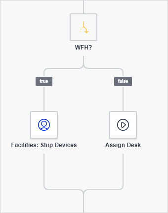

## 1 Introduction

A decision is an element that makes a choice based on a condition and follows one and only one of the outgoing paths. For example, you need to use a decision to follow different paths when a new hire works remotely or when they work from the office:

## 2 Properties

An example of decision properties is represented in the image below:

Decision properties consist of the following sections:

* [General](#general)
* [Outcome](#outcome)

### 2.1 General Section {#general}

#### 2.1.1 Caption

The **Caption** describes what happens in this element. It is displayed in the workflow element to make the workflow easier to read and understand without needing to add annotations.

#### 2.1.2 Condition

**Condition** is configured based on an [expression](expressions). The expression should result in a Boolean or an enumeration.

For the expression resulting in a Boolean, two paths are possible: **true** and **false**. For example, you can use the expression resulting in a Boolean if you want to follow different paths if a new employee is working from home (and either send their devices to the home address or set up a workstation in the office).

The number of conditions available for the enumeration type depends on the corresponding enumeration values. There is also the *empty* condition available for enumeration: if the enumeration parameter or an attribute of an object is unassigned, the sequence flow with the caption **(empty)** is followed. For example, you have several requests with low or high priority. The ones having high priority follow one path and should be approved by the Management team. Low priority requests follow a different path and can be approved by the Administration department. The requests that have no priority specified follow an empty path and can have a user task to assign priority first.   

### 2.2 Outcomes Section {#outcome}

**Outcomes** depends on the condition of the decision. For example, for the Boolean, you have **true** and **false** outcomes, and for the enumeration: an outcome per each enumeration value and an empty one when the value is unassigned.  

## 3 Read More

* [Parallel Split](parallel-split)