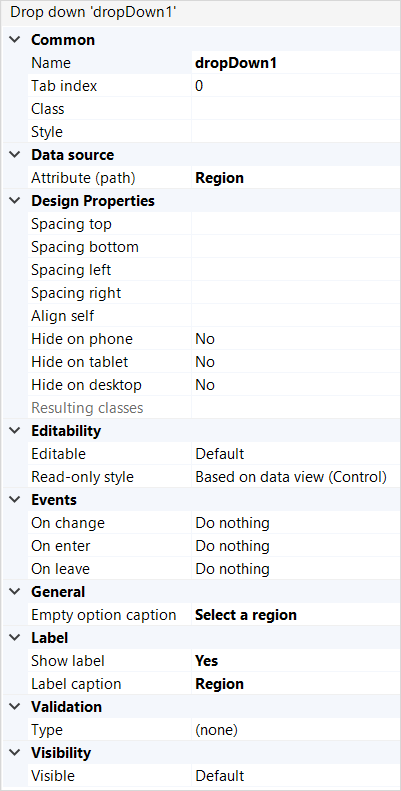
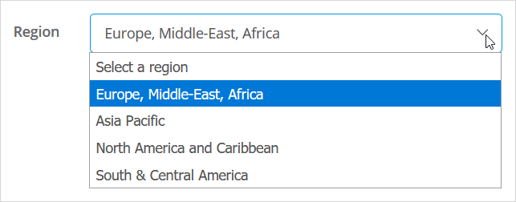

## 1 Introduction

A **drop-down** is used to display and, optionally, allow the end-user to edit the value of an attribute of [data type](data-types) *enumeration*.

A drop-down must be placed in a [data widget](data-widgets) and displays an attribute of the object(s) retrieved by that widget. The name of the attribute to be displayed is shown inside the drop-down, between square brackets, and colored blue.

{}
A drop-down should not be confused with a [reference selector](reference-selector), which is used to select an [association](association-landing-page) to another object.
{}

For example, the following drop-down allows the end-user to see, and set, the **Region** to which a customer is allocated. The possible values for **Region** are held in an enumeration.

## 2 Properties

An example of drop-down properties is represented in the image below:

{}
{}

Drop-down properties consist of the following sections:

* [Common](#common)
* [Data source](#data-source)
* [Design Properties](#design-properties)
* [Editability](#editability)
* [Events](#events)
* [General](#general)
* [Label](#label)
* [Validation](#validation)
* [Visibility](#visibility)

### 2.1 Common Section{#common}

{}

### 2.2 Data Source Section{#data-source}

{}

### 2.3 Design Properties Section{#design-properties}

{} 

### 2.4 Editability Section{#editability}

{}

### 2.5 Events Section{#events}

#### 2.5.1 On Change{#on-change}

The on-change property specifies an action that will be executed when leaving the widget, either by using the <kbd>Tab</kbd> key or by clicking another widget, after the value has been changed.

{}

#### 2.5.2 On Enter

The on-enter property specifies an action that will be executed when the widget is entered, either by using the <kbd>Tab</kbd> key or by clicking it with the mouse.

{}

#### 2.5.3 On Leave

The on-leave property specifies an action that will be executed when leaving the widget, either by using the <kbd>Tab</kbd> key or by clicking another widget.

This differs from the [On change](#on-change) property in that the event will always be triggered, even if the value has not been changed.

{}

### 2.6 General Section{#general}

#### 2.6.1 Empty Option Caption

Empty option caption is the text that is shown for the empty option in the drop-down shown to the end-user. This is a translatable text. For more details, see [Translatable Texts](translatable-texts).

Adding a caption for the empty option improves the user experience of your application. It also helps end-users using a screen-reader to operate the application easily.

For example, the drop-down that allows the end-user to select the region allocated to a customer, where the possible values for **Region** are held in an enumeration, could have the caption `Select a region`.

### 2.7 Label Section{#label}

{}

### 2.8 Validation Section{#validation}

{}

### 2.9 Visibility Section{#visibility}

{}

## 3 Read More

*   [Data View](data-view)
*   [Attributes](attributes)
