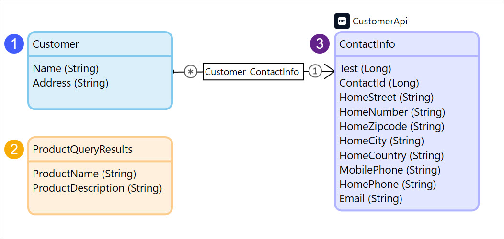
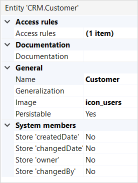
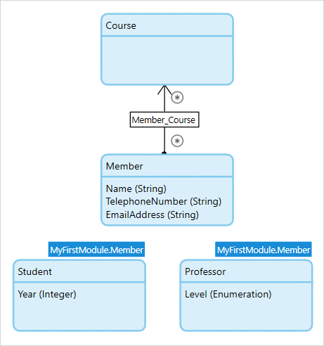

## 1 Introduction

An **entity** usually represents a class of real-world objects, such as customers, invoices, CDs, etc. An instance of an entity is called an object.

For example, the object representing the CD 'Exodus' could be an instance of the entity 'CD'.

 

The properties or features of an entity are described using [attributes](attributes). An attribute represents a small piece of information about an entity, such as the name or birth date of a person.

For example, you have a collection of CDs like the one in the table below:

| Title | Artist |
| --- | --- |
| How to Dismantle an Atomic Bomb | U2 |
| Exodus | Bob Marley & The Wailers |

The rows in the table are CDs. The type of the two rows is *CD* and this is the entity name. A specific CD like *How to Dismantle an Atomic Bomb* from the band *U2* is called an object of the entity *CD*. Characteristics like the title and artist are called attributes.

## 2 Type of Entities {#entity-types}

The entity type defines how the data is handled and there are two types:

1. [Persistable entity](#persistable-entity) 

2. [Non-persistable entity](#non-persistable-entity)

    

### 2.1 Persistable Entity {#persistable-entity}

When an entity is declared persistable, a database table is created for the entity. These type of entities are colored *blue* in the domain model. For more information on persistable entities, see [Persistability](persistability).

### 2.2 Non-Persistable Entity {#non-persistable-entity}

Non-persistable entities are stored in the runtime memory and never get committed to the database. These type of entities are colored *orange* in the domain model. For more information on persistable entities, see [Persistability](persistability).

### 2.3 External Entity {#external-entity}

{}
Mendix Data Hub is a premium product and only accessible to users that have a license.
{}

{}[what about Freemium users and those with inherited consumed OData services?]{}

An external entity connects to shared assets through the [Data Hub Catalog](/data-hub/data-hub-catalog). External entities are added to the domain model through the [Data Hub pane](data-hub-pane). These entities are displayed as purple entity containers in the domain model. 

When entities from the Data Hub Catalog are consumed in an app module, it is possible to make local changes to the entity that only affect how the data is used and presented in the local app. 

For more information on external entities in your app project, see [External Entities](external entities). For more information on using registered OData services, see [Consuming from the Data Hub](data-hub/data-hub-catalog/consume).

{}
Compared to local entities, external entities have a limited number of properties that can be edited locally, many of which are read-only, as they are defined in the originating app.
{}

## 3 Properties {#properties}

An example of the entity properties is represented in the image below:

{}
{}

Entity properties consist of the following sections:

* [Access rules](#access-rules)
* [Documentation](#documentation)
* [General](#entities-general-properties)
* [System members](#system-members)

{}
For more information, see the [Properties of External Entities](external-entities#properties) section of *External Entities*.
{}

### 3.1 Access Rules Section {#access-rules}

#### 3.1.1 Access Rules

For more information on access rules, see [Access Rules](access-rules).

### 3.2 Documentation Section {#documentation}

#### 3.2.1 Documentation {#documentation-property}

This allows you to describe aspects of the entity which may be useful to you or other team members when using the entity within the app.

### 3.3 General Section {#entities-general-properties}

#### 3.3.1 Name {#name}

The name property defines the name of the entity. This name is used to refer to the entity in forms, microflows, queries, constraints, etc.

The name has to be unique only within a module domain model. You can have two entities with the same name, provided they are in the domain models of different modules.

#### 3.3.2 Generalization {#generalization}

An entity can be a more specialized version of a general entity. This means that the specialized entity has all the attributes, associations, events, and other properties of the more general entity. Using the generalization property you can specify which entity is the generalization of the entity. For example, the **Car** entity could have **Vehicle** as its generalization.

The generalization specifies the entity from which a specific entity derives its properties (attributes, associations, events, and other properties). It is used when entities have common attributes and can be generalized using a super entity. In object oriented programming (OOP) the generic term for generalization and specialization is called **inheritance**.

When an entity that has a specialization is retrieved (for example, in a data grid or microflow), specializations of that entity are included in the result. When a specialization is retrieved, its generalizations are not included in the result. Using the previous example, if **Vehicle** is retrieved, the resulting set will contain objects of types **Vehicle** and **Car**. If **Car** is retrieved, only objects of **Car** are included in the result set.

One important use of this feature is to derive functionality from the **System** module (for example, images from the **Image** entity and files from the **FileDocument** entity).

For example, this property can be used in a situation where, you have a **Student** entity and a **Professor** entity, which have some generic properties. They both have a name, telephone number, and email address and can be a member of one or more courses. Both entities are *generalized* in the **Member** entity. Conversely, this means that the **Member** entity is *specialized* in the **Student** and **Professor** entities.

For more information, and a discussion on the relative merits of using generalization or associations, see [Generalization vs 1-1 Associations](generalization-and-association).

#### 3.3.4 Image {#image}

The image property can be used to associate the entity with an image. In the domain model this image is visualized in the right-top corner of the entity representation. The image is also visible in entity selection windows and in the Connector. For instance, when selecting an entity for a data view.

#### 3.3.5 Persistable

Define whether instances of this entity can be stored in the database. For more information, see [Persistability](persistability).

### 3.4 System Members Properties{#system-members}

#### 3.4.1 Store 'createdDate' 

This property defines whether the entity contains the system attribute 'createdDate'. This is an attribute of type **Date and time** that stores the date and time when the object was created. The value of this attribute is automatically set by the server upon creating an object.

| Option | Description |
| --- | --- |
| True | Entity contains the system attribute 'createdDate'. |
| False *(default)* | Entity does not contain the system attribute 'createdDate'. |

#### 3.4.2 Store 'changedDate' 

This property defines whether the entity contains the system attribute 'changedDate'. This is an attribute of type **Date and time** that stores the most recent date and time when the object was changed.

| Option | Description |
| --- | --- |
| True | Entity contains the system attribute 'changedDate'. |
| False *(default)* | Entity does not contain the system attribute 'changedDate'. |

{}
The 'changedDate' property is only updated on real changes. Simply changing and committing an entity with the same attribute values does not update 'changedDate'.
{}

#### 3.4.3 Store 'owner' 

This property defines whether the entity has the system association 'owner'. This is an association to the system entity 'User' that (initially) stores a reference to the user that created the object. This association is automatically set by the server upon creating an object.

| Option | Description |
| --- | --- |
| True | Entity has the system association 'owner'. |
| False  *(default)* | Entity does not have the system association 'owner'. |

#### 3.4.4 Store 'changedBy' 

This property defines whether the entity has the system association 'changedBy'. This is an association to the system entity 'User' that stores a reference to the user that most recently changed the object.

| Option | Description |
| --- | --- |
| True | Entity has the system association 'changedBy'. |
| False *(default)*  | Entity does not have the system association 'changedBy'. |

## 4 Tabs in the Entity Dialog Box{#dialog-box}

You can also edit an entity by opening the entity properties dialog box.

In addition to the properties described above, there are also tabs which allow you to edit the following:

*   [Attributes](attributes)
*   [Associations](associations)
*   [Validation Rules](validation-rules)
*   [Event Handlers](event-handlers)
*   [Indexes](indexes)
*   [Access Rules](access-rules)

See the detailed pages for each of these tabs for more information.
