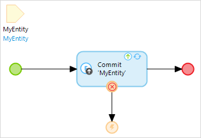

{}
This activity can only be used in microflows, not in nanoflows.
{}

## 1 Introduction

An error event defines where a microflow will stop and throw an error that occurred earlier. If you call a microflow, you may want to know whether any errors occurred within the microflow or not. This event throws the error again, so the caller of the microflow can catch them. All database actions within the current transaction will be rolled back.

{}

You can only use an error event if an error is in scope: Studio Pro does not accept it if you connect the normal execution flow to an error event, because there would not be an error to pass back to the caller..

{}

In this example, an error occurs while committing an object to the database. It is caught, and the flow continues to the error event where the error is passed back to the caller of the microflow. So you can implement your error handling on multiple levels.

