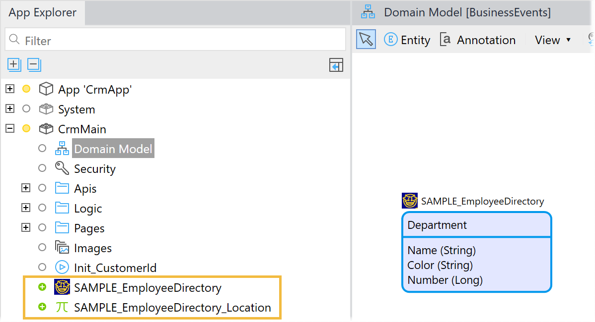
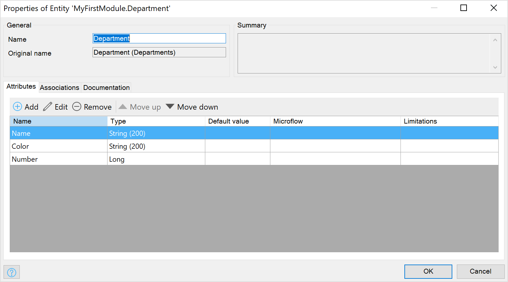
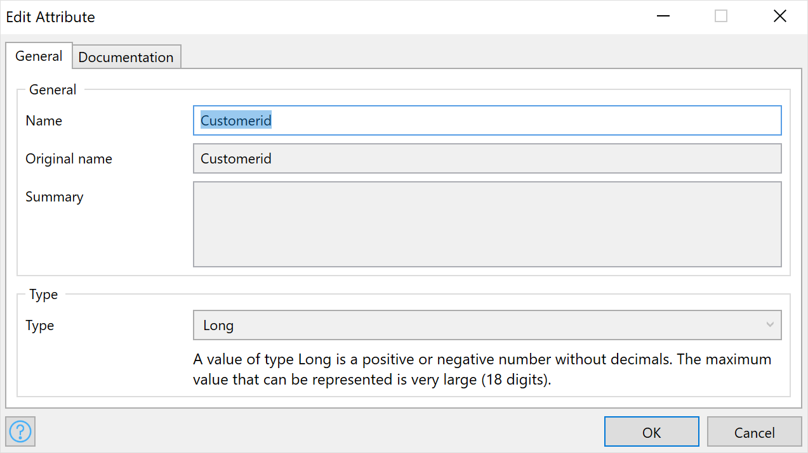
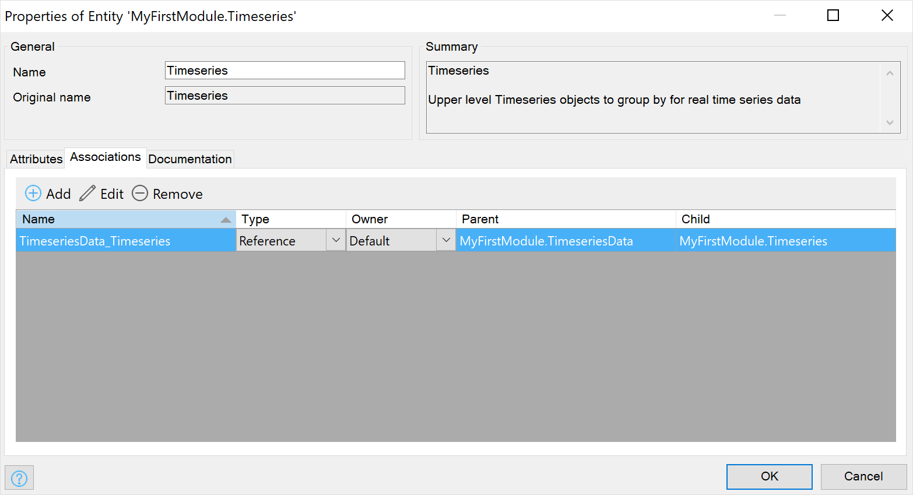
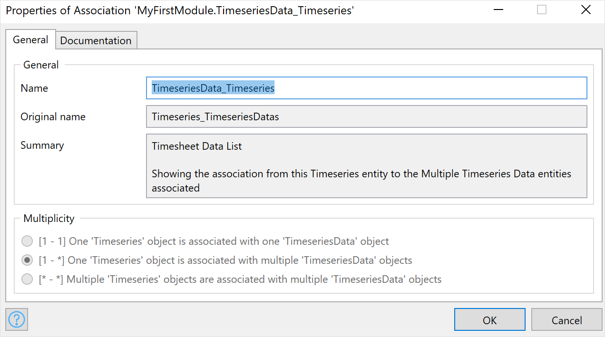

## 1 Introduction

External entities can be added to the Domain Model through the [Data Hub pane](data-hub-pane). They are displayed as *purple* entity containers in the domain model and they represent the link to the datasets that are made available through the shared data sources registered in [Mendix Data Hub](/data-hub/). The datasets are maintained and stored in the application and data sources, are collections of entity sets published in OData services. 

Datasets are maintained and updated in the source application. You can integrate or *consume* these datasets through external entities in your app development, and any changes to the data in the originating app is automatically updated in the consuming apps. 

External entities can be used them with local entities however, as the datasets are maintained in the source applications, not all properties can be changed in the consuming app.

To follow how to add external entites from the **Data Hub** pane see [Adding External Entities](#adding-external-entities).

{}
A license is required to use Mendix Data Hub and connect to external data sources through consumed OData services in your apps.
{}

## 2 Adding an External Entity to an App {#adding-external-entities}

To add an external entity to your app model, follow these steps:

1. In the the Domain Model of you app model search in the **Data Hub** pane for the entity or data source that you want to use in your app. 

    {}In the [Data Hub Catalog](/data-hub/Catalog/Search), an OData service may be registered mulitple times with different version numbers or deployed to different environments, all exposing the entity (dataset)) that you may want to use. Search the Data Hub Catalog first and find the one most relevant to the requirements for your app.{}

3. Drag and drop the entity in the Domain Model. 

4. The entity and its attributes are then added to your app and two documents are added in the **App Explorer**: 

    * the **Consumed OData Service** document that contains details of the OData service and the metadata; the logo displayed identifies the originating app of the service
    * the **OData Location** that specifies the location constants for the service

	

{}
When you drag an entity that is associated with an entity from the same service already in your Domain Model, the association will be displayed and established between the entities. For more information on associations between external entities, see [Associations](#properties).
{}

For further information, see [Consumed OData Service](consumed-odata-service).

In the **App** section of the **Data Hub** pane the consumed entities that are in the current app are listed:

{}
If there is a newer version of a consumed service becomes available in the Data Hub Catlog, this will be indicated in the **Data Hub** pane by an update arrow against the service name. For more information, see the [Updating or Switching a Consumed OData Service](consumed-odata-service#updating) section in *Consumed OData Service*.
{}

You can make local changes to the properties of external entities that only affect how the data is used and presented in the consuming app. All other properties are defined in the source application and cannot be changed. When multiple external entities from the same OData service are used in a module or app, associations between the entities (made in the source app) will automatically be made in the local module.

For more information on using published OData services and entities through the Data Hub Catalog, see [How to Consume Registered Assets](/data-hub/data-hub-catalog/consume) in the *Data Hub Guide*.

## 2 Properties of External Entities {#properties}

Compared to local entities, external entities have a limited number of properties that can be changed. The rest of the properties are defined in the originating app and are, therefore, read-only.

{}
Changes that are made to the properties of external entities are made only in the consuming app. The originating app will not be affected by the changes.
{}

### 2.1 General

This tab displays the general properties of the external entity. The values that are defined in the originating app are displayed but but cannot be edited. The values that can be edited will only apply to the local app:

* **Name** – the name of the entity in the local app
* **Original name** – this is read-only and shows the name of the entity as defined in the consumed OData service
* **Summary** – this is a read-only field and displays the description for the entity in the originating app

### 2.2 Attributes {#attributes}

The [attributes](attributes) that have been exposed in the OData service for the external entity are listed here. All changes that are made to the attributes and the attribute list are applied to the local instance of the entity. As they are consumed, these changes will not affect the metadata of the consumed service that the entity is exposed in or the attributes of the entity in the originating app.

{}In the [Data Hub Pane](data-hub-pane#association-attributes) the associations and attributes that are not supported in your Mendix model are shown as non-selectable (gray) and will not be included when you drag them into the domain model or be included in the entity properties. For more information see [Data Hub Pane](data-hub-pane#association-attributes).{}

The following operations can be done on the displayed attribute list:

* **Add** – add attributes that were exposed in the OData service for the entity and were previously removed for this local instance
* **Edit** – edit the selected attribute from the [Edit Attribute](#edit-attribute) form
* **Remove** – remove an attribute from list

#### 2.2.1 Edit Attribute {#edit-attribute}

The **Edit Attribute** box can be used for specifying a local name for the attribute and adding a local description.

* **General Tab**
	* **Name** – a local name for the attribute can be specified.
	* **Original Name** – this is a read-only value that displays the original name of the attribute as given in the originating app
	* **Summary** – a read-only summary displaying the description for the attribute in the originating app; to enter a local description, add this in the [Documentation tab](#documentation)
	* **Type** – read-only vlues for the **Type** and **Length** and **Max. Length** of the attribute as defined in the originating app
* **Documentation** – a description for the attribute that is displayed for users of the current app

### 2.3 Associations {#associations}

This tab displays the associations that the external entity has with other entities that are exposed in the same service and also any associations that have been made with local entities. For further details on association properties in Studio Pro see [Association Tab Properties](association-member-properties).

The following apply for all associations with the external entity:

**Name** – name of the association as displayed in the current app
**Type** – read-only for associations between two external entities
**Owner** – read-only for associations between two external entities
**Parent** – read-only for associations between two external entities
**Child** – read-only for associations between two external entities

You can **Add** and **Edit** associations to the external entity with a local entity. However, the association cannot be made *from* an external entity to a local entity: the local entity must be the owner of the association.

If you use an external entity in your app and this entity is associated with other external entities from the same OData service in your app, the association will automatically be added in the domain model and be listed here.

{}
It is possible to **Remove** an association between two external entities in the domain model that has been automatically added. If at a later stage you want to restore the association, you can do this in the domain model by right-clicking one of the external entities and clicking **Add** > **Association**.
{}

{}
If you want to connect two external entities that are not connected in the originating app, this is not possible as the relationship to the data cannot be influenced locally. However, consider adding a local entity and connect this local entity with both external entities. The local entity must be the owner of both associations, in this case.
{}

### 2.3.1 Association Properties

When you **Edit** an association that is included for two entities exposed in the same OData service, the following properties are displayed and the only local change that can be made is the local Name:

* **Name** – local name of the association
* **Original Name** – read-only name of the association given to it in the originating app
* **Summary** – read-only description of the association from the originating app
* **Multiplicity** – read-only multiplicity values from the originating app
* **Documentation** – go to this tab to add a local description for the external entity association

### 2.3.2 Connecting Two External Entities

If you want to connect two external entities that are not connected in the originating app, this is not possible as the relationship to the data cannot be influenced locally. However, you can add a local entity and connect this local entity with both external entities. The local entity must be the owner of both associations, in this case.

### 2.4 Documentation {#documentation}

You can add any local information about the external entity in this tab.

## 3 External Entity Limitations

External entities are the endpoints that are defined in the published OData service from the originating app. The consumed OData service document displays the values from the service metadata when the external entity is used through the **Data Hub** pane. The limitation on external entities is that they are consume-only entities. The datasets associated with the entities are maintained in the originating apps.

For more details on consuming services and exposed entities, including operations that can be performed on external entities, see [How to Consume Registered Assets](/data-hub/data-hub-catalog/consume) in the *Data Hub Guide*.
