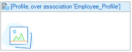
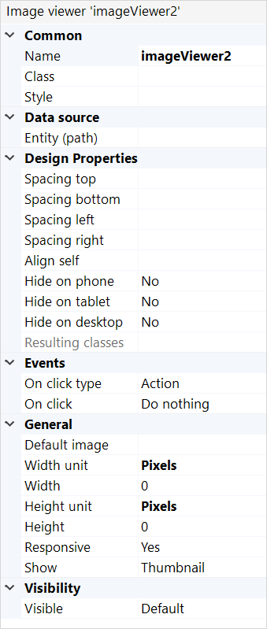

## 1 Introduction

An image viewer can be used to display an image or its thumbnail. For example, you can show a profile picture:

An image viewer must be placed in a data view or a template grid.

## 2 Properties

An example of image viewer properties is represented in the image below:

{}
{}

Image uploader properties consist of the following sections:

* [Common](#common) 
* [Data source](#data-source)
* Design Properties
* [Events](#events)
* [General](#general)
* [Visibility](visibility)

### 2.1 Data Source Section {#data-source}

#### 2.1.1 Entity (Path)

The **Entity (path)** property specifies which object will be shown in the image viewer. It must be a System.Image or a specialization thereof. If the object in the data view is (a specialization of) System.Image you can use this object in the image viewer as well.

### 2.2  Events Section {#events}

{}

### 2.3 General Section

#### 2.3.1 Default Image

This is the image that is displayed if no image is uploaded.

#### 2.3.2 Width Unit {#width-unit}

The table below describes possible ways to specify the width of an image: 

| Value | Definition |
| --- | --- |
| Pixels | The width is specified in a number of pixels. If you specify both width and height, the image will be scaled automatically: the proportions will be kept, the picture will not be stretched. |
| Percentage | The width is specified in a percentage of the original width. It can be larger than its original width in which case the image is stretched. |
| Auto | The width of the given image is used. |

*Default value*: Percentage

{}
Not supported on native mobile pages.
{}

#### 2.3.3 Width 

This property is displayed only when the [**Width unit**](#width-unit) property is set to *Pixels* or *Percentage*. This property determines the width of the image, either in pixels or a percentage.

*Default value*: 0

#### 2.3.4 Height Unit {#height-unit}

The table below describes possible ways to specify the height of an image: 

| Value      | Definition                                                   |
| ---------- | ------------------------------------------------------------ |
| Pixels     | The height is specified in a number of pixels. If you specify both width and height, the image will be scaled automatically: the proportions will be kept, the picture will not be stretched. |
| Percentage | The height is specified in a percentage of the original height. It can be larger than its original height in which case the image is stretched. |
| Auto       | The height of the given image is used.                       |

*Default value*: Auto

{}Not supported on native mobile pages.{}

#### 2.3.5 Height

This property is displayed only when the [**Height unit**](#height-unit) property is set to *Pixels* or *Percentage*. This property determines the height of the image, either in pixels or a percentage.

*Default value*: 0

#### 2.3.6 Responsive

This property determines how the image scales. If the value is set to *Yes*, the image will never get bigger than its original size, but it can become smaller. If the value is set to *No*, the image can become both larger and smaller than its original size.

*Default value*: Yes

#### 2.3.7 Show

This property indicates whether the generated thumbnail or the full image is shown.

_Default value:_ Thumbnail

### 2.4 Visibility Properties

{}

## 3 Read More

* [Page](page)
* [File Widgets](file-widgets)
* [Properties Common for Widgets](common-widget-properties)
