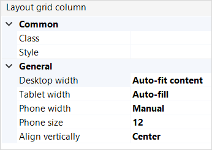
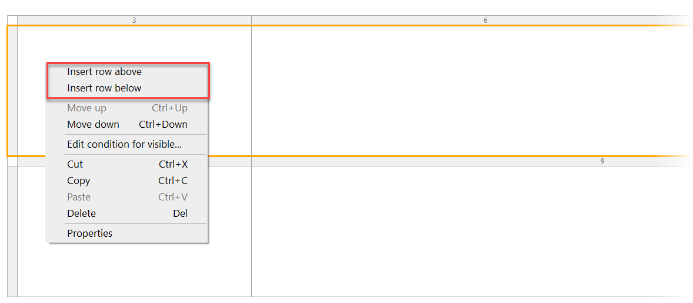

## 1 Introduction

Layout grid rows and columns are components of a [layout grid](). You can define the number of columns in a row, their size and alignment per a device.

## 2 Rows and Their Properties

A layout grid can contain one or more rows. Each row contains [columns](#columns) and the number of columns can differ per row.

An example of layout grid row properties is represented in the image below:

{}

Row properties consist of the following sections:

* [Common](#row-common)
* [General](#row-general)
* [Visibility](#row-visibility)

### 2.1 Common Section {#row-common}

{}

### 2.1 General Section {#row-general}

The **General** section of a row contains the following properties:

* **Columns** – sets the number of columns in the row
* **Align columns vertically** – This property aligns all columns in a row vertically. You can select the following options:
  
  * **Not set** – columns are not aligned
  
  * **Top** – columns are aligned to the top of the layout grid
  
  * **Center** – columns are aligned to the center of the layout grid
  
  * **Bottom** – columns are aligned to the bottom of the layout grid
  
    {}This setting can be overridden by the **Align vertically** setting of an individual column.
    {}
  
* **Spacing between columns** – when set to *Yes*, adds spacing between columns

### 2.2 Visibility Section {#row-visibility}

{}

## 3 Columns and Their Properties{#columns}

Columns form a row of a layout grid.  

 An example of layout grid column properties is represented in the image below:

Layout grid column properties consist of the following sections:

* [Common](#column-common)
* [General](#column-general)

### 3.1 Common Section

{}

### 3.2 General Section

#### 3.2.1 **Desktop/Tablet/Phone Width** {#column-width}

**Desktop/Tablet/Phone Width** allows you to set a width for the corresponding device. You can choose the following options:

* **Auto-fill** – takes the available space for a column (for example, if there is one column, it will span the column for the whole row, and for two columns, it will divide the space equally between them)
* **Auto-fit content** – automatically fits the size of the column to its content
* **Manual** – allows you to manually set the size of the columns by setting the [Desktop/Tablet/Phone size](#column-size) option 

#### 3.2.2 **Desktop/Tablet/Phone Size** {#column-size}

The **Desktop/Tablet/Phone Size** option is displayed only if [Desktop/Tablet/Phone width](#column-width) is set to **Manual**. width allows you to select size of the column for the corresponding devices.

#### 3.2.3 Layout Examples

The width and size properties described above can be used to make your layout more flexible and adaptive to different types of devices.

For example, you have a layout grid with one row and two columns: a customer's profile picture in one column, and a text with details in another.

For the desktop, set Auto-fit content and Auto-fill.

For tablet,

For phone, 

## 4 Performing Basic Actions

### 4.1 Adding a New Row or a Column

To add a new row, do the following:

1. Select an existing row in a layout grid.

2.  Right-click and select **Insert row above** or **Insert row below**:

    

3. Select a column layout (how many columns should be in a row and what weight columns should have).

A new row is added to the layout grid.

To add a new column, do the following:

1. Select a column next to which you want to add a new one.
2. Right-click and select **Add column left** or **Add column right**.

A new column is added, the weight 1 is automatically set for it. 

### 4.2 Performing Other Actions on Rows

In adding to inserting a new row, you can perform the following actions when right-clicking a row:

* **Move up** – moves a row up in the layout grid, you can use a shortcut for it  <kbd>Ctrl</kbd> + <kbd>↑</kbd> 
* **Move down** – moves a row down in the layout grid, you can use a shortcut for it  <kbd>Ctrl</kbd> + <kbd>↓</kbd> 

### 4.3 Performing Other Actions on Columns

In adding to inserting a new column, you can perform the following actions when right-clicking a column:

* **Move left** – moves a column left in the row, you can use a shortcut for it  <kbd>Ctrl</kbd> + <kbd>←</kbd> 
* **Move right** – moves a column right in the row, you can use a shortcut for it  <kbd>Ctrl</kbd> + <kbd>→</kbd> 
* **Row** – allows you to perform actions on the column's row 

## 5 Read More

* [Page](page)
* [Layout Grid](layout-grid)
* [Properties Common for Widgets](common-widget-properties)
