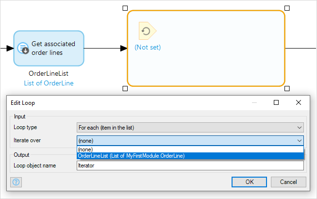

## 1 Introduction

A loop is used to execute repeated actions and is visualized as a frame. For each iteration the flow inside the loop is executed. The loop can be configured to iterate over a list or based on a boolean expression, check out [loop type section](#loop-type) for more details on each loop type.

The loop can contain all types of elements used in microflows, except for start and end events. Only a loop can contain [break events](break-event) and [continue events](continue-event).

## 2 Input Properties

### 2.1 Loop type{#loop-type}
* [For each (item in the list)](#for-each)
* [While (condition is true)](#while)

#### 2.1.1 For each (item in the list){#for-each}
This is the default type when creating a new loop activity and can be used to iterate over a list of objects. The list can be configured by setting *Iterate over* property to a list in your flow scope, and for each object in the list the flow inside the loop will be executed. The iterator, which looks the same as a parameter, represents the current object in the list for each iteration and it can be renamed by setting *Loop object name*. This object is shown in black and the entity type of the object is in blue.

For example, if you have a list of objects of the *OrderLine* entity and you want to set the purchase date for every object, you can use a loop with a change activity in it that sets the purchase date:

#### 2.1.2 While (condition is true){#while}
// todo

A variable that is a list of items you will loop through.

## 3 Action Properties

### 3.1 Loop Object Name

**Loop object name** is the name of the list item that is currently being worked on. The flow inside the loop is executed for each object in the list, and the object will always have this name. For example, if the list over which the loop iterates is of type *List of Order*, the iterator object will be of type *Order*.