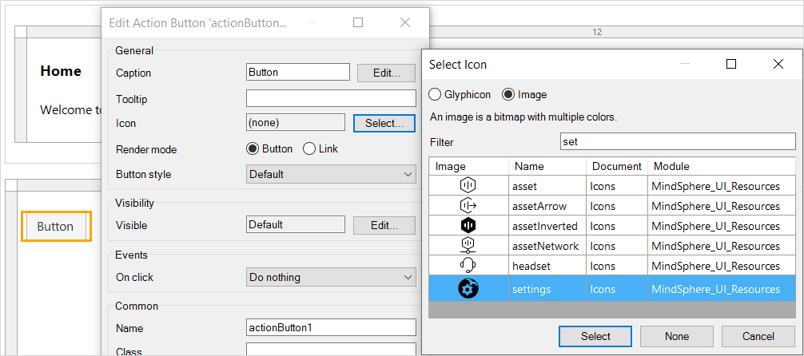
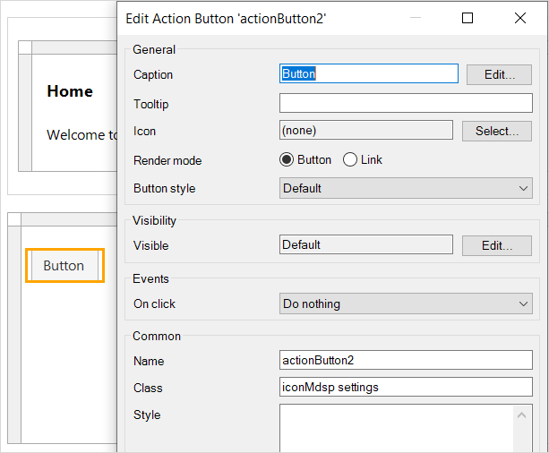
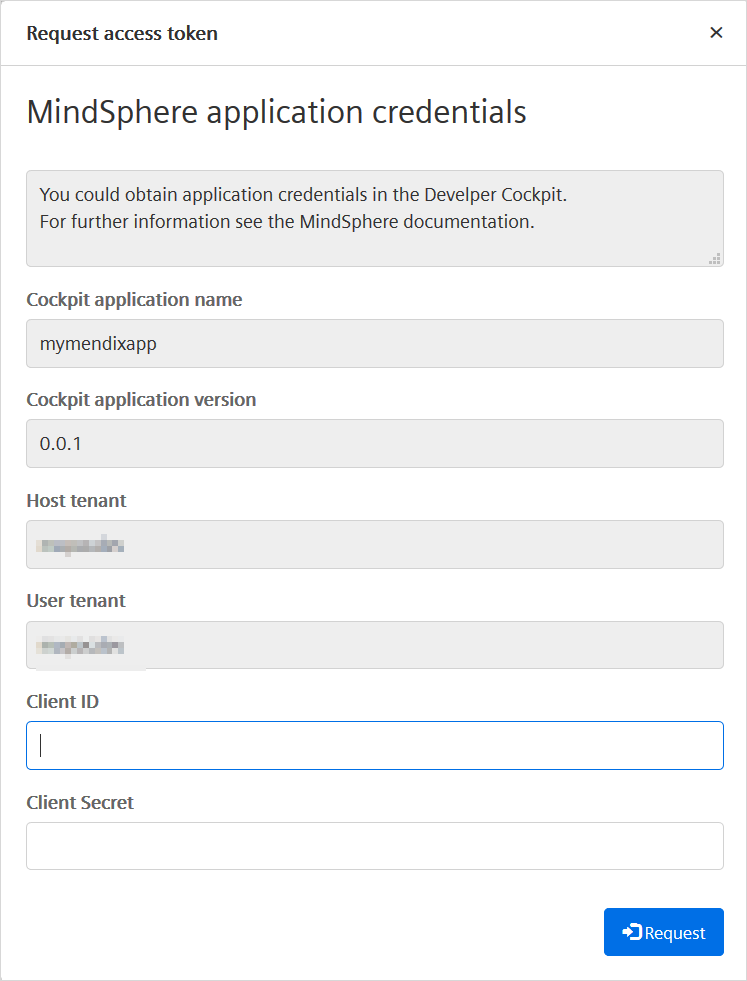
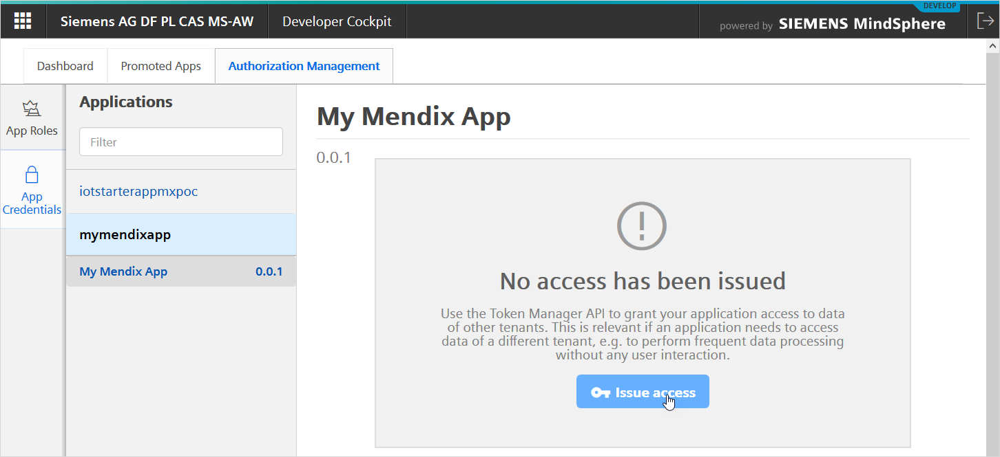
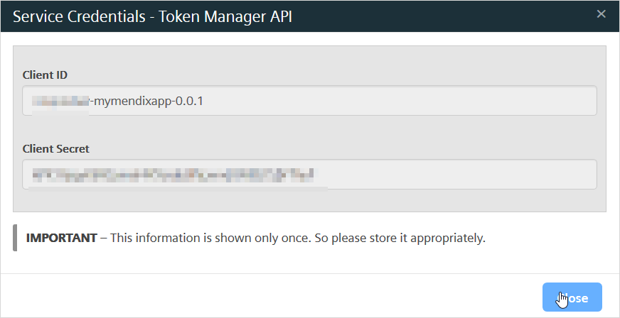
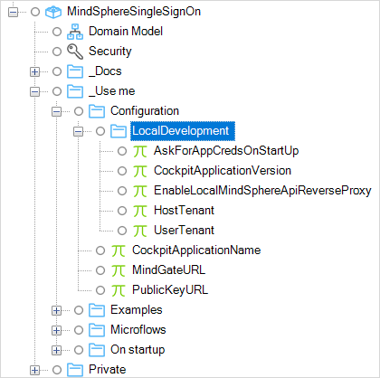
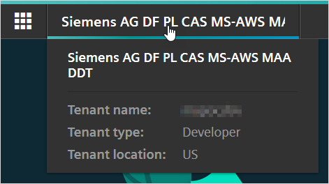
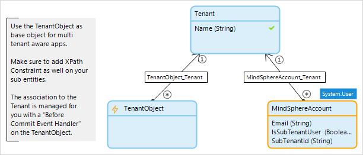

## 1 Introduction

When developing a Mendix app which will be deployed to MindSphere, there are a number of extra things you need to take into consideration. The following subjects are discussed below:

* [Atlas UI](#atlasui)
* [Authorizing MindSphere REST Calls](#mstoken)
* [Cloud Foundry Environment Variables](#cfenvvars)
* [Licensing Your App](#licensing)
* [Local Testing](#localtesting)
* [Multi-Tenancy](#multitenancy)
* [Validation](#validation)

Finally, there is a section on some [Limitations](#limitations) which apply to Mendix apps deployed to MindSphere.

## 2 Atlas UI{#atlasui}

The MindSphere Theme Pack includes two ways of including MindSphere icons in your app.

### 2.1 MindSphere Icons as SVGs

You can select MindSphere icons from the MindSphere Theme Pack to be displayed as SVGs in your application.

1. Open the properties of a widget which can display an icon (for example a button).
2. Click **Select...** next to the Icon.
3. Select **Image** as the icon type.
4. Find the image that you want and click **Select**. The MindSphere icons are in the module *MindSphere_UI_Resources*.



{}
You cannot change the color of these icons from within Mendix.
{}

### 2.2 MindSphere Icons as an Icon Font

The MindSphere Theme Pack provides a font which contains icons. This means that you can use a MindSphere icon in any page element where you can assign a class.

To do this:

1. Find the icon you wish to use. These have the same names as the icons in the MindSphere Theme Pack and are listed in the *Project Explorer* dock under **Project '…' > App Store modules > MindSphere_UI_Resources > Icons**.

    

2. Open the properties of the element to which you wish to add an icon.
3. Set **Icon** to *(none)*.
3. Add the class `iconMdsp {icon-name}`.

    

{}
You will not see the icon in the Desktop Modeler when it is in *Edit mode*. Switch to *View mode* to confirm that you have selected the correct icon.

You can only add one icon per element.
{}

## 3 Authorizing MindSphere REST Calls{#mstoken}

The **MindSphereToken** entity contains the *Access_token* attribute which needs to be passed as the Authorization header in REST calls to MindSphere APIs.

To improve security of your app, it is recommended that you delete the MindSphereToken object returned by the *Access token* action before showing a page or reaching the end of the microflow.


## 4 Cloud Foundry Environment Variables{#cfenvvars}

If you need to set or change the value of any Cloud Foundry Environment Variables, you will have to do this using the Cloud Foundry Command Line Interface (CF CLI).

1.  Use `cf set-env {app_name} {environment_variable_name} {value}`
2.  You will need to restart the app to use the new value.  
    Use `cf restart {app_name}`

{}
Restarting your app will cause your app to be temporarily unavailable.
{}

## 5 Licensing Your App{#licensing}

When you initially deploy a Mendix App, it is treated as a *Free App*. For a MindSphere app the most important restrictions are:

* You can have a maximum of ten users
* The app will go into sleep mode after 1-2 hours

For a full list of limitations, see the [Free App](/developerportal/deploy/mendix-cloud-deploy#free-app) section of *Mendix Cloud*. Note that this also includes restrictions which apply specifically to apps which are deployed to the Mendix Cloud.

To license your app, you need to obtain a license key from [Mendix Support](https://support.mendix.com).

Instructions for licensing apps are available in the [License Activation](https://github.com/mendix/cf-mendix-buildpack#license-activation) section of the *Mendix Cloud Foundry Buildpack Readme*. Refer to [Cloud Foundry Environment Variables](#cfenvvars), above, for instructions on changing Cloud Foundry environment variables.

## 6 Local Testing{#localtesting}

### 6.1 Credentials 

When you run your app locally, you will not be able to use SSO to get your credentials. You will be logged on as MxAdmin and will be presented with a login screen either when the app starts, or the first time that your app attempts to retrieve your access token, depending on the value of the constant *AskForAppCredsOnStartUp*.

{{% image_container width="50%" %}}{}

This will use the credentials you have set up under **App Credentials** in the *Authorization Management* tab of the MindSphere Developer Cockpit for this application.

To create the app credentials:

1.  Register this application using the identical application name as that set in the constant **CockpitApplicationName**. See [MindSphere Launchpad Setup](/developerportal/deploy/deploying-to-mindsphere#launchpad) in *Siemens Mindsphere – deployment*.
2.  Go to the **App Credentials** page in the *Authorization Management* tab of the MindSphere Developer Cockpit.
3.  Click **Issue access** to obtain a token.

    

4.  Select the access level and click **Submit**

    

5.  Make a note of the **Client ID** and **Client Secret**

    

For more information about creating app credentials, see the documentation on the MindSphere website here: [Self-Hosted Application – Access MindSphere APIs](https://developer.mindsphere.io/howto/howto-selfhosted-api-access.html).

To ensure that the correct application credentials are requested, you have to set the following constants in the **LocalDevelopment** folder of the **MindSphereSingleSignOn** module in addition to the other configuration constants.



**AskForAppCredsOnStartUp**

Set this to *True* if you want your app to ask for credentials as soon as it starts up, before the first page is displayed. If this is set to *False* then the app will ask for credentials the first time that it attempts to retrieve your access token.

If you trigger microflows consuming MindSphere APIs on the home page, setting this to *True* ensures that they will work the first time the page is displayed.

{}
This setting has no effect on apps which are deployed to the cloud. The credentials page is only shown for local deployments.
{}

**CockpitApplicationVersion**

This is a valid version of the MindSphere app as registered in the Developer Cockpit under the name *CockpitApplicationName*.

**EnableLocalMindSphereApiReverseProxy**

Set this to *True* to enable a reverse proxy for MindSphere API calls which are made directly from the html pages (for example, the calls from the MindSphere OS Bar).

This adds a new endpoint `/api/**` to the app. An access token is added to all calls from the UI to MindSphere and these are forwarded directly. This setting is needed if you use MindSphere WebComponents during local development, as the WebComponents request data direct calls to MindSphere APIs without any Microflows.

**HostTenant**

This should be the tenant where your credentials are stored. It is needed when retrieving your Service Credentials. The **Tenant name** is available from the menu bar in the MindSphere launchpad.



The definition of a tenant on MindSphere is available in the MindSphere document [Definition of Tenant](https://documentation.mindsphere.io/resources/html/settings/en-US/118273564939.html).

**UserTenant**

This should be the tenant that the user has access to in a multi-tenant environment. For a developer tenant, this must be the same as the HostTenant. In an operator or iot plan tenant, you can change this to allow you to test multi-tenant apps.

### 6.2 User Roles

If you are testing different roles in your app, do not use the demo users. If you switch between demo users, this will not correctly populate the tenant and role information from MindSphere. To test different roles, allocate the role to MxAdmin, redeploy, and log in again.

#### 6.3 Local User Passwords

Local users should not be created for your MindSphere app.

When a new user is identified during SSO, the SSO process generates a random password for the user. The password policy for your app needs to accept these randomly generated passwords. The password generation algorithm generates passwords of a fixed length, so the password policy should not be set to require more characters.

{}
This policy is set up as the default in the MindSphere starter and example apps and should not be changed.
{}

## 7 Multi-Tenancy{#multitenancy}

In MindSphere, apps are usually designed to be multi-tenant, meaning that a single instance of the app serves multiple tenants. A tenant is a representation of a real-world organization. It groups users, data, assets, entities, and many kinds of other properties. Access to these resources for users of the same tenant is controlled via the authorization management system.

For a MindSphere app to be multi-tenant, each user can only see the data from a single tenant, defined by their login credentials, and cannot access resources of other tenants.

### 7.1 Control through MindSphere APIs

The Authorization HTTP Header (see DS_MindSphereAccessToken in the [Microflows](/developerportal/deploy/deploying-to-mindsphere#microflows) section of *Siemens Mindsphere – deployment*) which is passed for every MindSphere API call ensures that the user can only obtain data which is authorized to them via their tenant.

### 7.2 Control within a Mendix app

If no security is placed on persistent Mendix entity objects, these are accessible to all users of the app (subject to access granted by their user role). This means that any app which stores data in persistent Mendix entities cannot be made multi-tenant without additional security.

MindSphere SSO provides the user’s tenant as the **Name** attribute in the **Tenant** entity.



In addition, MindSphere SSO will identify whether the current user is a subtenant using **IsSubTenantUser** and, if so, will populate the name of the subtenant in **SubtenantId**. More information about subtenants can be found in the MindSphere documentation [Subtenants](https://developer.mindsphere.io/apis/core-tenantmanagement/api-tenantmanagement-overview.html#subtenants).

**How To Make Your App Multi-Tenant**

By utilizing the **Tenant** when an entity is accessed, the Mendix app can be made multi-tenant.

{}
It is not possible, currently, to generate these access restrictions automatically.

The developer will have to add a rule every time the entity is accessed. See the instructions below.
{}

{}
It is not necessary to put an access rule on every entity within the domain model. It is only required for: **persistent** entities which have a **TenantId** attribute.
{}

To make your Mendix app multi-tenant, do the following:

1.  Make all *persistent* entities which have a **TenantId** attribute a specialization of the MindSphereSingleSignOn.TenantObject entity.  
    This ensures that every object is associated with the Tenant object of the user who creates it.
2.  Every action on this object must have the following XPath constraint:

    ```java
    [MindSphereSingleSignOn.TenantObject_Tenant/MindSphereSingleSignOn.Tenant/MindSphereSingleSignOn.MindSphereAccount_Tenant='[%CurrentUser%]']
    ```
    
    This ensures that the user can only retrieve entities which belong to their tenant, in other words, where their Tenant matches the TenantId of the entity. You can copy and paste this constraint from here (hover your mouse over the text and click the **Copy** button). You can also copy it from XPath constraint on the *TenantObject* entity in the *MindSphereSingleSignOn* module. For more information on XPath, see [XPath](/refguide/xpath).

{}
For consistency, it is recommended that all access to these entities is done through a sub-microflow which contains the XPath constraint. This enforces multi-tenant security.
{}

**Example**

You have some limits which are set for the user's tenant to be applied to a time series. You then want to get a list of all these so that you can display the values to the user.

1.  Create the domain model with the **LimitConfig** entity being a specialization of **MindSphereSingleSignOn.TenantObject**.

    

2.  Write a sub-microflow which returns a list of all limits.
3.  Apply the XPath constraint to the **Retrieve Objects** action.

    {{% image_container width="75%" %}}{}

4.  When you want to retrieve the list of limits, call this microflow instead of using the retrieve objects action. This will ensure that tenant-based security is always applied.

## 8 Validation{#validation}

Your app should, as a minimum, meet the requirements of the checklist on the MindSphere developer site here: [Get your Application Ready for Productive Use](https://developer.mindsphere.io/howto/howto-app-publication.html).

## 9 Limitations{#limitations}

The following limitations apply to Mendix apps which are deployed to MindSphere.

If these limitations affect the design of your app, you can still create a Mendix app to use MindSphere APIs from outside MindSphere.

### 9.1 Binary File Storage

MindSphere does not currently have a compatible file service available in its Cloud Foundry stack. Therefore, you cannot use any Mendix features which rely on having a file service.

In particular, this means that you cannot use entities which are specializations of the *System.FileDocument* entity. This also includes all entities which are specializations of the *System.Image* entity, as this is also a specialized type of FileDocument.

You can store small amounts of binary information in persistable entities. However, the database management system (DBMS) will have strict limits on the size of binary attributes and using them as a replacement for FileDocument entities can lead to performance issues.

Alternatively, you can use a separate AWS S3 bucket. See [Configuring External Filestore](https://github.com/mendix/cf-mendix-buildpack#configuring-external-filestore) in the *Mendix Cloud Foundry Buildpack GitHub Repository*. Refer to [Cloud Foundry Environment Variables](#cfenvvars), above, for instructions on changing Cloud Foundry environment variables.

### 9.2 App Name{#appname}

There are no limitations on what you call your app within Mendix. However, when you deploy the app to MindSphere, the app name registered in the Developer Cockpit must have the following characteristics:

* Contains only *lowercase* alphanumeric characters and, optionally, the symbols `-`, `_` and `.`
* Starts with a letter
* Length does not exceed 40 characters
* Is unique within your tenant

If you want to use the same app name in both Mendix and MindSphere, you should bear these constraints in mind when naming your Mendix app.

### 9.3 Roles and Scopes

At present, MindSphere only supports two roles. You should take this into account when designing security within your Mendix app.

It is recommended that you create two scopes for your MindSphere app, **user** and **admin** which will map to identically-named user roles in your Mendix app.

There is a more detailed discussion of MindSphere and Mendix roles and scopes in the [Roles & Scopes](/developerportal/deploy/deploying-to-mindsphere#rolesscopes) section of *Siemens MindSphere – deploy*.

### 9.4 Logout from MindSphere

If the user logs out from MindSphere, the Mendix app will not delete the session cookie.


{}
In some circumstances, this could lead to another user *using the same app in the same browser on the same computer*, picking up the session from the previous user if the cookie has not yet expired.
{}

### 9.5 Cloud Services Platform 

Mendix apps can currently only be deployed to MindSphere running on AWS (Amazon Web Services). They cannot currently be deployed to MindSphere running on Microsoft Azure.

## 10 Read More

* [Siemens MindSphere – deployment](/developerportal/deploy/deploying-to-mindsphere)
