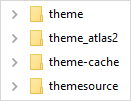
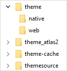
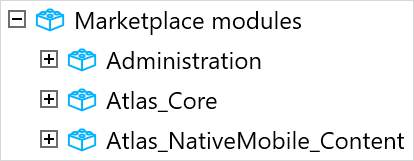

## 1 Introduction

Atlas 3 brings a new degree of power and sophistication to styling in Mendix. To upgrade from Atlas 2 to Atlas 3, see the [Upgrade from Atlas 2 to Atlas 3](#upgrade) section below. To view a high-level summary of the changes Atlas 3 brings to Mendix, visit the [Atlas 3 Change Summary](/refguide/atlas3-change-summary).

The upgrade from Atlas 2 to Atlas 3 topic of this document, has been divided into the following sections: 

- [Upgrading your Theme directory](#upgrade-theme-directory)
- [Migrating your Web styling](#upgrade-web-styling)
- [Migrating your Native styling](#upgrade-native-styling)
- [Migrating custom defined design properties](#upgrade-design-properties)
- [Migrating your UI content](#upgrade-ui-content)

This final sections of this document reference known issues and some troublehsooting issues that may occur when upgrading to Atlas 3. 

## 2 Upgrade from Atlas 2 to Atlas 3 {#upgrade}

Before upgrading, please note that in Atlas 3 all hybrid content is removed because hybrid profiles are deprecated in Mendix 9. If your project requires hybrid content, we recommend not upgrading to Atlas 3 unless you have created all your own hybrid content separate from Atlas’.

Before you start the upgrading process, it may help if you consult the folder structure changes introduced in Atlas 3 by reading the [File and Folder Structure](/howto/front-end/customize-styling-new#file-and-folder) section of *How to Customize Styling*. 

### 2.1 Upgrading your theme directory {#upgrade-theme-directory}

To upgrade your theme directory to Atlas 3, please complete the following steps:

1. Rename you Atlas 2 **theme** directory. We suggest naming it to *theme_atlas2*.

   

2. Download the Atlas 3 [**theme.zip**](https://www.dropbox.com/s/guffms4u5idx3us/theme.zip?dl=1) and extract it into the root of your Mendix project folder. The folder structure should look similar to the example below. **Mendix project root**, then **theme**, then **web** and **native**.



### 2.2 Migrating your web styling {#upgrade-web-styling}

This section can be skipped if you have not made any modifications to the **web** section of your **Atlas 2 theme** and you can continue to the section on **[Migrating UI content](#upgrade-ui-content)**.

Modifications to the **Atlas 2 web theme** include the following: 

- Changes to custom variables
- Adding of additional custom styling
- Changes to design properties
- Changes made to Login.html and index.html

If you have made any of the above modifications, please follow the following steps below. The steps have been divided into 5 sections: 

- [Web custom variables](#web-custom-variables)
- [Web custom styling](#web-custom-styling)
- [Web additonal custom styling](#web-additional-custom-styling)
- [Web design properties](#web-design-properties)
- [Web resources](#web-resources)

#### 2.2.1 Web custom variables {#web-custom-variables}

This section concerns modifications you have made to the **custom-variables** scss file of your **Atlas 2 theme**.

```
theme_atlas2/styles/web/sass/app/_custom-variables.scss
```

To move your custom variable modifications to **Atlas 3**, there are two options: 

**Option 1** - If the custom variables apply to the app level, then the modifications should be moved into the **custom-variables** scss file of the **Atlas 3 theme** directory. 

```
theme/web/custom-variables.scss
```

**Option 2** - If you want to extract the variables into a reusable module, move them into the **custom-variables** scss file of a module you have created in the **themesource** directory.

```
themesource/your-module/web/custom-variables.scss
```

#### 2.2.2 Web custom styling {#web-custom-styling}

This section concerns modifications you have made to the **custom** scss file of your **Atlas 2 theme**.

```
theme_atlas2/styles/web/sass/app/_custom.scss
```

To move your custom styling modifications to **Atlas 3**, there are two options: 

**Option 1** - If the custom styling apply to the app level, then the modifications should be moved into the **main** scss file of the **Atlas 3 theme** directory. 

```
theme/web/main.scss
```

**Option 2** - If you want to extract the custom styling into a reusable module, move them into the **main** scss file of a module you have created in the **themesource** directory.

```
themesource/your-module/web/main.scss
```

#### 2.2.3 Web additional custom styling {#web-additional-custom-styling}

This section concerns modifications you have made to the **app** folder of your **Atlas 2 theme** and any additional scss stylesheets that you might have added. 

```
theme_atlas2/styles/web/sass/app/_
```

To move you additional stylesheets that you have added here to **Atlas 3**, there are two options: 

**Option 1** - If the additional stylesheets apply to the app level, these changes should be moved into the **web** directory of the **Atlas 3 theme**. 

```
theme/web/_
```

Remember to include `@import <file name>` in ***theme/web/main.scss*** to include your additional files in the compilation of the SCSS. 

**Option 2** - If you want to extract the additional stylesheets into a reusable module, move them to a module you have created in **themesource**.

```
themesource/your-module/web/_
```

Remember to include `@import<file name>` in ***themesource/your-module/web/main.scss*** to include your additional files in the compilation of the SCSS. 

#### 2.2.4 Web design properties {#web-design-properties}

This section concerns modifications you have made to the **settings.json file** of your **Atlas 2 theme**.

```
theme_atlas2/settings.json
```

Custom **design properties** that you have added to **settings.json**, need to be moved into the web's **design-property** json file of a module you have created in the **themesource** directory. 

```
themesource/your-module/web/design-properties.json*
```

Do not add to the modules **Atlas Core** or **Atlas Web Content**.

If you have user defined **design properties** for platform supported or community supported widgets, follow the two scenarios below.  

#### 2.2.5 Web resources {#web-resources}

This section concerns modifications you have made to documents **login.html** and **index.html**, as well as additional static resources e.g. font libraries, images, etc...

Any custom index.html or login.html pages that you have created in your **Atlas 2 theme** need to be moved to the **web** directory of the **Atlas 3 theme**. 

```
theme/web/login.html
```

The same applies to additional HTML documents that you may have created. 

Additional static resources such as images, font libraries need to be moved to the **resources** directory of **web** in the **Atlas 3 theme.** 

```
theme/web/resources
```

### 2.3 Migrating your native styling {#upgrade-native-styling}

This section can be skipped if you have not made any modifications to the **native** section of your **Atlas 2 theme** and you can continue to the section **migrating your UI content** {#upgrade-ui-content}.

Modifications to the **Atlas 2 theme** include the following: 

- Changes to custom variables
- Adding of additional custom styling
- Changes to design properties

If you have made any of the above modifications, please follow the following steps below. The steps have been divided into 4 sections: 

- [Native custom variables]({#native-custom-variables})
- [Native custom styling]({#native-custom-styling})
- [Native additonal custom styling](native-additonal-custom-variables)
- [Native design properties](#native-design-properties)

#### 2.3.1 Native custom variables {#native-custom-variables}

This section concerns modifications you have made to the **custom-variables** js file of your **Atlas 2 theme**.

```
theme_atlas2/styles/native/sass/app/custom-variables.js
```

To move your custom variable modifications to **Atlas 3**, there are two options: 

**Option 1** - If the custom variables apply to the app level, then the modifications should be moved into the **custom-variables** scss file of the **Atlas 3 theme** directory. 

```
theme/native/custom-variables.js
```

**Option 2** - If you want to extract the variables into a reusable module, move them into the **custom-variables** scss file of a module you have created in the **themesource** directory.

```
themesource/your-module/native/custom-variables.js
```

#### 2.3.2 Native custom styling {#native-custom-styling}

This section concerns modifications you have made to the **custom** js file of your **Atlas 2 theme**.

```
theme_atlas2/styles/native/sass/app/_custom.js
```

To move your custom styling modifications to **Atlas 3**, there are two options: 

**Option 1** - If the custom styling apply to the app level, then the modifications should be moved into the **main** js file of the **Atlas 3 theme** directory. 

```
theme/native/main.js
```

**Option 2** - If you want to extract the custom styling into a reusable module, move them into the **main** js file of a module you have created in the **themesource** directory.

```
themesource/your-module/native/main.js
```

#### 2.3.3 Native additonal custom styling {#native-additional-custom-styling}

This section concerns modifications you have made to the **app** folder of your **Atlas 2 theme** and any additional js stylesheets that you might have added. 

```
theme_atlas2/styles/native/sass/app/_
```

To move you additional stylesheets that you have added here to **Atlas 3**, there are two options: 

**Option 1** - If the additional stylesheets apply to the app level, these changes should be moved into the **web** directory of the **Atlas 3 theme**. 

```
theme/native/_
```

Remember to import the file using JavaScript's `import` syntax in *theme/native/main.js* and export the variable exposed by the imported file. 

**Option 2** - If you want to extract the additional stylesheets into a reusable module, move them to a module you have created in **themesource**.

```
themesource/your-module/native/_
```

Remember to import the file using JavaScript's `import` syntax in *themesource/your-module/native/main.js* and export the variable exposed by the imported file.

#### 2.2.4 Native design properties {#native-design-properties}

This section concerns modifications you have made to the **settings-native.json file** of your **Atlas 2 theme**.

```
theme_atlas2/settings-native.json
```

Custom **design properties** that you have added to **settings-native.json**, need to be moved into the native's **design-property** json file of a module you have created in the **themesource** directory. 

```
themesource/your-module/web/design-properties.json*
```

Do not add to the modules **Atlas Core** or **Atlas Native Content**.

If you have custom defined **design properties** for platform supported or community supported widgets, see the section **migrating custom defined design properties**.

### 2.4 Migrating custom defined design properties {#upgrade-design-properties}

#### 2.4.1 Adding Design Properties for Platform-Supported Widgets

If you have extended one or more platform supported widgets with your own design property similar to the following example.

You have extended the **container widget** with a design property **border** to add a border to an instance of the container. Note that for design properties the `Element` name is called `DivContainer`.

```
{
 "pageTemplates": "WebModeler",
 "cssFiles": ["styles/web/css/main.css"],
 "designProperties": {
  "DivContainer": [
  	{
  		"name": "Align content",
  		"type": "Dropdown",
  		"description": "Align content of this element left, right or center it. Align elements 					inside the container as a row or as a column.",
  		"options": [
  				{
  					"name": "Left align as a row",
  					"oldNames": ["Left align as row"],
  					"class": "row-left"
  				},
  				{
  					"name": "Center align as a row",
    				"oldNames": ["Center align as row"],
  					"class": "row-center"
  				},
  				{
  					"name": "Right align as a row",
  					"oldNames": ["Right align as row"],
  					"class": "row-right"
   				}
   		]
   },
   {
    "name": "Border", // custom design property targeting the platform's DivContainer
    "type": "Toggle",
    "description": "Add a border.",
    "class": "div-container-border"
   }
  ]
 }
}
```

In the example above we have two design properties: **align content** and **border**. Align content is a Atlas 3 defined design property, while border is custom-defined design property. To avoid conflicts with the Atlas 3 defined design properties, its recommended to export only your custom-defined design properties to the web's **design-property** json file of a module you have created in the **themesource** directory. Resulting in something similiar to the below example. 

```
{
 "DivContainer": [
  {
   "name": "Border",
   "type": "Toggle",
   "description": "Add a border.",
   "class": "div-container-border"
  }
 ]
}
```

#### 2.4.2 Adding Design Properties for Community-Supported Widgets

If you have defined your own design property for a community-supported widget in your project, similar to the following example, follow these steps.

You have added a design property `“Opacity”` for MyCustomWidget, in **Atlas 2**. As shown below in the **settings.json** file. 

```
{
 "pageTemplates": "WebModeler",
 "cssFiles": ["styles/web/css/main.css"],
 "designProperties": {
  "MyCustomWidget": [
   {
    "name": "Opacity",
    "type": "Dropdown",
    "description": "Emphasize the visual-importance via opacity.",
    "options": [
     {
      "name": "Light",
      "class": "opacity-light"
     },
     {
      "name": "Normal",
      "class": "opacity-normal"
     }
    ]
   }
  ]
 }
}
```

As this is a custom-defined design property, this needs to be added to the web's **design-property** json file of a module you have created in the **themesource** directory. Resulting in something similiar to the below example.

```
{
 "MyCustomWidget": [
  {
   "name": "Opacity",
   "type": "Dropdown",
   "description": "Emphasize the visual-importance via opacity.",
   "options": [
    {
     "name": "Light",
     "class": "opacity-light"
    },
    {
     "name": "Normal",
     "class": "opacity-normal"
    }
   ]
  }
 ]
}
```

#### 2.4.3 Merging options for design properties

Currently the merging of design property options across themesource modules is not yet supported.

### 2.5  Migrating UI content {#upgrade-ui-content}

**Atlas 3** distributes the UI content previously found in the Atlas_UI_Resources, in 3 seperate modules: **Atlas Core**, **Atlas Web Content** and **Atlas Native Content**. 

- [**Atlas Core**](https://marketplace.mendix.com/link/component/117187) - Contains Atlas core styling and layouts
- [**Atlas Web Content**](https://marketplace.mendix.com/link/component/117183) - Contains Atlas's web page templates and building blocks
- [**Atlas Native Content**](https://marketplace.mendix.com/link/component/117175) - Contains Atlas's native page templates and building blocks

#### 2.5.1 Upgrading Atlas UI Resources to Atlas Core

1.  If you have modified any of the Atlas UI content found in Atlas UI Resources, its recommended to move the UI content from this folder to another user defined module within your app. **Skip this step** if you have not modifed any of Atlas UI's content.

2. Rename the **Atlas_UI_Resources** module to **Atlas_Core** in Studio Pro by right-clicking the module then clicking **Rename**:

   

3. Download **[Atlas Core](https://marketplace.mendix.com/link/component/117187)** from the Marketplace and replace the existing ***Atlas_UI_Resources*** renamed to ***Atlas_Core***:

   

#### 2.5.2 Adding Atlas Web content to your app

1. Download **[Atlas Web Content](https://marketplace.mendix.com/link/component/117183)** from Marketplace

   

2. **Atlas Web Content** will appear as a new module inside **Marketplace Modules**

   

#### 2.5.3 Adding Atlas Native content to your app

1. Download **[Atlas Native Content](https://marketplace.mendix.com/link/component/117175)** from Marketplace

   

2. **Atlas Native Content** will appear as a new module inside **Marketplace Modules**



## 3 Expected Issues After Upgrading to Atlas 3

When you have completed the sections above, you may have errors in your error list:

*   For errors relating to renamed design properties, right-click a related error and click **Updated all renamed design properties in project**:

	
	
* For errors about the **Phone** or **Tablet** navigation profile no longer existing, right-click the error and select **Go to** which will navigate you to the widget that points to a missing Phone or Tablet profile — use one of these methods to solve the error:
	* Delete the layout
	* Delete the widget in the layout
	* Add the **Phone web** or **Tablet web** navigation profile to your Mendix application
	* In the widget's properties pane change the **Profile** to an already existed profile, like **Responsive web**

	Note that navigation profiles have changed in Mendix 9. See the [Mendix 9 Release Notes](/releasenotes/studio-pro/9.0) for more information.

	

*  If you are using Hybrid phone profiles, please make sure you change them to their equivalent web profiles by clicking **Change profile type** in your navigation profile:
	* Hybrid tablet app offline → Tablet web offline
	* Hybrid tablet app online → Tablet web
	* Hybrid phone app offline → Phone web offline
	* Hybrid phone app online → Phone web

	

*  If you are using Badge, Progress Circle, Progress Bar, or Maps widgets, please make sure you update the definitions of the widgets and reconfigure following the new properties added for each widget:

	

*  If you have **Design property X is not supported by your theme** errors, it either means a design property has been removed in Atlas 3 or you need to add your own design properties to the new file structure as instructed in the [migrating custom defined design properties](#upgrade-design-properties) section above. To suppress the error, right-click the error, then select **Remove property**. To check how to extend your design properties, please follow [How to Extend Design Properties](/howto/front-end/extend-design-properties).

	

* If you have errors saying **Unknown option X for design property**, it means the design property option has been removed in Atlas 3. Use one of the following methods to solve the error: 
	* Set the design property to its default option: right-click the error, then select **Set property X to default**
	* Search for the design property option's CSS class in *theme_atlas2/settings.json* for web and *theme_atlas2/settings-native.json* for native, then add it to the applicable [widget's style property](common-widget-properties#style)  

	

* If you have errors saying **Nanoflow commons/Native mobile resources are not compatible** get the new major versions from **Marketplace**.

## 4 Edge Case Issues After Upgrading to Atlas 3

In Mendix 9 the Hybrid profile is deprecated. In Atlas 3 all hybrid content is removed. When upgrading from Atlas 2 to Atlas 3, you may have errors about pages used as the default home page for a hybrid profile which no longer exists:


To fix this, right-click the error then select **Go to Navigation profile ‘HybridPhone’** and change the default home page:
	


## 5 Troubleshoot

To troubleshoot common Atlas problems, do the following:

* If you have **Layout X no longer exists** errors, right-click the error then go to the page on which the error occurs. In the page’s properties, select a new, appropriate layout.
* If you have **The selected image X no longer exists** errors, right-click the error and go to the page on which it occurs and choose a new image. Depending on your project you may want to download the **Atlas_NativeMobile_Content** module and use an image from the module.
* If you have **The selected placeholder X no longer exists** errors, right-click the error and go to the page on which it occurs, thereafter you have alternative options to correct the error:
	*  Adjust the layout the page uses to include a placeholder with matching name.
	* On the page, move the content out of the placeholder.

## 5 Read more

- [Atlas 3 Website](https://www.mendix.com/atlas/)
- [Atlas Design System App](https://atlasdesignsystem.mendixcloud.com/)
- [Atlas 3 Change Summary](/refguide/atlas3-change-summary)
- [Studio Pro 9 Release Notes](/releasenotes/studio-pro/9.0)


