## 1 Introduction

This reference guide will contextualize the style elements Mendix uses in native apps, as well as explain the classes and style properties of Mendix’s widgets. To learn the basics of native styling, you can consult [Native Styling](/howto/mobile/native-styling) and then follow the [Style Your Mendix Native App](/howto/mobile/how-to-use-native-styling) how-to.

Mendix apps use layouts to dictate how pages can look and function. For native apps specifically, you can use a native layout to easily integrate navigation and settings optimized for native functionality. For more information on layouts, see [Layout](layout).

To keep widgets responsive, Mendix apps use Flexbox. Using Flexbox, a component can set the layout of its child components. This allows your app to retain a consistent layout across multiple form factors. For more information on layout, see React Native’s [Flexbox documentation](https://facebook.github.io/react-native/docs/flexbox).

You can use the `height` and `width` properties to set a widget component’s dimensions. For more information on size, see React Native’s [Height and Width documentation](https://facebook.github.io/react-native/docs/height-and-width).

## 2  Style Objects

A widget is composed of various elements, and each can be styled individually. You can customize your widgets using style objects. A style object is a JavaScript object with a set of attributes specific for each widget. Some of the attributes reuse properties of other elements, such as React Native’s ViewStyle, TextStyle, ImageStyle, and Colors elements. You can consult the following property sets for more information on styling properties as you customize your app:

* **ViewStyle** – React Native’s [View Style](https://facebook.github.io/react-native/docs/view-style-props) property set helps you alter borders, opacity, and other general aspects of your app (the view style property set also contains layout, shadow, and transform properties as well)
* **TextStyle** – React Native’s [Text](https://facebook.github.io/react-native/docs/text#style) property set will allow you to style text – using these props you can control text’s font, selection status, and more (the text property set also contains layout properties as well)
* **ImageStyle** – React Native’s [Image](https://facebook.github.io/react-native/docs/image#style) property set will allow you to style images from network sources, a local library, and temporary local images – using these properties you can alter an image’s size, border, and more (the image property set also contains layout properties as well)
* **Colors** – React Native’s [Color Reference](https://facebook.github.io/react-native/docs/colors) property set will allow you to alter colors – you can customize colors using red-green-blue notation, change hue or saturation, and more 

### 2.1  Class Names

Each style object has a name, referred to as the object’s class name. You can create new custom classes, and then apply styling to a single widget by setting a class name onto a widget class property. Here you can see the code for creating a `customClassName`:

```javascript
// A custom styling class
export const customClassName = {
	container: {
		// ViewStyle properties
		paddingTop: 5
	},
	text: {
		// TextStyle properties
		fontWeight: "bold"
	}
}
```

That custom class can be easily accessed in Mendix Studio Pro:

{}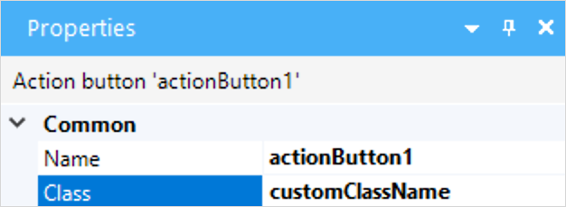{}

When you want to apply styling to one instance of a widget, you can extend that widget’s default class. Each widget's default class is named in the [Data Widgets](#understanding-data-widgets) section below. The example below shows how to extend a default class:

```javascript
export const ActionButton = {
	container: {
		// ViewStyle properties
		borderWidth: 3
	},
	caption: {
		// TextStyle properties
		fontSize: 20
	},
};
```

Add-on widgets each have their own default styling classes based on their full widget IDs (found in *{widget name}.xml*), and can be created by replacing the dots with underscores. The example below shows a pluggable widget’s default styling class:

```javascript
export const com_mendix_widget_native_badge_Badge = (Badge = {
	text: {
		// TextStyle properties
		color: "#00FF00",
	}
});
```

For more information on creating your own classes, see the [Creating Your Own Classes](/howto/mobile/how-to-use-native-styling#6-creating-your-own-classes) section in *How To Use Native Styling*. That document also shows how to use custom classes as design properties.

## 3  Data Widgets {#understanding-data-widgets}

Data widgets are essential to many Mendix apps. These widgets will allow your users to create and handle data objects, and can be customized to fit your app’s needs.

### 3.1 Data View Widget

The data view widget shows the contents of one data object. For more information about this widget, see [Data View](data-view).This widget has no user interface, so it does not support any styling.

### 3.2 List View Widget

The list view shows a list of objects arranged vertically or horizontally. For more information about this widget, see [List View](list-view). This is not the default list view, but how a list view widget could look in an app:

{}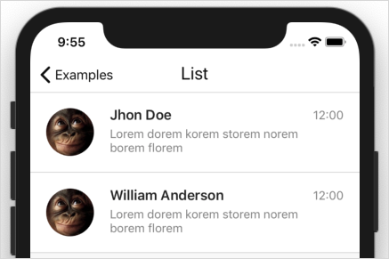{}

This is how the widget’s code is structured:

```xml
<container>
	<listItem>content</listItem>
	<listItem>content</listItem>
</container>
```

The widget’s style properties are as follows:

| Element | Style Properties    | Description |
| --- | --- | --- |
| `container` | All ViewStyle properties |       |
| `container` | `numColumns` | This is the number of columns that the list should render (this defaults to 1). |
| `listItem`  | All ViewStyle properties |          |

The default class to style all list views is named `ListView`.

## 4 Common Widgets

Common widgets are used in almost all app pages. Because of their ubiquity, learning to style common widgets will make a large difference for your apps.

### 4.1 Text

The text widget shows text which can optionally contain parameters. For more information on these widgets, see [Text Widgets](text). The widget’s style properties are as follows:

```xml
<container>
	<text>content</text>
</container>
```

| Element | Style Properties    | Description |
| --- | --- | --- |
| `container` | This has all ViewStyle properties. |                 |
| `text`      | This has all TextStyle properties. |                 |

The default class to style all texts is named `Text`.

### 4.2 Image {#image}

The image widget can be used to show a predefined image on a page, layout, or snippet. For more information on these widgets, see [Image Widgets](image). The widget’s style properties are as follows:

```xml
<container>
	<image/>
</container>
```

| Element | Style Properties    | Description |
| --- | --- | --- |
| `container` | This has all ViewStyle properties.  |       |
| `image`     | This has all ImageStyle properties. |       |


The default class to style all static image styles is named `Image`. Please note that images loaded from the model are styled with `NativeDynamicImage` as described in the [Image Viewer](#image-viewer) section below.

### 4.3 Page Title 

The page title widget shows the title of the page on which it is used. This can be the title defined on the page itself, or the override title defined when showing a page. For more information on this widget, consult [Page Title](page-title). The widget’s style properties are as follows:

```xml
<container>
	<text>Page Title</text>
</container>
```

| Element | Style Properties    | Description |
| --- | --- | --- |
| `container` | This has all ViewStyle properties. |                 |
| `text`      | This has all TextStyle properties. |                 |

The default class to style all page titles is named `PageTitle`.

## 5 Container Widgets

Container widgets are a set of tools that allow you to provide structure for your page’s content. There is also a specific widget called container widget detailed below. For more information on these widgets, see [Container Widgets](container-widgets).

### 5.1 Container 

A container widget can be used to style or hide a group of widgets. This widget does not have a visual representation by default, though styling can be used to add spacing. The widget’s style properties are as follows:

```xml
<container>
	content
</container>
```

| Element | Style Properties    | Description |
| --- | --- | --- |
| `container` | This has all ViewStyle properties. |        |

The default class to style all page titles is named `Container`.

### 5.2 Tab Container

Tab containers are used to show information categorized into multiple tab pages. Tab containers can help display information which exceeds a device’s screen space. This is how a default tab container widget could look in an app:

{}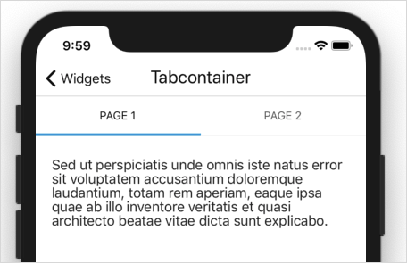{}

This is how the widget’s code is structured:

```xml
<container>
	<tabBar>
		<tab>
			<label>PAGE 1</label>
		</tab>
		<tab>
			<label>PAGE 2</label>
		</tab>
		<indicator>
	<tabBar>
	content
</container>
```

The widget’s style properties are as follows:

| Element | Style Properties    | Description |
| --- | --- | --- |
| `container` | This has all ViewStyle properties. |     |
| `tabBar`    | This has all ViewStyle properties. |     |
| `tabBar` | `bounces` | This is a Boolean value indicating whether the tab bar bounces when scrolling. |
| `tabBar` | `pressColor` | This is a color for material ripple (Android only). |
| `tabBar` | `pressOpacity` | This is opacity for a pressed tab. |
| `tabBar` | `scrollEnabled` | This is a Boolean value enabling scrollable tabs. |
| `tabBar` | `tabBarPosition` | This is the position of the tab bar in the tab view, and possible values are `top` and `bottom` (defaults to `top`). |
| `indicator` | This has all ViewStyle properties. |     |
| `tab`       | This has all ViewStyle properties. |     |
| `label`     | This has all TextStyle properties. |     |

The default class to style all tab containers is named `TabContainer`.

### 5.3 Scroll Container

A scroll container is used to make enable scrolling for a part of a page. This widget does not have a visual representation by default, though styling can be used to add spacing.  The widget’s style properties are as follows:

```xml
<container>
	scrollable content
</container>
```

| Element | Style Properties    | Description |
| --- | --- | --- |
| `container` | This has all ViewStyle properties. |            |

The default class to style all scroll containers is named `ScrollContainer`.

## 6 Input Widgets

Input widgets are typically used to show data to the user and allow them to edit data. For more information on these widgets, see [Input Widgets](input-widgets).

### 6.1 Text Box {#text-box}

A text box can be used to display or edit a textual value. This is how a text box widget with validation feedback and a plain text box widget could look in an app:

{}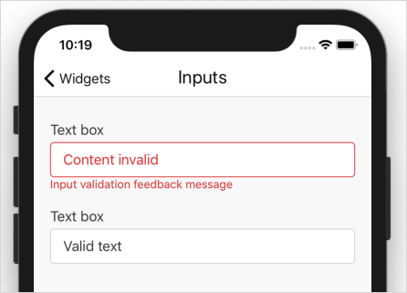{}

The widget’s style properties are structured as follows:

```xml
<container>
	<label>Text box</label>
	<inputError>Content invalid</inputError>
	<validationMessage>Input validation feedback message</validationMessage>
</container>
<container>
	<label>Text box</label>
	<input>Valid text</input>
</container>
```

| Element | Style Properties    | Description |
| --- | --- | --- |
| `container` | This has all ViewStyle properties.   |   |
| `input` | This has all TextStyle properties. |  |
| `input` | `autoCapitalize` | This automatically capitalizes certain characters when the user types:<br><br>* `characters`: capitalizes all characters<br>* `words`: capitalizes the first letter of each word<br>* `sentences`: capitalizes the first letter of each sentence (default)<br>* `none`: capitalizes nothing |
| `input` | `placeholderTextColor` | This is the text color of the placeholder string. |
| `input` | `selectionColor` | This is the highlight and cursor color of the text input. |
| `input` | `underlineColorAndroid` | This is the color of the `input` underline. |
| `inputError` | This has the same properties as `input`. |   |
| `label` | This has all TextStyle properties. |   |
| `label` | `numberOfLines` | This is the maximum number of lines to wrap the label text. If the text is any longer, it will be cut off with an ellipsis (this defaults to 1). |
| `validationMessage` | This has all TextStyle properties.   |    |

The default class to style all text boxes is named `TextBox`.

### 6.2 Text Area

A text box can be used to display or edit a textual value with multiple lines. This widget supports the same style properties and structure as the [Text Box](#text-box) widget above. This is how a text area widget with validation feedback and a plain text area widget could look in an app:

{}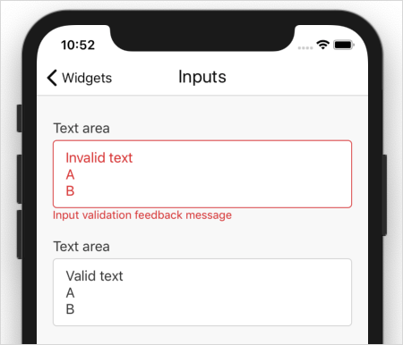{}

The default class to style all text areas is named `TextArea`.

### 6.3 Drop Down {#drop-down}

A drop down is an input widget that can be used to display and edit enumeration attributes. 

This is how a drop down widget could look in an iOS app: 

{}{}

This is how a drop down widget could look in an Android app:

{}{}

The widget’s style properties are as follows:

```xml
<container>
	<label>Drop down enumeration</label>
	<value>Content invalid</value>
	<validationMessage>Validation feedback enumeration</validationMessage>
</container>
<container>
	<label>Drop down enumeration</label>
	<value></value>
</container>
<picker>
	<pickerBackdropIOS/>
	<pickerTopIOS><button>close</button></pickerTopIOS>
	<pickerIOS>
		<pickerItemIOS>First</pickerItemIOS>
		<pickerItemIOS>Second</pickerItemIOS>
		<pickerItemIOS>Third</pickerItemIOS>
	</pickerIOS>
</picker>
```

| Element | Style Properties    | Description |
| --- | --- | --- |
| `container` | This has all ViewStyle properties. |  |
| `label` | This has all TextStyle properties. | |
| `label` | `numberOfLines` | The maximum number of lines to wrap the label text. If the text is any longer it will be cut off with an ellipsis. Defaults to `1`. |
| `pickerIOS` | This has all ViewStyle properties. |  |
| `pickerItemIOS` | This has all TextStyle properties. |   |
| `pickerBackdropIOS` | This has all ViewStyle properties. |   |
| `pickerTopIOS` | This has all ViewStyle properties. |  |
| `value`  | This has all TextStyle properties. | |
| `validationMessage` | This has all TextStyle properties. |    |

The default class to style all drop down inputs is named `DropDown`.

### 6.4 Check Box 

A check box input widget can be used to display and edit Boolean attributes and is rendered as a switch. This is how a check box widget could look in an app:

{}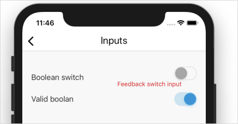{}

The widget’s style properties structure is as follows:

```xml
<container>
	<label>Boolean switch</label>
	<inputError>
		<trackColorOff/>
		<thumbColorOff/>
	</inputError>
	<validationMessage>Feedback switch input</validationMessage>
</container>
<container>
	<label>Valid boolean</label>
	<input>
		<trackColorOn/>
		<thumbColorOn/>
	</input>
</container>
```

| Element | Style Properties    | Description |
| --- | --- | --- |
| `container` | This has all ViewStyle properties.   |   |
| `input` | This has all TextStyle properties.   |   |
| `input` | `trackColorOn` | Custom color for the switch track when turned on. |
| `input` | `trackColorOff` | Custom color for the switch track when turned off. |
| `input` | `thumbColorOn` | Color of the foreground switch grip when turned on. If this is set on iOS, the switch grip will lose its drop shadow. |
| `input` | `thumbColorOff` | Color of the foreground switch grip when turned off. If this is set on iOS, the switch grip will lose its drop shadow. |
| `inputError` | This has the same properties as `input`. |  |
| `label` | This has all TextStyle properties.   |  |
| `label` | `numberOfLines` | The maximum number of lines to wrap the label text. If the text is any longer it will be cut off with an ellipsis. Defaults to `1`. |
| `validationMessage` | This has all TextStyle properties.   |  |

The default class to style all check box inputs is named `Checkbox`.

### 6.5 Date Picker

A date picker is an input widget that can be used to display and edit date or time attributes. This is how a date picker widget could look in an app:

{}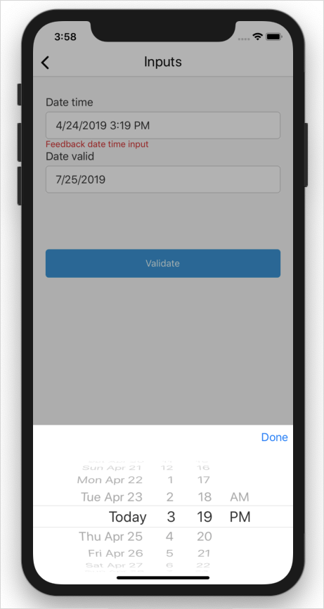{}

The widget’s style properties are as follows:

```xml
<container>
	<label>Drop down enumeration</label>
	<value>Content invalid</value>
	<validationMessage>Validation feedback enumeration</validationMessage>
</container>
```

| Element | Style Properties    | Description |
| --- | --- | --- |
| `container` | This has all ViewStyle properties. |  |
| `label` | This has all TextStyle properties. |  |
| `label`  | `numberOfLines` | This is the maximum number of lines to wrap the label text. If the text is any longer, it will be cut off with an ellipsis ( this defaults to `1`.) |
| `value` | This has all TextStyle properties. |  |
| `placeholder` | This has all TextStyle properties. |   |
| `validationMessage` | This has all TextStyle properties. |  |

The default class to style all date picker inputs is named `DatePicker`.

### 6.6 Reference selector

The reference selector is an input widget that can be used to display and edit associations. For more information on this widget, see [Reference Selector](reference-selector). This widget supports the same style properties and structure as the [drop down](#drop-down) widget above.

The default class to style all reference selector inputs is named `ReferenceSelector`.

## 7 File Widgets

File widgets help your user app manage images and other files. For more information on these widgets, see [File Widgets](file-widgets).

### 7.1 Image Viewer {#image-viewer}

An image viewer can be used to display an image. This widget supports the same style properties and structure as the [Image](#image) widget above.

The default class to style all image viewers is named  `NativeDynamicImage`.

## 8 Button Widgets

Button widgets help your user perform actions. For more information about these widgets, see [Button Widgets](button-widgets).

### 8.1 Action Button

An action button can perform various actions such as calling a nanoflow, opening a page. 

{}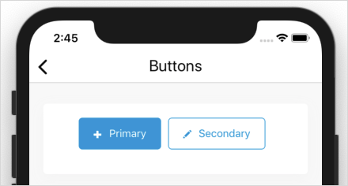{}

The widget’s style properties are as follows:

```xml
<container>
	<icon/><caption>primary</caption>
</container>
```

| Element | Style Properties    | Description |
| --- | --- | --- |
| `container` | This has all ViewStyle properties. |    |
| `container` | `rippleColor` | This is the color of the ripple on Android (this defaults to `rgba(0, 0, 0, 0.2)`). |
| `caption` | This has all TextStyle properties. |   |
| `icon` | This has all ViewStyle properties. |   |
| `icon` | `size` | This is the size of the button icon (this defaults to `12`). |
| `icon` | `color` | This is the color of the button icon. |

The default class to style all actions buttons is named `ActionButton`. However, an action button in a header has the default class `ActionButtonHeader`.

## 9 Navigation Widget 

The navigation widget allows users to navigate within your app using buttons on the top and bottom bars of your app’s pages. This is how a navigation widget could look in an app:

{}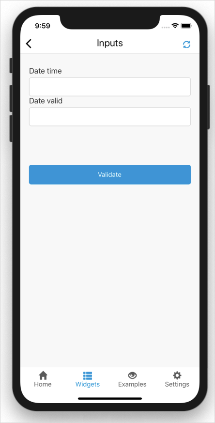{}

The widget’s style properties are as follows:

```xml
<app>
	<topBar/>
	application content
	<bottomBar/>
<app>
<progressOverlay>
	<background>
		<container>
			<activityIndicator/>
			<text/>
		</container>
	</background>
</progressOverlay>
```

| Element | Style Properties    | Description |
| --- | --- | --- |
| `topBar` | `backgroundColor` | This is the color of the background. |
| `topBar` | `backButtonColor` | This is the text color of the back button. |
| `topBar` | `titleAlignment` | This is the text alignment of the title. |
| `topBar` | `titleColor` | This is the text color of the title. |
| `topBar` | `titleFontFamily` | This is the font type of the title. |
| `topBar` | `titleFontSize` | This is the font size of the title. |
| `bottomBar` | `backgroundColor` | This is the color of the background. |
| `bottomBar` | `fontFamily` | This is the font type of the bottom bar text. |
| `bottomBar` | `fontSize` | This is the font size of the bottom bar text. |
| `bottomBar` | `color` | This is the default icon and text color. |
| `bottomBar` | `selectedColor` | This is the selected icon and text color. |
| `progressOverlay` | `background` | This has all ViewStyle properties. |
| `progressOverlay` | `container` | This has all ViewStyle properties. |
| `progressOverlay` | `activityIndicator` | This is the same as the [activity indicator](#activity-indicator) widget. |
| `progressOverlay` | `text` | This has all TextStyle properties. |

The default class to style the navigation is named  `navigationStyle`. There is no support for custom class styling on navigation.

## 10 Add-On Widgets

Add-on widgets are distributed through the [Native Mobile Resources](https://appstore.home.mendix.com/link/app/109513/) module, and are not shipped with Mendix Studio Pro. Other add-on widgets might also be distributed through starter apps, as well as modules importing pages from other projects. 

### 10.1 Activity Indicator {#activity-indicator}

The activity indicator widget displays a circular loading indicator. This is how an activity indicator widget could look in an app:

{}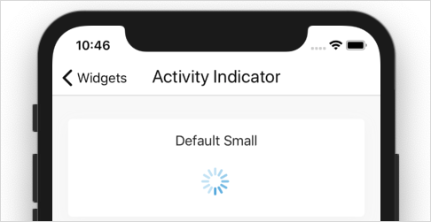{}

The widget’s style properties are as follows:

```javascript
<container>
	<indicator/>
</container>
```

| Element | Style Properties    | Description |
| --- | --- | --- |
| `container` | All ViewStyle properties |  |
| `indicator` | `color` | This is the color of the indicator (this defaults to `gray`). |
| `indicator` | `size` | Possible values for indicator are `large` and `small` (this defaults to `large`). |

The default class to style all activity indicators is named `com_mendix_widget_native_activityindicator_ActivityIndicator`.

### 10.2 App Events

The app events widget allows you to set actions when your app’s network status is changed, and can let you set limits on action calls. This widget has no user interface so does not support any styling.

### 10.3 Badge

The badge widget displays text or values as a badge. This is how a badge widget could look in an app:

{}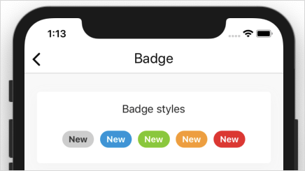{}

The widget’s style properties are as follows: 

```xml
<container>
	<text>New</text>
</container>
```

| Element | Style Properties    | Description |
| --- | --- | --- |
| `container` | This has all ViewStyle properties. |      |
| `text` | This has all TextStyle properties. |      |

The default class to style all badges is named `com_mendix_widget_native_badge_Badge`.

### 10.4 Barcode Scanner

The barcode scanner widget allows your app to scan barcodes and QR codes. This widget renders a camera view in a styleable container.

| Element | Style Properties    | Description |
| --- | --- | --- |
| `container` | This has all ViewStyle properties. |  |

The default class to style all barcode scanner widgets is named `com_mendix_widget_native_barcodescanner_BarcodeScanner`.

### 10.5 Feedback

The feedback widget allows users to give direct feedback. This is how a feedback widget could look in an app:

{}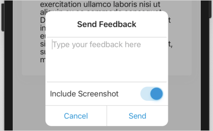{}

The widget’s style properties are as follows:

| Element | Style Properties    | Description |
| --- | --- | --- |
| `floatingButton` | This has all ViewStyle properties. |    |
| `dialog` | This has all ViewStyle properties. |  |
| `title` | This has all TextStyle properties. |  |
| `textAreaInput` | This has all TextStyle properties. |  |
| `textAreaInput` | `placeholderTextColor` | This is the text color of the placeholder string. |
| `textAreaInput` | `selectionColor` | This is the highlight and cursor color of the text input. |
| `textAreaInput` | `underlineColorAndroid` | This is the underline color for Android devices. |
| `textAreaInput` | `numberOfLines` | This is the height of the text area is based on this number of text lines. |
| `switchLabel` | This has all TextStyle properties. |   |
| `switchInput` | This has all TextStyle properties. |  |
| `switchInput` | `trackColorOn` | This is the custom color for the switch track when turned on. |
| `switchInput` | `trackColorOff` | This is the custom color for the switch track when turned off. |
| `switchInput` | `thumbColorOn` | This is the color of the foreground switch grip when turned on. If this is set on iOS, the switch grip will lose its drop shadow. |
| `switchInput` | `thumbColorOff` | This is the color of the foreground switch grip when turned off. If this is set on iOS, the switch grip will lose its drop shadow. |
| `button` | `borderColor` | This is the color of dialog button borders. |
| `button` | `borderWidth` | This is the width of dialog button borders. |
| `button` | `color` | This is the color of dialog button text. |
| `buttonDisabled` | `color` | This is the color of dialog button text when disabled. |
| `activityIndicator` | `color` | This is the color of the activity indicator that is shown while feedback is being submitted. |

The default class to style all feedback widgets is named `com_mendix_widget_native_feedback_Feedback`. 

### 10.6 Floating Action Button

The floating action button widget lets you customize the appearance and functionality of floating action buttons. The widget’s style properties are as follows:

| Element | Style Properties    | Description |
| --- | ---| --- |
| `container` | This has all ViewStyle properties. |  |
| `button` | This has all ViewStyle properties.  |  |
| `button` | `size` | This is the radius of the button. |
| `button` | `rippleColor` | This is the color of the ripple on Android. |
| `buttonIcon` | This has all ImageStyle properties. |  |
| `secondaryButton` | This has all ViewStyle properties.  |  |
| `secondaryButton` | `size` | This is the radius of the secondary buttons. |
| `secondaryButtonIcon` | This has all ImageStyle properties. |  |
| `secondaryButtonCaption` | This has all TextStyle properties.  |  |
| `secondaryButtonCaptionContainer` | This has all ViewStyle properties. |  |

The default class to style all floating actions buttons is named `com_mendix_widget_native_floatingactionbutton_FloatingActionButton`.

### 10.7 Maps

The maps widget supports various digital map providers. This is how a maps widget could look in an app:

{}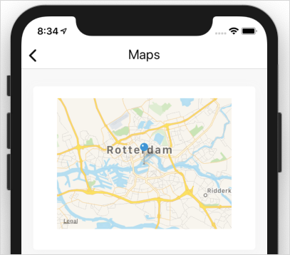{}

The widget’s style properties are as follows:

| Element | Style Properties    | Description |
| --- | --- | --- |
| `container` | This has all ViewStyle properties. |  |
| `loadingOverlay` | This has all ViewStyle properties. |  |
| `loadingIndicator` | `color` | This is the color of the loading indicator. |
| `marker` | `color` | This is the color of the location marker. |
| `marker` | `opacity` | This is the opacity of the location marker. |

The default class to style all map widgets is named `com_mendix_widget_native_maps_Maps`.

### 10.8 Notifications

The notifications widget lets you display a custom message in your app. This widget has no user interface so does not support any styling.

### 10.9 Progress Bar

The progress bar widget shows percentage of progress. This is how a progress bar widget could look in an app:

{}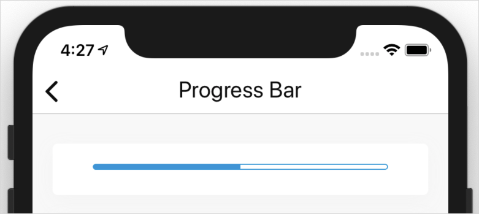{}

The widget’s style properties are as follows:

```xml
<container>
	<bar><fill/></bar>
	<validationMessage/>
</container>
```

| Element | Style Properties    | Description |
| --- | --- | --- |
| `container` | This has all ViewStyle properties. |  |
| `bar` | This has all ViewStyle properties. |  |
| `fill` | `backgroundColor` | This is the background color of the filled progress bar portion. |
| `validationMessage` | This has all TextStyle properties. |  |

The default class to style all progress bars is named `com_mendix_widget_native_progressbar_ProgressBar`.

### 10.10 Progress Circle

The progress circle widget displays progress in a circle using positive or negative values. This is how a progress circle widget could look in an app:

{}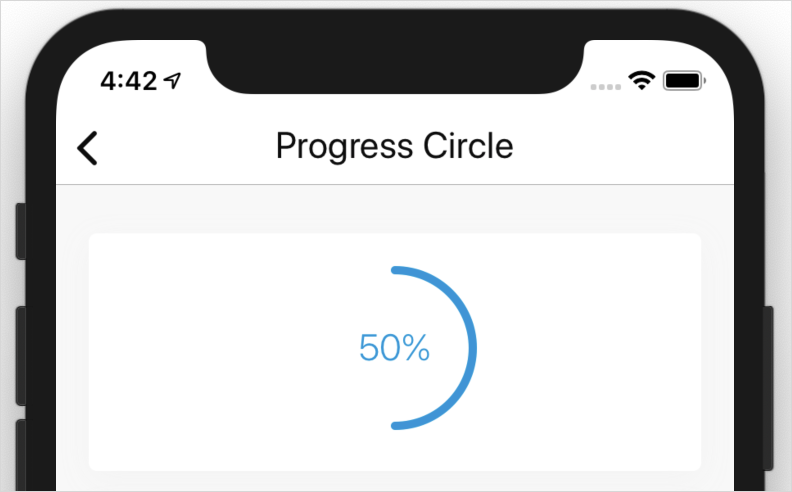{}

The widget’s style properties are as follows:

```xml
<container>
	<circle><fill/></circle>
	<validationMessage/>
</container>
```

| Element | Style Properties    | Description |
| --- | --- | --- |
| `container` | This has all ViewStyle properties. |  |
| `circle` | `size` | This is the radius of the progress circle. |
| `circle` | `borderWidth` | This is the border width of the progress circle. |
| `circle` | `borderColor` | This is the color of the progress circle border. |
| `fill` | `backgroundColor` | This is the color of the circle’s filled portion. |
| `fill` | `width` | This is the width of the progress circle. |
| `fill` | `lineCapRounded` | This determines if the rotating line’s front tip is rounded off or not. |
| `text` | This has all TextStyle properties. |  |
| `validationMessage` | This has all TextStyle properties. |  |

The default class to style all progress circles is named `com_mendix_widget_native_progresscircle_ProgressCircle`.

### 10.11 QR Code

The QR code widget generates a QR code based on a value, which a user can then scan. This is how a QR code widget could look in an app:

{}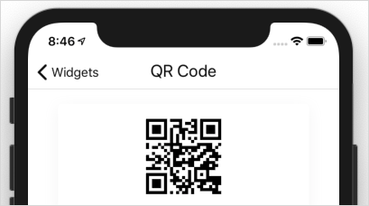{}

The widget’s style properties are as follows:

```xml
<container>
	<qrcode/>
</container>
```

| Element | Style Properties    | Description |
| --- | --- | --- |
| `container` | This has all ViewStyle properties. |   |
| `qrcode` | `size` | The size of the QR code. |
| `qrcode` | `color`| The color of the QR code. |
| `qrcode` | `backgroundColor` | The background color behind the QR code. |

The default class to style all QR codes is named `com_mendix_widget_native_qrcode_QRCode`.

### 10.12 Range Slider {#range-slider}

The range slider widget allows you to change a range of values using a slider with maximum and minimum bound values. This is how a range slider widget could look in an app:

{}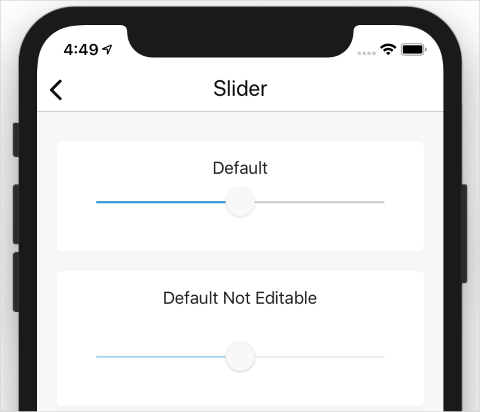{}

The widget’s style properties are as follows:

```xml
<container>
	<track><highlight/><marker/></track>
	<validationMessage/>
</container>

<container>
	<trackDisabled><highlightDisabled/><markerDisabled/></trackDisabled>
	<validationMessage/>
</container>
```

| Element | Style Properties    | Description |
| ---| --- | --- |
| `container` | This has all ViewStyle properties. |    |
| `track` | This has all ViewStyle properties. |    |
| `trackDisabled` | This has all ViewStyle properties. |    |
| `highlight` | This has all ViewStyle properties. |    |
| `highlightDisabled` | This has all ViewStyle properties. |    |
| `marker` | This has all ViewStyle properties. |    |
| `markerActive` | This has all ViewStyle properties. |    |
| `markerDisabled` | This has all ViewStyle properties. |    |
| `validationMessage` | This has all TextStyle properties. |    |

The default class to style all range slider inputs is named `com_mendix_widget_native_rangeslider_RangeSlider`.

### 10.13 Slider

The slider widget simply allows you to change a number value using a slider. This is how a slider widget could look in an app:

{}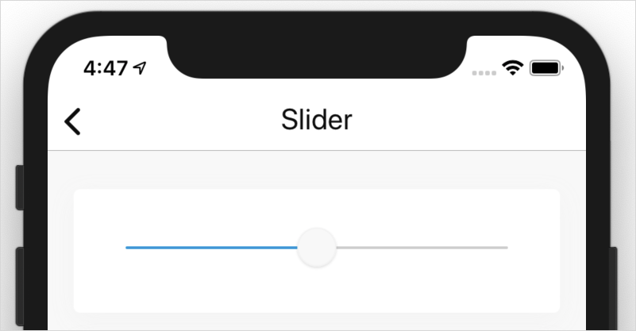{}

This widget supports the same style properties as the [range slider] (#range-slider) widget above.

The default class to style all slider inputs is named `com_mendix_widget_native_slider_Slider`.

### 10.14 Ratings

The ratings widget allows users to rate an object from 0 to 5. This is how a ratings widget could look in an app:

{}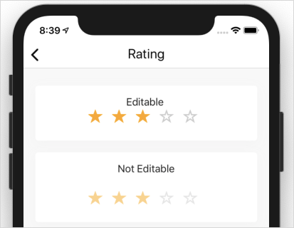{}

The widget’s style properties are as follows:

```xml
<container>
  <icon/><icon/><icon/><icon/><icon/>
</container>

<containerDisabled>
  <icon/><icon/><icon/><icon/><icon/>
</containerDisabled>
```

| Element | Style Properties    | Description |
| --- | --- | --- |
| `container` | This has all ViewStyle properties. |  |
| `containerDisabled` | This has all ViewStyle properties. |  |
| `icon` | This has all ViewStyle properties. |  |
| `icon` | `size` | The size of the icon. |
| `icon` | `color` | The color of the icon. |
| `icon` | `selectedColor` | The color of the icon when selected. |

The default class to style all rating inputs is named `com_mendix_widget_native_rating_Rating`.

### 10.15 Toggle Buttons

The toggle buttons widget allows you to set an enumeration attribute. This is how a toggle buttons widget could look in an app:

{}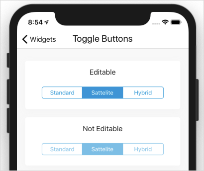{}

The widget’s style properties are as follows:

```xml
<container>
  <button><text>Standard</text></button>
  <activeButton><activeButtonText>Sattelite</activeButtonText></activeButton>
  <button><text>Hybrid</text></button>
  <validationMessage/>
</container>

<containerDisabled>
  <button><text>Standard</text></button>
  <activeButton><activeButtonText>Sattelite</activeButtonText></activeButton>
  <button><text>Hybrid</text></button>
  <validationMessage/>
</containerDisabled>
```

| Element | Style Properties    | Description |
| --- | --- | --- |
| `container` | This has all ViewStyle properties. |       |
| `containerDisabled` | This has all ViewStyle properties. |       |
| `button` | This has all ViewStyle properties. |       |
| `text` | This has all TextStyle properties. |       |
| `activeButton` | This has all ViewStyle properties. |       |
| `activeButtonText` | This has all TextStyle properties. |       |
| `validationMessage` | This has all TextStyle properties. |       |

The default class to style all toggle buttons is named `com_mendix_widget_native_togglebuttons_ToggleButtons`.

### 10.16 Video Player

The video player widget allows you to play video based on a URL, and is limited to MP4 only. This is how a video player widget could look in an app:

{}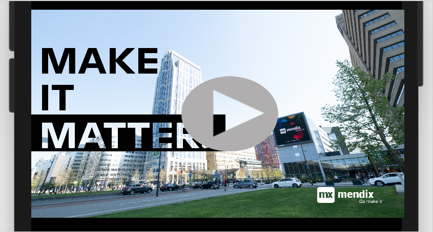{}

The widget’s style properties are as follows:

| Element | Style Properties    | Description |
| --- | --- | --- |
| `container` | This has all ViewStyle properties. |        |
| `indicator` | `color` | The loading indicator color. |
| `video` | This has all ViewStyle properties. |      |
| `errorMessage` | This has all TextStyle properties. |      |

The default class to style all video players is named `com_mendix_widget_native_videoplayer_VideoPlayer`.

### 10.17 Web View

The web view widget allows you to embed static or dynamic websites in your app. The widget’s style properties are as follows:

| Element | Style Properties    | Description |
| --- | --- | --- |
| `container` | This has all ViewStyle properties. |      |
| `errorContainer` | This has all ViewStyle properties. |      |
| `errorText` | This has all TextStyle properties. |     |

The default class to style all web views is named `com_mendix_widget_native_webview_WebView`. 

## 11 Read More

* [Style Your Mendix Native App](/howto/mobile/how-to-use-native-styling)
* [Implement Native Styling](/howto/mobile/native-styling)

