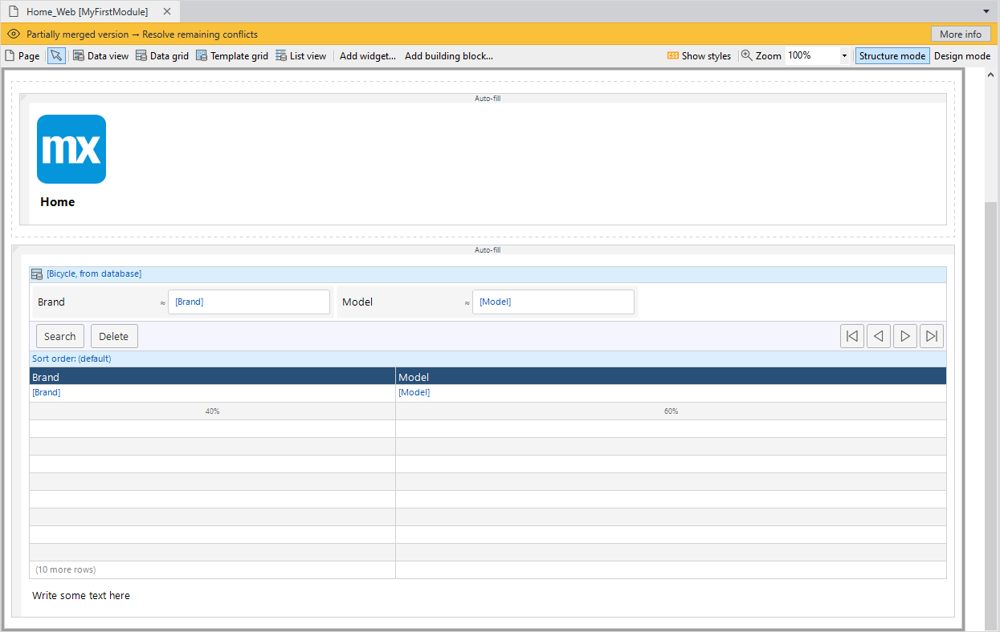

## 1 Introduction

A new merge algorithm with fine-grained conflict resolution is used when you update your app or merge changes in it. The new merge algorithm has the following features:

* **Fine-grained conflict resolution** – When there are conflicting changes in a document, you do not have to choose between whole documents: resolving a conflict using your change or using their change. Instead, you can resolve conflicts at the level of individual elements, such as widgets, entities, attributes, or microflow actions. Also, all non-conflicting changes from both sides are accepted automatically.
* **No conflicts on parallel changes to lists of widgets** – When two developers make changes to widgets in the same document there is no conflict, the changes are combined. However, if the changes are made too close to the same place in the document, a **list order conflict** is reported that reminds the developer who is merging the changes to decide on the final order of the widgets in the list. 

## 2 Enabling the New Algorithm with Fine-Grained Conflict Resolution

{}
Make sure that you repository is in a clean state: everything has been committed and there are no outstanding changes or conflicts. 
{}

To enable the new algorithm, do the following:

1. In the Studio Pro top bar, go to **Edit** > **Preferences** > **New features**. 
2. In the **Version Control** section, enable the **New merge algorithm with fine-grained conflict resolution** option.
3. Restart Studio Pro.

For more information, see [Preferences](preferences-dialog).

## 3 Resolving Conflict Example

A page document in your app is designed as shown below:

Your colleague makes the following changes in the main line:

* The text *Home* is changed to *Welcome!*
* A Mendix logo is added above the text *Welcome!*
* The subtitle *Welcome to your new app* is deleted
* A text *Write some text here* is added to the bottom layout grid

Your colleague's new document layout is shown below:

You make the following changes on a branch line:

* You change the text *Home* to *My homepage*
* You add a data grid inside the bottom layout grid

Your page is now laid out as shown below:

## 4 Resolving Conflicts

When you merge changes, the new algorithm shows you the following conflicts:

1. The text that both sides changed. 
2.  A **list order conflict**. Both of you added widgets to the bottom layout grid. The merge algorithm cannot guess the right order for the two new widgets and it reports the list order conflict. This is a reminder for you (the developer who is doing the merge) to look at the final layout and confirm the order. 

    

To start the resolution process, click the **Resolve...** button. The page is opened in a special mode with an orange tab:

The following non-conflicting changes have already been applied to the page:

* The Mendix logo is added above the text *Home* (main line)
* The subtitle is deleted (main line)
* The text widget is added to the bottom layout grid (main line)
* A data grid is added to the bottom layout grid (branch line)

### 4.1 Resolving the First Conflict

For the first conflict, you can inspect changes and decide which version to apply. Select one of the three lines that represent the conflict and choose **Resolve using Mine** or **Resolve using Theirs**. 

You will see the document update immediately after you click the button. If you are not satisfied with your choice, you can use undo to go back and try another option. 

{}
To use keyboard shortcuts <kbd>Ctrl</kbd>+<kbd>Z</kbd> and <kbd>Ctrl</kbd>+<kbd>Y</kbd> to undo your choice, click the document to focus it first.
{}

There is a third option to deal with a conflict: **Mark as Resolved**. This means that you do not choose any side to resolve the conflict and will keep things the way they were in the original. Neither of the new text changes will be applied.

Once you have chosen one of the three options to resolve the conflict, green checkmarks will appear to indicate that this conflict has been dealt with.

### 4.2 Resolving the Second Conflict

The second conflict is a list order conflict. It is a reminder to take a look at the order of the widgets in the 
layout grid. You can arrange the widgets in the desired order in the page editor and then choose **Mark as Resolved** for the list order conflict.

You can also decide to delete one of the widgets or add a new one. The document is fully editable while resolving conflicts. 

Some changes will make it impossible to resolve conflicts using **mine** or **theirs**. For example, if you have not resolved the first conflict yet and you delete the *Home* text widget, you cannot resolve the first conflict any more, because the widget is simply not there. At that point, you can only mark the conflict as resolved:

### 4.3 Finishing Conflict Resolution

Once all conflicts have been resolved, click the **Accept and Exit** button to finalize the results. The document will be saved in its merged form and the conflict for that document will be gone. The result is the document that contains changes from both sides and possibly some manual edits.

At any time, you can also choose to abort conflict resolution by clicking the **Cancel** button. The conflict will remain and you can resolve it later.
