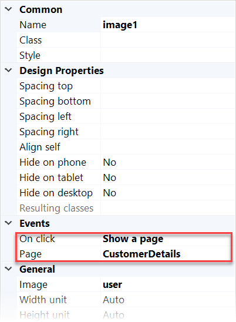

## 1 Introduction

## 2 On Click {#on-click}

An **On click** event specifies an event that is executed when a user clicks a widget. Often **On click** property is a part of the **Events** section in properties. For example, you can specify that when a user clicks a customer's profile image, the page with this customer's details will open:

{}
{}

On click event is common for many widgets, for example, an image, buttons, a list view. 

The **On click** property specifies what [action](#actions) is executed when a user click a widget.

## 3 Events

When an event is triggered, you can choose what action is triggered. Possible options are described below.

### 3.1 Event Actions{#actions}

* **Do nothing** – No action is taken. This option is useful for setting up a page without defining the underlying functionality yet.

* **Show a page** – the specified page opens.
  * **Page** – a [page](page) that should open. For more information opening pages function, see [Opening Pages](opening-pages).
  * **Page for specializations** – allows you to configure a different page for each specialization of the context object. If this action is placed inside a data view, it is possible to configure different page(s) for each specialization of the data view object. If this action is placed in a data grid, it is possible to configure different pages for each specialization of the data grid entity. This setting is not shown when there is not a context object or when the context object has no specializations.
* **Call a microflow** – the specified microflow is executed. 
* **Microflow** – a [microflow](microflow) that should be executed.
  * **Microflow settings** – specify what parameters will be passed to the microflow, whether to show a progress bar or not, etc. For more information on microflow settings, see [Starting Microflows](starting-microflows).
* **Call a nanoflow** – the specified nanoflow is executed.
  * **Nanoflow** – a [nanoflow](nanoflow) that should be executed.
* **Open link** – triggers an action based on a link type, some of which are specific to mobile devices.
  * **Link Type** – the type of action triggered when pressing the button. For information on available link types, see the [Link Types](#on-click-link-type) section below. 
  * **Address** – usage of the address property depends on the chosen link type. The property is used either as a URL (Web), as an email address (Email), or as a phone number (Call/Text). 
  * **Address value**  – allows you to specify an address if a literal value is selected in **Address**.
  * **Address attribute** – allows you to select an attribute if a attribute value is selected in **Address**. An address attribute specifies a path to an attribute. 
* **Create object** – Creates a new object.
  * **Entity (path)** – specifies which entity to create. It is also possible to choose an association (if available) from the context object. If an entity is configured, a new instance of the entity will be created. If an entity through association from the context object is configured, a new instance of the entity will be created and an object associated with the context will be created.
  * **On click page** – specifies which [page](page) with the new created object should be shown with the new created object. This page must accept a context parameter object (for example, a data view) with the same entity or a sub-type of the created entity.
* **Save changes** – commits all changes made on the page.
* **Sync automatically** – when an object is saved in a Mendix application running in an offline profile, this information is stored in a local database until it can be synchronized with the server (for more information on the capabilities of offline apps, see [Offline First](offline-first). In practice, this means that uploading a new object to the server requires two distinct actions: saving the object and [syncing it](offline-first#synchronization). This option indicates whether synchronization should happen when the save button is clicked.
  * **Close page** – indicates whether the current page should be closed.
* **Cancel changes** – Rolls back all changes made on the page.
* **Close page** – indicates whether the current page should be closed.
* **Close page** – Closes a pop-up window (for pop-up pages) or navigates to the previously visited page (for content pages).
* **Delete** – deletes an object. Its behavior depends on a data container it is placed in. When placed in a data view, deletes the connected object; it does not delete objects in a nested data view unless configured through delete behavior. When placed in a data grid, template grid, or reference set selector control bar, it deletes the selected object(s). When placed inside a list view, it deletes the corresponding list view item.
* **Close page** – indicates whether the current page should be closed.
* **Synchronize** – synchronizes the data stored locally on your device with the server database.
* **Sign out** – signs the currently signed-in user out. When no user is signed in, no action is performed.

### 3.2 Link Types {#on-click-link-type}

The table below described link types available for the **Open link** on click event:

| Value | Description |
| --- | --- |
| Web | Navigate to a website URL. |
| Email | Composes an email. |
| Call | Starts a phone call. |
| Text | Sends a text message. |

_Default value:_ Web

{}

When you configure **Email**, **Call**, or **Text** options, the corresponding default app will be opened on the device when the action is triggered, for example, the default email client will be opened to compose a message.

{}

## 4 Read More

* [Pages](pages)
* [Page](page)

