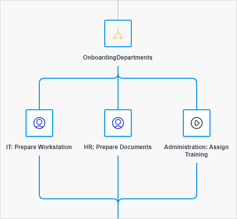

## 1 Introduction

The parallel split is used to have parallel processes in your workflow. For example, when onboarding a new employee, you can have several processes running in parallel: the HR preparing necessary documents, the IT department preparing a workstation, and the Administration department scheduling a training for the employee:

{}
The workflow needs to complete all paths of the parallel split before it can continue to the next activity.
{}

## 2 Properties

Parallel split properties consist of the following sections:

* [General](#general)
* [Paths](#paths)

### 2.1 General Section {#general}

#### 2.1.1 Name

**Name** is the internal name of the element. When referring to the element in the app project you will use this name. It must be unique within the workflow, but you can have two elements with the same name in different workflows. 

#### 2.1.2 Caption

The **Caption** describes what happens in this element. It is displayed in the workflow element to make the workflow easier to read and understand without needing to add annotations.

### 2.2 Paths Section {#paths}

The **Paths** property allows you to add as many paths as there are parallel processes. 

## 3 Read More

* [Workflow Properties](workflow-properties)