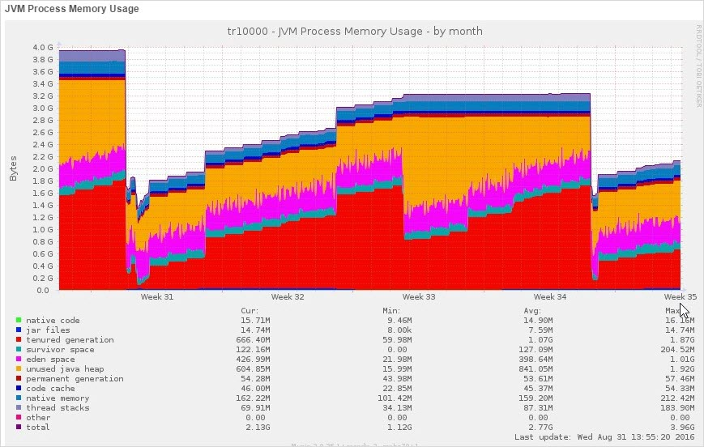
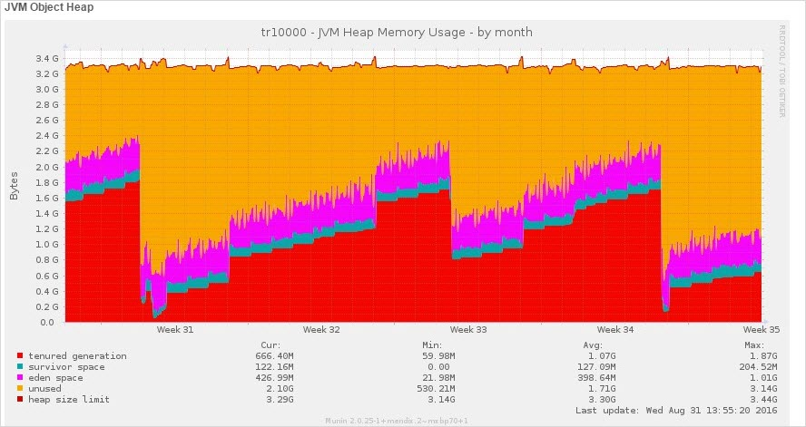
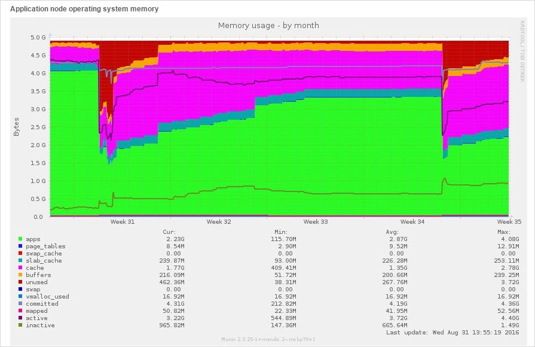

## 1 Introduction
When you're developing or running Mendix you will sooner or later come in contact with Java. In this document we'll explain some of the basic concepts of Java in Mendix.

## 2 Concepts
The Java concepts are listed below.

### 2.1 Java Virtual Machine (JVM)
When using Mendix you will use it together with Java (JDK) to deploy and run the actual application in a Java Virtual Machine (JVM). The JVM is a container in which the Mendix application runs. It looks like this:

Or as shown in the Mendix Cloud:

### 2.2 PermGen

The [Permanent Generation](https://docs.oracle.com/javase/7/docs/webnotes/tsg/TSG-VM/html/tooldescr.html#gblmm) (PermGen) holds classes and libraries, which are only loaded into the PermGen when they are actually used. It is not part of the Java Heap space and in Java8 it no longer exists and is replaced by something called Metadata. These concepts mostly relate to the libraries you add in the userlib directory of your project. Once they are used somewhere in a microflow (through a Java call) they will be added to the PermGen (Java 7 and prior) or the Metadata (Java 8). So if you see any errors related to these two terms, you know where to start looking.

### 2.3 Stack

Another interesting area is the Stack. This is what holds, among other things, all information about microflows, domain models and other Mendix specific information. Any microflow that is executed will also end up in the stack (see *thread stacks* in the graph above).

### 2.4 Heap, Garbage Collector and OOM Errors

Next up is the heap space (Heap). But before we go into that, let’s briefly discuss another important part of the JVM: the Garbage Collector (GC).

A GC is responsible for:

*   allocating memory
*   ensuring that any referenced objects remain in memory
*   recovering memory used by objects that are no longer reachable from references in executing code

Simply put, any object in the Heap that is currently in use (which is a fairly broad concept) is considered to be alive. Any object that is no longer used is considered dead. The GC takes care of removing all these dead objects to free up memory in the Heap again.

A GC is not responsible for preventing out of memory errors (OOM errors) in itself. You could, for example, keep creating objects indefinitely, and since they will stay alive until you are done doing so, the GC wouldn’t even touch those objects, but you would still end up with an OOM error.

Back to the Heap. We can divide it into three parts:

1.  Eden Space (young generation)
2.  Survivor Space (young generation)
3.  Tenured Generation (old generation)

When the GC executes a minor garbage collection it will try to clean up all the objects in the young generation only. If it fails to clean up an Eden Space object it will move it to the Survivor Space. If it fails to clean up a Survivor Space object enough times, it will move it to the Tenured Generation. If the Tenured Generation grows large enough (around 60% of the total space available to the Heap) it will execute a major garbage collection and try to clean up all the objects in both the young and the old generation. So a healthy JVM would have a Heap that goes up and down in relation to its memory usage in the various parts.

You can see this quite well in the following JVM Object Heap graph taken from the Mendix Cloud:

The purple and green spikes are minor garbage collections. The large drops in the red part are major garbage collections. This is a healthy looking Heap.

### 2.5 Application Server

And finally a Mendix Cloud graph where all of the above comes together:

The green part (apps) is basically the JVM in which the Mendix application is running. Anything else is reserved for the operating system of the application server.

## 3 Related Content

* [Transient Objects & Garbage Collecting](transient-objects-garbage-collecting)
* [Java Memory Usage](java-memory-usage)
* [Common Runtime & Java Errors](runtime-java-errors)

