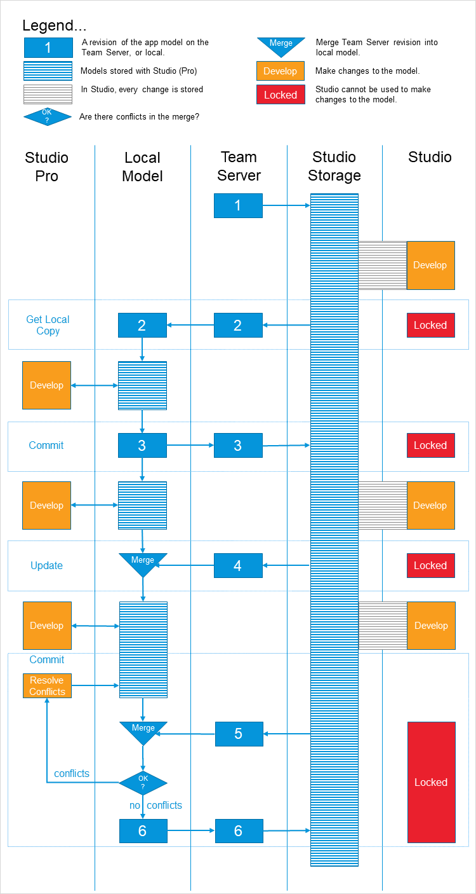
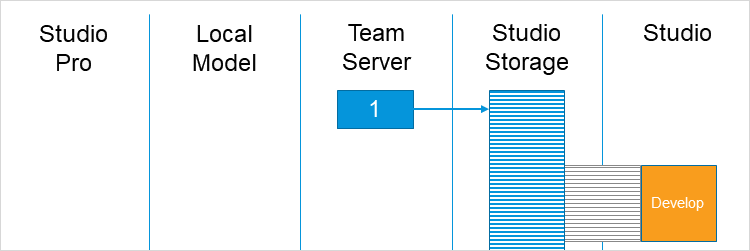
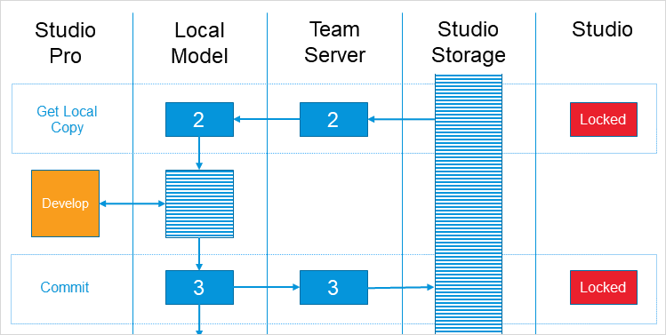

## 1 Introduction

Version Control allows you to manage your app development in two ways:

* Firstly, it allows you to store (*commit*) the current revision of your model and all its resources. You give it an identifier so that you can get that revision again and share it with other team members.
* Secondly, it allows work to take place on multiple *development lines* so that several different features can be worked on at once. These development lines can then be *merged* back together so that your *main line* contains all the completed features that have been worked on separately.

Version control in Mendix is built on top of [Apache Subversion](https://subversion.apache.org/) and the concepts will be familiar to Subversion users. Mendix simplifies Subversion commands by building them into the Modelers and Developer Portal.

## 2 Concepts

### 2.1 Team Server

The Team Server is where all the committed versions of Mendix app projects are stored. If you commit a revision of an app, it is stored on the Team Server.

To commit to the Team Server you will need to have a role in the project which allows you to edit the project. For more information, see section [App Team Roles](/developerportal/company-app-roles#app-team-roles) in *Company & App Roles*.

### 2.2 Repository

Within the *Team Server* each app is stored in a repository. This repository contains all the *committed revisions* for the *branches* of the app.

### 2.3 Revision

A revision is the version of your app at a moment in time, stored on the *Team Server*.

Each revision of your app is given a unique number to identify it and enable you to find it in future. A new revision is created from the *Desktop Modeler* when the app is committed to the Repository.

### 2.4 Working Copy

A working copy is the version of your app which is currently being worked on in the Modelers. There is one working copy, the local model, for each development line of the app when it is being developed with the Desktop Modeler. This model is held locally, on each computer where development work is taking place.

There is also one working copy, held in the *cloud*, which is worked on by the Web Modeler. Only one developer at a time can edit this.

### 2.5 Merge

Merging is the action of taking one *revision* of an app and applying the differences which have been made in a different revision. See section 3.3, [Merging Branches](#merging-branches) for more information.

If any of the differences cannot be applied, then there is a *conflict*.

### 2.6 Conflict

A conflict occurs when a revision of the app cannot be merged into the working copy automatically. This happens when the same document has been changed in two different places and these changes cannot be reconciled. Examples are the following:

* the properties of a widget are changed in both places but to different settings
* a document is moved or deleted in one place but has been changed in a different way in the other place.

When a conflict occurs, a developer has to intervene to decide how it should be resolved before it can be committed to the Team Server as a new revision.

### 2.7 Update

Updating is the action, invoked in the Desktop Modeler, which gets the latest revision of the current *development line* from the Team Server repository and merges the differences into the current working copy.

### 2.8 Commit

Committing is the action, invoked in the Desktop Modeler, of sending all your changes to the *repository* and making a new *revision*.

### 2.9 Development Line

Development of an app is done in a Development Line where a set of related changes is made. There are two types of Development Line: *Main Lines* and *Branch Lines.*

#### 2.9.1 Main Line

The Main Line is the initial development line for the app and is usually kept as the version which will be deployed to the production environment. Simple apps, and apps which do not require a high degree of collaboration, may only have a main line.

#### 2.9.2 Branch Line

A Branch line is a way of making an independent set of changes which can be tested away from the Main Line.

See section 3, [Branches](#branches), for more information on how branch lines can be used.

### 2.10 Tag

A Tag is a way of identifying a commit in addition to the *revision* number. It is specified by the developer and has four parts:

* Major: used to identify significant new functionality, a new user interface, or other important change
* Minor: used to identify new functionality which augments the main function of the app
* Patch: used to identify a *fix* to an error in a previously-released app
* Revision: this is added automatically and is the revision number of the commit

## 3 Branches{#branches}

With more complex apps, you may want to manage your code in a more sophisticated way. For example, you may want to develop new features separately from the currently deployed version of your app so that you can fix any bugs without having to release all the new features.

This is done using *branch lines*.

### 3.1 Main Line

All apps are developed along the main line (also referred to as *trunk*). Here you have all development happening along a single line, with all changes built upon the previous revision:

### 3.2 Branch Line

When you add a branch line, you take a copy of an existing *revision* and work separately on that copy. Changes made to one branch do not impact any other branches.

In Mendix each revision within a *repository* is given a unique version number. This means that version numbers given to revisions along any chosen branch line may not be consecutive.

### Merging Branches{#merging-branches}

You may have a branch line which will continue independently and never need to be combined with any other development lines. For example, you may create a branch for a particular release of your app and only ever use it to fix bugs in that release.

On the other hand, you may want to add the features from one branch line into another development line. Two cases for doing this are:

* you develop new features in a branch line and want to include them in your main development line
* you want to take advantage of a bug fix which was made on another branch line

You can merge a specific revision of a branch line into your current *working copy*. If, for example, you were working on the main line updated to revision 6, you can *merge* revision 5 from another branch line into your working copy. Then you can commit the result to create revision 7.

There may be conflicts during the merge, and these will have to be resolved before you can commit your app.

Note that *errors* can be introduced by the *merge* process even if no conflicts are identified during the merge. Errors are inconsistencies which are flagged in the Modelers and will prevent the app from being deployed. They could lead to a revision not being deployable, so it is important to check for errors after you have done a merge.
