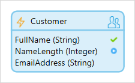
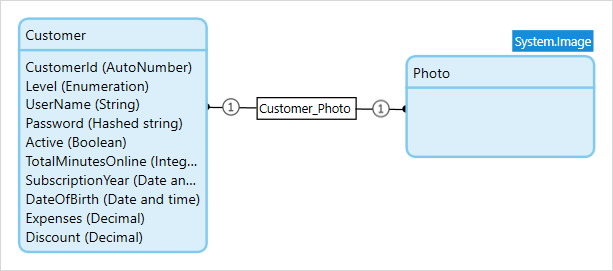

{}
 For the Simplified Chinese translation, click [中文译文](https://cdn.mendix.tencent-cloud.com/documentation/attributes.pdf).
{}

## 1 Introduction

**Attributes** are characteristics that describe and/or identify an entity. Each of these attributes is given a name.

A **Customer**, for example, typically has attributes for the name of the customer (for example, **FullName**), an e-mail address (for example, **EmailAddress**) and other personal information.

The domain model editor uses the following symbols to help visualize attribute properties:

| Symbol | Description |
| --- | --- |
|  | This attribute has one or more validation rules. |
|  | This attribute has a microflow that calculates the value of the attribute. |

{}
Attributes for external entities are specified in the **External Entity Properties**. These attributes are defined in the originating app and the only local changes that can be applied to these entities is a local name and description. For further information see the [Attributes](external-entities#attributes) section of *External Entities*.
{}

## 2 Properties

You can add attributes to an entity from the [entity properties dialog box](entities#dialog-box). You can also edit them from this dialog box, or by double-clicking the attribute name in the domain model.

{}
You can **Add** new attributes to [external entities](external-entities#attributes), **Edit** some of the attribute properties, or **Delete** them. However, the changes will only apply locally, and the values in the originating app will not be affected. For more information on operations on attributes of external entities, see the [Attributes](external-entities#attributes) section of *External Entities*.
{}

An example of the attribute properties is represented in the image below:

Attribute properties consist of the following sections:

* [Common](#common)
* [Type](#type)
* [Value](#value)
* [Limitations](#limitations)

### 2.1 Common Section {#common}

#### 2.1.1 Name

The **Name** property specifies the name of the attribute. This name is used to refer to the attribute in forms, microflows, queries, constraints, and so forth.

{}
If you delete an attribute in your entity and then create a new attribute with the same name, Mendix will consider it a new and different attribute. This means that upon deployment the old column will be dropped, including its data. Then a new, empty, column with the same name will be created.
{}

#### 2.1.3 Documentation

This allows you to describe aspects of the entity which may be useful to you or other team members when using the entity within the app.

### 2.2 Type Section {#type}

#### 2.2.1 Type

The type property defines the type of data that can be stored in the attribute. These are related to the data types described in [Data Types](data-types), but there is not a one-to-one mapping.

{}
Mendix allows you to change attribute and association types on existing domain models. While some attributes can easily be converted, there are limitations and consequences of converting between some types. For more information, see [Attributes Type Migration](attributes-type-migration).
{}

An attribute has one of the following types:

Type | Possible values | Maps to Mendix data type |
--- | --- | --- |
AutoNumber | A positive or negative whole number. AutoNumber attributes are automatically generated numbers. The default value of the attribute determines the first number that will be generated. Each created object will have an AutoNumber that is one greater than the previous one. AutoNumbers can only be used for persistable entities as the AutoNumber value is computed in the database. | Integer/Long |
Binary<small>[1]</small> | Binary data. Can only be used for persistable entities as the data is stored in the database. For example an entire file. In most cases you want to use an association to a FileDocument or Image to store file contents. | Binary |
Boolean | True or false. | Boolean | 
Date and time | A point in time consisting of a date and a time component accurate up to milliseconds. | Date and time |
Decimal | A positive or negative number that can have digits after the decimal point. The Decimal type can be used for high-precision calculations. Use this type to represent amounts of money for example. When a Decimal type attribute is persisted in the database its value is validated against 2 conditions. In case the number of digits of the integral part (before the decimal separator) is more than 20, an exception is thrown. In case the number of digits of the fractional part (after the decimal separator) is more than 8, the fractional value is automatically rounded according to [the round half to even rule (also known as bankers' rounding)](https://en.wikipedia.org/wiki/Rounding#Round_half_to_even). Therefore the the maximum allowable value for the Decimal type is 99999999999999999999.99999999. | Decimal |
Enumeration | A list of predefined attributes. For more information, see [Enumerations](enumerations). | Enumeration |
Hashed string | A string which is hashed using the algorithm specified in the [project settings](project-settings#hash-algorithm). This can be used to store password hashes, for example, so that the original password is not recorded in the database.  | String |
Integer | A whole number that can be positive (maximum 231-1, thus 2147483647), negative (minimum -231, thus -2147483648), or zero. | Integer/Long |
Long | A whole number that can be positive (maximum 263-1), negative (minimum -263), or zero. | Integer/Long |
String *(default)* | A text containing letters, spaces, numbers and other characters. | String |

<small>[1]</small>The maximum size that can approximately be stored in an attribute of type binary depends on the database:

| HSQLDB | PostgreSQL | SQL Server | Oracle |
| --- | --- | --- | --- |
| 1 MB | 1 GB | 2 GB | 128 TB or limited by hard disk of server |

**Example**

In a web shop, you want to store the id, profile photo, level (for service quality), user name, password, activity, total of minutes spent online, year of subscription, date of birth, total amount of expenses and the standard amount of discount for a customer.

The **CustomerId** should be unique for every customer, so this attribute has type **AutoNumber**.

The **Photo** is represented by an association to an entity that specializes Image. You do not use a Binary attribute for this purpose.

**Level** has three possible values: High, Medium and Low. This is stored in an attribute of type **Enumeration**.

The **Password** itself should not be stored, but only its hash value, thus it is stored in an attribute of type **Hashed string**.

A customer can be active or inactive, which is stored in an attribute named **Active** of type **Boolean**.

#### 2.2.2 Localize

{}
This property is shown if **Type** is set to **Date and time**.
{}

This property indicates whether the date and time should be localized. By default localization is enabled. If you are _not_ interested in the time component of a date (for example, a birthday), you should set this property to 'No'. Otherwise, the date can change because of time zone differences: a date and time early in the morning on April 2nd in Europe will be on April 1st in the U.S.A.

In technical terms, this property indicates whether the client assumes that the date and time are in a local time zone (Yes) or in UTC (No). In the former case, the date is first converted to UTC before being sent to the server and converted from UTC before being displayed.

Default: *Yes*

#### 2.2.3 Enumeration

{}
This property is shown if **Type** is set to **Enumeration**.
{}

The enumeration property indicates which enumeration defines the possible values for this attribute.

#### 2.2.4 Length

{}
This property is shown if **Type** is set to **String**.
{}

This property specifies whether the length of a String is limited or unlimited. In the case of a limited length, the 'Max length' property specifies the maximum (see below).

Default: *Limited*

#### 2.2.5 Max Length (Only for String Attribute Type)

{}
This property is shown if **Type** is set to **String**.
{}

The 'Max length' property specifies the number of characters that can be stored in the attribute.

Default: *200*

### 2.3 Value Section {#value}

#### 2.3.1 Value

The **Value** determines whether the value of the attribute is **Calculated** by a microflow or **Stored** in the database.

Take note of the following things when using **Calculated** attributes:

* Each time an object with a calculated attribute is retrieved, the attribute is calculated. Depending on the complexity of the microflow and the number of objects you retrieve this can have impact on performance.
* Attributes that are calculated by a microflow are not stored in the database.
* It is not possible to sort on an attribute for which this property is used, because sorting is done by the database engine.
* Uncommitted associated objects cannot be retrieved in calculated attributes.

#### 2.3.2 Microflow

{}
This property is shown if **Value** is set to **Calculated**.
{}

If the value is a computation, the **Microflow** property defines which microflow defines this computation to calculate the value of the attribute when the object is retrieved. The microflow should have a parameter of the type of the entity of the attribute and it should return a value with the same type as the attribute.

For example, in a web shop, you want to show the total expenses for each customer. These are calculated by retrieving all orders associated with the customer and adding their totals.

#### 2.3.3 Default Value

{}
This property is shown if **Value** is set to **Stored**.
{}

The **Default value** property defines the value of this attribute when an object is created. The default value should be compatible with the type of the attribute.

| Type of Attribute | Default Value When Not Specified | Additional Comments |
| --- | --- | --- |
| AutoNumber | 1 | Starting value of this attribute. If there are already objects of this entity, the AutoNumber values will be based on the right 32 bits of the id column value. This can cause gaps in the AutoNumber ranges with jumps of 100, because id values are reserved by the Runtime in blocks of 100. |
| Binary | N/A |   |
| Boolean | False |   |
| Date and time | (empty) | The default value can either be a UTC date with the format `year-month-day` (suffixed optionally by ` hour:minute`, or ` hours:minute:second`), or `[%CurrentDateTime%]` (which sets the value of this attribute to the date and time when the object is created). |
| Decimal | 0 |   |
| Enumeration | (empty) |   |
| Hashed string | (empty) |   |
| Integer | 0 |   |
| Long | 0 |   |
| String | (empty) |   |

### 2.4 Limitations {#limitations}

The **Limitations** property specifies whether the attribute can be used for filtering and sorting:

* **Non-sortable** – the attribute cannot be used for sorting (for example, you cannot use this attribute in the sort bar of a data grid or for sorting in a Retrieve action)
* **Non-filterable** – the attribute cannot be used for filtering (for example, you cannot use this attribute in XPath constraints or for filtering in a list operation)

Some attribute types in Mendix always have limitations:

* Hashed string attributes are non-filterable
* Binary attributes are non-sortable and non-filterable
* Calculated attributes are non-sortable and non-filterable
