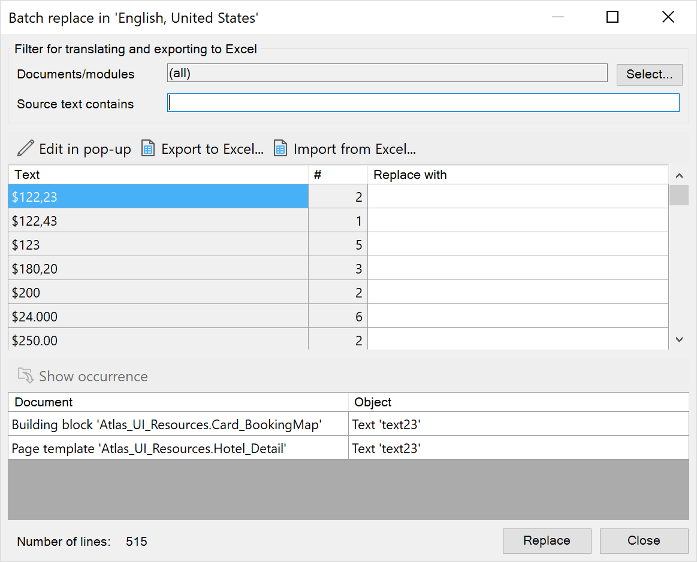
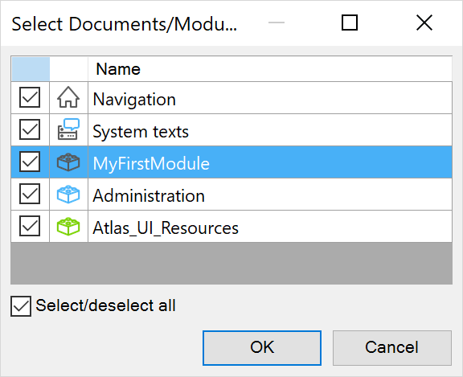
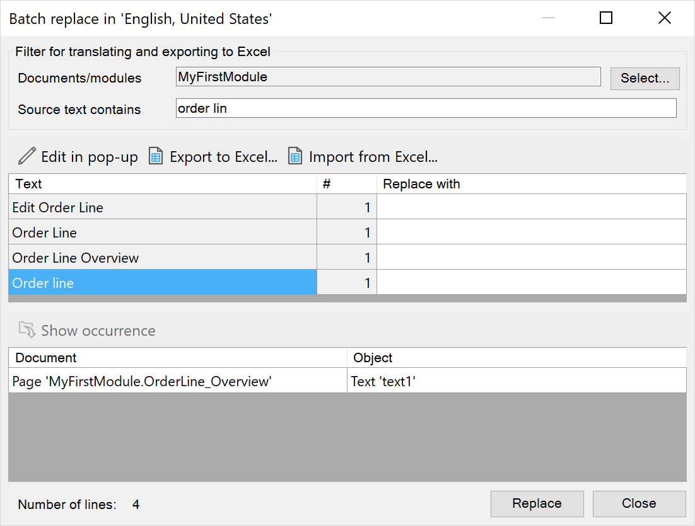
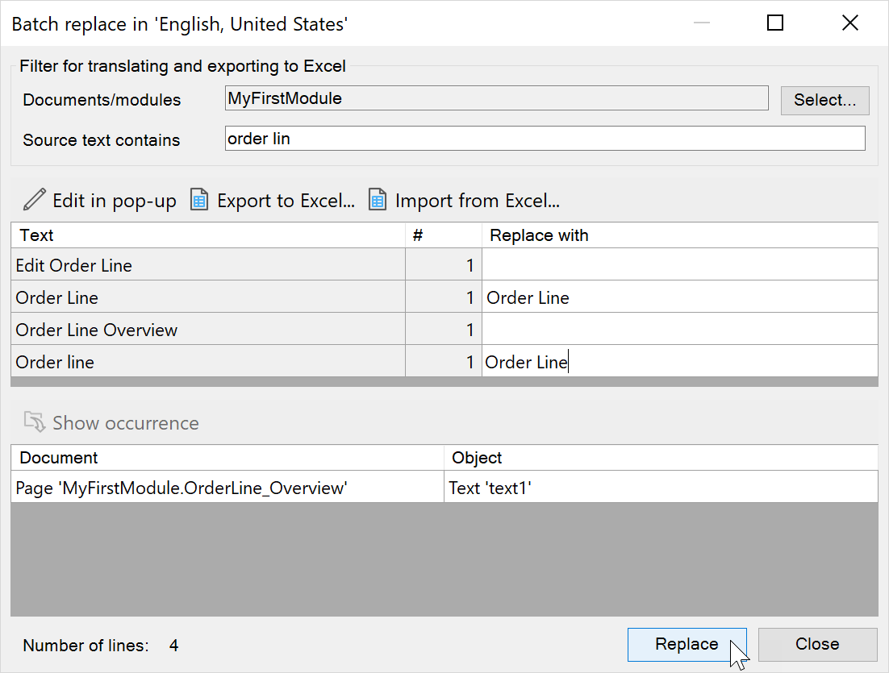
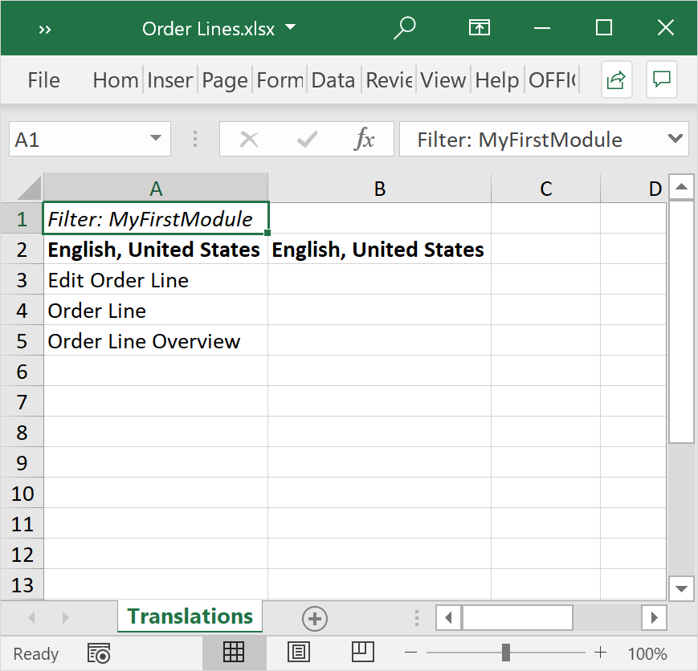

{}
 For the Simplified Chinese translation, click [中文译文](https://cdn.mendix.tencent-cloud.com/documentation/batch-replace.pdf).
{}

## 1 Introduction

**Batch replace** works on the currently selected language and allows you to replace any existing texts with a new one.

There are a number of reasons that you may wish to do this:

* The same text should appear in different places in the app, however, it has been entered inconsistently, for example sometimes with capital letters and sometimes not — if you reuse existing text across your app, this will improve the user experience
* If all occurrences of a piece of text are identical, you only need to enter the translation once — this saves time and improves consistency
* If you find better wording for a common label or text, you can change them all at once with a single command

## 2 Using Batch Replace

Batch replace works on the currently selected language, so first you should select the language you want to work on. For more information, see the [Working in the Currently Selected Language](translatable-texts#selected-language) section in *Language Menu*.

### 2.1 Documents/modules

You can select one or more modules you want to use for batch translate. For example, you may want to ignore texts from imported and system modules in the default language, or concentrate on translating just the system messages into your chosen language.

Click **Select…** and check the modules you want to work on.

The default is to work on all modules in the app.

### 2.2 Source Text Contains

To search for phrases that are similar, type what you want to search for.

By default, all the translatable text from the selected module(s) will be shown.

Each found text will be displayed in the **Text** column.
The **#** column shows the number of times it occurs in the selected module(s).

If you select a line, you can look in the **Show occurrence** section to see the **Object** containing the text and the **Document** it appears in. Double-clicking or clicking **Show occurrence** will open the document and select the object so you can easily see the context.

{}
Tip: move the dialog box to one side to get a better look at the document.
{}

### 2.3 Replace With

In **Replace with**, type new text that you want to use instead of the existing text. Click **Replace** to confirm the replacement.

Identical replacement and original texts will be combined into a single entry.

## 3 Exporting & Importing Text

If you want to translate a language outside Studio Pro, you can export the translatable texts to the Microsoft Excel (*.xlsx*) format, make changes, and then import the changes from the updated Excel file.

This is particularly useful if you are working on multiple apps and have already got text for, say, the system modules which you want to reuse.

### 3.1 Export to Excel

Click **Export to Excel…** to export the currently displayed text items to a Microsoft Excel (*.xlsx*) format file.

The file will be in the format shown below:

**Row 1** – *Filter:* indicates the modules which are included in the exported file.

**Row 2**  – indicates the language. The first column represents the current text, the second column the *replace with* text.

**Rows 3+**  – show the current texts

You can make changes in column B which will be processed if the file is imported.

### 3.2 Import from Excel

Click **Import from Excel…** to import a correctly-constructed Microsoft Excel (*.xlsx*) format file.

This does the following:

* The selected module(s) are set to the ones in the *Filter:* line of the file
* Any texts which are empty in column B will be ignored
* Any texts in column A which do not match translatable texts in the selected module(s) will be ignored
* Any text in column B which is not ignored is entered into the **Replace with** column

Changes will only be made if you click **Replace**.

{}
The formats of the Excel files for batch replace and batch translate are similar. You will be warned if you try to import a batch translate file or a batch replace file with the wrong language but you can still import it if you ignore the warning.
{}
