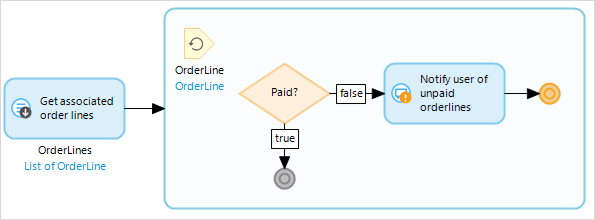

{}
 For the Simplified Chinese translation, click [中文译文](https://cdn.mendix.tencent-cloud.com/documentation/break-event.pdf).
{}

## 1 Introduction

{}
Break events can only be used inside [loops](loop).
{}

A break event is used to stop iterating over the list of objects and continue with the rest of the flow. Without a break event, the loop will continue with the iteration of the next object.

For example, if you want to notify the user of any unpaid order lines you can use a break event. First, you retrieve all objects of the *OrderLine* entity that are associated with the order. You check whether each order line is paid or not. If the order line is paid, the microflow continues to the next order line. However, if an unpaid order line is found, the user is notified and the loop stops; the microflow breaks from the loop and continues with the rest of the microflow. Once you have found one unpaid order line you do not have to continue iterating over the rest of the order lines.

## 2 Read More

* [Loop](loop)
* [Continue Event](continue-event)