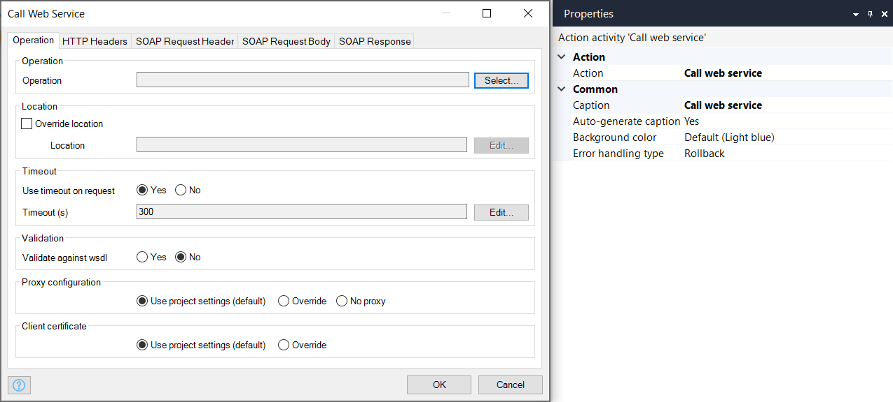
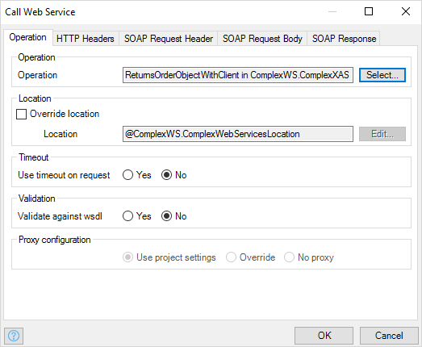
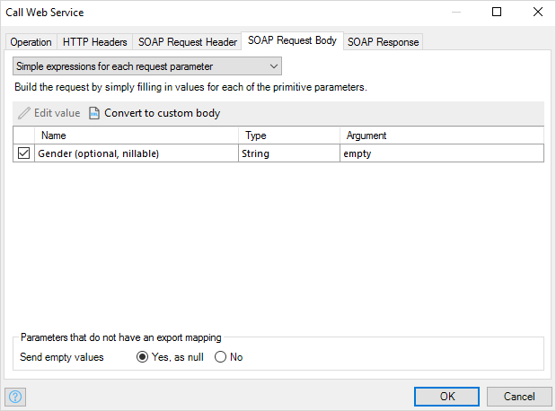

{}
 For the Simplified Chinese translation, click [中文译文](https://cdn.mendix.tencent-cloud.com/documentation/).
{}

{}
 This activity can only be used in **Microflows**.
{}

## 1 Introduction

The **Call web service** activity can be used to call one of the [imported web service](consumed-web-services) operations. You can specify whether or not to use authentication, what the request should look like and how the response of the web service should be handled.

## 2 Properties

An example of call web service properties is represented in the image below:

There are two sets of properties for this activity, those in the dialog box on the left, and those in the properties pane on the right.

The call web service properties pane consists of the following sections:

* [Action](#action)
* [Common](#common)

## 3 Action Section{#action}

The **Action** section of the properties pane shows the action associated with this activity.

You can open a dialog box to configure this action by clicking the ellipsis (**…**) next to the action.

You can also open the dialog box by double-clicking the activity in the microflow or right-clicking the activity and selecting **Properties**.

The properties dialog box consists of five tabs:

* [Operation](#operation)
* [HTTP Headers](#http-headers)
* [SOAP Request Header](#request-header)
* [SOAP Request Body](#request-body)
* [SOAP Response](#response)

## 4 Operation Tab{#operation}

### 4.1 Operation

**Operation** defines which operation of the web service is called.

### 4.2 Override Location

**Override location** defines whether to override the location where the web service is called.

{}

When calling a web service using a call web service activity, the location of the web service is determined as follows.

1.  If the location is overridden in the call web service activity, the location specified in that action is used.
2.  If the service that defines the operation has a location constant defined, the value of that constant is used.
3.  Otherwise, the location as specified in the WSDL of the imported web service is used.

{}

### 4.3 Location

**Location** defines the address of the web service if you override the location. The location needs to be entered using an [expression](expressions) which results in a valid URL string.

### 4.4 Use Timeout on Request

This can be used to throw an exception when the web service takes too long to respond after connecting. After a set amount of time, an exception will be thrown and the microflow will roll back or go into your custom error handler.

Default value: *Yes* (as of Studio Pro [8.5.0](/releasenotes/studio-pro/8.5#850); in earlier versions, the default value was No)

{}
It is recommended that you keep this set this to **Yes**. Most cloud infrastructure services (including those used by the Mendix Cloud) will close HTTP connections automatically if there is no traffic for a few minutes, even if your activity is still waiting for a response. This means that, if your activity calls a web service which takes a long time to respond, the connection may be closed without the activity being aware of this, and your activity will not receive a response. Under these circumstances, if **Use timeout on request** is set to **No**, your activity will get stuck waiting indefinitely for data to arrive.
{}

Default: *No*

### 4.5 Timeout

**Timeout** specifies the timeout value in seconds.

Default value: *300* (as of Studio Pro [8.5.0](/releasenotes/studio-pro/8.5#850); in earlier versions, the default value was 30)

### 4.6 Validate Against WSDL

**Validate against wsdl** specifies whether the call action should validate the incoming and outgoing XML against the WSDL. Note that Mendix generates correct XML but the application data can cause the XML to become incorrect (for example fields that cannot be empty are empty in the data you're sending).

Setting this setting to yes can greatly decrease performance!

{}
When consuming a WSDL that uses encoding, turning on validation will lead to a consistency error, because it is not WS-I compliant.
{}

Schema validation is not supported when you configure the [consumed web service](consumed-web-service) to send binary data as attachments.

Default: *No*

### 4.7 Proxy Configuration

In almost all cases, you can ignore this setting. **Use project settings** is a good default value.

If desired, you can configure whether to use a proxy for the request. These are the choices:

* **Use project settings** – use whatever settings are defined at the project level (default)
* **Override** – override the project-level settings for this action
* **No proxy** – do not use a proxy for this action, even if there is a proxy configured at the project level

When you select **Override**, you can configure dynamically whether to use a proxy. You then supply the host, port, username, and password settings for the proxy.

### 4.8 Client certificate

{}
This feature is available in Mendix 8.18.0 and later.
{}

In most cases, the default **Use project settings** can be used.

However, you can specify a client certificate to use for the request by clicking **override**.
Select from one of the following:

* **Use project settings**(default) – use the settings that are defined at the project level 
* **Override** – override the project-level settings for this action

When you select **Override**, you can configure the client certificate that will be used. Click **Edit** to specify the **Client certificate identifier**. This identifier can be set in different places, depending on where you deploy the app:

* When you deploy the app to the Mendix cloud, the identifier is set when [pinning a client certificate](https://docs.mendix.com/developerportal/deploy/certificates#3-outgoing-client-certificates)
* When you deploy the app elsewhere, the identifier is set in the custom setting [ClientCertificateUsages](custom-settings#ca-certificates)

When this identifier is not set (either not pinned or not present in _ClientCertificateUsages_), the default settings will be used (as if **Use project settings** were selected).

## 5 HTTP Headers Tab{#http-headers}

### 5.1 Use HTTP Authentication

Use HTTP authentication defines whether the basic authentication should be used.

### 5.2 User Name

User name defines the user name that will be used to authenticate over HTTP. The user name needs to be entered using [expressions](expressions). The microflow expression should result in a string.

### 5.3 Password

Password defines the password that will be used to authenticate over HTTP. The password needs to be entered using [expressions](expressions). The microflow expression should result in a string.

### 5.4 Custom HTTP Headers

These custom headers are added to the HTTP request header. Each custom header is a pair of a key and a value (a microflow expression).

## 6 SOAP Request Header Tab {#request-header}

For the request header, Studio Pro provides some common XML structures in a drop-down menu.

## 7 SOAP Request Body Tab {#request-body}

The XML for the request parts (header and body) can be generated in several ways, chosen through the dropdown at the top of the page, that are described in the following sections.

### 7.1 Export Mapping for Entire Request

Using this option, a single [Export Mapping](export-mappings) can be used to generate the XML for the request part. You can choose the export mapping to use for the request part and, if applicable, the object or list that you want to use as parameter for the mapping.

### 7.2 Simple Expressions for Each Request Parameter

This option for request parts can be used when all children of the XML element of the request part occur at most once and are primitive values. If that is not the case, this option is disabled and cannot be used.

Using this option you need to supply an argument value for all elements of a primitive type (parameters). Argument values need to be entered using [expressions](expressions) resulting in the same data type as the parameter.

For primitive parameters (both optional and nillable) that do not have an export mapping, you can choose to send empty values by setting **Send empty values** to **Yes, as null**.

### 7.3 Export Mappings for Each Request Parameter

This option can be used when all children of the XML element of the request part occur at most once. You need to supply an argument value for all top-level elements of the request (parameters). For simple parameters you can enter a microflow expression, for complex parameters you define a mapping.

{}

If a primitive request parameter is both optional and nillable, you need to select whether or not to send the empty values.

*Default value*: do not send the empty values.

{}

### 7.4 Custom Request Template

This option allows you to generate the XML for the request part using a template. The template defines the XML structure of the request part in plain text.

#### 7.4.1 String Template{#string-template}

The template for the XML request can contain parameters that are written as a number between braces (for example, `{1}`). The first parameter has the number `1`, the second `2`, etc. You can escape the opening brace (`{`), by using a double opening brace (`{{`).

#### 7.4.2 Parameters

For each parameter in the template, you can specify its value using a [microflow expression](expressions) resulting in a string value. This value will be inserted at the position of the parameter.

## 8 SOAP Response Tab{#response}

If the data type is a complex XML structure it can be mapped to entities using a [Import Mapping](import-mappings). If it is primitive data, it can be stored in a variable immediately. The response does not have to be used though; it can also be ignored if you are not interested in it.

### 8.1 Mapping

If you are using complex XML structures you can choose the [Import Mapping](import-mappings) that will be used to transform the XML into objects.

### 8.2 If No Object Was Found

You can indicate what should happen **if not object was found** when the import mapping has checked the box **decide this at the place where the mapping gets used**.

### 8.3 Parameter

If the selected mapping requires a parameter, you can choose it here.

### 8.4 Commit

Indicates whether the resulting objects should be committed to the database, and whether event handlers should be triggered.

| Option | Description |
| --- | --- |
| Yes | The objects are saved in the database and the [event handlers](event-handlers) are triggered. |
| Yes without events | The objects are saved in the database, but the [event handlers](event-handlers) are not triggered (default). |
| No | The objects are created without being saved in the database. You will need a [commit action](committing-objects) to save them. |

### 8.5 Range (If the Mapping Returns a List)

The range determines how many objects are mapped and returned.

| Range | Meaning |
| --- | --- |
| All | Map and return all objects. |
| First | Map and return only the first object. The result of the action will be a single object instead of a list. |
| Custom | Map and return a given number of objects (limit). The limit is a microflow expression that must result in a number. |

### 8.6 Store in Variable

Choose whether to store the result of the operation in a variable, object, or list.

### 8.7 Type

The type of the output.

### 8.8 Name

The name for the output that will hold the result of the operation.

## 9 Common Section{#common}

{}
