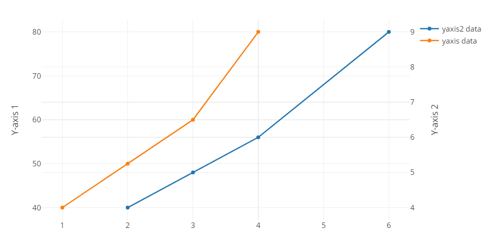
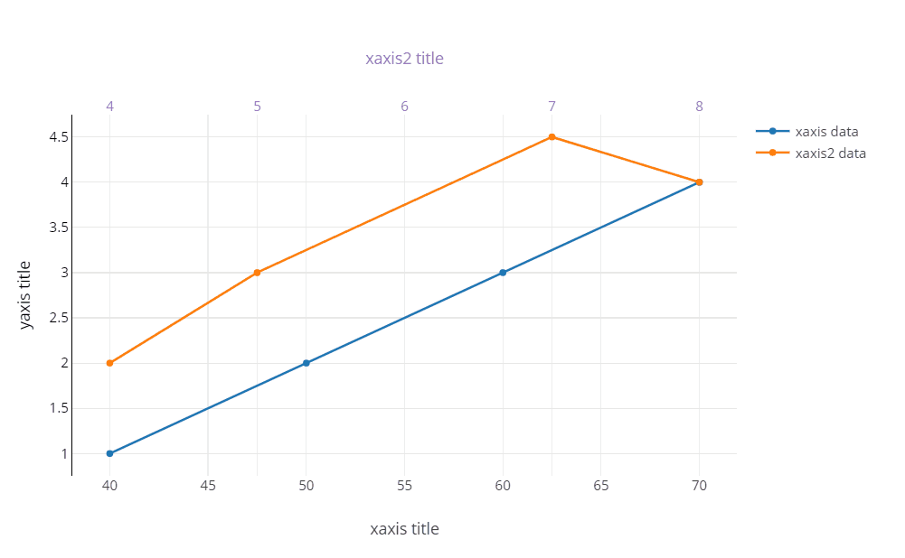
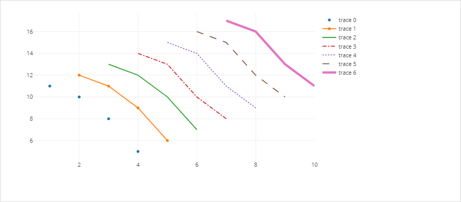
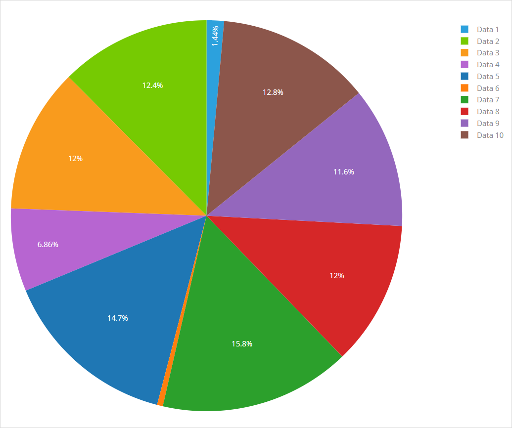
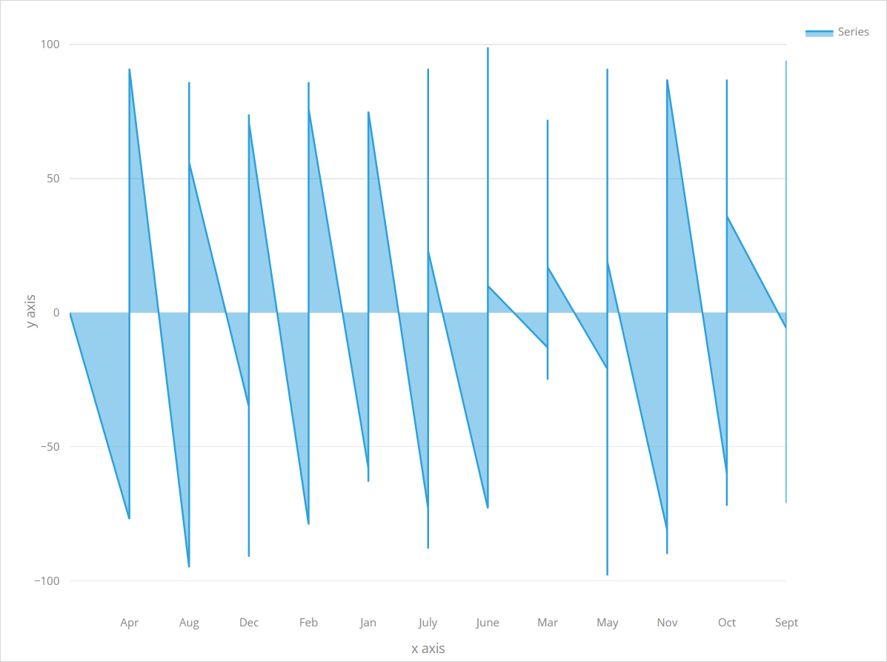
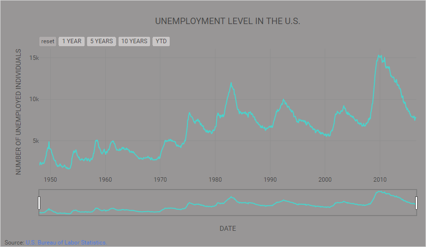
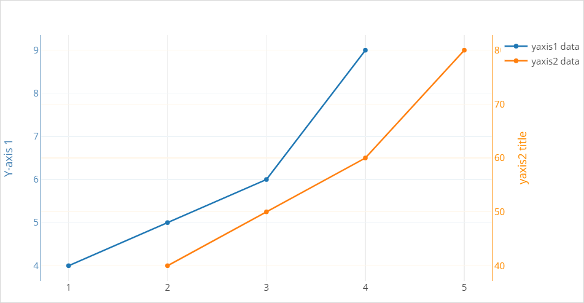
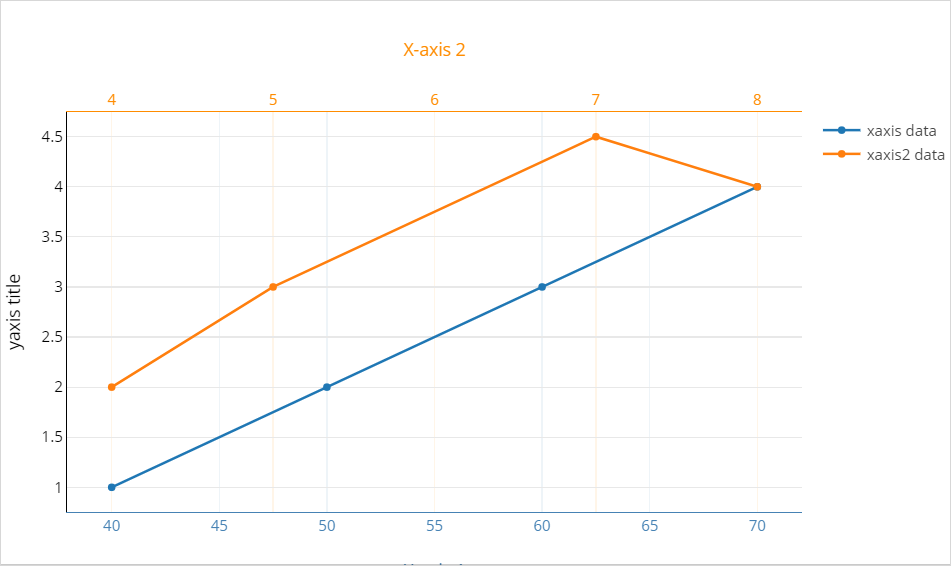

{}
 For the Simplified Chinese translation, click [中文译文]().
{}

## 1 Introduction

This reference describes advanced configuration settings for the chart widget.

Standard charts provide the most common settings through the widget configuration. Additional settings can be set via the Advanced settings.

This cheat sheet with JSON snippets will provide some samples of advance configuration.

The full reference can be found at [https://plot.ly/javascript/](https://plot.ly/javascript/). The chart widgets support plotly.js version 1.47.4.

When the advanced configuration does not suffice have a look at the [Any Chart](https://appstore.home.mendix.com/link/app/106437/Mendix/Any-Chart) widget in the Marketplace.

## 2 Layout (All Charts) {#layout-all}

Layout controls the general appearance of the chart. The chart is customized by adding JSON properties to the layout.

Below is a basic configuration.

``` json
{
  "font": {
    // font properties
  },
  "title": "CHART TITLE",
  "titlefont": {
    // title font properties
  },
  "hovermode": "closest",
  "showlegend": true,
  "legend": {
    // legend properties
  },
  "hoverlabel": {
    // hover label properties
  },
  "margin": {
    // margin properties
  }
}
```

To use the layout snippet above, replace all lines labeled *// {some text} properties* with actual properties specific to the element.

### 2.1 Legend

The legend properties below are added to the layout configuration to apply custom style to it.

``` json
{
  "legend": {
    "showlegend": true,
    "legend": {
      "bgcolor": "#fff",
      "bordercolor": "#444",
      "borderwidth": 0,
      "font":{
        "family": "Open Sans, verdana, arial, sans-serif",
        "size": 12,
        "color": "black"
      },
      "orientation": "v",
      "traceorder": "normal",
      "tracegroupgap": 10,
      "x": -0.1,
      "xanchor": "right"
    }
  }
}
```

You can change the position of the legend by modifying the properties as shown below.

**Right:**

``` json
{
  "showlegend": true,
}
```

**Left:**

Adjust x for long series names or Y-axis ticks.

``` json
{
  "showlegend": true,
  "legend": {
    "xanchor": "right",
    "x": -0.1
  }
}
```

**Top:**

``` json
{
  "showlegend": true,
  "legend": {
    "orientation": "h",
    "y": 1.1
  }
}
```

**Bottom:**

Adjust y to -0.2 for long X-axis ticks.

``` json
{
  "showlegend": true,
  "legend": {
    "orientation": "h",
    "y": "auto"
  }
}
```

**Inside:**

``` json
{
  "showlegend": true,
  "legend": {
    "x": 0
  }
}
```

**None:**

``` json
{
  "showlegend": false
}
```


More options can be found here: [Legend configurations](https://plot.ly/javascript/reference/#layout-legend).

### 2.2 Axes

The axes properties apply to charts with x and y axes. They can be configured as:

``` json
{
  "xaxis": {
    "gridcolor": "#eaeaea",
    "title": "X-axis",
    "color": "#0000FF",
    "showgrid": false,
    "fixedrange": true,
    "showline": true,
    "side": "bottom"
  },
  "yaxis": {
    "rangemode": "tozero",
    "zeroline": true,
    "zerolinecolor": "#eaeaea",
    "gridcolor": "#eaeaea",
    "color": "#0000FF",
    "title": "Y-axis",
    "showgrid": true,
    "showline": true,
    "fixedrange": true
  }
}
```


More options can be found here: [Axes configurations](https://plot.ly/javascript/reference/#layout-xaxis).

### 2.3 Multiple Y Axes

These properties apply to charts with more than one Y axis. They can be configured as:

``` json
{
  "yaxis": {
    "title": "Y-axis 1",
    "zeroline": true,
    "color": "#4682B4",
    "showgrid": true,
    "showline": true
  },
  "yaxis2": {
    "title": "Y-axis 2",
    "color": "#FF8C00",
    "showgrid": true,
    "showline": true,
    "zeroline": true,
    "overlaying": "y",
    "side": "right"
  }
}
```

The layout properties above should be used with the corresponding [data properties](#multiple-y-axes-data-properties).



More options can be found here: [Multiple Y axes configurations](https://plot.ly/javascript/multiple-axes/).

### 2.4 Multiple X Axes

These properties apply to charts with more than one X axis. They can be configured as:

``` json
{
  "xaxis": {
    "title": "X-axis 1",
    "color": "#4682B4",
    "showgrid": true,
    "showline": true,
    "zeroline": true
  },
  "xaxis2": {
    "title": "X-axis 2",
    "titlefont": {
      "color": "#FF8C00"
    },
    "tickfont": {
      "color": "#FF8C00"
    },
    "zeroline": true,
    "color": "#FF8C00",
    "showgrid": true,
    "showline": true,
    "overlaying": "x",
    "side": "top"
  }
}
```

The layout properties above should be used with the corresponding [data properties](#multiple-x-axes-data-properties).



More options can be found here: [Multiple X axes configurations](https://plot.ly/javascript/multiple-axes/).

### 2.5 Math LaTeX Formulas

Titles, axes and series can contain complex mathematical expressions.


```
$\sqrt{(n_\text{c}(t|{T_\text{early}}))}$
```

Add the following to the index.html of the theme:

``` javascript
<script type="text/javascript" async src="https://cdnjs.cloudflare.com/ajax/libs/mathjax/2.7.1/MathJax.js?config=TeX-AMS-MML_SVG"></script>
```

More information on LatTex Syntax is available here: https://en.wikibooks.org/wiki/LaTeX/Mathematics.

### 2.6 Title

The title appears above the chart. It can be configured as:

``` json
{
  "title": "CHART TITLE",
  "titlefont": {
    "family": "Droid Sans, Droid Serif, sans-serif",
    "size": 20,
    "color": "black"
  }
}
```


More options can be found here: [Title configurations](https://plot.ly/javascript/reference/#layout-title).

### 2.7 Color

Sets the the background color of a graph.

``` json
{
  "paper_bgcolor": "#FFF"
}
```

### 2.8 Margin

Creates space around the chart.

``` json
{
  "margin": {
    "l": 70,
    "r": 60,
    "b": 60,
    "t": 60,
    "pad": 10,
    "autoexpand": true
  }
}
```


More options can be found here: [Margin configurations](https://plot.ly/javascript/reference/#layout-margin).

### 2.9 Tooltip

A small pop-up box that appears when the user moves the mouse pointer over a chart data point.

``` json
{
  "hovermode": "text",
  "hovertext": "text",
  "hoverinfo": "all",
  "textposition": "inside",
  "hoverlabel": {
    "bgcolor": "#888",
    "bordercolor": "#888",
    "font": {
      "color": "white"
    }
  }
}
```

.

More options can be found here: [Tooltip configurations](https://plot.ly/javascript/reference/#layout-hovermode).

### 2.10 Fonts

Sets a global font at the root level which will be applied to all chart elements. Or set a font for specific elements.

``` json
{
  "font": {
    "family": "Open Sans,verdana, arial, sans-serif",
    "size": 12,
    "color": "black"
  },
  "legend": {
    "font": {}
  },
  "titlefont": {},
  "hoverlabel": {
    "font": {}
  },
  "xaxis": {
    "titlefont": {},
    "tickfont": {}
  },
  "yaxis": {
    "titlefont": {},
    "tickfont": {}
  }
}
```

### 2.11 Range Mode

Sets how the range of a given axis should be displayed.

**normal:**

Sets the range based on the plotted values, adjusting to fit them.

```json
{
  "yaxis": {
    "rangemode": "normal"
  }
}
```


**nonnegative:**

Shows only positive values, the range is based on the plotted positive values.

```json
{
  "yaxis": {
    "rangemode": "nonnegative"
  }
}
```


**tozero:**

This is the default range mode in charts. Both positive and negative ranges for the axes will start from the zero mark.

```json
{
  "yaxis": {
    "rangemode": "tozero"
  }
}
```

  

{}
When **fill** for the series is set to something other than *none*, the Y-axis range is forced to start from zero (*tozero*). For example:

**Layout**

```json
{
  "yaxis": {
    "rangemode": "normal"
  }
}
```

**Data**

```json
{
  "fill": "tonexty"
}
```
{}


More options can be found here: [range mode configurations](https://plot.ly/javascript/reference/#layout-yaxis-rangemode).

## 3 Data/Series Properties {#data-series}

These properties are applied to specific types of chart only. For each chart, data properties are distinct. They make the chart appear as its supposed to be.

### 3.1 Lines

A mode and line configuration can be added in the **Advanced** configuration of the series.



``` json
[
  {
    "mode": "markers"
  },
  {
    "mode": "lines+markers"
  },
  {
    "mode": "lines"
  },
  {
    "mode": "lines",
    "line": {
      "dash": "dashdot"
    }
  },
  {
    "mode": "lines",
    "line": {
      "dash": "dot"
    }
  },
  {
    "mode": "lines",
    "line": {
      "dash": "longdash"
    }
  },
  {
    "mode": "lines",
    "line": {
      "width": 5
    }
  }
]
```

### 3.2 Combine Chart Types

The type of a series can be changed. For example, you can make a bar series into a line series:


### 3.3 Pie Chart

Displays a circular graph divided into slices to illustrate numerical proportion.

``` json
{
  "hole": 0.9
}
```



More options can be found here: [Pie chart data properties](https://plot.ly/javascript/reference/#pie).

### 3.4 Fill

Displays a line chart with the areas below the lines filled with colors.

``` json
{
  "line": {
    "color": "#17202A",
    "shape": "linear",
    "dash": "dot"
  },
  "type": "scatter",
  "fill": "tonexty",
  "fillcolor": "#B2BABB"
}
```



More options can be found here: [Area chart data properties](https://plot.ly/javascript/reference/#area).

### 3.5 Time Series

The example below shows how you can set up filter buttons to filter a chart by time.

.

``` json
{
  "xaxis": {
    "rangeslider": {
      "visible": true
    },
    "rangeselector": {
      "buttons": [
        {
          "step": "all",
          "label": "reset"
        },
        {
          "step": "year",
          "stepmode": "backward",
          "count": 1,
          "label": "1 YEAR"
        },
        {
          "step": "year",
          "stepmode": "backward",
          "count": 5,
          "label": "5 YEARS"
        },
        {
          "step": "year",
          "stepmode": "backward",
          "count": 10,
          "label": "10 YEARS"
        },
        {
          "step": "year",
          "stepmode": "todate",
          "count": 1,
          "label": "YTD"
        }
      ]
    }
  }
}
```

See more properties here: [Range Selector](https://plot.ly/javascript/reference/#layout-xaxis-rangeselector).

### 3.6 Multiple Y Axes Data Properties {#multiple-y-axes-data-properties}

Displays two different Y axes with different scales, according to the ranges of the datasets.

``` json
[
  {
    "name": "yaxis2 data",
    "yaxis": "y2",
    "type": "scatter"
  },
  {
    "name": "yaxis data",
    "type": "scatter"
  }
]
```



### 3.7 Multiple X Axes Data Properties {#multiple-x-axes-data-properties}

Displays two different X axes with different scales.

``` json
[
  {
    "name": "xaxis data",
    "xaxis": "x",
    "type": "scatter"
  },
  {
    "name": "xaxis2 data",
    "xaxis": "x2",
    "type": "scatter"
  }
]
```

.

## 4 Configurations Options (All Charts) {#config-options}

The following configuration options are available in all charts (presented here as an example with formatting for the `nl` `locale`):

```json
{
  "displayModeBar": true,
  "displaylogo": false,
  "modeBarButtonsToRemove": [ "sendDataToCloud", "lasso2d", "select2d", "hoverClosestCartesian", "hoverCompareCartesian", "toggleSpikelines" ],
  "locale": "nl",
  "locales": {
		"nl": {
			"dictionary": {
				"Download plot as a png": "Opslaan als PNG"
			},
			"format": {
				"days": ["zondag",
				"maandag",
				"dinsdag",
				"woensdag",
				"donderdag",
				"vrijdag",
				"zaterdag"],
				"shortDays": ["zon",
				"maa",
				"din",
				"woe",
				"don",
				"vri",
				"zat"],
				"months": ["januari",
				"februari",
				"maart",
				"april",
				"mei",
				"juni",
				"juli",
				"augustus",
				"september",
				"oktober",
				"november",
				"december"],
				"shortMonths": ["jan",
				"feb",
				"maa",
				"apr",
				"mei",
				"jun",
				"jul",
				"aug",
				"sep",
				"okt",
				"nov",
				"dec"],
				"date": "%d-%m-%Y",
				"datetime": "%d-%m-%Y %H:%M",
				"year": "%Y",
				"month": "%b %Y",
				"dayMonth": "%d %b",
				"dayMonthYear": "%d %b %Y"
			}
		}
	}
}
```
