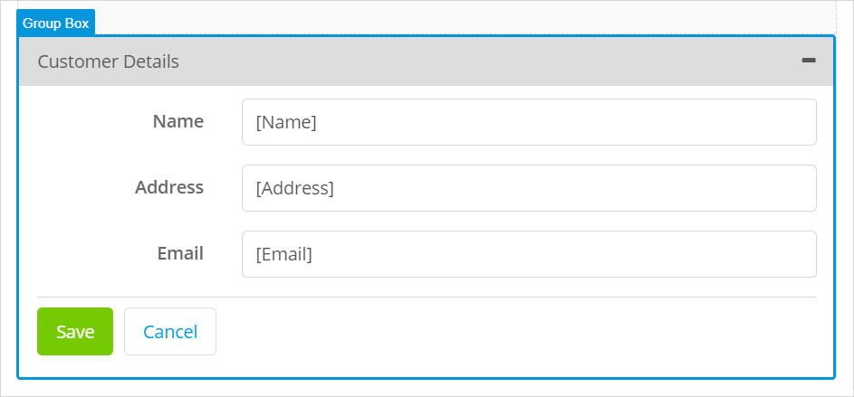
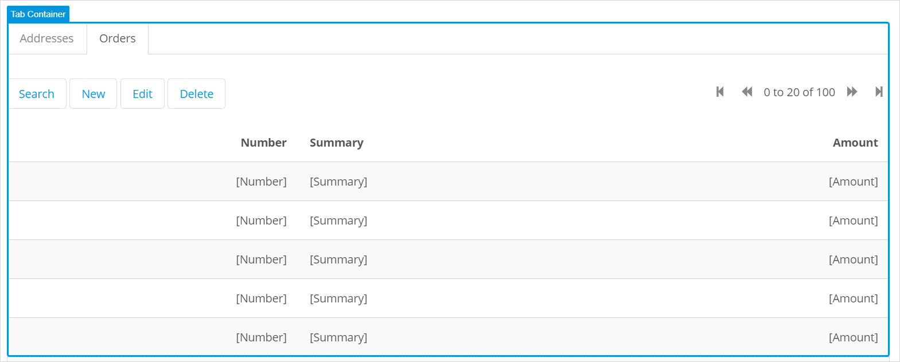
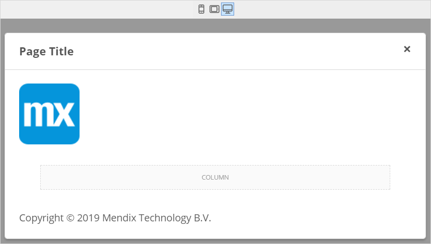
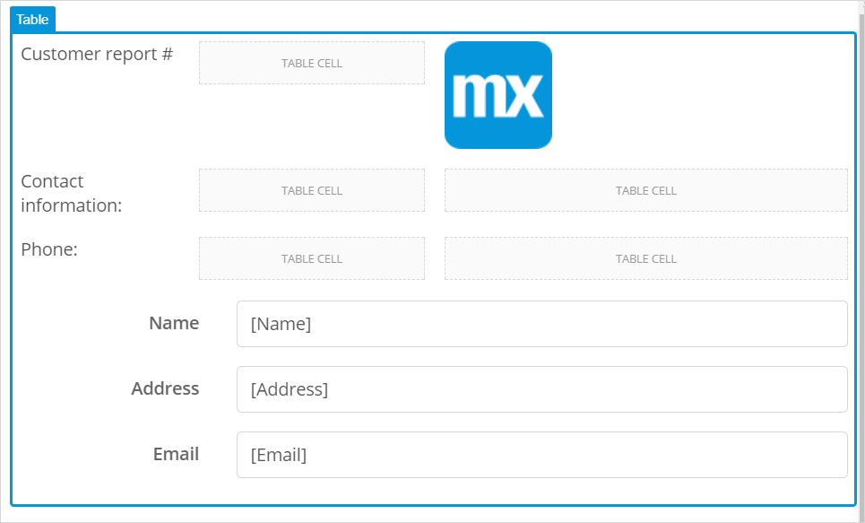

{}
For the Simplified Chinese translation, click [here]().
{}

## 1 Introduction

Container widgets provide structure to your page's content.

* [Layout grid](layout-grid) – gives structure to your pages, has a built-in behavior to show how a page will look like on different devices:

    

* [Container](container) – a layout element where you can place a widget or a group of widgets and simultaneously style, drag or delete them:

    

* [Group box](group-box) – groups widgets together, can be configured to collapse or expand with all elements inside it:

    

* [Tab container](tab-container) – shows information categorized into tabs:

    

* [Scroll Container](scroll-container) – divides layout into regions, such as a header, sidebar, or footer. In the example below a scroll container is used to structure a pop-up page layout with a header and a footer:

    

* [Table](table) – consists of a number of rows and columns; each table cell can contain widgets. In the example below, some table cells contain widgets and some are still empty:

    

* [Navigation list](navigation-list) – allows you to select a separate on-click action for each row of this widget:

    

## 2 Performing Basic Functions

{}

## 3 Read More

* [Page](page)
* [Pages](pages)