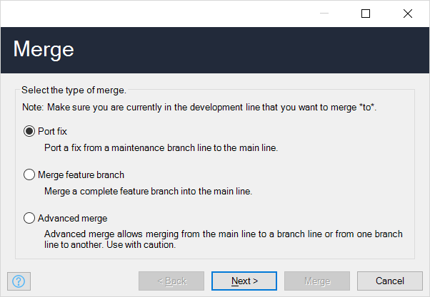

{}
 For the Simplified Chinese translation, click [中文译文](https://cdn.mendix.tencent-cloud.com/documentation/merge-dialog.pdf).
{}

## 1 Introduction

With the **Merge** dialog you can [merge](version-control#merge) changes from a branch line to the main line. For example, a fix that you applied in a maintenance branch line can be merged back to the main line so that you do not have to apply the fix by hand again. Also if you completed developing a large feature in a separate branch line you can use merge to incorporate that feature into the main line.

To access the **Merge** dialog, open [Version Control menu](version-control-menu) > **Merge Changes Here**:

{}
Before continuing with the merge action, please make sure that you are currently working in the development line that you want to merge to.
{}

The following merge scenarios are supported:

## 2 Port Fix

This merge scenario allows you to merge a fix from a maintenance branch line to the main line. If you just want to merge a small fix, a single commit is often enough. It is however also possible to merge multiple commits at once.

### 2.1 Branch Line

Choose the branch line from which you want to merge the fix.

### 2.2 One Revision / Multiple Revisions

Choose whether you want to merge just a single commit or a whole range of commits from the maintenance branch line. In the latter case both the start and end revisions must be selected. The start revision is the revision with the lowest number and the end revision is the revision with the highest number. Note that all revisions that are contained within the specified range are merged.

## 3 Merge Feature Branch

This merge scenario allows you to merge a complete feature branch line to the main line.

### 3.1 Branch Line

Choose the branch line that you want to merge. It's not necessary to select individual revisions in this case, because all revisions of the branch line are merged automatically.

## 4 Advanced Merge

This scenario may be used for merge actions that are only needed in exceptional circumstances. Use this option with caution.

While normally you would only merge (revisions of) a branch line to the main line, the advanced merge scenario offers the possibility to merge from the main line to a branch line, or from one branch line to another.

### 4.1 Branch Line

Choose the branch line that you want to merge, or select 'Main line' when you want to merge (revisions of) the main line to the current branch line.

### 4.2 Start / End Revision

Select the start revision (revision with the lowest number) and the end revision (revision with the highest number) of the range you want to merge. If you want to merge all commits of the selected branch line, simply select the first and the last revision of the branch. It's not necessary to select the 'Create branch' revision.
